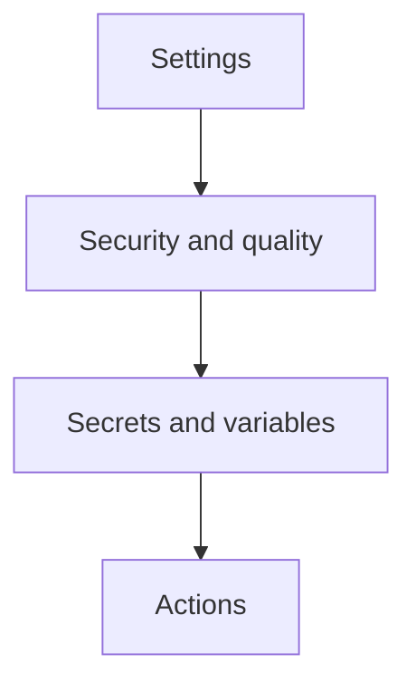

# 📘 S2J Docs Linter - npm パッケージ仕様 (認証およびシークレット管理仕様)

## 概要

本ドキュメントは、S2J Docs Linter (`@s2j/docs-linter`) を npm レジストリ (`npmjs.com`) に publish する際の認証および secret 管理方針を定義します。

GitHub Actions を利用した publish 自動化を想定します。

## 1. 認証戦略

### 設計意図 (ゴール)

* npm publish を安全に自動化する
* 認証情報の漏洩を防止する
* 長期 secret の利用を最小化する
* 組織 S2J のパッケージ publish を安全に管理する

### 設計原則

* 必要最小限の権限のみ付与すること。
* 長期 secret を減らすこと。
* 認証情報の入れ替えを容易にすること。
* CI/CD の自動化に適した方式を採用すること。

### 設計方針 (規約)

認証方式の優先順位は、下記の通りです。

1. npm trusted publishing (OIDC)
2. npm 自動化トークン
3. 手動でのローカル publish

### 非対象 (Out of Scope)

下記は対象外です。

* パスワード認証
* レガシー認証トークン
* GitHub Packages 認証

### 責務

本仕様で定義すること。

* npm 認証モデル
* GitHub Actions secret 管理
* トークンの入れ替え方針
* インシデント対応の基準

### 非責務

本仕様では定義しないこと。

* エンタープライズ SSO
* 組織全体の IAM ガバナンス

## 2. GitHub Secret Management

### 設計意図 (ゴール)

GitHub Actions 上で安全に secret を扱います。

### 設計原則

* secret exposure をリポジトリ単位で制御すること。
* 漏洩時影響を最小化すること。

### 設計方針 (規約)

GitHub リポジトリで、secret として `NPM_TOKEN` を登録します。



### 推奨設定

利用リポジトリのみ公開します。
組織全体の secret は、慎重に判断します。

### 禁止事項

下記を禁止します。

* ワークフローログへのトークン出力
* $NPM_TOKEN の echo 出力
* デバッグログでの secret 表示

### 責務

本仕様で定義すること。

* GitHub secret ストレージ

### 非責務

本仕様では定義しないこと。

* 開発者のローカルマシンにおける、認証情報の管理

## 3. Transitional Compatibility: `NPM_TOKEN` (Legacy / Optional)

### 設計意図 (ゴール)

npm Trusted Publishing 導入前の、一時的な互換運用を許容します。

### 設計原則

* 段階移行を許容する。
* 必要最小権限のみ。

### 設計方針 (規約)

`NPM_TOKEN` は、下記の用途において、legacy compatibility としてのみ許容します。GitHub Actions の標準 publish 認証方式としては、採用しません。

* ローカルでの手動 publish
* 一時的な CI の代替手段

### 非対象 (Out of Scope)

* 長期運用
* デフォルトの公開認証

### 責務

* 代替認証

### 非責務

* 標準的なリリース自動化

## 4. フェーズ2: npm Trusted Publishing (推奨)

### 設計意図 (ゴール)

GitHub Actions から secretless npm publish を実現します。

### 設計原則

* GitHub Secrets に publish token を保存しない。
* GitHub Actions OIDC identity を npm registry に委譲する。
* 長期 secret を削減する。

### 設計方針 (規約)

標準 publish 認証方式は、「npm Trusted Publishing」です。
その対象は、下記の通りです。

* GitHub repository
* GitHub Actions
* npm organization `s2j`

GitHub Actions:

```yaml
permissions:
  contents: read
  id-token: write
```

npm 側では、Trusted Publisher 登録を必須とします。

### 非対象 (Out of Scope)

* NPM_TOKEN ベース標準運用
* 手動によるトークンのローテーション

### 責務

* trusted publisher の登録
* OIDC publish 認証
* GitHub Actions との連携

### 非責務

* レガシートークンのライフサイクル

## 5. GitHub Actions 例

### フェーズ1: `NPM_TOKEN`

```yaml
permissions:
  contents: read

steps:
  - uses: actions/checkout@v4

  - uses: actions/setup-node@v4
    with:
      node-version: 20
      registry-url: 'https://registry.npmjs.org'

  - run: npm ci
  - run: npm publish --access public
    env:
      NODE_AUTH_TOKEN: ${{ secrets.NPM_TOKEN }}
```

### フェーズ2以降: npm trusted publishing (Target State)

```yaml
permissions:
  contents: read
  id-token: write

steps:
  - uses: actions/checkout@v4

  - uses: actions/setup-node@v4
    with:
      node-version: 20
      registry-url: 'https://registry.npmjs.org'

  - run: npm ci
  - run: npm publish --access public
```

## 6. トークンの入れ替え方針

### 設計意図 (ゴール)

トークン漏洩時のリスクを下げます。

### 設計原則

* 漏洩前提で設計すること。

### 設計方針 (規約)

入れ替えトリガーは、下記の通りです。入れ替え期間は、`90–180日` を推奨します。

* メンテナーの変更
* 侵害の疑い
* publish 失敗
* 定期レビュー

### 責務

本仕様で定義すること。

* トークンの失効
* トークンの再発行

### 非責務

本仕様では定義しないこと。

* 自動入れ替えツール

## 7. インシデント対応

### 設計意図 (ゴール)

credential 漏洩時に迅速対応します。

### 設計方針 (規約)

対応順は、下記の通りです。

1. npm トークンの取り消し
2. GitHub secret の削除
3. 代替トークンの発行
4. publish 履歴の監査
5. リリースの整合性レビュー

### 責務

本仕様で定義すること。

* 最低限のインシデント対応手順書

### 非責務

本仕様では定義しないこと。

* 鑑識

## 8. 移行戦略

### 設計方針 (規約)

1. フェーズ1: NPM_TOKEN
2. フェーズ2: npm trusted publishing
3. フェーズ3: トークン廃止
