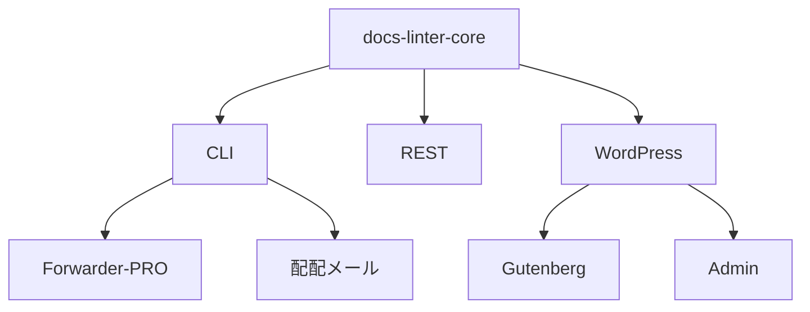

# 📘 S2J Docs Linter - 将来アーキテクチャ

## 目的

S2J Docs Linter は、Markdown エディター向けの textlint ルールセットとして開始したプロジェクトです。今後は単なる CLI ツールではなく、WordPress や業務システムから利用可能な「文章の品質検査エンジン」に発展させることを目指します。

本ドキュメントでは、将来アーキテクチャおよび責務分離の方針を定義します。

## 基本方針

### textlint の隠蔽

ユーザーは textlint の存在を意識しません。ユーザーは下記のみを扱います。

* テキスト
* Lint プロファイル
* 辞書
* ルール設定
* 診断結果

内部実装として textlint を利用することは許容するが、公開 API として露出しません。

### Core First

最初に構築するのは WordPress プラグインではなく Core Engine です。

全てのアダプターは Core Engine を利用します。



### ブラウザー依存の排除

WordPress Block エディター上で利用する場合であっても、Chrome 専用実装としません。

Core Engine は、下記の実行環境をサポートします。

* Node.js
* ブラウザー
* Web Worker

実行環境による挙動差異を極力排除します。

## ドメインモデル

### ルール定義

ルール定義です。開発者またはコントリビューターが管理します。アプリケーションユーザーは変更できません。

ルール定義例は、下記のようになります。

* max-kanji-continuous
* max-sentence-length
* max-heading-length
* forbidden-word
* required-word

### ルール設定

ルール設定です。ユーザーが変更する値です。

ルール設定例は、下記のようになります。

```json
{
  "max-kanji-continuous": {
    "max": 7
  }
}
```

たとえば、法律事務所の場合は、下記のようになります。

```json
{
  "max-kanji-continuous": {
    "max": 30
  }
}
```

### 辞書

ユーザー固有の辞書です。

辞書例は、下記のようになります。

* 禁止語の辞書
* 推奨語の辞書
* 固有名詞の辞書
* 企業用語の辞書

辞書はアプリケーション側 DB に保存します。

### プロファイル

ルールと辞書の集合です。

プロファイル例は、下記のようになります。

* wordpress
* business-mail
* technical-document

### Lint 結果

診断結果です。

診断結果例は、下記のようになります。

```json
{
  "errors": [],
  "warnings": []
}
```

## 境界づけられたコンテキスト

### コアドメイン

責務は、下記のとおりです。

* 文章解析
* ルール評価
* 辞書評価
* 診断結果生成

成果物は、下記のとおりです。

* `@s2j/docs-linter-core`

### アプリケーション

責務は、下記のとおりです。

* UseCase
* Profile 管理
* 設定管理
* 辞書管理

### アダプター

責務は、下記のとおりです。

* CLI
* REST API
* `WordPress`
* `Forwarder-PRO`
* `配配メール`

### インフラストラクチャ

責務は、下記のとおりです。

* textlint
* YAML Parser
* JSON Parser
* Storage

## パッケージ Strategy

### `@s2j/docs-linter-core`

文章の品質検査エンジンの責務は、下記のとおりです。

* `lint()`
* `loadProfile()`
* `validateConfig()`

Node.js およびブラウザー環境で利用可能とします。

### `@s2j/docs-linter`

CLI パッケージの責務は、下記のとおりです。

* init
* doctor
* lint command

内部的に docs-linter-core を利用します。

### `@s2j/docs-linter-rest`

REST API ラッパーの責務は、下記のとおりです。

* REST エンドポイント
* Profile API
* 辞書 API

## 永続化 Strategy

中央管理サーバーは提供しません。

設定や辞書は各アプリケーションが管理します。

永続化例は、下記のようになります。

* `WordPress` Database
* `Forwarder-PRO` Database
* `配配メール` Database

### Export

ユーザーは下記形式でエクスポートできます。

* .textlintrc.json
* dictionary.yml

### Import

ユーザーは設定や辞書をインポートできます。

## ロードマップ

* フェーズ0
  * Core API 設計の成果物は、下記のとおり
    * コアドメイン定義
    * 公開 API 定義
    * Configuration Schema 定義
* フェーズ1-A
  * `@s2j/docs-linter-core` 成果物は、下記のとおり
    * `lint()`
    * ルールエンジン
    * 辞書エンジン
    * プロファイルエンジン
* フェーズ1-B
  * `@s2j/docs-linter-rest` 成果物は、下記のとおり
    * REST API
    * Configuration API
    * 辞書 API
* フェーズ2
  * `in WordPress` 成果物は、下記のとおり
    * Gutenberg 連携
    * Admin UI
    * Bulk Scan
* フェーズ3
  * `in Forwarder-PRO` 成果物は、下記のとおり
    * Mail Editor 連携
    * Bulk Mail 検証
* フェーズ4
  * `in 配配メール` 成果物は、下記のとおり
    * Mail Editor 連携
    * Bulk Mail 検証
