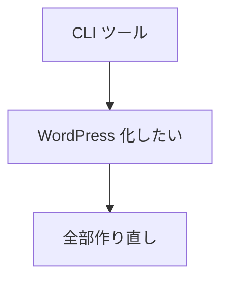
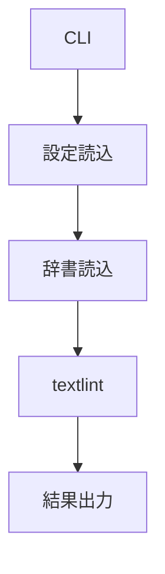
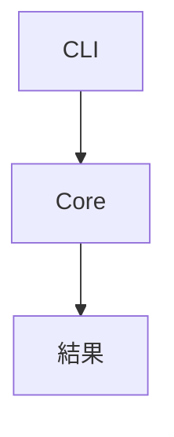
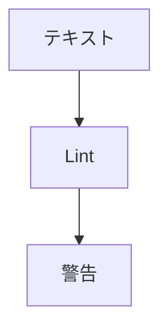

# 📘 S2J Docs Linter - Modification Plan-3

良い感じに、実現できそうな感じがしてきました。

---

同意見です。

むしろ現在の **S2J Docs Linter の資産が無駄にならない構想** が大きいですね。

よくある失敗として、下記が挙げられます。



しかし、あなたの構想は下記の方向なので、既存資産を活かしやすいです。

```text
現在
┌────────────────────┐
│ @s2j/docs-linter   │
└────────────────────┘

将来
┌────────────────────┐
│ @s2j/docs-linter   │ ← CLI
├────────────────────┤
│ docs-linter-core   │ ← 共通エンジン
├────────────────────┤
│ REST Adapter       │
├────────────────────┤
│ WordPress Plugin   │
├────────────────────┤
│ Forwarder Adapter  │
└────────────────────┘
```

---

## 私が今なら優先するもの

現時点では、フェーズ1の REST API を実装するよりも、まず `@s2j/docs-linter-core` を意識した設計整理を優先します。



例えば現在、`s2j-docs-linter lint` の内部で上記の流れなら、これを下記のような分離を検討する。



---

## npm パッケージとして理想形

```ts
import { lint } from "@s2j/docs-linter-core";

const result = await lint({
  text: markdown,
  profile: "wordpress",
});
```

例えば、上記のような API を持てれば、CLI、REST、WordPress は全部この関数を呼ぶだけになります。

---

## WordPress 版で実は強い部分

あなたの構想は、単なる「記事編集中の警告表示」ではなく、下記まで視野に入っています。

> 固定ページや投稿を一括診断する

これは結構価値があります。

WordPress 界隈には、下記は多いのですが、**文章の品質診断** は意外と少ないです。

* SEO 診断
* リンク切れ診断
* セキュリティ診断

特に下記まで扱えるものはほぼありません。

* 社内用語の辞書
* 企業独自の禁止語
* 表記ゆれルール

---

## `Forwarder-Pro` や `配配メール` との相性

ここも面白いです。

メール配信システムでは、下記のチェック需要があります。

* 誤字
* 表記ゆれ
* 禁止語
* 企業用語

しかもメールは Markdown ではなくても、内部的には、Plain Text や HTML です。
つまり本質的には下記で済むので、Core API 化しておけば適用しやすいです。



---

## ひとつだけ注意点

今後ドキュメントを書く際は、「WordPress 向け textlint」ではなく、**「文章の品質検査エンジン」** として整理しておくと、将来性があります。

例えば、`docs-linter-core` の責務を「Markdown を Lint する」ではなく、「テキストコンテンツを Lint する」にしておくと、下記に展開しやすくなります。

* Markdown
* HTML
* Gutenberg Block
* メール本文
* プレーンテキスト

実際、あなたが構想しているフェーズ4まで見据えると、「WordPress 向けツール」ではなく **『文章の品質管理プラットフォーム』のコアエンジン**　という位置付けの方が、アーキテクチャとしては綺麗です。