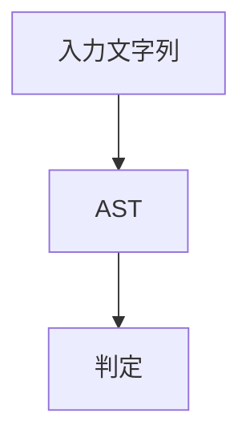
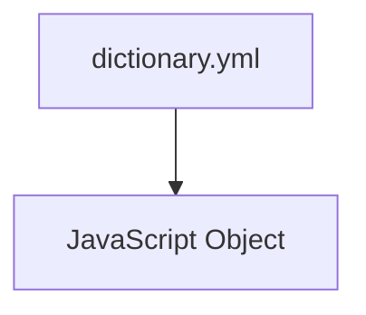
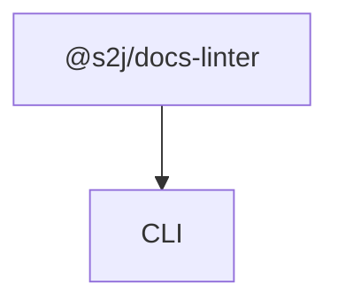
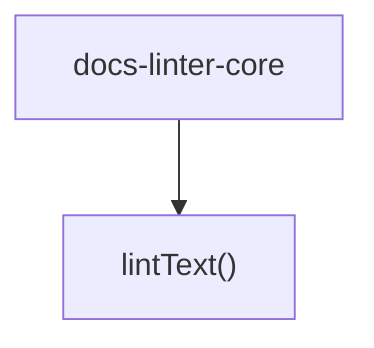

# 📘 S2J Docs Linter - Modification Plan-6

npm でインストールした textlint 関連モジュールを Vite でバンドルし、Web Worker 内で textlint を実行可能な状態にする「@s2j/docs-linter-core」を検討しています。

WordPress プラグイン (外部コントリビューターに実装してもらう予定の「in `Forwarder-PRO`」「in `配配メール`」)では、「@s2j/docs-linter-core」を、REST API で呼び出す形にする予定です。

そこで、[S2J Docs Linter](https://github.com/stein2nd/docs-linter.git) の現在の構成から、「Node.js 依存処理 (fs / path / os / process 等)」に強く依存してる textlint-rule があれば、教えてください。

「バンドル時の解決以外では fs / path / os / process を利用してない」ケースもありそうな気がします。

---

これは非常に良い視点です。

実際には、「textlint ルールが Node.js 依存か？」ではなく、「そのルールは lint 実行時に Node.js API を呼ぶか？」で判定する必要があります。

---

## まず結論

あなたの現在の `@s2j/docs-linter` の主要構成を見る限り、下記の大半は **Web Worker 化できる可能性が高い** と考えられます ([textlint-rule-preset-ja-technical-writing](https://github.com/textlint-ja/textlint-rule-preset-ja-technical-writing))。

* textlint
* preset-ja-technical-writing
* prh
* 独自ルール（space-around-english.js など）

---

## 危険度分類

私は次の3段階で見ています。

---

### A. Web Worker 対応しやすい

典型例は、下記だけを使うルール。

```js
context.Syntax.Str
context.report()
node.value
```

例えば、下記の系統です。 ([textlint-rule-preset-ja-technical-writing](https://github.com/textlint-ja/textlint-rule-preset-ja-technical-writing))

* 漢字連続数
* 助詞重複
* 弱い表現
* 句読点

これらは下記の構造だけなので、Node 依存がほぼありません。



---

### B. ビルド時だけ Node を使う

典型例は、下記のようなケース。

```js
import yaml from "yaml";
import dictionary from "./dictionary.yml";
```

Vite が下記に変換できれば、実行時には `fs.readFileSync()` は不要です。



あなたの `wp-terms.yml` はまさにこれです。
現在 `fs.readFileSync("wp-terms.yml")` なら危険。
しかし `import terms from "./wp-terms.yml";` なら問題ありません。

---

### C. Node 依存が強い

これは要注意です。

---

#### fs

`fs.readFileSync()`

例えば、下記を毎回読むような実装。

```js
rulePaths: [
  "./dictionary.yml"
]
```

特に `textlint-rule-prh` は設定次第で下記を読み込みます。 ([技術書リンター](https://zenn.dev/suzuki_hoge/scraps/d565944c9981be))

```json
{
  "rulePaths": [
    "./prh.yml"
  ]
}
```

そのため、そのままでは `Web Worker` で動かない可能性があります。
ただし、これは「prh がダメ」ではなく、「ファイル読込方式がダメ」なだけです。
例えば `import rules from "./prh.yml";` に変換すれば解決できます。

---

#### path

`path.resolve()`

これも設定ファイル探索でよく出ます。

---

#### process.cwd()

`process.cwd()`

textlint 本体や CLI 系でよく出ます。
しかし、Core API では不要なことが多いです。

---

#### os

`os.platform()`

これはほぼ CLI 用です。

---

## 実は textlint 本体が一番怪しい

ここが重要です。

ルールよりも、むしろ `textlint CLI` の方が Node 依存しています。
例えば `textlint README.md` は当然ながら、下記を使います。

```js
fs
path
process.argv
```

しかし、API としては `lintText()` があります。 ([Node.js (TypeScript) で、textlint を動かす方法](https://fwywd.com/tech/textlint-engine-basic))
あなたの構想だと、下図1と下図2を分離するので、CLI 依存部分を切り離せます。





---

## 私なら先にやる調査

実装前に、現在のリポジトリで下記を実施します。

```bash
grep -R "fs\." .
grep -R "path\." .
grep -R "process\." .
grep -R "os\." .
```

特に下記の配下。

```text
presets/
rules/
dictionary/
```

そして結果を、下記のようなカテゴリーに分類します。

* 実行時依存
* ビルド時依存
* CLI 専用

---

## 現時点での予想

あなたのリポジトリ構成から推測すると、下記の印象です ([textlint-rule-preset-ja-technical-writing](https://github.com/textlint-ja/textlint-rule-preset-ja-technical-writing))。

| コンポーネント | Web Worker化 |
| --- | --- |
| 独自ルール (space-around-english.js) | ほぼ可能 |
| wp-terms.yml | 可能 |
| preset-ja-technical-writing | 可能性高い |
| textlint-rule-prh | 工夫が必要 |
| textlint CLI | 不可 |
| doctor | 不可 |
| init | 不可 |

そのため、私は今の構想なら、下記という切り分けは十分現実的との印象を受けます。

```text
docs-linter-core: Web Workerで動く lintEngine
@s2j/docs-linter: CLI (init / doctor / lintコマンド)
```

むしろ最大のリスクは独自ルールではなく、`textlint-rule-prh` のような「外部ファイルを動的ロードするルール」をどう Vite バンドルに落とし込むかでしょう。
