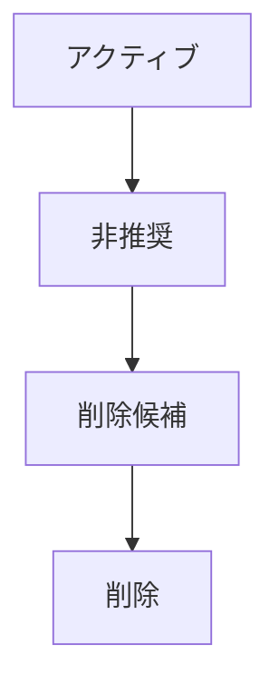
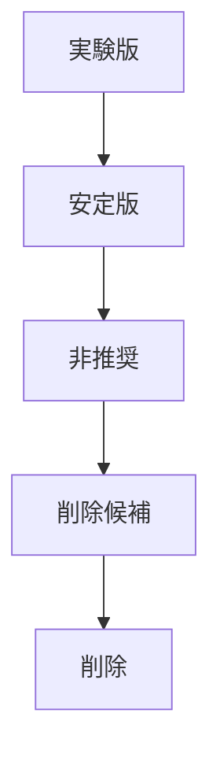
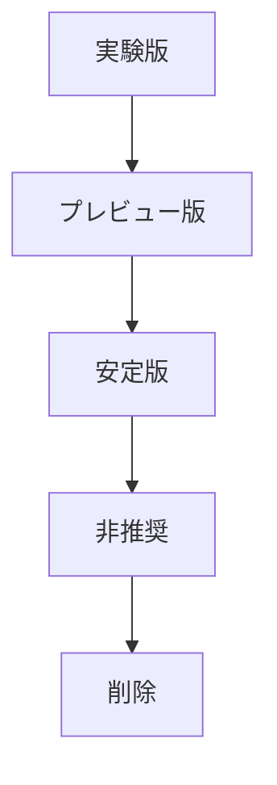

# 📘 S2J Docs Linter - バージョン互換表

## 1. 互換性仕様

本書は、S2J Docs Linter プラットフォームの互換性契約を定義します。

互換性は、プラットフォーム全体の後方互換性 (Backward Compatibility) および相互運用性 (Interoperability) を保証するための契約です。

本書は、下記のコンポーネントを対象とします。

* Core API
* Core ランタイム
* REST API
* SDK
* SDK ジェネレーター
* 生成される SDK

## 2. 目的

互換性契約は、下記を目的とします。

* 後方互換性の維持
* セマンティック・バージョニングの適用
* SDK の長期利用性の保証
* 利用側アプリケーションの保護
* アップグレード・リスクの最小化

## 3. 互換性の原則

プラットフォームは、下記の原則に従います。

* デフォルトでの後方互換性
* 明示的な破壊的変更
* セマンティック・バージョニング
* 利用側 First
* インクリメンタル移行

## 4. 互換性の範囲

### 対象となるコンポーネント

* ドメイン契約
* ランタイム契約
* REST 契約
* SDK 契約
* ジェネレーター契約

### 対象外となるコンポーネント

下記は、互換性保証の対象外とします。

* 内部実装
* ビルド・ツール
* テスト・ユーティリティ
* 実験的機能

## 5. 互換性のレベル

| レベル | 説明 |
| --- | --- |
| Binary | バイナリ互換 |
| Source | ソースコード互換 |
| API | API 契約互換 |
| Behavior | 動作互換 |
| Data | データ互換 |

## 6. セマンティック・バージョニング方針

### パッチ

下記のみ許可します。

* バグ修正
* ドキュメント
* 内部最適化

後方互換性を維持しなければなりません。

### マイナー

下記を許可します。

* 新機能
* オプションのパラメータ
* 新規エンドポイント
* 新規 SDK API

既存 API を破壊してはなりません。

### メジャー

下記を許可します。

* 破壊的変更
* API の削除
* 挙動の変更
* 契約の変更

移行ガイドを提供します。

## 7. 互換性マトリクス

### Core API

| バージョン | サポート対象 |
| --- | --- |
| 1.x | Yes |
| 2.x | メジャー・アップグレード |

### REST API

| SDK | REST |
| --- | --- |
| 1.x | v1 |
| 2.x | v2 |

### SDK ジェネレーター

| ジェネレーター | SDK |
| --- | --- |
| 1.x | SDK 1.x |
| 2.x | SDK 2.x |

### ランタイム

| ランタイム | サポート対象 |
| --- | --- |
| 現在のメジャー | Yes |
| 以前のメジャー | 限定的 |

## 8. 後方互換性の契約

### 必須

下記は、後方互換性を維持します。

* 既存のエンドポイント
* 既存の DTO
* 既存の SDK API
* 既存の設定

### 禁止

下記は、メジャー・バージョンを除き禁止します。

* パラメータの削除
* プロパティの削除
* メソッドの削除
* 必須パラメータの追加

## 9. 前方互換性

「利用側」は、未知の要素を許容できることを推奨します。

下記は、前方互換性の例です。

* 未知の JSON プロパティ
* 追加の応答フィールド
* オプションのヘッダー

## 10. 非推奨方針

### ライフサイクル



### ルール

非推奨 API は、下記を提供します。

* 非推奨通知
* 移行ガイド
* 削除スケジュール

## 11. 移行方針

### 原則

移行は、段階的に実施します。

### 成果物

* 移行ガイド
* 互換性マトリクス
* 破壊的変更
* アップグレード例

## 12. 利用側の互換性

### サポート対象の「利用側」

* `WordPress`
* `Forwarder-PRO`
* `配配メール`
* 生成される SDK

### 検証

メジャー・リリース前に「利用側」の互換性テストを実施します。

## 13. ジェネレーターの互換性

### 互換性の対象

* OpenAPI バージョン
* テンプレート・バージョン
* プラグイン・バージョン
* ランタイム・バージョン

### ルール

ジェネレーターは、互換性マトリクスを公開します。

## 14. 機能の互換性

### オプション機能

新機能は、「フィーチャー・フラグ」により無効化可能とすることを推奨します。

### ルール

フィーチャー・フラグの既定値は、後方互換性を損なわないようにします。

## 15. 互換性の検証

### 必須テスト

* 契約テスト
* スナップショット・テスト
* SDK 互換性テスト
* 「利用側」の互換性テスト
* 回帰テスト

### ルール

互換性テストに失敗したリリースは、公開してはなりません。

## 16. 互換性の指標

### 標準指標

* 破壊的変更の数
* 非推奨 API の数
* 移行の成功率
* 互換性テストのカバレッジ

### ルール

互換性の指標は、リリース KPI に含めます。

## 17. 契約

### Advanced 互換性契約

互換性契約は、プラットフォーム全体の進化を安全に行うための基盤とします。

### 機能ライフサイクルの契約

機能は、ライフサイクルを持ちます。

### 互換性ダッシュボードの契約

互換性を可視化します。

## 18. Advanced 互換性

本章は、互換性仕様を補完します。

本章では、互換性を機械可読かつ自動検証可能にするための契約を定義します。

互換性契約は、プラットフォーム全体の進化を安全に行うための基盤とします。

## 19. 互換性マニフェスト

各リリースは、「互換性マニフェスト」を公開します。

マニフェストは、ランタイムおよび「利用側」が利用可能な互換性情報を提供します。

下記は、互換性マニフェスト例です。

```json
{
  "manifestVersion": "1.0",
  "coreApi": "1.2",
  "restApi": "1.1",
  "sdk": "1.5",
  "generator": "1.0"
}
```

### 必須項目

* マニフェスト・バージョン
* Core API バージョン
* REST バージョン
* SDK バージョン
* ジェネレーター・バージョン
* 互換性プロファイル

### ルール

互換性マニフェストは、リリース成果物に含めます。

## 20. 機能ネゴシエーション

利用側と SDK は、「機能」を確認できます。

下記は、機能ネゴシエーションの例です。

* supportsBatchValidation
* supportsAsyncValidation
* supportsStreaming
* supportsProfileDiscovery
* supportsSecurityProfile

### ルール

未知の機能は、無視しなければなりません。

## 21. 互換性プロファイル

「利用側」ごとの差異を吸収します。

### 標準プロファイル

* デフォルト
* `WordPress`
* `Forwarder-PRO`
* `配配メール`

### 目的

プロファイルにより、下記を切り替えます。

* 有効な機能
* ランタイム挙動
* 互換性ルール

### ルール

プロファイルは、ランタイム中に判定できるようにします。

## 22. 契約発展の方針

安定版は、段階的に進化します。

### ライフサイクル



### ルール

安定版契約は、マイナー・バージョンで破壊してはなりません。

## 23. 互換性マニフェスト・バージョン

マニフェスト自体もバージョン管理します。

### ルール

マニフェスト・フォーマットの変更は、メジャー・バージョンとします。

### 互換性

「利用側」は、未知のプロパティを許容します。

## 24. ジェネレーター互換性プロファイル

ジェネレーターは、対象ランタイムを公開します。

### 標準プロパティ

* サポート対象の言語
* テンプレート・バージョン
* ランタイム・バージョン
* プラグイン・バージョン

### ルール

ジェネレーターは、「互換性プロファイル」を公開します。

## 25. ランタイム機能マトリクス

ランタイムごとの差異を公開します。

下記は、ランタイム機能マトリクスの例です。

| ランタイム | 非同期 | ストリーミング | 一括 |
| --- | --- | --- | --- |
| Browser | Yes | No | Yes |
| Node.js | Yes | Yes | Yes |
| PHP | No | No | Yes |

### ルール

ランタイム差異は、「機能」として管理します。

## 26. 機能ライフサイクル

機能は、ライフサイクルを持ちます。

### ライフサイクル



### ルール

実験的な機能は、後方互換性を保証しません。

## 27. 互換性レビューの方針

メジャー・バージョンのリリース前に、互換性レビューを実施します。

### レビューの対象

* API 契約
* SDK 契約
* ランタイム契約
* ジェネレーター契約

### 成果物

* 互換性レポート
* 破壊的変更
* 移行プラン

### ルール

互換性レビュー未実施のメジャー・バージョンは、公開してはなりません。

## 28. 互換性ダッシュボード

互換性を可視化します。

### 標準指標

* サポート対象の SDK バージョン
* サポート対象のランタイム・バージョン
* 非推奨 API
* 互換性テストのカバレッジ
* 破壊的変更

### 利用側

* CI/CD
* `WordPress`
* `Forwarder-PRO`
* `配配メール`

### ルール

ダッシュボードは、機械可読データを提供します。

## 29. 横断原則

### 機械可読 First

互換性情報は、機械可読であることとします。

### 利用側 First

「利用側」のアップグレード・コストを最小化します。

### 明示的な発展

契約の進化は、明示的に管理します。

### 継続的な検証

互換性は、継続的に検証します。

## 30. 完了条件

互換性仕様は、下記を実装した時点で完成とみなします。

* 互換性の原則
* 互換性の範囲
* 互換性のレベル
* セマンティック・バージョニング方針
* 互換性マトリクス
* 後方互換性の契約
* 前方互換性
* 非推奨方針
* 移行方針
* 「利用側」の互換性
* ジェネレーターの互換性
* 機能の互換性
* 互換性の検証
* 互換性の指標
* ADR (アーキテクチャ決定記録)

Advanced 互換性契約は、下記を実装した時点で完成とみなします。

* 互換性マニフェスト
* 機能ネゴシエーション
* 互換性プロファイル
* 契約発展の方針
* 互換性マニフェスト・バージョン
* ジェネレーター互換性プロファイル
* ランタイム機能マトリクス
* 機能ライフサイクルの契約
* 互換性レビューの方針
* 互換性ダッシュボードの契約
* 横断原則
* Advanced 互換性契約 ADR (アーキテクチャ決定記録)

## 31. ADR (アーキテクチャ決定記録)

### ADR-COMP-001

#### タイトル

* 後方互換性 First

#### 決定

* 後方互換性を、既定方針とする。

### ADR-COMP-002

#### タイトル

* セマンティック・バージョニング

#### 決定

* セマンティック・バージョニングに従って、互換性を管理する。

### ADR-COMP-003

#### タイトル

* 明示的な非推奨

#### 決定

* 削除前に、非推奨期間を設ける。

### ADR-COMP-004

#### タイトル

* 「利用側」の互換性

#### 決定

* 主要「利用側」との互換性を、リリース条件とする。

### ADR-COMP-005

#### タイトル

* 互換性の検証

#### 決定

* 互換性テストを、必須とする。

## 32. Advanced 互換性契約 ADR (アーキテクチャ決定記録)

### ADR-COMP-006

#### タイトル

* 互換性マニフェスト

#### 決定

* すべてのリリースは、「互換性マニフェスト」を公開する。

### ADR-COMP-007

#### タイトル

* 機能ネゴシエーション

#### 決定

* 利用側は、「ランタイム機能」を確認できる。

### ADR-COMP-008

#### タイトル

* プロファイル・ベース互換性

#### 決定

* 互換性は、「プロファイル」により管理する。

### ADR-COMP-009

#### タイトル

* ライフサイクル駆動の発展

#### 決定

* 契約は、ライフサイクルに従って進化する。

### ADR-COMP-010

#### タイトル

* 継続的な互換性レビュー

#### 決定

* メジャー・バージョンごとに、互換性レビューを実施する。
