# 📘 S2J Docs Linter - Core API 仕様

## 1. 概要

本ドキュメントは `@s2j/docs-linter-core` の公開 API およびドメインモデルを定義します。
本パッケージは文章の品質検査エンジンであり、CLI・REST API、`WordPress` / `Forwarder-PRO` / `配配メール` 等のアダプターから利用されることを想定します。

## 2. 今後の互換性

新しい RuleDefinition が追加されても、`Metadata` / `Schema` / `UiSchema` が定義されていれば、アダプター側は修正不要で動作することを目標とします。

新しいルールが追加されても、`Metadata` / `Schema` / `UiSchema` / `権限` が提供されていれば、アダプター側は修正不要で動作することを目標とします。

新しい DictionaryType が追加されても、アダプター層は、`Metadata` / `Type` / `Schema` を利用して動作することを目標とします。未知のタイプは `custom` として扱います。

Core API は、`RuleId` / `ProfileId` / `DictionaryId` を永続識別子として扱います。
これらの後方互換性の維持を目標とします。

## 3. 設計原則

### textlint の隠蔽

ユーザーは textlint の存在を意識しません。

Core API が公開するのは下記のみとします。

* Text
* Profile
* ルール設定
* 辞書
* Lint 結果

textlint 固有オブジェクトは公開 API に含めません。

### ランタイムの独立性

Core API は下記ランタイムをサポートします。

* Node.js
* ブラウザー
* Web Worker

Core API 自体は fs / path / os / process への依存を持ちません。

### アダプターの独立性

Core API は特定プラットフォームに依存しません。

対象例は、下記のようになります。

* CLI
* REST API
* `WordPress`
* `Forwarder-PRO`
* `配配メール`

## 4. UI 契約

Core API は、RuleDefinition、プロファイル、辞書に対する UI 契約を提供します。

下記のようなアダプター層は、UI 契約を利用して、設定画面を自動生成できます。

* `WordPress`
* 将来の CMS
* `Forwarder-PRO`
* `配配メール`
* 将来のメール配信プラットフォーム

### 設計意図 (ゴール)

* アダプターごとの個別実装の削減
* ルール追加時の UI 修正不要化
* 動的フォーム生成
* 動的検証
* 動的レポート生成

## 5. 検証レポート契約

検証レポートは、一括診断の結果の標準フォーマットです。

### エンティティー

#### ValidationReport

```ts
interface ValidationReport {
    summary:
        ValidationSummary;

    items:
        ValidationItem[];
}
```

#### ValidationSummary

```ts
interface ValidationSummary {
    total: number;

    errors: number;

    warnings: number;

    infos: number;
}
```

#### ValidationItem

```ts
interface ValidationItem {
    id: string;

    title: string;

    result:
        LintResult;
}
```

## 6. 互換性契約

Core API は、長期的な後方互換性を維持します。

下記のようなアダプター層は、「バージョン」情報および「権限」情報を利用して、互換性を判定します。

* `WordPress`
* `Forwarder-PRO`
* `配配メール`
* 将来のアダプター

## 7. ドメイン・イベント契約

ドメイン・イベントは、将来的なイベント駆動連携のために定義します。

現時点では、必須実装ではありません。

## 8. インポート / エクスポート契約

プロファイルおよび辞書は、移植可能でなければなりません。

### エクスポート形式

```json
{
  "schemaVersion":
    "1.0.0",

  "profileVersion":
    "1.2.0",

  "profile":
    {}
}
```

下記は、辞書エクスポート例です。

```json
{
  "type":
    "proper-noun",

  "terms": [
    "WordPress",
    "Gutenberg"
  ]
}
```

### 互換性ルール

アダプター層は、下記を確認します。

* SchemaVersion
* ProfileVersion

互換性が無い場合は警告を表示します。

## 9. ルール・カテゴリー契約

ルール・カテゴリーは、RuleDefinition を論理的に分類するための値オブジェクトです。

下記のようなアダプター層は、「ルール・カテゴリー」を利用して設定画面をグループ化できます。

* `WordPress`
* `Forwarder-PRO`
* `配配メール`
* 将来のアダプター

## 10. 辞書タイプ契約

辞書タイプは、辞書の役割を定義する値オブジェクトです。

アダプター層は、「辞書タイプ」を利用して適切な編集 UI を生成します。

## 11. パッケージ契約

パッケージ契約は、プロファイルおよび辞書の配布単位を定義します。

パッケージは、エクスポート / インポートの最小単位です。

対象は、下記のようなアダプターです。

* `WordPress`
* `Forwarder-PRO`
* `配配メール`
* 将来のアダプター

## 12. 移行契約

Core API は、パッケージの後方互換性を維持します。

## 13. 後継契約

非推奨ルールは、後継ルールを持てます。

## 14. ルール・ライフサイクル契約

ルールは追加・更新・非推奨化される可能性があります。

アダプター層は、「ルール・ライフサイクル」を認識できなければなりません。

## 15. 辞書ライフサイクル契約

「辞書タイプ」もルールと同様に、ライフサイクルを持ちます。

## 16. 集約契約

Core API は「集約のルート」を中心としてドメインモデルを構成します。

集約外部からの更新は禁止します。

アダプター層は、「集約のルート」を通じてのみドメインオブジェクトへアクセスしなければなりません。

## 17. 境界づけられたコンテキスト契約

Core API は、ドメイン駆動設計 (DDD) の「境界づけられたコンテキスト」に基づいて設計します。

本章は、コアドメインとアダプター・ドメインの責務境界を定義します。

本契約は、長期的な保守性およびアダプター間の独立性を維持することを目的とします。

## 18. 非責務

現時点では下記をアダプター層の責務とします。

* Markdown エディター UI
* WordPress UI
* REST API 実装
* データベース実装
* ユーザー管理
* 認証

## 19. 汎用言語

| 用語 | Description |
| --- | --- |
| Rule Definition | ルール定義 |
| Rule Configuration | ルール設定 |
| Dictionary | 辞書 |
| Profile | ルールと辞書の集合 |
| Lint Request | Lint 要求 |
| Lint Result | Lint 結果 |
| Violation | 指摘事項 |

## 20. ドメインモデル

### RuleDefinition

ルール定義です。開発者またはコントリビューターが提供します。ユーザーは変更できません。

ルール定義例は、下記のようになります。

```text
max-kanji-continuous
max-sentence-length
max-heading-length
forbidden-word
required-word
```

### RuleConfiguration

RuleDefinition に対する具体値です。

ルール設定例は、下記のようになります。

```json
{
  "max-kanji-continuous": {
    "max": 7
  }
}
```

### Dictionary

ユーザー固有の辞書です。

辞書例は、下記のようになります。

```yaml
forbidden:
  - ヤバい

recommended:
  - 利用する

properNouns:
  - WordPress
  - Gutenberg
```

### Profile

診断プロファイルです。

プロファイル例は、下記のようになります。

```json
{
  "id": "wordpress",
  "name": "WordPress Profile",
  "rules": {},
  "dictionary": {}
}
```

### Violation

指摘事項です。

指摘例は、下記のようになります。

```json
{
  "ruleId": "max-kanji-continuous",
  "severity": "warning",
  "message": "漢字の連続数が上限を超えています"
}
```

### LintResult

診断結果です。

結果例は、下記のようになります。

```json
{
  "errors": [],
  "warnings": []
}
```

## 21. 集約

### プロファイル集約

プロファイルを集約ルートとします。

```text
┬ Profile
├─ RuleConfiguration
└─ Dictionary
```

RuleConfiguration および辞書は、プロファイル経由で管理します。

## 22. 値オブジェクト

### RuleId

```ts
type RuleId = string;
```

ルール id 例は、下記のようになります。

```text
max-kanji-continuous
forbidden-word
```

### ProfileId

```ts
type ProfileId = string;
```

プロファイル id 例は、下記のようになります。

```text
wordpress
business-mail
```

### Severity

```ts
type Severity =
    | "error"
    | "warning"
    | "info";
```

## 23. ドメインサービス

### LintEngine

文章を品質検査するドメインサービスです。

責務は、下記になります。

* ルール評価
* 辞書評価
* 結果の生成

### RuleEngine

ルール評価を担当します。

責務は、下記になります。

* RuleDefinition の実行
* RuleConfiguration の適用

### DictionaryEngine

辞書評価を担当します。

責務は、下記になります。

* 禁止語の検査
* 推奨語の検査
* 固有名詞の検査

### RuleRegistry

利用可能な RuleDefinition を管理します。

```ts
interface RuleRegistry {
    getAll(): RuleDefinition[];
    get(ruleId: RuleId): RuleDefinition | undefined;
}
```

## 24. アプリケーションサービス

### LintService

文章診断ユースケースです。

```ts
lint(request: LintRequest): Promise<LintResult>
```

### ProfileService

プロファイル管理ユースケースです。

```ts
loadProfile(profileId)
```

### ConfigService

設定管理ユースケースです。

```ts
validateConfig(config)
```

## 25. リポジトリ

### ProfileRepository

責務は、下記になります。

* Profile 取得
* Profile 保存

Core API ではインターフェースのみ定義します。実装はアダプター側に委譲します。

### DictionaryRepository

責務は、下記になります。

* 辞書取得
* 辞書保存

Core API では実装しません。

## 26. 公開 API

### `lint()`

文章の品質検査です。

```ts
const result = await lint({
    text,
    profile
});
```

* リクエスト

```ts
interface LintRequest {
    text: string;
    profile: Profile;
}
```

* 応答

```ts
interface LintResult {
    errors: Violation[];
    warnings: Violation[];
}
```

### `lintBatch()`

複数文書を一括診断します。

```ts
const result =
    await lintBatch(
        requests
    );
```

* リクエスト

```ts
interface BatchLintRequest {
    items:
        LintRequest[];
}
```

* 応答

```ts
interface BatchLintResult {
    total: number;

    success: number;

    failed: number;

    results:
        LintResult[];
}
```

### `validateConfig()`

設定を検証します。

```ts
validateConfig(config);
```

### `validateDictionary()`

辞書を検証します。

```ts
validateDictionary(dictionary);
```

### `getAvailableRules()`

利用可能な RuleDefinition 一覧を取得します。

```ts
const rules =
    getAvailableRules();
```

* 応答

```json
[
  {
    "id": "max-kanji-continuous"
  },
  {
    "id": "max-sentence-length"
  }
]
```

### `getAvailableRule()`

利用可能な RuleDefinition を取得します。

* 応答

```json
[
  {
    "id":
      "max-kanji-continuous",

    "metadata":
      {},

    "schema":
      {},

    "uiSchema":
      {}
  }
]
```

### `validateProfile()`

プロファイルの妥当性を検証します。

```ts
validateProfile(
    profile
);
```

* 検証対象
  * ルールの存在
  * スキーマの検証
  * 重大度の検証
  * 辞書の検証

* エラー例

```json
{
  "ruleId":
    "max-kanji-continuous",

  "message":
    "max must be greater than zero"
}
```

## 27. インフラストラクチャ境界

Core API が依存可能なものは、下記になります。

* textlint エンジン
* ルール・アダプター
* YAML パーサー
* JSON パーサー

Core API が依存してはならないものは、下記になります。

* `WordPress`
* React
* ブラウザー API
* Node.js API
* データベース

## 28. ルール・レジストリ

ルール・レジストリは利用可能な RuleDefinition の一覧を提供します。

アダプター層は、ルール・レジストリを利用して、たとえば下記のような UI を構築できます。

* `WordPress` 管理画面
* `Forwarder-PRO` 設定画面
* `配配メール` 設定画面

## 29. ルール・メタデータ

ルール・メタデータはルールの表示情報を提供します。

アダプター層は、ルール・メタデータを利用して UI を生成します。

下記は、ルール・メタデータ例です。

```json
{
  "id": "max-kanji-continuous",

  "label":
    "漢字連続数",

  "description":
    "漢字の連続数を制限します",

  "category":
    "readability",

  "defaultSeverity":
    "warning",

  "order":
    100
}
```

### エンティティー

#### RuleMetadata

```ts
interface RuleMetadata {
    id: string;

    label: string;

    description: string;

    category: string;

    tags?: string[];

    defaultSeverity:
        | "error"
        | "warning"
        | "info";

    order?: number;
}
```

## 30. ルール・スキーマ

ルール・スキーマは RuleConfiguration の構造を定義します。

アダプター層は、ルール・スキーマを利用して設定 UI を生成します。

下記は、ルール・スキーマ例です。

```json
{
  "properties": {
    "max": {
      "type": "number",

      "label":
        "最大連続文字数",

      "description":
        "許容する漢字連続数",

      "required":
        true,

      "defaultValue":
        7,

      "minimum":
        1,

      "maximum":
        100
    }
  }
}
```

### スキーマ・バージョン

ルール・スキーマのバージョンを表します。ルール・スキーマの構造変更を管理するために利用します。

下記は、スキーマ・バージョン例です。

```json
{
  "version": "1.0.0"
}
```

### 重大度

ユーザーは、ルール毎に重大度を変更できます。

下記は、重大度例です。

```json
{
  "max-kanji-continuous": {
    "severity":
      "warning",

    "max":
      7
  }
}
```

#### 利用可能な値

```ts
type Severity =
    | "error"
    | "warning"
    | "info";
```

### エンティティー

#### RuleDefinition

RuleDefinition は、Metadata、Schema、Capability を持ちます。

```ts
interface RuleDefinition {
    id: string;

    metadata:
        RuleMetadata;

    schema:
        RuleSchema;

    uiSchema:
        UiSchema;

    capability:
        RuleCapability;
}
```

#### RuleSchema

```ts
interface RuleSchema {
    properties:
        Record<
            string,
            SchemaProperty
        >;
}
```

#### SchemaProperty

```ts
interface SchemaProperty {
    type:
        | "string"
        | "number"
        | "boolean"
        | "array";

    label: string;

    description: string;

    required: boolean;

    defaultValue?: unknown;

    minimum?: number;

    maximum?: number;

    enum?: string[];
}
```

#### SchemaVersion

```ts
interface SchemaVersion {
    version: string;
}
```

## 31. ルール・カテゴリー

ルール・カテゴリーは、RuleDefinition を論理的に分類するための値オブジェクトです。

### 設計意図 (ゴール)

* 設定画面の整理
* ルールの検索性向上
* ルールのフィルタリング
* 動的 UI 生成

### 値オブジェクト

#### RuleCategory

```ts
type RuleCategory =
    | "readability"
    | "style"
    | "terminology"
    | "grammar"
    | "branding"
    | "accessibility"
    | "custom";
```

### ルール・カテゴリー定義

| カテゴリー | Description |
| --- | --- |
| readability | 可読性 |
| style | 文体 |
| terminology | 用語統一 |
| grammar | 文法 |
| branding | ブランド表記 |
| accessibility | アクセシビリティ |
| custom | カスタム |

### ルール・メタデータ連携

下記は、ルール・メタデータ連携例です。

```json
{
  "id":
    "max-kanji-continuous",

  "label":
    "漢字連続数",

  "description":
    "漢字の連続数を制限します",

  "category":
    "readability",

  "defaultSeverity":
    "warning"
}
```

### エンティティー

#### RuleMetadata

```ts
interface RuleMetadata {
    id: string;

    label: string;

    description: string;

    category:
        RuleCategory;

    tags?: string[];

    defaultSeverity:
        Severity;
}
```

### ルール・カテゴリー - 動的 UI 例

```text
readability
 ├─ max-kanji-continuous
 ├─ max-sentence-length
 └─ max-heading-length

terminology
 ├─ forbidden-word
 ├─ required-word
 └─ proper-noun
```

上記のようなルール・レジストリを元に、下記のような UI が生成されます。

```text
[可読性]

□ 漢字連続数
□ 文長
□ 見出し長

[用語統一]

□ 禁止語
□ 推奨語
□ 固有名詞
```

### 拡張方針

新しいカテゴリーは後方互換性を維持した状態で追加できます。

アダプター層は、未知のカテゴリーを表示できなければなりません。

## 32. ルール機能

ルールが提供する機能を表します。

アダプター層は、「権限」を参照し、利用可能な UI や処理を決定します。

下記は、ルール機能例です。

```json
{
  "worker": true,
  "batch": true,
  "autofix": false,
  "realtime": true
}
```

### エンティティー

#### RuleCapability

```ts
interface RuleCapability {
    worker: boolean;

    batch: boolean;

    autofix: boolean;

    realtime: boolean;
}
```

### プロパティ

| プロパティ | Description |
| --- | --- |
| worker | Web Worker 実行対応 |
| batch | 一括診断対応 |
| autofix | 自動修正対応 |
| realtime | リアルタイム診断対応 |

## 33. UI スキーマ

UI スキーマは表示方法を定義する。

ルール・スキーマがデータ構造を表し、UI スキーマが描画方法を表す。

下記は、UI スキーマ例です。

```json
{
  "fields": {
    "max": {
      "widget": "number",

      "helpText":
        "1〜100 を指定してください"
    }
  }
}
```

### エンティティー

#### UiSchema

```ts
interface UiSchema {
    fields:
        Record<
            string,
            UiField
        >;
}
```

#### UiField

```ts
interface UiField {
    widget:
        | "text"
        | "textarea"
        | "number"
        | "checkbox"
        | "select"
        | "multiselect";

    placeholder?: string;

    helpText?: string;
}
```

## 34. プロファイル・メタデータ

Profile の表示情報を定義します。

下記は、プロファイル・メタデータ例です。

```json
{
  "id":
    "wordpress",

  "name":
    "WordPress",

  "description":
    "WordPress 向けプロファイル",

  "category":
    "cms"
}
```

### エンティティー

#### ProfileMetadata

```ts
interface ProfileMetadata {
    id: string;

    name: string;

    description: string;

    category?: string;

    icon?: string;
}
```

## 35. プロファイル・バージョン

Profile のバージョンを表します。

Profile インポート / エクスポート時の互換性確認に利用します。

下記は、プロファイル・バージョン例です。

```json
{
  "version": "2.1.0"
}
```

### エンティティー

#### ProfileVersion

```ts
interface ProfileVersion {
    version: string;
}
```

## 36. 辞書メタデータ

辞書の表示情報を定義します。

下記は、辞書メタデータ例です。

```json
{
  "id":
    "proper-nouns",

  "name":
    "固有名詞辞書",

  "description":
    "製品名やサービス名を管理します"
}
```

### エンティティー

#### DictionaryMetadata

```ts
interface DictionaryMetadata {
    id: string;

    name: string;

    description: string;

    category?: string;
}
```

## 37. 辞書タイプ

辞書タイプは辞書の役割を定義する値オブジェクトです。

下記は、辞書タイプ例です。

```json
{
  "id":
    "wordpress-proper-nouns",

  "name":
    "WordPress 固有名詞辞書",

  "description":
    "WordPress 関連用語",

  "type":
    "proper-noun"
}
```

### 設計意図 (ゴール)

* 辞書の役割明確化
* 動的 UI 生成
* 動的検証
* インポート / エクスポートの標準化

### 値オブジェクト

#### DictionaryType

```ts
type DictionaryType =
    | "forbidden"
    | "recommended"
    | "proper-noun"
    | "abbreviation"
    | "branding"
    | "custom";
```

### 辞書タイプ定義

| タイプ | Description |
| --- | --- |
| forbidden | 禁止語 |
| recommended | 推奨語 |
| proper-noun | 固有名詞 |
| abbreviation | 略語 |
| branding | ブランド表記 |
| custom | カスタム |

### 辞書メタデータ連携

### エンティティー

#### DictionaryMetadata

```ts
interface DictionaryMetadata {
    id: string;

    name: string;

    description: string;

    type:
        DictionaryType;
}
```

### 辞書タイプ - 動的 UI 例

```text
forbidden
 └─ 禁止語辞書

recommended
 └─ 推奨語辞書

proper-noun
 └─ 固有名詞辞書

branding
 └─ ブランド表記辞書
```

上記のような辞書レジストリを元に、下記のような UI が生成されます。

```text
[禁止語]

+ 追加
- 削除

────────────────

[固有名詞]

+ 追加
- 削除

────────────────

[ブランド表記]

+ 追加
- 削除
```

### 検証方針

辞書タイプごとに異なる検証ルールを適用できます。

下記は、検証ルール例です。

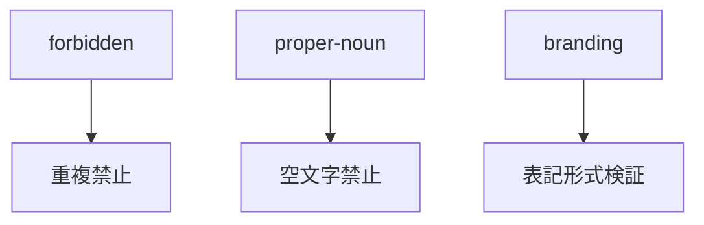

## 38. ランタイム機能

Core ランタイムが提供する機能を表します。

アダプター層は、「ランタイム機能」を利用して機能を制御します。

下記は、ランタイム機能例です。

```json
{
  "browser": true,
  "worker": true,
  "nodejs": false
}
```

### エンティティー

#### RuntimeCapability

```ts
interface RuntimeCapability {
    browser: boolean;

    worker: boolean;

    nodejs: boolean;
}
```

## 39. イベント種類

### ProfileUpdated

Profile が更新されたことを示します。

### DictionaryImported

辞書がインポートされたことを示します。

### DictionaryExported

辞書がエクスポートされたことを示します。

### ValidationCompleted

診断処理が完了したことを示します。

### BatchValidationCompleted

一括診断が完了したことを示します。

## 40. イベント・メタデータ

下記は、イベント・メタデータ例です。

```json
{
  "eventId":
    "evt-001",

  "eventType":
    "ValidationCompleted",

  "occurredAt":
    "2026-06-21T10:00:00Z"
}
```

### エンティティー

#### DomainEvent

```ts
interface DomainEvent {
    eventId: string;

    eventType: string;

    occurredAt: string;
}
```

## 41. 動的 UI 生成

アダプター層は、下記の情報のみを利用して、設定画面を構築します。

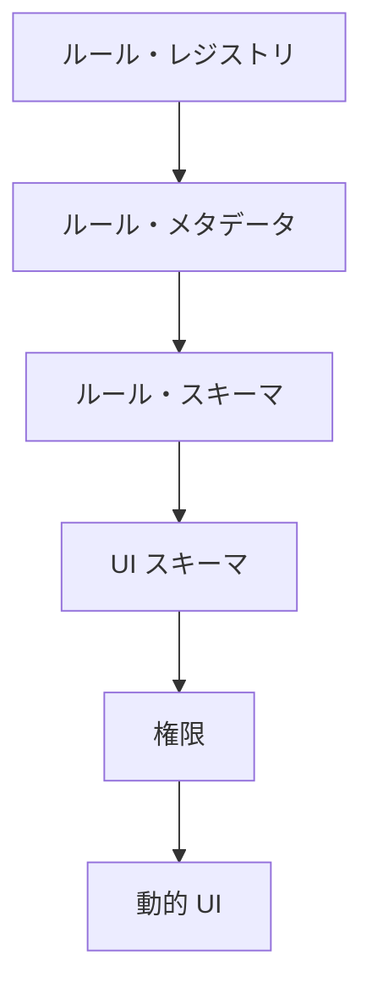

下記は、動的 UI 生成例です。

```json
{
  "id":
    "max-kanji-continuous",

  "metadata": {
    "label":
      "漢字連続数"
  },

  "schema": {
    "properties": {
      "max": {
        "type":
          "number"
      }
    }
  }
}
```

上記のようなルールを元に、下記のような UI を生成します。

```text
漢字連続数

[ 7 ]
```

### 推奨

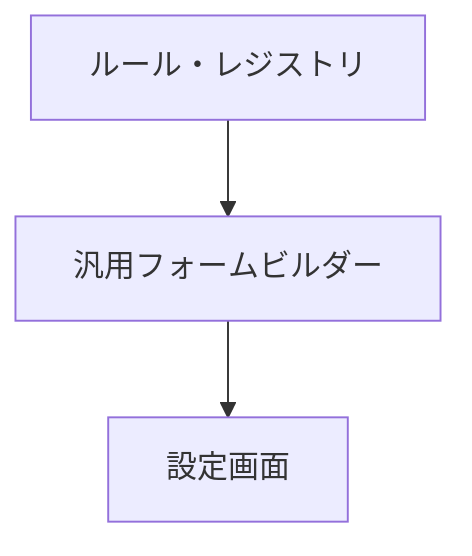

### 禁止

アダプター層は、ルール ID に依存して画面を実装してはなりません。

下記のような実装は禁止します。

```ts
if (
  ruleId ===
  "max-kanji-continuous"
)
{
    ...
}
```

## 42. パッケージ

パッケージは、プロファイルおよび辞書の配布単位を定義します。

下記は、パッケージ例です。

```json
{
  "schemaVersion": "1.0.0",

  "packageVersion": "1.2.0",

  "exportedAt":
    "2026-06-21T10:00:00Z",

  "profile": {},

  "dictionaries": []
}
```

### 設計意図 (ゴール)

* プロファイルの移植性向上
* 辞書の移植性向上
* バックアップ
* バージョン管理
* マイグレーション

### エンティティー

#### ProfilePackage

```ts
interface ProfilePackage {
    schemaVersion: string;

    packageVersion: string;

    profile: Profile;

    dictionaries:
        Dictionary[];

    exportedAt: string;
}
```

## 43. インポート

### `validatePackage()`

パッケージの整合性を検証します。

```ts
validatePackage(
    profilePackage
);
```

### 検証対象

* SchemaVersion
* PackageVersion
* Profile
* Dictionary

## 44. エクスポート

### `exportPackage()`

パッケージを生成します。

```ts
exportPackage(
    profile
);
```

## 45. 移行

Core API は、パッケージの後方互換性を維持します。

### 移行 Strategy

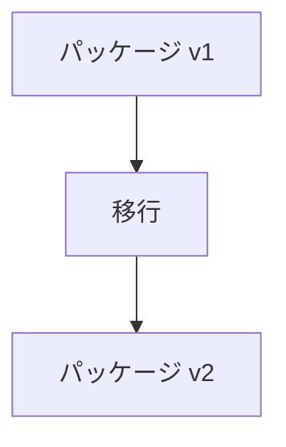

### 移行 Result

```ts
interface MigrationResult {
    sourceVersion:
        string;

    targetVersion:
        string;

    success:
        boolean;

    warnings:
        string[];
}
```

## 46. ルール・ライフサイクル

ルールは追加・更新・非推奨化される可能性があります。

下記は、ルール・ライフサイクル例です。

```json
{
  "id":
    "old-rule",

  "label":
    "旧ルール",

  "lifecycle":
    "deprecated"
}
```

### ライフサイクル状態

```ts
type RuleLifecycleState =
    | "active"
    | "deprecated"
    | "removed";
```

### エンティティー

#### RuleMetadata

```ts
interface RuleMetadata {
    id: string;

    label: string;

    description: string;

    category:
        RuleCategory;

    lifecycle:
        RuleLifecycleState;
}
```

## 47. アダプター挙動

### active

通常表示します。

### deprecated

利用可能だが、警告を表示します。

下記は、挙動例です。

```text
このルールは非推奨です。
後継ルールへの移行を推奨します。
```

### removed

新規作成時には、表示しません。既存 Profile に存在する場合のみロード可能です。

## 48. 後継

非推奨ルールは、後継ルールを持てます。

下記は、後継例です。

```json
{
  "id":
    "legacy-rule",

  "lifecycle":
    "deprecated",

  "successorRuleId":
    "modern-rule"
}
```

### エンティティー

#### RuleMetadata

```ts
interface RuleMetadata {
    successorRuleId?:
        string;
}
```

## 49. 辞書ライフサイクル

「辞書タイプ」もルールと同様に、ライフサイクルを持ちます。

### ライフサイクル状態

```ts
type DictionaryLifecycleState =
    | "active"
    | "deprecated"
    | "removed";
```

### エンティティー

#### DictionaryMetadata

```ts
interface DictionaryMetadata {
    id: string;

    name: string;

    type:
        DictionaryType;

    lifecycle:
        DictionaryLifecycleState;
}
```

## 50. 互換性方針

### 下位互換性

Core API は、下記を保証します。

* ProfilePackage のロード
* 非推奨ルールのロード
* 非推奨辞書のロード

### 上位互換性

未知のルールは、下記として扱います。

```json
{
  "type":
    "custom"
}
```

未知の DictionaryType は、下記として扱います。

```json
{
  "type":
    "custom"
}
```

## 51. 長期メンテナンス方針

### 基本原則

アダプター層は、ルール ID や「辞書タイプ」の固定値に依存してはなりません。

下記のような操作は、許可されます。

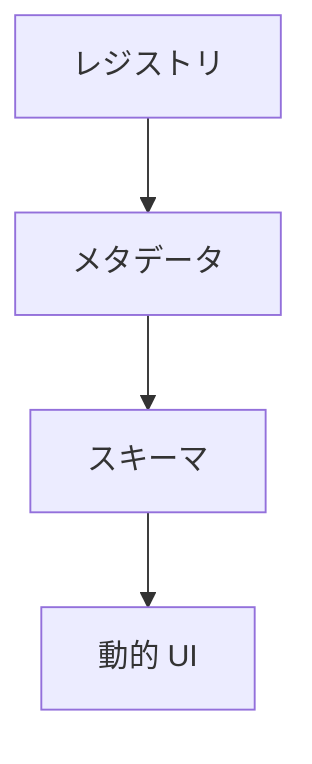

一方、下記のような操作は、許可されません。

```ts
if (
  ruleId ===
  "max-kanji-continuous"
)
{
    ...
}
```

## 52. 集約のルート

Core API は「集約のルート」を中心としてドメインモデルを構成します。

### プロファイル集約

プロファイルは、Core API の主要「集約のルート」です。

### 構造

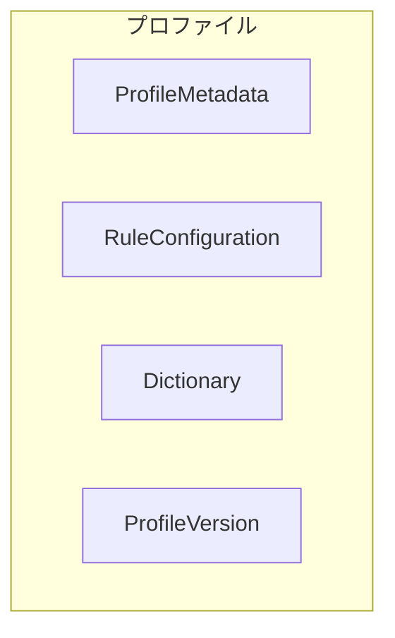

### 責務

* RuleConfiguration
* Dictionary
* Metadata
* Version Information

### 不変条件

「プロファイル集約」は、下記を保証します。

#### ルール整合性

全ての RuleConfiguration は、存在する RuleDefinition を参照しなければなりません。

#### 辞書整合性

全ての辞書は、有効な DictionaryType を持たなければなりません。

#### バージョン整合性

ProfileVersion は、「集約」全体に対して適用されます。

個別 RuleConfiguration に独自バージョンを持たせてはなりません。

## 53. 集約アクセスルール

更新は、必ず「プロファイル集約」経由で行います。

下記のようなアクセスは、許可されます。

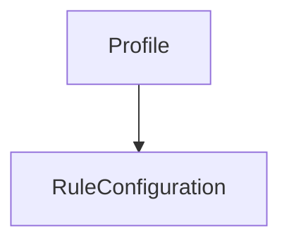

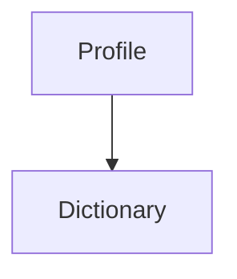

一方、下記のようなアクセスは、許可されません。

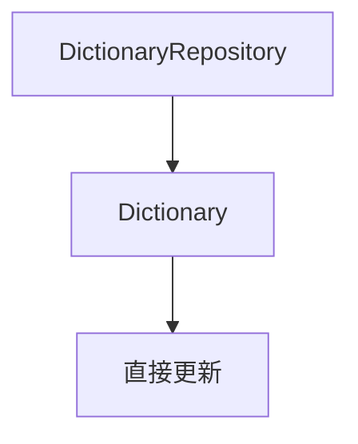

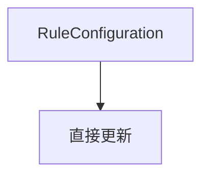

## 54. エクスポート単位

Profile パッケージの最小単位は、「集約」とします。

下記は、エクスポート単位例です。

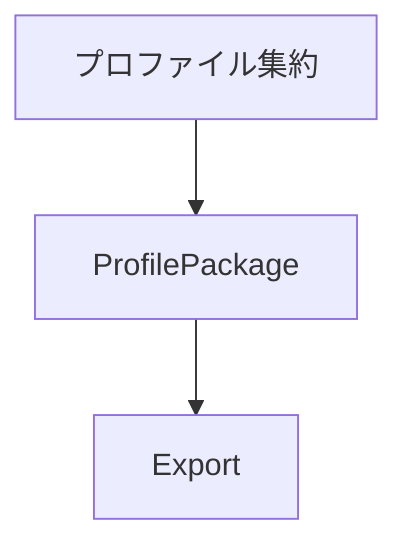

## 55. インポート単位

Profile パッケージの最小単位は、「集約」とします。

下記は、インポート単位例です。

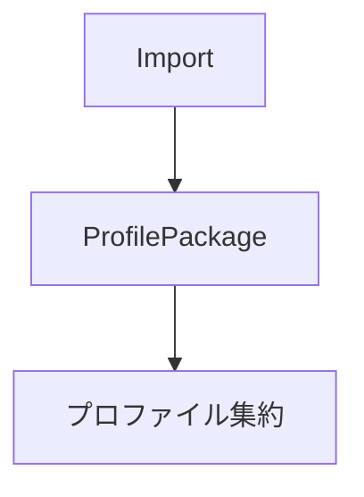

## 56. ID Strategy

Core API は安定した識別子を提供します。

識別子は、インポート / エクスポート / 移行の基盤となります。

## 57. ルール ID

RuleId はルール・レジストリ内で一意でなければなりません。

下記は、ルール ID 例です。

```text
max-kanji-continuous
max-sentence-length
forbidden-word
```

### RuleId

```ts
type RuleId = string;
```

### 安定性ルール

RuleId は、変更してはなりません。表示名の変更時も、RuleId は維持します。

下記のような操作は、許可されます。

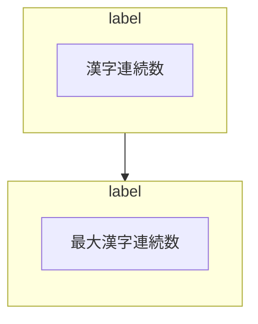

一方、下記のような操作は、許可されません。

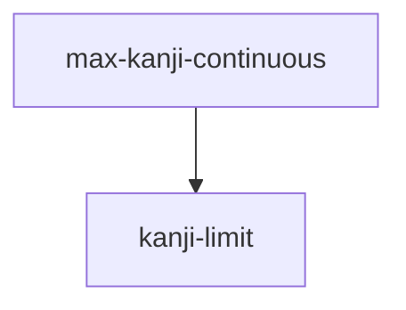

## 58. プロファイル ID

ProfileId は「パッケージ」内で一意でなければなりません。

### ProfileId

```ts
type ProfileId = string;
```

### 推奨フォーマット

```text
wordpress/default
wordpress/legal
mail/business
mail/marketing
```

### 名前空間ルール

ProfileId は「名前空間」を持つことを推奨します。

下記は、名前空間例です。

```text
wordpress/default
wordpress/legal
forwarder-pro/default
haihai-mail/marketing
```

#### フォーマット

```text
<domain>/<profile-name>
```

## 59. 辞書 ID

DictionaryId は「プロファイル集約」内で一意でなければなりません。

### DictionaryId

```ts
type DictionaryId = string;
```

### 推奨フォーマット

```text
proper-nouns
forbidden-words
recommended-words
```

## 60. パッケージ ID

パッケージのインポート / エクスポートを識別します。

下記は、パッケージ ID 例です。

```text
pkg-20260621-001
```

### PackageId

```ts
type PackageId = string;
```

## 61. ID 不変性

### 原則

識別子は不変です。

下記のような操作は、許可されます。

* `ProfileMetadata.name` の変更
* `RuleMetadata.label` の変更

一方、下記のような操作は、許可されません。

* `ProfileId` の変更
* `RuleId` の変更
* `DictionaryId` の変更

## 62. ID 解決

インポート時は「ID」によってマッピングを行います。

下記は、ID 解決の例です。

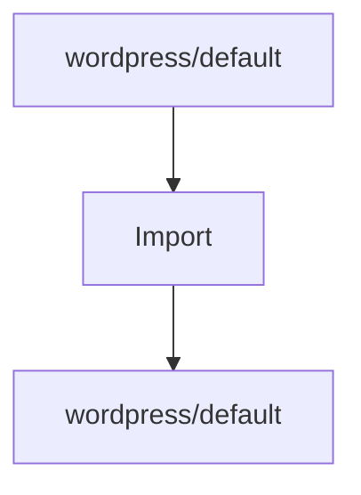

### 衝突 Strategy

同一 ProfileId が存在する場合、下記のいずれかを選択します。

* replace
* merge
* duplicate


## 63. 境界づけられたコンテキスト

### 設計原則

#### Core First

文章品質判定に関する知識は、「コアドメイン」に集約します。

#### アダプター独立性

コアドメインは、下記のようなアダプターに対して、特定プラットフォームに依存してはなりません。

* `WordPress`
* 将来の CMS
* `Forwarder-PRO`
* `配配メール`
* 将来のメール配信プラットフォーム

#### 安定ドメイン

コアドメインは、長期間維持されます。

アダプター・ドメインは変更可能です。

### コアドメイン・コンテキスト

Core API が管理するコンテキストです。

#### 責務

* RuleDefinition
* RuleConfiguration
* RuleMetadata
* RuleSchema
* UiSchema
* Dictionary
* DictionaryMetadata
* Profile
* Validation
* ValidationReport
* Import / Export
* Package
* Lifecycle
* Versioning

#### 集約ルート

```text
Profile
```

#### ドメインサービス

```text
LintService
ValidationService
ProfileService
```

#### ドメイン・イベント

```text
ProfileUpdated
DictionaryImported
ValidationCompleted
BatchValidationCompleted
```

### `WordPress` コンテキスト

`WordPress` アダプターが管理するコンテキストです。

#### 責務

* Post
* Page
* Block
* Custom Post Type
* User
* Option
* Metadata
* Gutenberg Integration
* WP-CLI Integration

#### 所有権

WordPress 固有概念は、「コアドメイン」に追加してはなりません。

下記は、所有権例です。

下記は、許可されます。

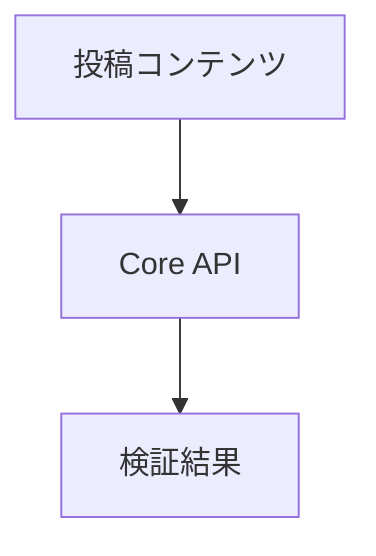

下記は、許可されません。

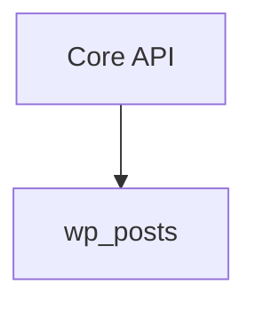

### メール配信コンテキスト

`Forwarder-PRO` や `配配メール` が管理するコンテキストです。

下記は、メール配信コンテキスト例です。

下記は、許可されます。

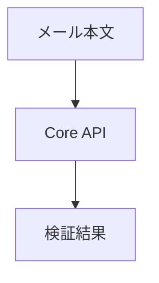

一方、下記は、許可されません。

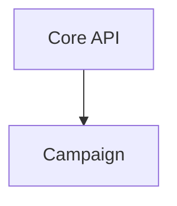

#### 責務

* メール
* Campaign
* テンプレート
* Delivery
* Subscriber
* テナント
* Organization

#### 所有権

メール配信固有概念は、「コアドメイン」に追加してはなりません。

### アダプター・コンテキスト

アダプターは独自のドメインモデルを持ちます。

下記は、アダプター・コンテキスト例です。

#### `WordPress` アダプター

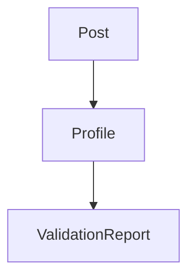

#### `Forwarder-PRO` アダプター

```mermaid
flowchart TD
  A["Mail"] --> B["Profile"]
  B --> C["ValidationReport"]
```

#### `配配メール` アダプター

```mermaid
flowchart TD
  A["Campaign"] --> B["Profile"]
  B --> C["ValidationReport"]
```

## 64. コンテキスト・マッピング

### 上流コンテキスト

コアドメインは、「上流コンテキスト」とします。

#### 提供物

* ルール・レジストリ
* メタデータ
* スキーマ
* 検証
* パッケージ契約

### 下流コンテキスト

アダプター・ドメインは「下流コンテキスト」とします。

#### 消費物

* RuleDefinition
* RuleSchema
* UiSchema
* ValidationReport

## 65. 依存性ルール

### 許可

```mermaid
flowchart TD
  A["アダプター"] --> B["Core API"]
```

```mermaid
flowchart TD
  A["WordPress アダプター"] --> B["Core API"]
```

```mermaid
flowchart TD
  A["Forwarder-PRO アダプター"] --> B["Core API"]
```

### 禁止

```mermaid
flowchart TD
  A["Core API"] --> B["`WordPress`"]
```

```mermaid
flowchart TD
  A["Core API"] --> B["`Forwarder-PRO`"]
```

```mermaid
flowchart TD
  A["Core API"] --> B["`配配メール`"]
```

## 66. 腐敗防止層

アダプターは必要に応じて「腐敗防止層」を実装できます。

### `WordPress` 例

```mermaid
flowchart TD
  A["`wp_posts`"] --> B["PostMapper"]
  B --> C["LintRequest"]
```

### `Forwarder-PRO` 例

```mermaid
flowchart TD
  A["MailTemplate"] --> B["TemplateMapper"]
  B --> C["LintRequest"]
```

## 67. 共有カーネル

Core API が提供する「共有カーネル」です。

### 含まれる

* RuleDefinition
* RuleMetadata
* RuleSchema
* UiSchema
* Profile
* Dictionary
* ValidationReport

### 含まない

* ユーザー
* サイト
* テナント
* Campaign
* メール
* 投稿

## 68. 拡張方針

新規アダプターを追加する場合は、既存「境界づけられたコンテキスト」を破ってはなりません。

下記は、許可されます。

```mermaid
flowchart TD
  A["新規アダプター"] --> B["Core API"]
```

一方、下記は、許可されません。

```mermaid
flowchart TD
  A["Core API"] --> B["新規アダプター固有のドメイン"]
```

## 69. 設計上の選択記録

### ADR-001

コアドメインは、文章品質判定に関する責務のみを保持します。

### ADR-002

プラットフォーム固有概念は、アダプター・ドメインに配置します。

### ADR-003

Core API は `WordPress` / `Forwarder-PRO` / `配配メール` に依存しません。

## 70. アダプター・ガイドライン

アダプター層は、ルール・スキーマを直接解釈します。

ルールごとの専用画面を実装してはなりません。

下記のような実装は、許可されます。

```mermaid
flowchart TD
  A["ルール・メタデータ"] --> B["Schema"]
  B --> C["フォーム生成"]
```

下記のような実装は、推奨されます。

```mermaid
flowchart TD
  A["ルール・レジストリ"] --> B["一般設定画面"]
```

一方、下記のような実装は、許可されません。

```text
if (
  ruleId ===
  "max-kanji-continuous"
)
{
  ...
}
```

アダプター層は、表示名ではなく ID を利用して参照します。

下記による参照は、許可されます。

```text
RuleId
ProfileId
DictionaryId
```

一方、下記による参照は、許可されません。

```text
ルールのラベル
プロファイルの名称
辞書の名称
```

## 71. 完了基準

Core API は、下記を満たした時点で完成とみなします。

* ドメイン
  * RuleDefinition
  * RuleConfiguration
  * Dictionary
  * Profile
  * Violation
  * ValidationReport
* メタデータ
  * RuleMetadata
  * ProfileMetadata
  * DictionaryMetadata
* スキーマ
  * RuleSchema
  * UiSchema
* レジストリ
  * RuleRegistry
* サービス
  * `lint()`
  * `lintBatch()`
  * `validateProfile()`
  * `validateDictionary()`
* 互換性
  * SchemaVersion
  * ProfileVersion
  * RuleCapability
* 拡張
  * DomainEvent 契約

Core API の設計は、下記を満たすこと。

* 「境界づけられたコンテキスト」が定義されている
* 「集約ルート」が定義されている
* アダプターの依存関係が一方向である
* 「共有カーネル」が定義されている
* 「プラットフォーム固有ドメイン」が分離されている
* 「腐敗防止層」を許容している
* 「境界づけられたコンテキスト」が明文化されている

Core API は、下記を満たした時点で、長期運用が可能とみなします。

* エクスポート
* インポート
* パッケージ検証
* 移行
* ルール・ライフサイクル
* 辞書ライフサイクル
* 下位互換性
* 上位互換性

## 72. 今後の拡張機能

下記は、今後追加を検討する機能です。これらは Core API の公開インターフェースを破壊しない形で追加します。

* 自動修正
* ルール・マーケットプレイス
* プロファイル・マーケットプレイス
* 多言語対応
* AI 支援レビュー
