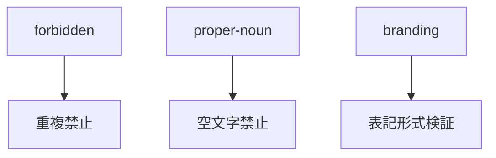
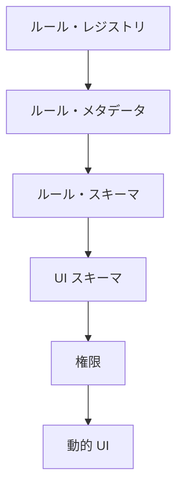
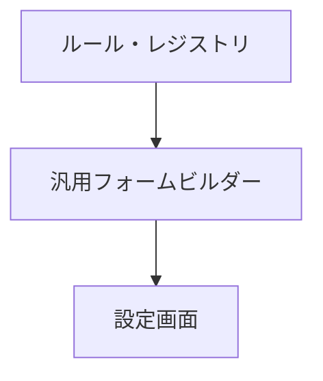
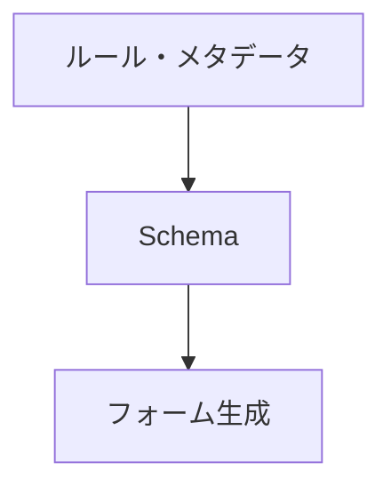
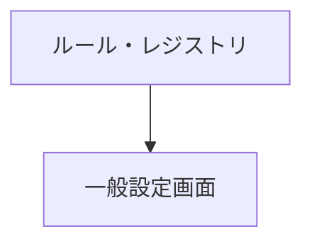

# 📘 S2J Docs Linter - フェーズ0 - Core API 仕様

## 1. 概要

本ドキュメントは `@s2j/docs-linter-core` の公開 API およびドメインモデルを定義します。
本パッケージは文章の品質検査エンジンであり、CLI・REST API、`WordPress` / `Forwarder-PRO` / `配配メール` 等のアダプターから利用されることを想定します。

## 2. 今後の互換性

新しい RuleDefinition が追加されても、`Metadata` / `Schema` / `UiSchema` が定義されていれば、アダプター側は修正不要で動作することを目標とします。

新しいルールが追加されても、`Metadata` / `Schema` / `UiSchema` / `権限` が提供されていれば、アダプター側は修正不要で動作することを目標とします。

新しい DictionaryType が追加されても、アダプター層は、`Metadata` / `Type` / `Schema` を利用して動作することを目標とします。

未知のタイプは `custom` として扱います。

## 3. 設計原則

### textlint の隠蔽

ユーザーは textlint の存在を意識しません。

Core API が公開するのは下記のみとします。

* Text
* Profile
* ルール設定
* 辞書
* Lint 結果

textlint 固有オブジェクトは公開 API に含めません。

### ランタイムの独立性

Core API は下記ランタイムをサポートします。

* Node.js
* ブラウザー
* Web Worker

Core API 自体は fs / path / os / process への依存を持ちません。

### アダプターの独立性

Core API は特定プラットフォームに依存しません。

対象例は、下記のようになります。

* CLI
* REST API
* `WordPress`
* `Forwarder-PRO`
* `配配メール`

## 4. UI 契約

Core API は RuleDefinition、Profile、Dictionary に対する UI 契約を提供します。

下記のようなアダプター層は、UI 契約を利用して、設定画面を自動生成できます。

* `WordPress`
* 将来の CMS
* `Forwarder-PRO`
* `配配メール`
* 将来のメール配信プラットフォーム

### 設計意図 (ゴール)

* アダプターごとの個別実装の削減
* ルール追加時の UI 修正不要化
* 動的フォーム生成
* 動的検証
* 動的レポート生成

## 5. 検証レポート契約

検証レポートは、一括診断の結果の標準フォーマットです。

### エンティティー

#### ValidationReport

```ts
interface ValidationReport {
    summary:
        ValidationSummary;

    items:
        ValidationItem[];
}
```

#### ValidationSummary

```ts
interface ValidationSummary {
    total: number;

    errors: number;

    warnings: number;

    infos: number;
}
```

#### ValidationItem

```ts
interface ValidationItem {
    id: string;

    title: string;

    result:
        LintResult;
}
```

## 6. 互換性契約

Core API は、長期的な後方互換性を維持します。

下記のようなアダプター層は、「バージョン」情報および「権限」情報を利用して、互換性を判定します。

* `WordPress`
* `Forwarder-PRO`
* `配配メール`
* 将来のアダプター

## 7. ドメイン・イベント契約

ドメイン・イベントは、将来的なイベント駆動連携のために定義します。

現時点では、必須実装ではありません。

## 8. インポート / エクスポート契約

Profile および Dictionary は移植可能でなければなりません。

### エクスポート形式

```json
{
  "schemaVersion":
    "1.0.0",

  "profileVersion":
    "1.2.0",

  "profile":
    {}
}
```

下記は、辞書エクスポート例です。

```json
{
  "type":
    "proper-noun",

  "terms": [
    "WordPress",
    "Gutenberg"
  ]
}
```

### 互換性ルール

アダプター層は下記を確認します。

* SchemaVersion
* ProfileVersion

互換性が無い場合は警告を表示します。

## 9. ルール・カテゴリー契約

ルール・カテゴリーは、RuleDefinition を論理的に分類するための値オブジェクトです。

下記のようなアダプター層は「ルール・カテゴリー」を利用して設定画面をグループ化できます。

* `WordPress`
* `Forwarder-PRO`
* `配配メール`
* 将来のアダプター

## 10. 辞書タイプ契約

辞書タイプは Dictionary の役割を定義する値オブジェクトです。

アダプター層は「辞書タイプ」を利用して適切な編集 UI を生成します。

## 11. 非責務

現時点では下記をアダプター層の責務とします。

* Markdown エディター UI
* WordPress UI
* REST API 実装
* データベース実装
* ユーザー管理
* 認証

## 12. 汎用言語

| 用語 | Description |
| --- | --- |
| Rule Definition | ルール定義 |
| Rule Configuration | ルール設定 |
| Dictionary | 辞書 |
| Profile | ルールと辞書の集合 |
| Lint Request | Lint 要求 |
| Lint Result | Lint 結果 |
| Violation | 指摘事項 |

## 13. ドメインモデル

### RuleDefinition

ルール定義です。開発者またはコントリビューターが提供します。ユーザーは変更できません。

ルール定義例は、下記のようになります。

```text
max-kanji-continuous
max-sentence-length
max-heading-length
forbidden-word
required-word
```

### RuleConfiguration

RuleDefinition に対する具体値です。

ルール設定例は、下記のようになります。

```json
{
  "max-kanji-continuous": {
    "max": 7
  }
}
```

### Dictionary

ユーザー固有の辞書です。

辞書例は、下記のようになります。

```yaml
forbidden:
  - ヤバい

recommended:
  - 利用する

properNouns:
  - WordPress
  - Gutenberg
```

### Profile

診断プロファイルです。

プロファイル例は、下記のようになります。

```json
{
  "id": "wordpress",
  "name": "WordPress Profile",
  "rules": {},
  "dictionary": {}
}
```

### Violation

指摘事項です。

指摘例は、下記のようになります。

```json
{
  "ruleId": "max-kanji-continuous",
  "severity": "warning",
  "message": "漢字の連続数が上限を超えています"
}
```

### LintResult

診断結果です。

結果例は、下記のようになります。

```json
{
  "errors": [],
  "warnings": []
}
```

## 14. 集約

### Profile 集約

Profile を集約ルートとします。

```text
┬ Profile
├─ RuleConfiguration
└─ Dictionary
```

RuleConfiguration および Dictionary は Profile 経由で管理します。

## 15. 値オブジェクト

### RuleId

```ts
type RuleId = string;
```

ルール id 例は、下記のようになります。

```text
max-kanji-continuous
forbidden-word
```

### ProfileId

```ts
type ProfileId = string;
```

プロファイル id 例は、下記のようになります。

```text
wordpress
business-mail
```

### Severity

```ts
type Severity =
    | "error"
    | "warning"
    | "info";
```

## 16. ドメインサービス

### LintEngine

文章を品質検査するドメインサービスです。

責務は、下記になります。

* ルール評価
* 辞書評価
* 結果の生成

### RuleEngine

ルール評価を担当します。

責務は、下記になります。

* RuleDefinition の実行
* RuleConfiguration の適用

### DictionaryEngine

辞書評価を担当します。

責務は、下記になります。

* 禁止語の検査
* 推奨語の検査
* 固有名詞の検査

### RuleRegistry

利用可能な RuleDefinition を管理します。

```ts
interface RuleRegistry {
    getAll(): RuleDefinition[];
    get(ruleId: RuleId): RuleDefinition | undefined;
}
```

## 17. アプリケーションサービス

### LintService

文章診断ユースケースです。

```ts
lint(request: LintRequest): Promise<LintResult>
```

### ProfileService

プロファイル管理ユースケースです。

```ts
loadProfile(profileId)
```

### ConfigService

設定管理ユースケースです。

```ts
validateConfig(config)
```

## 18. リポジトリ

### ProfileRepository

責務は、下記になります。

* Profile 取得
* Profile 保存

Core API ではインターフェースのみ定義します。実装は Adapter 側に委譲します。

### DictionaryRepository

責務は、下記になります。

* 辞書取得
* 辞書保存

Core API では実装しません。

## 19. 公開 API

### `lint()`

文章の品質検査です。

```ts
const result = await lint({
    text,
    profile
});
```

* リクエスト

```ts
interface LintRequest {
    text: string;
    profile: Profile;
}
```

* 応答

```ts
interface LintResult {
    errors: Violation[];
    warnings: Violation[];
}
```

### `lintBatch()`

複数文書を一括診断します。

```ts
const result =
    await lintBatch(
        requests
    );
```

* リクエスト

```ts
interface BatchLintRequest {
    items:
        LintRequest[];
}
```

* 応答

```ts
interface BatchLintResult {
    total: number;

    success: number;

    failed: number;

    results:
        LintResult[];
}
```

### `validateConfig()`

設定を検証します。

```ts
validateConfig(config);
```

### `validateDictionary()`

辞書を検証します。

```ts
validateDictionary(dictionary);
```

### `getAvailableRules()`

利用可能な RuleDefinition 一覧を取得します。

```ts
const rules =
    getAvailableRules();
```

* 応答

```json
[
  {
    "id": "max-kanji-continuous"
  },
  {
    "id": "max-sentence-length"
  }
]
```

### `getAvailableRule()`

利用可能な RuleDefinition を取得します。

* 応答

```json
[
  {
    "id":
      "max-kanji-continuous",

    "metadata":
      {},

    "schema":
      {},

    "uiSchema":
      {}
  }
]
```

### `validateProfile()`

Profile の妥当性を検証します。

```ts
validateProfile(
    profile
);
```

* 検証対象
  * Rule Existence
  * Schema Validation
  * Severity Validation
  * Dictionary Validation

* エラー例

```json
{
  "ruleId":
    "max-kanji-continuous",

  "message":
    "max must be greater than zero"
}
```

## 20. インフラストラクチャ境界

Core API が依存可能なものは、下記になります。

* textlint Engine
* Rule Adapter
* YAML Parser
* JSON Parser

Core API が依存してはならないものは、下記になります。

* WordPress
* React
* ブラウザー API
* Node.js API
* Database

## 21. ルール・レジストリ

ルール・レジストリは利用可能な RuleDefinition の一覧を提供します。

アダプター層はルール・レジストリを利用して、たとえば下記のような UI を構築できます。

* `WordPress` 管理画面
* `Forwarder-PRO` 設定画面
* `配配メール` 設定画面

## 22. ルール・メタデータ

ルール・メタデータはルールの表示情報を提供します。

アダプター層はルール・メタデータを利用して UI を生成します。

下記は、ルール・メタデータ例です。

```json
{
  "id": "max-kanji-continuous",

  "label":
    "漢字連続数",

  "description":
    "漢字の連続数を制限します",

  "category":
    "readability",

  "defaultSeverity":
    "warning",

  "order":
    100
}
```

### エンティティー

#### RuleMetadata

```ts
interface RuleMetadata {
    id: string;

    label: string;

    description: string;

    category: string;

    tags?: string[];

    defaultSeverity:
        | "error"
        | "warning"
        | "info";

    order?: number;
}
```

## 23. ルール・スキーマ

ルール・スキーマは RuleConfiguration の構造を定義します。

アダプター層はルール・スキーマを利用して設定 UI を生成します。

下記は、ルール・スキーマ例です。

```json
{
  "properties": {
    "max": {
      "type": "number",

      "label":
        "最大連続文字数",

      "description":
        "許容する漢字連続数",

      "required":
        true,

      "defaultValue":
        7,

      "minimum":
        1,

      "maximum":
        100
    }
  }
}
```

### スキーマ・バージョン

ルール・スキーマのバージョンを表します。ルール・スキーマの構造変更を管理するために利用します。

下記は、スキーマ・バージョン例です。

```json
{
  "version": "1.0.0"
}
```

### 重大度

利用者は Rule 毎に Severity を変更できます。

下記は、重大度例です。

```json
{
  "max-kanji-continuous": {
    "severity":
      "warning",

    "max":
      7
  }
}
```

#### 利用可能な値

```ts
type Severity =
    | "error"
    | "warning"
    | "info";
```

### エンティティー

#### RuleDefinition

RuleDefinition は Metadata、Schema、Capability を持ちます。

```ts
interface RuleDefinition {
    id: string;

    metadata:
        RuleMetadata;

    schema:
        RuleSchema;

    uiSchema:
        UiSchema;

    capability:
        RuleCapability;
}
```

#### RuleSchema

```ts
interface RuleSchema {
    properties:
        Record<
            string,
            SchemaProperty
        >;
}
```

#### SchemaProperty

```ts
interface SchemaProperty {
    type:
        | "string"
        | "number"
        | "boolean"
        | "array";

    label: string;

    description: string;

    required: boolean;

    defaultValue?: unknown;

    minimum?: number;

    maximum?: number;

    enum?: string[];
}
```

#### SchemaVersion

```ts
interface SchemaVersion {
    version: string;
}
```

## 24. ルール・カテゴリー

ルール・カテゴリーは、RuleDefinition を論理的に分類するための値オブジェクトです。

### 設計意図 (ゴール)

* 設定画面の整理
* ルールの検索性向上
* ルールのフィルタリング
* 動的 UI 生成

### 値オブジェクト

#### RuleCategory

```ts
type RuleCategory =
    | "readability"
    | "style"
    | "terminology"
    | "grammar"
    | "branding"
    | "accessibility"
    | "custom";
```

### ルール・カテゴリー定義

| カテゴリー | Description |
| --- | --- |
| readability | 可読性 |
| style | 文体 |
| terminology | 用語統一 |
| grammar | 文法 |
| branding | ブランド表記 |
| accessibility | アクセシビリティ |
| custom | カスタム |

### ルール・メタデータ連携

下記は、ルール・メタデータ連携例です。

```json
{
  "id":
    "max-kanji-continuous",

  "label":
    "漢字連続数",

  "description":
    "漢字の連続数を制限します",

  "category":
    "readability",

  "defaultSeverity":
    "warning"
}
```

### エンティティー

#### RuleMetadata

```ts
interface RuleMetadata {
    id: string;

    label: string;

    description: string;

    category:
        RuleCategory;

    tags?: string[];

    defaultSeverity:
        Severity;
}
```

### ルール・カテゴリー - 動的 UI 例

```text
readability
 ├─ max-kanji-continuous
 ├─ max-sentence-length
 └─ max-heading-length

terminology
 ├─ forbidden-word
 ├─ required-word
 └─ proper-noun
```

上記のようなルール・レジストリを元に、下記のような UI が生成されます。

```text
[可読性]

□ 漢字連続数
□ 文長
□ 見出し長

[用語統一]

□ 禁止語
□ 推奨語
□ 固有名詞
```

### 拡張方針

新しいカテゴリーは後方互換性を維持した状態で追加できます。

アダプター層は未知のカテゴリーを表示できなければなりません。

## 25. ルール機能

ルールが提供する機能を表します。

アダプター層は、「権限」を参照し、利用可能な UI や処理を決定します。

下記は、ルール機能例です。

```json
{
  "worker": true,
  "batch": true,
  "autofix": false,
  "realtime": true
}
```

### エンティティー

#### RuleCapability

```ts
interface RuleCapability {
    worker: boolean;

    batch: boolean;

    autofix: boolean;

    realtime: boolean;
}
```

### プロパティ

| プロパティ | Description |
| --- | --- |
| worker | Web Worker 実行対応 |
| batch | 一括診断対応 |
| autofix | 自動修正対応 |
| realtime | リアルタイム診断対応 |

## 26. UI スキーマ

UI スキーマは表示方法を定義する。

ルール・スキーマがデータ構造を表し、UI スキーマが描画方法を表す。

下記は、UI スキーマ例です。

```json
{
  "fields": {
    "max": {
      "widget": "number",

      "helpText":
        "1〜100 を指定してください"
    }
  }
}
```

### エンティティー

#### UiSchema

```ts
interface UiSchema {
    fields:
        Record<
            string,
            UiField
        >;
}
```

#### UiField

```ts
interface UiField {
    widget:
        | "text"
        | "textarea"
        | "number"
        | "checkbox"
        | "select"
        | "multiselect";

    placeholder?: string;

    helpText?: string;
}
```

## 27. プロファイル・メタデータ

Profile の表示情報を定義します。

下記は、プロファイル・メタデータ例です。

```json
{
  "id":
    "wordpress",

  "name":
    "WordPress",

  "description":
    "WordPress 向けプロファイル",

  "category":
    "cms"
}
```

### エンティティー

#### ProfileMetadata

```ts
interface ProfileMetadata {
    id: string;

    name: string;

    description: string;

    category?: string;

    icon?: string;
}
```

## 28. プロファイル・バージョン

Profile のバージョンを表します。

Profile インポート / エクスポート時の互換性確認に利用します。

下記は、プロファイル・バージョン例です。

```json
{
  "version": "2.1.0"
}
```

### エンティティー

#### ProfileVersion

```ts
interface ProfileVersion {
    version: string;
}
```

## 29. 辞書メタデータ

Dictionary の表示情報を定義します。

下記は、辞書メタデータ例です。

```json
{
  "id":
    "proper-nouns",

  "name":
    "固有名詞辞書",

  "description":
    "製品名やサービス名を管理します"
}
```

### エンティティー

#### DictionaryMetadata

```ts
interface DictionaryMetadata {
    id: string;

    name: string;

    description: string;

    category?: string;
}
```

## 30. 辞書タイプ

辞書タイプは Dictionary の役割を定義する値オブジェクトです。

下記は、辞書タイプ例です。

```json
{
  "id":
    "wordpress-proper-nouns",

  "name":
    "WordPress 固有名詞辞書",

  "description":
    "WordPress 関連用語",

  "type":
    "proper-noun"
}
```

### 設計意図 (ゴール)

* 辞書の役割明確化
* 動的 UI 生成
* 動的検証
* インポート / エクスポートの標準化

### 値オブジェクト

#### DictionaryType

```ts
type DictionaryType =
    | "forbidden"
    | "recommended"
    | "proper-noun"
    | "abbreviation"
    | "branding"
    | "custom";
```

### 辞書タイプ定義

| タイプ | Description |
| --- | --- |
| forbidden | 禁止語 |
| recommended | 推奨語 |
| proper-noun | 固有名詞 |
| abbreviation | 略語 |
| branding | ブランド表記 |
| custom | カスタム |

### 辞書メタデータ連携

### エンティティー

#### DictionaryMetadata

```ts
interface DictionaryMetadata {
    id: string;

    name: string;

    description: string;

    type:
        DictionaryType;
}
```

### 辞書タイプ - 動的 UI 例

```text
forbidden
 └─ 禁止語辞書

recommended
 └─ 推奨語辞書

proper-noun
 └─ 固有名詞辞書

branding
 └─ ブランド表記辞書
```

上記のような辞書レジストリを元に、下記のような UI が生成されます。

```text
[禁止語]

+ 追加
- 削除

────────────────

[固有名詞]

+ 追加
- 削除

────────────────

[ブランド表記]

+ 追加
- 削除
```

### 検証方針

辞書タイプごとに異なる検証ルールを適用できます。

下記は、検証ルール例です。



## 31. ランタイム機能

Core ランタイムが提供する機能を表します。

アダプター層は「ランタイム機能」を利用して機能を制御します。

下記は、ランタイム機能例です。

```json
{
  "browser": true,
  "worker": true,
  "nodejs": false
}
```

### エンティティー

#### RuntimeCapability

```ts
interface RuntimeCapability {
    browser: boolean;

    worker: boolean;

    nodejs: boolean;
}
```

## 32. イベント種類

### ProfileUpdated

Profile が更新されたことを示します。

### DictionaryImported

Dictionary がインポートされたことを示します。

### DictionaryExported

Dictionary がエクスポートされたことを示します。

### ValidationCompleted

診断処理が完了したことを示します。

### BatchValidationCompleted

一括診断が完了したことを示します。

## 33. イベント・メタデータ

下記は、イベント・メタデータ例です。

```json
{
  "eventId":
    "evt-001",

  "eventType":
    "ValidationCompleted",

  "occurredAt":
    "2026-06-21T10:00:00Z"
}
```

### エンティティー

#### DomainEvent

```ts
interface DomainEvent {
    eventId: string;

    eventType: string;

    occurredAt: string;
}
```

## 34. 動的 UI 生成

アダプター層は、下記の情報のみを利用して、設定画面を構築します。



下記は、動的 UI 生成例です。

```json
{
  "id":
    "max-kanji-continuous",

  "metadata": {
    "label":
      "漢字連続数"
  },

  "schema": {
    "properties": {
      "max": {
        "type":
          "number"
      }
    }
  }
}
```

上記のようなルールを元に、下記のような UI を生成します。

```text
漢字連続数

[ 7 ]
```

### 推奨



### 禁止

アダプター層は、ルール ID に依存して画面を実装してはなりません。

下記のような実装は禁止します。

```ts
if (
  ruleId ===
  "max-kanji-continuous"
)
{
    ...
}
```

## 35. アダプター・ガイドライン

アダプター層はルール・スキーマを直接解釈します。

ルールごとの専用画面を実装してはなりません。

下記は、許可されます。



下記は、推奨されます。



下記のような実装は、禁止されます。

```text
if (
  ruleId ===
  "max-kanji-continuous"
)
{
  ...
}
```

## 36. 完了基準

Core API は下記を満たした時点で完成とみなします。

* ドメイン
  * RuleDefinition
  * RuleConfiguration
  * Dictionary
  * Profile
  * Violation
  * ValidationReport
* メタデータ
  * RuleMetadata
  * ProfileMetadata
  * DictionaryMetadata
* スキーマ
  * RuleSchema
  * UiSchema
* レジストリ
  * RuleRegistry
* サービス
  * `lint()`
  * `lintBatch()`
  * `validateProfile()`
  * `validateDictionary()`
* 互換性
  * SchemaVersion
  * ProfileVersion
  * RuleCapability
* 拡張
  * DomainEvent 契約

## 37. 今後の拡張機能

下記は、今後追加を検討する機能です。これらは Core API の公開インターフェースを破壊しない形で追加します。

* 自動修正
* ルール・マーケットプレイス
* プロファイル・マーケットプレイス
* 多言語対応
* AI 支援レビュー
