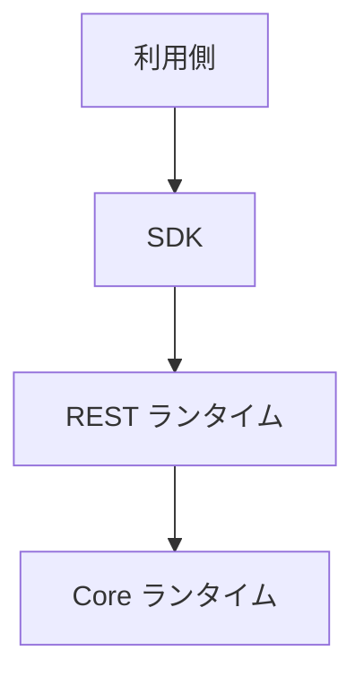

# 📘 S2J Docs Linter - 配置モデル

## 1. 配置仕様

本書は、S2J Docs Linter プラットフォームの配置契約を定義します。

配置契約は、プラットフォームを実行環境に配置するための構成、および各ランタイムの責務を定義します。

本書は、下記のコンポーネントを対象とします。

* Core ランタイム
* REST ランタイム
* SDK
* SDK ジェネレーター
* WordPress 連携
* 将来追加される「利用側」

## 2. 目的

配置モデルは、下記を目的とします。

* ランタイムの責務分離
* 配置の標準化
* 「利用側」ごとの差異吸収
* ホスティング環境の抽象化
* 長期運用性の確保

## 3. 配置の原則

プラットフォームは、下記の原則に従います。

* ランタイム非依存
* 「利用側」非依存
* インフラストラクチャ非依存
* 不変配置
* ステートレス・ランタイム
* データとしての設定

## 4. 配置ユニット

プラットフォームは、下記の配置ユニットから構成されます。

| ユニット | 責務 |
| --- | --- |
| Core ランタイム | Lint エンジン |
| REST ランタイム | トランスポート・アダプター |
| SDK | クライアント・ランタイム |
| SDK ジェネレーター | コード生成 |
| 利用側 | WordPress 等 |

## 5. 配置モデル

### 組み込み

「利用側」内に直接組み込みます。

下記は、組み込み例です。

* WordPress プラグイン
* ブラウザー・アプリケーション
* デスクトップ・アプリケーション

### ローカル・ランタイム

ローカル・プロセスとして実行します。

下記は、ローカル・ランタイム例です。

* Node.js
* CLI

### リモート・ランタイム

REST API として提供します。

下記は、リモート・ランタイム例です。

* Spring Boot
* PHP ランタイム
* Node.js サーバー

### ハイブリッド・ランタイム

「利用側」内とリモート・ランタイムを、組み合わせます。

下記は、ハイブリッド・ランタイム例です。

* ブラウザー + REST
* WordPress + REST

## 6. ランタイム・トポロジー

## 7. サポート対象の配備先

### ブラウザー

* Web Worker
* サーバーサイド Node.js への依存関係なし

### PHP

* WordPress
* 汎用 PHP

### Node.js

* CLI
* REST サーバー

### Java

* Spring Boot

### 将来のランタイム

追加ランタイムは、「配置契約」を実装します。

## 8. ランタイム境界

各ランタイムは、独立してデプロイ可能でなければなりません。

### Core ランタイム

ビジネス・ロジックのみを保持します。

### REST ランタイム

トランスポートのみ担当します。

### SDK

通信のみ担当します。

### 利用側

ビジネス・ワークフローを担当します。

## 9. 契約

### 設定の契約

配置は、設定により制御します。

### リソースの契約

配置時に利用するリソースを、定義します。

### スケーラビリティ契約

プラットフォームは、水平・垂直スケールを妨げてはなりません。

## 10. 設定

配置は、設定により制御します。

下記は、制御の例です。

* エンドポイント
* タイムアウト
* リトライ
* プロファイル
* 認証

### ルール

設定は、ランタイムから分離します。

## 11. リソース

配置時に利用するリソースを、定義します。

### マネージド・リソース

* 辞書
* ルール定義
* プロファイル
* テンプレート
* キャッシュ

### ルール

リソースは、差し替え可能である必要があります。

## 12. 配置プロファイル

* 開発： デバッグ有効
* テスト： モックサービス有効
* ステージング： 本番同様の環境
* 本番： 最適化設定

## 13. スケーラビリティ

プラットフォームは、水平・垂直スケールを妨げてはなりません。

下記は、スケーラビリティ契約の例です。

* 複数の REST ランタイム
* 共有 SDK
* ステートレス Core ランタイム

## 14. 可用性の方針

配置は、部分障害に耐えられることを推奨します。

### 例

* リトライ
* タイムアウト
* 正常な失敗

## 15. アップグレード戦略

配置は、段階的に更新できます。

### サポート対象の戦略

* ローリング・アップデート
* Blue/Green (現行/新) 配置
* カナリア・リリース

### ルール

配置戦略は、ランタイムに依存しません。

## 16. 可観測性

配置は、下記を公開できます。

* ヘルス・ステータス
* バージョン
* ランタイム・プロファイル
* 機能
* 指標

## 17. 完了条件

配置仕様は、下記を実装した時点で完成とみなします。

* 配置の原則
* 配置ユニット
* 配置モデル
* ランタイム・トポロジー
* サポート対象の配備先
* ランタイム境界
* 設定の契約
* リソースの契約
* 配置プロファイル
* スケーラビリティ契約
* 可用性の方針
* アップグレード戦略
* 可観測性
* ADR (アーキテクチャ決定記録)

## 18. ADR (アーキテクチャ決定記録)

### ADR-DEP-001

#### タイトル

* ランタイム非依存配置

#### 決定

* 配置は、ランタイムに依存しない。

### ADR-DEP-002

#### タイトル

* ステートレス・ランタイム

#### 決定

* Core ランタイムは、ステートレスとする。

### ADR-DEP-003

#### タイトル

* データとしての設定

#### 決定

* 配置設定は、ランタイムから分離する。

### ADR-DEP-004

#### タイトル

* リソース分離

#### 決定

* 辞書およびルールは、リソースとして管理する。

### ADR-DEP-005

#### タイトル

* 利用側の独立性

#### 決定

* 利用側は、「配置ユニット」として独立する。
