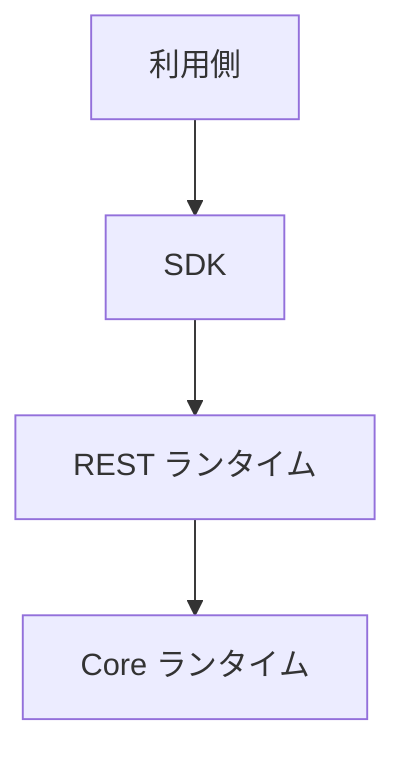
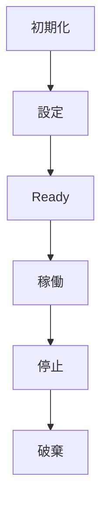
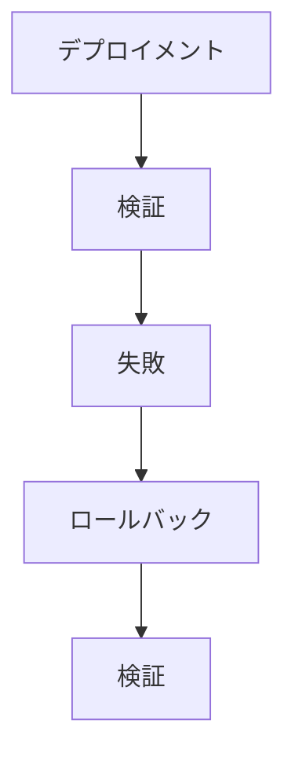
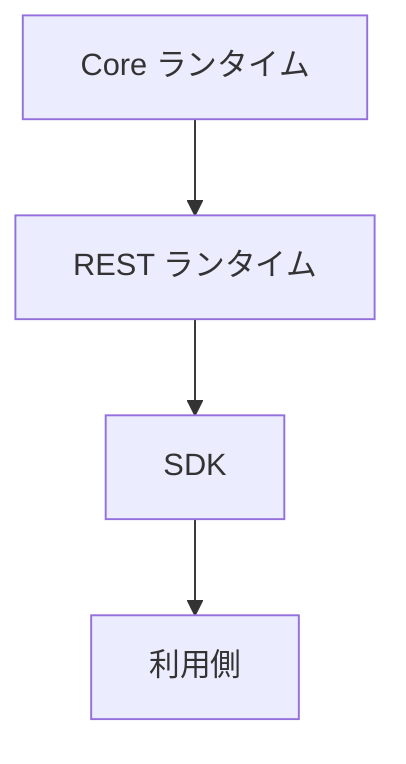

# 📘 S2J Docs Linter - デプロイメント・モデル

## 1. デプロイメント仕様

本書は、S2J Docs Linter プラットフォームのデプロイメント契約を定義します。

デプロイメント契約は、プラットフォームを実行環境にデプロイメントするための構成、および各ランタイムの責務を定義します。

本書は、下記のコンポーネントを対象とします。

* Core ランタイム
* REST ランタイム
* SDK
* SDK ジェネレーター
* WordPress 連携
* 将来追加される「利用側」

## 2. 目的

デプロイメント・モデルは、下記を目的とします。

* ランタイムの責務分離
* デプロイメントの標準化
* 「利用側」ごとの差異吸収
* ホスティング環境の抽象化
* 長期運用性の確保

## 3. デプロイメント原則

プラットフォームは、下記の原則に従います。

* ランタイム非依存
* 「利用側」非依存
* インフラストラクチャ非依存
* 不変デプロイメント
* ステートレス・ランタイム
* データとしての設定

## 4. デプロイメント・ユニット

プラットフォームは、下記のデプロイメント・ユニットから構成されます。

| ユニット | 責務 |
| --- | --- |
| Core ランタイム | Lint エンジン |
| REST ランタイム | トランスポート・アダプター |
| SDK | クライアント・ランタイム |
| SDK ジェネレーター | コード生成 |
| 利用側 | WordPress 等 |

## 5. デプロイメントモデル

### 組み込み

「利用側」内に直接組み込みます。

下記は、組み込み例です。

* WordPress プラグイン
* ブラウザー・アプリケーション
* デスクトップ・アプリケーション

### ローカル・ランタイム

ローカル・プロセスとして実行します。

下記は、ローカル・ランタイム例です。

* Node.js
* CLI

### リモート・ランタイム

REST API として提供します。

下記は、リモート・ランタイム例です。

* Spring Boot
* PHP ランタイム
* Node.js サーバー

### ハイブリッド・ランタイム

「利用側」内とリモート・ランタイムを、組み合わせます。

下記は、ハイブリッド・ランタイム例です。

* ブラウザー + REST
* WordPress + REST

## 6. ランタイム・トポロジー



## 7. サポート対象の配備先

### ブラウザー

* Web Worker
* サーバーサイド Node.js への依存関係なし

### PHP

* WordPress
* 汎用 PHP

### Node.js

* CLI
* REST サーバー

### Java

* Spring Boot

### 将来のランタイム

追加ランタイムは、「デプロイメント契約」を実装します。

## 8. ランタイム境界

各ランタイムは、独立してデプロイ可能でなければなりません。

### Core ランタイム

ビジネス・ロジックのみを保持します。

### REST ランタイム

トランスポートのみ担当します。

### SDK

通信のみ担当します。

### 利用側

ビジネス・ワークフローを担当します。

## 9. 契約

### 設定の契約

デプロイメントは、設定により制御します。

### リソースの契約

デプロイメント時に利用するリソースを、定義します。

### スケーラビリティ契約

プラットフォームは、水平・垂直スケールを妨げてはなりません。

### Advanced デプロイメント契約

デプロイメント契約は、ランタイム、利用側、およびインフラストラクチャを疎結合に保つことを目的とします。

### デプロイメント機能の契約

デプロイメントは、ランタイム機能を公開します。

### ランタイム・プロファイル契約

ランタイムは、プロファイルにより動作を切り替えます。

### 環境契約

ランタイムは、環境設定を利用します。

### リソース解決契約

ランタイムは、リソースを解決します。

### ランタイム・ライフサイクル契約

すべてのランタイムは、共通ライフサイクルを持ちます。

### デプロイメント検証契約

デプロイメント完了後に、ランタイムを検証します。

### ロールバック契約

デプロイメントは、ロールバックをサポートします。

### デプロイメント可観測性の契約

デプロイメント状態は、ランタイムから取得できます。

### デプロイメント互換性契約

デプロイメントは、「互換性契約」と整合していなければなりません。

デプロイメント互換性契約は、デプロイメント・マニフェストと互換性マニフェストの対応関係を定義します。

### デプロイメント依存関係の契約

デプロイメント・ユニット間の依存関係を、定義します。

### ランタイム・ヘルス契約

ランタイムは、共通のヘルス契約を提供します。

### デプロイメント・セキュリティ契約

デプロイメントは、セキュリティ契約に従います。

### デプロイメント・アップグレード契約

デプロイメントは、段階的なアップグレードをサポートします。

### デプロイメント監査契約

デプロイメントは、監査可能であることとします。

### ランタイム分離契約

各ランタイムは、独立して実行できます。

## 10. 設定

デプロイメントは、設定により制御します。

下記は、制御の例です。

* エンドポイント
* タイムアウト
* リトライ
* プロファイル
* 認証

### ルール

設定は、ランタイムから分離します。

## 11. リソース

デプロイメント時に利用するリソースを、定義します。

### マネージド・リソース

* 辞書
* ルール定義
* プロファイル
* テンプレート
* キャッシュ

### ルール

リソースは、差し替え可能である必要があります。

## 12. デプロイメント・プロファイル

* 開発： デバッグ有効
* テスト： モックサービス有効
* ステージング： 本番同様の環境
* 本番： 最適化設定

## 13. スケーラビリティ

プラットフォームは、水平・垂直スケールを妨げてはなりません。

下記は、スケーラビリティ契約の例です。

* 複数の REST ランタイム
* 共有 SDK
* ステートレス Core ランタイム

## 14. 可用性の方針

デプロイメントは、部分障害に耐えられることを推奨します。

### 例

* リトライ
* タイムアウト
* 正常な失敗

## 15. アップグレード戦略

デプロイメントは、段階的に更新できます。

### サポート対象の戦略

* ローリング・アップデート
* Blue/Green (現行/新) デプロイメント
* カナリア・リリース

### ルール

デプロイメント戦略は、ランタイムに依存しません。

## 16. 可観測性

デプロイメントは、下記を公開できます。

* ヘルス・ステータス
* バージョン
* ランタイム・プロファイル
* 機能
* 指標

## 17. Advanced デプロイメント

本章は、デプロイメント仕様を補完します。

本章では、プラットフォームを安全かつ一貫性を保って配置・運用するためのデプロイメント契約を定義します。

デプロイメント契約は、ランタイム、利用側、およびインフラストラクチャを疎結合に保つことを目的とします。

## 18. デプロイメント・マニフェスト

デプロイメントは、マニフェストにより記述します。

デプロイメント・マニフェストは、デプロイメントの Single Source of Truth とします。

下記は、デプロイメント・マニフェストの例です。

```yaml
deploymentVersion: "1.0"

profile: wordpress

runtime:
  core: 1.2.0
  rest: 1.1.0
  sdk: 1.5.0

capabilities:
  - web-worker
  - batch-validation
```

### 必須プロパティ

* デプロイメント・バージョン
* ランタイム・バージョン
* デプロイメント・プロファイル
* 機能リスト
* 互換性リファレンス

### ルール

デプロイメント・マニフェストは、リリース成果物に含めます。

## 19. デプロイメント機能

デプロイメントは、ランタイム機能を公開します。

### 標準機能

* supportsWebWorker
* supportsRestRuntime
* supportsCLI
* supportsBatchValidation
* supportsOffline
* supportsIncrementalValidation

### ルール

機能は、ランタイム起動時に取得できることとします。

## 20. ランタイム・プロファイル

ランタイムは、プロファイルにより動作を切り替えます。

### 標準プロファイル

* default
* browser
* wordpress
* cli
* spring-boot
* embedded

### ルール

プロファイルは、デプロイメント・マニフェストで指定します。

## 21. 環境

ランタイムは、環境設定を利用します。

### 標準変数

* LINTER_PROFILE
* LINTER_ENDPOINT
* LINTER_CACHE
* LINTER_TIMEOUT
* LINTER_LOG_LEVEL

### ルール

設定は、ランタイムに埋め込んではなりません。

## 22. デプロイメント記述子

デプロイメント記述子は、ランタイム間の構成を記述します。

下記は、デプロイメント記述子の例です。


### ルール

記述子は、デプロイメント・トポロジーを表現できることとします。

## 23. リソース解決

ランタイムは、リソースを解決します。

### マネージド・リソース

* ルール
* 辞書
* プロファイル
* テンプレート
* 設定

### 解決順序

1. デプロイメントのオーバーライド
2. 利用側リソース
3. 組み込みリソース

### ルール

リソース解決は、決定論的 (deterministic) であることとします。

## 24. ランタイム・ライフサイクル

すべてのランタイムは、共通ライフサイクルを持ちます。

### ライフサイクル



### ルール

Ready 状態になるまで、リクエストを受け付けてはなりません。

## 25. デプロイメント検証

デプロイメント完了後に、ランタイムを検証します。

### 必須検証

* ヘルス・チェック
* 機能チェック
* 設定チェック
* バージョン・チェック

### ルール

検証に失敗したデプロイメントは、Ready として扱いません。

## 26. ロールバック

デプロイメントは、ロールバックをサポートします。

### ロールバック・フロー



### ルール

ロールバックは、デプロイメント前の状態へ復元可能でなければなりません。

## 27. デプロイメント可観測性

デプロイメント状態は、ランタイムから取得できます。

### 標準情報

* ヘルス
* 準備状況
* 稼働状況
* ランタイム・バージョン
* デプロイメント・プロファイル
* 機能

### 標準指標

* 起動時間
* アクティブ・ランタイム
* リソース使用量
* デプロイメント数

### ルール

可観測性に関する情報は、機械可読で取得できることとします。

## 28. 横断原則

### ランタイム非依存

デプロイメントは、ランタイムに依存しません。

### 「利用側」非依存

「利用側」に依存したデプロイメントを、禁止します。

### 不変デプロイメント

デプロイメント後にランタイムを、変更してはなりません。

### データとしての設定

設定は、ランタイムから分離します。

### 不変インフラストラクチャ

デプロイメント後のランタイムを、変更してはなりません。

### 決定論的 (deterministic) なデプロイメント

同一マニフェストから同一デプロイメントを生成します。

### インフラストラクチャの独立性

デプロイメントは、特定のインフラストラクチャに依存しません。

### 継続的な検証

デプロイメントは、継続的に検証します。

## 29. Advanced デプロイメント・ガバナンス

本章は、デプロイメント仕様を補完します。

本章では、デプロイメントの長期運用に必要なデプロイメント契約および運用ガバナンスを定義します。

デプロイメント契約は、ランタイム、互換性、およびリリース・エンジニアリングと連携してプラットフォーム全体の整合性を保証します。

## 30. デプロイメント互換性

デプロイメントは、「互換性契約」と整合していなければなりません。

デプロイメント互換性契約は、デプロイメント・マニフェストと互換性マニフェストの対応関係を定義します。

### 検証の対象

* ランタイム・バージョン
* Core API バージョン
* REST バージョン
* SDK バージョン
* ジェネレーター・バージョン

### ルール

互換性が検証できないデプロイメントは、本番に昇格してはなりません。

## 31. デプロイメント・プロファイル・マニフェスト

デプロイメント・プロファイルは、ランタイム構成を定義します。

下記は、デプロイメント・プロファイル例です。

```yaml id="r7qxt8"
profile: wordpress

runtime:
  php: "8.2"

features:
  web-worker: false
  rest-runtime: true
```

### ルール

デプロイメント・プロファイルは、デプロイメント・マニフェストから参照されます。

## 32. デプロイメント依存関係

デプロイメント・ユニット間の依存関係を、定義します。

### 標準の依存関係


### ルール

依存関係は、循環してはなりません。

## 33. デプロイメント順序の方針

デプロイメントおよびシャットダウンの順序を、定義します。

### 起動順序



### シャットダウン順序

起動の逆順で、停止します。

### ルール

依存先より先に、起動してはなりません。

## 34. ランタイム・ヘルス

ランタイムは、共通のヘルス契約を提供します。

### 必須ステータス

* 起動
* 稼働状態
* 準備状態
* シャットダウン

### ルール

準備状態が完了するまで、ランタイムは、リクエストを受け付けません。

## 35. デプロイメント・セキュリティ

デプロイメントは、セキュリティ契約に従います。

### セキュリティの対象

* TLS
* Secret
* 認証
* 証明書
* 設定

### ルール

Secret を、デプロイメント成果物に含めてはなりません。

## 36. デプロイメント・アップグレード

デプロイメントは、段階的なアップグレードをサポートします。

### サポート対象の戦略

* ローリング・アップデート
* Blue/Green (現行/新) デプロイメント
* カナリア・リリース

### ルール

アップグレード前に、互換性検証を実施します。

## 37. マルチノード・デプロイメント方針

ランタイムは、複数ノード構成をサポートできます。

下記は、マルチノード・デプロイメントの例です。

* 複数 REST ランタイム
* Shared SDK
* ステートレス Core ランタイム

### ルール

ランタイムは、ノード数に依存してはなりません。

## 38. ランタイム分離

各ランタイムは、独立して実行できます。

### 分離の対象

* ブラウザー
* CLI
* REST
* WordPress

### ルール

ランタイム間で、内部状態を共有してはなりません。

## 39. デプロイメント監査

デプロイメントは、監査可能であることとします。

### 監査の対象

* デプロイメント
* ロールバック
* プロモーション
* 検証

### 必須情報

* ランタイム
* バージョン
* タイムスタンプ
* オペレーター
* デプロイメント・プロファイル

### ルール

監査情報は、追跡可能な形式で保持します。

## 40. 完了条件

デプロイメント仕様は、下記を実装した時点で完成とみなします。

* デプロイメント原則
* デプロイメント・ユニット
* デプロイメント・モデル
* ランタイム・トポロジー
* サポート対象の配備先
* ランタイム境界
* 設定の契約
* リソースの契約
* デプロイメント・プロファイル
* スケーラビリティ契約
* 可用性の方針
* アップグレード戦略
* 可観測性
* ADR (アーキテクチャ決定記録)

Advanced デプロイメント契約は、下記を実装した時点で完成とみなします。

* デプロイメント・マニフェスト
* デプロイメント機能の契約
* ランタイム・プロファイル契約
* 環境契約
* デプロイメント記述子
* リソース解決契約
* ランタイム・ライフサイクル契約
* デプロイメント検証契約
* ロールバック契約
* デプロイメント可観測性の契約
* 横断原則
* Advanced デプロイメント契約 ADR (アーキテクチャ決定記録)

Advanced デプロイメント・ガバナンスは、下記を実装した時点で完成とみなします。

* デプロイメント互換性契約
* デプロイメント・プロファイル・マニフェスト
* デプロイメント依存関係契約
* デプロイメント順序の方針
* ランタイム・ヘルス契約
* デプロイメント・セキュリティ契約
* デプロイメント・アップグレード契約
* マルチノード・デプロイメント方針
* ランタイム分離契約
* デプロイメント監査契約
* Advanced デプロイメント・ガバナンス ADR (アーキテクチャ決定記録)

## 41. ADR (アーキテクチャ決定記録)

### ADR-DEP-001

#### タイトル

* ランタイム非依存デプロイメント

#### 決定

* デプロイメントは、ランタイムに依存しない。

### ADR-DEP-002

#### タイトル

* ステートレス・ランタイム

#### 決定

* Core ランタイムは、ステートレスとする。

### ADR-DEP-003

#### タイトル

* データとしての設定

#### 決定

* デプロイメント設定は、ランタイムから分離する。

### ADR-DEP-004

#### タイトル

* リソース分離

#### 決定

* 辞書およびルールは、リソースとして管理する。

### ADR-DEP-005

#### タイトル

* 利用側の独立性

#### 決定

* 利用側は、「デプロイメント・ユニット」として独立する。

## 42. Advanced デプロイメント契約 ADR (アーキテクチャ決定記録)

### ADR-DEP-006

#### タイトル

* デプロイメント・マニフェスト

#### 決定

* デプロイメントは、マニフェストにより記述する。

### ADR-DEP-007

#### タイトル

* ランタイム機能

#### 決定

* ランタイム機能は、公開契約とする。

### ADR-DEP-008

#### タイトル

* プロファイル・ベースのデプロイメント

#### 決定

* デプロイメントは、ランタイム・プロファイルにより切り替える。

### ADR-DEP-009

#### タイトル

* 統一ランタイム・ライフサイクル

#### 決定

* すべてのランタイムは、共通ライフサイクルを持つ。

### ADR-DEP-010

#### タイトル

* デプロイメント検証

#### 決定

* デプロイメント後の検証を、必須とする。

## 43. Advanced デプロイメント・ガバナンス ADR (アーキテクチャ決定記録)

### ADR-DEP-011

#### タイトル

* デプロイメント互換性

#### 決定

* デプロイメントは、互換性マニフェストと整合する。

### ADR-DEP-012

#### タイトル

* 「依存関係」駆動デプロイメント

#### 決定

* デプロイメント順序は、「依存関係グラフ」に従う。

### ADR-DEP-013

#### タイトル

* ランタイム分離

#### 決定

* ランタイムは、独立して配置できる。

### ADR-DEP-014

#### タイトル

* ヘルス駆動デプロイメント

#### 決定

* ヘルス契約をデプロイメントの基準とする。

### ADR-DEP-015

#### タイトル

* デプロイメント監査可能性

#### 決定

* デプロイメントは、監査可能であることを必須とする。
