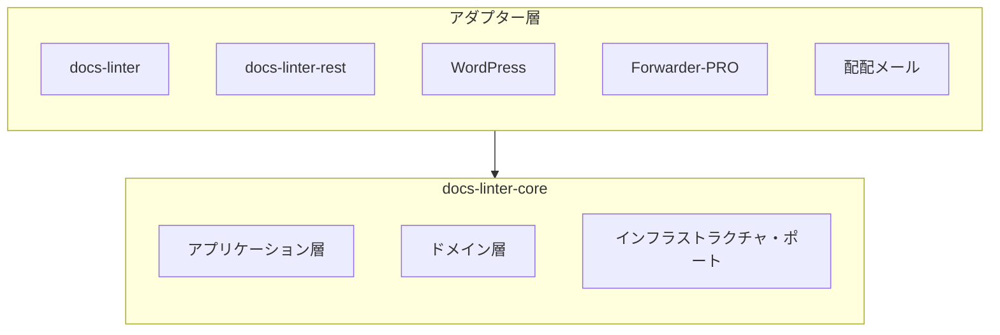
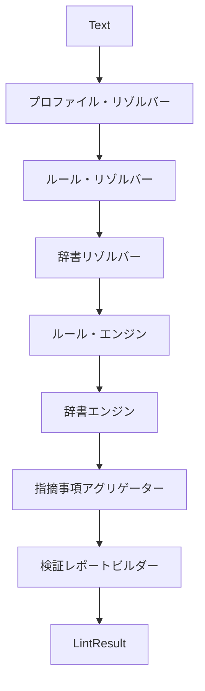
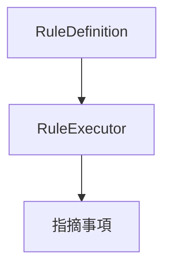
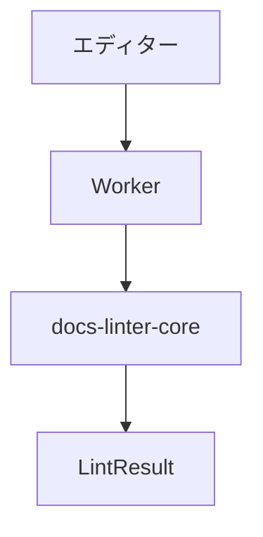
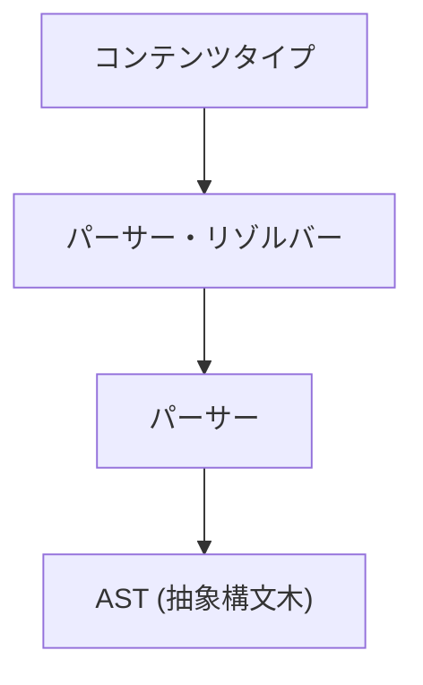
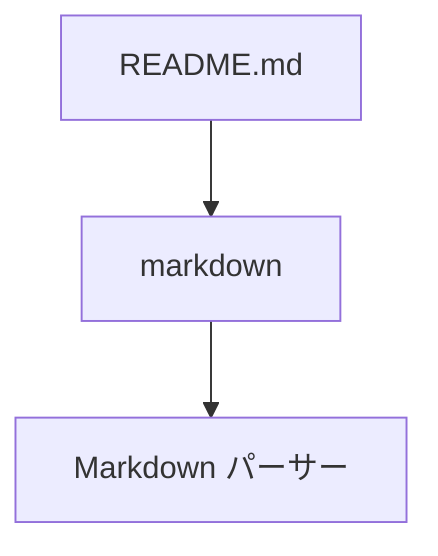
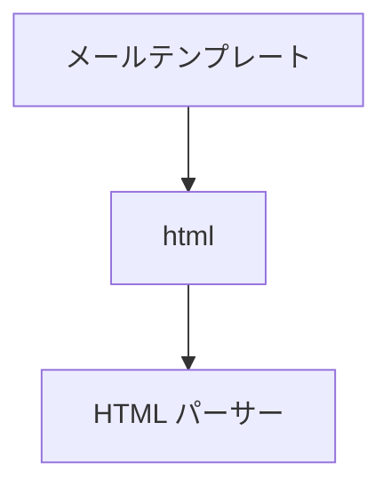
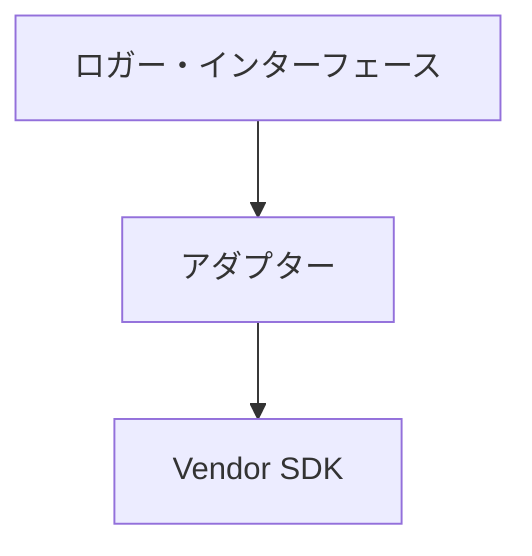

# 📘 S2J Docs Linter - フェーズ1-A - @s2j/docs-linter-core

## 1. 概要

`@s2j/docs-linter-core` は、S2J Docs Linter の中核となる、文章の品質診断というドメイン知識を集約するためのコアドメイン・パッケージ (文章の品質検査エンジン) です。
CLI、REST API、`WordPress`、`Forwarder-PRO` / `配配メール` は、全て「アダプター層」と位置付け、本パッケージを中心に構成します。

## 2. 設計意図 (ゴール)

* textlint の隠蔽
* 実行環境に非依存
* アダプター非依存
* 文章の品質判定の共通化

## 3. 非責務

* CLI
* REST API
* WordPress UI
* React UI
* データベース
* ユーザー管理
* 認証
* 認可

## 4. アーキテクチャ



## 5. パッケージの責務

### ドメイン層

責務は、下記の管理です。

* RuleDefinition
* RuleConfiguration
* Dictionary
* Profile
* Violation
* LintResult

### アプリケーション層

責務は、下記の提供です。

* `lint()`
* `validateConfig()`
* `validateDictionary()`
* `loadProfile()`

### インフラストラクチャ・ポート

責務は、下記のインターフェースのみの定義になります。実装はアダプター層に委譲します。

* RuleRepository
* DictionaryRepository
* ProfileRepository

## 6. ディレクトリ構造

```text
src/
├┬─ application/
│├─ services/
│├─ usecases/
│└─ dto/
├┬─ domain/
│├─ entities/
│├─ value-objects/
│├─ services/
│└─ repositories/
├┬─ infrastructure/
│├─ parsers/
│├─ adapters/
│└─ engines/
├─ profiles/
├─ rules/
├─ dictionaries/
└─ index.ts
```

## 7. ドメイン層

### Profile エンティティ

集約のルートです。

```ts
interface Profile {
    id: string;
    name: string;

    rules: RuleConfiguration[];
    dictionaries: Dictionary[];
}
```

### RuleDefinition エンティティ

ルール定義です。

```ts
interface RuleDefinition {
    id: string;
    name: string;
    description: string;
}
```

### RuleConfiguration エンティティ

ユーザーによる設定値です。

```ts
interface RuleConfiguration {
    ruleId: string;
    values: Record<string, unknown>;
}
```

### 辞書エンティティ

辞書定義です。

```ts
interface Dictionary {
    id: string;
    name: string;
    terms: string[];
}
```

### 指摘事項エンティティ

診断結果です。

```ts
interface Violation {
    ruleId: string;

    severity:
        | "error"
        | "warning"
        | "info";

    message: string;

    line?: number;
    column?: number;
}
```

## 8. ドメインサービス

### LintEngine

文章の品質診断を担当します。責務は、下記になります。

* ルールの評価
* 辞書の評価
* 結果の集約

### RuleEngine

RuleDefinition を実行します。責務は、下記になります。

* RuleConfiguration 適用
* ルールの評価

### DictionaryEngine

辞書を評価します。責務は、下記になります。

* 禁止語の検査
* 推奨語の検査
* 固有名詞の検査

## 9. アプリケーション層

### LintService

下記は、主要ユースケースです。

```ts
const result = await lint({
    text,
    profile,
});
```

* Input

```ts
interface LintRequest {
    text: string;

    profile: Profile;
}
```

* Output

```ts
interface LintResult {
    errors: Violation[];
    warnings: Violation[];
    infos: Violation[];
}
```

* ProfileService

プロファイルをロードします。

```ts
loadProfile(
    profileId: string
);
```

* ValidationService

設定を検証します。

```ts
validateConfig(config);
```

```ts
validateDictionary(dictionary);
```

## 10. ルールエンジン設計

### ルール定義

ルール定義は、開発者が管理します。ルール定義例は、下記のようになります。

```text
max-kanji-continuous
max-sentence-length
max-heading-length
forbidden-word
required-word
```

### ルール設定

ユーザーが変更します。ルール設定例は、下記のようになります。

```json
{
  "max-kanji-continuous": {
    "max": 7
  }
}
```

たとえば、法律系のプロファイル例は、下記になります。

```json
{
  "max-kanji-continuous": {
    "max": 30
  }
}
```

## 11. プロファイル設計

プロファイルは、集約のルートとします。

```text
Profile
 ├─ RuleConfiguration
 └─ Dictionary
```

プロファイルの設計例は、下記のようになります。

```json
{
  "id": "wordpress",

  "rules": {
    "max-kanji-continuous": {
      "max": 7
    }
  },

  "dictionary": {
    "properNouns": [
      "WordPress",
      "Gutenberg"
    ]
  }
}
```

## 12. ランタイム要件

サポート対象は、下記になります。

* Node.js
* ブラウザー
* Web Worker

下記への直接依存を禁止します。

* fs
* path
* os
* process

## 13. textlint 連携

Core は textlint を内部利用します。ただし textlint は、公開 API に露出しません。

`import { TextLintEngine }` は許可します。
`new TextLintKernel()` をユーザーに公開することは禁止します。

## 14. リポジトリ構成

### ProfileRepository

```ts
interface ProfileRepository {
    load(
        profileId: string
    ): Promise<Profile>;
}
```

### DictionaryRepository

```ts
interface DictionaryRepository {
    load(
        dictionaryId: string
    ): Promise<Dictionary>;
}
```

Core はリポジトリ・インターフェースのみ保持します。

## 15. 公開 API

### `lint()`

文章を品質診断します。

```ts
const result =
    await lint({
        text,
        profile,
    });
```

### `validateConfig()`

設定を検証します。

```ts
validateConfig(config);
```

### `validateDictionary()`

辞書を検証します。

```ts
validateDictionary(dictionary);
```

### `getRules()`

ルールを取得します。

```ts
getRules();
```

### `getRule()`

指定ルールを取得します。

```ts
getRule(
    ruleId
);
```

### `getRuntimeDiagnostics()`

ランタイム診断の応答を取得します。

```ts
getRuntimeDiagnostics();
```

## 16. 実行モデル

`@s2j/docs-linter-core` は、Core API の定義する契約を実装する、ドメイン・ランタイムです。

本章では、ルール実行、辞書評価、検証パイプライン、およびランタイム Strategy を定義します。

### 設計原則

#### Core API 準拠

Core ランタイムは、`core_api.md` の定義する契約を実装します。

新たな「ドメインコンセプト」を追加してはなりません。

#### ランタイム独立性

Core ランタイムは、下記の実行環境をサポートします。

* Node.js
* ブラウザー
* Web Worker

#### プラットフォーム独立性

Core ランタイムは、下記に依存してはなりません。

* `WordPress`
* Gutenberg
* `Forwarder-PRO`
* `配配メール`
* React
* `Spring Boot`

### 検証パイプライン

検証パイプラインは、文章品質の診断実行フローです。

#### フロー



### パイプライン Stages

#### プロファイル・リゾルバー

プロファイル集約をロードします。

##### 責務

* プロファイルのロード
* バージョンのチェック
* プロファイルの検証

#### ルール・リゾルバー

RuleDefinition を取得します。

##### 責務

* ルール・レジストリのルックアップ
* ルール設定のマッピング
* ルール機能の検証

#### 辞書リゾルバー

辞書を取得します。

##### 責務

* 辞書のロード
* 辞書の検証
* 辞書タイプの解決

#### ルール・エンジン

ルールを実行します。

##### 責務

* ルールの実行
* 重大度の解決
* ルール・ライフサイクルの検証

#### 辞書エンジン

辞書を評価します。

##### 責務

* 使用禁止の用語
* 推奨の用語
* 固有名詞
* ブランディングの用語

#### 指摘事項アグリゲーター

指摘事項を集約します。

##### 責務

* 重大度のグループ化
* ルールのグループ化
* レポートの準備

#### 検証レポートビルダー

ValidationReport を生成します。

##### 責務

* 概要の作成
* 詳細の作成
* 統計の作成

## 17. ルール実行モデル

RuleDefinition と RuleExecutor を分離します。

### 構造



### インターフェース

#### RuleExecutor

```ts
interface RuleExecutor {
    execute(
        context: RuleContext
    ): Promise<Violation[]>;
}
```

##### 責務

* ルールの評価
* 指摘事項の生成

##### 禁止

RuleExecutor は、下記に依存してはなりません。

* `WordPress`
* ブラウザー DOM
* データベース
* ネットワーク・アクセス

### ルール登録 Strategy

(Core ランタイムは、ブラウザーおよび Web Worker をサポートするため) ルール登録は、静的方式を採用します。

#### 登録

```ts
registerRule(
    ruleDefinition,
    ruleExecutor
);
```

#### 禁止

```ts
require(
    dynamicPath
);

import(
    runtimeGeneratedPath
);
```

### ルール・レジストリ・ランタイム

ルール・レジストリは、RuleDefinition と RuleExecutor を管理します。

#### 責務

* 登録
* ルックアップ
* ライフサイクルの解決

### 辞書ランタイム

辞書エンジンは、DictionaryType ごとに評価します。

#### 対応タイプ

* forbidden
* recommended
* proper-noun
* branding
* abbreviation
* custom

### マッチング Strategy

下記は、マッチング例です。

```json
{
  "type": "forbidden",
  "match": "contains"
}
```

#### exact

完全一致でのマッチングです。

#### contains

部分一致でのマッチングです。

#### regex

正規表現でのマッチングです。

### ランタイム Strategy

ランタイム Strategy は、実行環境の差異を吸収します。

#### ランタイム環境

```ts
type RuntimeEnvironment =
    | "node"
    | "browser"
    | "worker";
```

#### ランタイム・アダプター

```ts
interface RuntimeAdapter {
    environment:
        RuntimeEnvironment;
}
```

#### ランタイム検出

```ts
getRuntimeEnvironment();
```

#### ランタイム機能解決

RuntimeCapability は、実行環境に応じて解決します。

下記は、ランタイム機能解決例です。

```json
{
  "worker": true,
  "batch": true,
  "autofix": false
}
```

### 実行モード

#### Sync

```ts
lint()
```

#### Async

```ts
lintAsync()
```

#### Batch

```ts
lintBatch()
```

### Worker Strategy

ブラウザー・ランタイムは、Web Worker 実行を推奨します。

#### フロー



#### 要件

UI スレッドをブロックしてはなりません。

### パッケージング Strategy

Core ランタイムは、Vite バンドルを前提とします。

#### モジュール形式

下記を許可します。

* ESM

下記を許可しません。

* CommonJS のみ

#### バンドル互換性

下記をサポート対象とします。

* Vite
* Rollup
* Webpack

#### Node.js API 方針

下記を、「ランタイム・アダプターを介する」と言う、制限付きで許可します。

* process.env

下記を許可しません。

* fs
* path
* os
* child_process

### ライフサイクル・ハンドリング

ルール・ライフサイクルを、ランタイムが解決します。

#### 有効ルール

通常実行します。

#### 非推奨ルール

実行可能です。警告を生成できます。

#### 削除済みルール

新規プロファイルでは、利用できません。既存プロファイルの移行のみ、許可します。

### 移行ランタイム

移行契約を実行します。

#### 責務

* スキーマの移行
* プロファイルの移行
* 辞書の移行

### ドメインイベント・ランタイム

Core ランタイムは、「ドメインイベント」を発行できます。

#### 対応イベント

* ProfileUpdated
* DictionaryImported
* ValidationCompleted
* BatchValidationCompleted

### パフォーマンス方針

#### 設計意図 (ゴール)

* ブラウザー互換
* Worker 互換
* 一括での検証互換

#### 要件

ルールは、ステートレスとします。

RuleExecutor は、副作用を持ちません。

## 18. パーサー Strategy

`@s2j/docs-linter-core` は、入力コンテンツを抽象構文木 (AST) に変換した上で、検証を実施します。

RuleExecutor は、生テキストを直接解析してはなりません。

### 設計意図 (ゴール)

* パーサーの差し替えを可能にする
* コンテンツタイプの追加を可能にする
* ルールの再利用性を高める
* ランタイム非依存を維持する

### インターフェース

#### Parser

```ts
interface Parser {
    parse(
        content: string
    ): Promise<DocumentAst>;
}
```

#### DocumentAst

```ts
interface DocumentAst {
    type: string;

    children:
        DocumentAst[];
}
```

### 対応パーサー

#### Markdown パーサー

下記は、パース対象です。

* README.md
* ドキュメント
* WordPress Block エディター Markdown

#### HTML パーサー

下記は、パース対象です。

* WordPress HTML
* メール・テンプレート

#### プレーンテキスト・パーサー

下記は、パース対象です。

* メール本文
* テキストコンテンツ

#### パーサー解決



## 19. コンテンツタイプ Strategy

コンテンツタイプは、入力コンテンツの種類を表します。

パーサー選択およびルール適用判定に利用します。

### 値オブジェクト

```ts
type ContentType =
    | "markdown"
    | "html"
    | "text";
```

### コンテンツタイプ・リゾルバー

```ts
interface ContentTypeResolver {
    resolve(
        content: string
    ): ContentType;
}
```

下記は、コンテンツタイプ・リゾルバー例です。





### ルール互換性

ルールは、対応コンテンツタイプを宣言できます。

```ts
interface RuleCapability {
    supportedContentTypes:
        ContentType[];
}
```

## 20. キャッシュ Strategy

`@s2j/docs-linter-core` は、検証パフォーマンス向上のため、キャッシュを利用できます。

キャッシュは、最適化であり、ドメインロジックに影響を与えてはなりません。

### キャッシュ・ターゲット

#### ルール・レジストリ・キャッシュ

キャッシュ対象は、下記になります。

* RuleDefinition
* RuleMetadata
* RuleSchema

#### プロファイル・キャッシュ

キャッシュ対象は、下記になります。

* Profile
* RuleConfiguration

#### 辞書キャッシュ

キャッシュ対象は、下記になります。

* Dictionary
* DictionaryMetadata

#### AST (抽象構文木) キャッシュ

キャッシュ対象は、下記になります。

* パース結果

### インターフェース

#### CacheProvider

```ts
interface CacheProvider {
    get<T>(
        key: string
    ): Promise<T | null>;

    set<T>(
        key: string,
        value: T
    ): Promise<void>;
}
```

### キャッシュ方針

#### 許可

* メモリー・キャッシュ
* ブラウザー・キャッシュ
* Worker キャッシュ

#### 禁止

RuleExecutor は、キャッシュの存在を前提としてはなりません。

## 21. エラー処理方針

`@s2j/docs-linter-core` は、「フェイルセーフ」採用します。

単一ルールの失敗によって、検証全体を停止してはなりません。

### エラー・カテゴリ

#### パーサー・エラー

下記は、エラー例です。

```text
Invalid Markdown
Malformed HTML
```

#### ルール・エラー

下記は、エラー例です。

```text
Rule Execution Failure
```

#### 辞書エラー

下記は、エラー例です。

```text
Invalid Dictionary Format
```

#### プロファイル・エラー

下記は、エラー例です。

```text
Unsupported Profile Version
```

### エラー Strategy

#### パーサー・エラー

検証を停止します。

#### ルール・エラー

ルールをスキップします。

#### 辞書エラー

辞書を無効化します。

#### プロファイル・エラー

検証を拒否します。

### エラー・レポート

```ts
interface RuntimeError {
    code: string;

    message: string;

    severity:
        | "error"
        | "warning";
}
```

## 22. 可観測性

`@s2j/docs-linter-core` は、ランタイム状態を観測可能でなければなりません。

### 設計意図 (ゴール)

* デバッグ
* パフォーマンス分析
* ランタイム監視
* アダプター診断

### インターフェース

#### Logger

```ts
interface Logger {
    debug(
        message: string
    ): void;

    info(
        message: string
    ): void;

    warn(
        message: string
    ): void;

    error(
        message: string
    ): void;
}
```

#### MetricsCollector

```ts
interface MetricsCollector {
    increment(
        metric: string
    ): void;

    timing(
        metric: string,
        duration: number
    ): void;
}
```

### 標準指標

#### 検証指標

* validation.total
* validation.success
* validation.failed

#### ルール指標

* rule.execution.count
* rule.execution.failure

#### パーサー指標

* parser.execution.count
* parser.execution.duration

#### 辞書指標

* dictionary.lookup.count

### テレメトリ方針

テレメトリは、任意機能とします。

Core ランタイムは、下記のような特定ベンダーに依存してはなりません。

* Google Analytics 依存
* Datadog 依存
* Sentry 依存

下記は、許可されます。



## 23. ランタイム診断

ランタイム状態を取得します。

下記は、ランタイム診断の応答例です。

```json
{
  "runtime": "worker",

  "rules": 12,

  "profiles": 3,

  "dictionaries": 5,

  "cache": {
    "enabled": true
  }
}
```

## 24. 拡張方針

新しい RuleDefinition は追加可能とします。

ルール定義例は、下記のようになります。

* readability-score
* passive-voice
* marketing-phrase

公開 API の破壊的変更は、避けます。

## 25. 完了条件

`@s2j/docs-linter-core` は、下記を実装した時点で完成とみなします。

* 検証パイプライン
* ルール・ランタイム
* 辞書ランタイム
* ルール・レジストリ・ランタイム
* ランタイム Strategy
* Worker Strategy
* パッケージング Strategy
* ライフサイクル・ハンドリング
* 移行ランタイム
* ドメインイベント・ランタイム
* Core API Compatibility

`@s2j/docs-linter-core` は、下記を実装した時点でランタイム層完了とみなします。

* パーサー Strategy
* コンテンツタイプ Strategy
* キャッシュ Strategy
* エラー処理方針
* 可観測性
* ランタイム診断

## 26. 今後のロードマップ

* フェーズ1
  * `@s2j/docs-linter-core` として成立する最小構成
    * ルールエンジン
    * 辞書エンジン
    * プロファイルエンジン
* フェーズ2
  * ブラウザーランタイムとして、下記に対応
    * Vite
    * Web Worker
* フェーズ3
  * `WordPress` 連携
* フェーズ4
  * `Forwarder-PRO` 連携
  * `配配メール` 連携
