# 📘 S2J Docs Linter - フェーズ1-A - @s2j/docs-linter-core

## 1. 概要

`@s2j/docs-linter-core` は、S2J Docs Linter の中核となる、文章の品質診断というドメイン知識を集約するためのコアドメイン・パッケージ (文章の品質検査エンジン) です。
CLI、REST API、`WordPress`、`Forwarder-PRO` / `配配メール` は、全て「アダプター層」と位置付け、本パッケージを中心に構成します。

## 2. 設計意図 (ゴール)

* textlint の隠蔽
* 実行環境に非依存
* アダプター非依存
* 文章の品質判定の共通化

## 3. 非責務

* CLI
* REST API
* `WordPress` UI
* React UI
* データベース
* ユーザー管理
* 認証
* 認可

## 4. アーキテクチャ

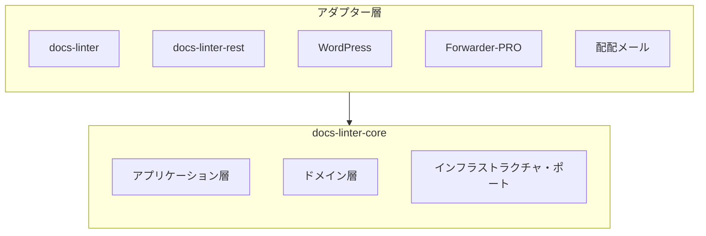

## 5. パッケージの責務

### ドメイン層

責務は、下記の管理です。

* RuleDefinition
* RuleConfiguration
* Dictionary
* Profile
* Violation
* LintResult

### アプリケーション層

責務は、下記の提供です。

* `lint()`
* `validateConfig()`
* `validateDictionary()`
* `loadProfile()`

### インフラストラクチャ・ポート

責務は、下記のインターフェースのみの定義になります。実装はアダプター層に委譲します。

* RuleRepository
* DictionaryRepository
* ProfileRepository

## 6. 拡張契約

`@s2j/docs-linter-core` は、拡張可能なランタイムとして設計します。

## 7. プラグイン拡張契約

ルールパックや辞書パックは、「拡張機能」として提供できます。

## 8. 互換性契約

拡張機能は、Core API 契約を破ってはなりません。

## 9. 解決契約

後段の設定が優先されます。

## 10. リソース・ロード契約

Core ランタイムは、リソースの保存場所を知りません。

ResourceProvider を介して取得します。

## 11. リクエスト/応答契約

アプリケーション・サービスは、リクエスト/応答モデルを採用します。

## 12. リポジトリ契約

Core ランタイムは、ストレージの実装詳細を知りません。

リポジトリは、「集約ルート」の永続化および取得を担当します。

## 13. バージョン・ネゴシエーション契約

Core ランタイムは、ProfileVersion および SchemaVersion を評価します。

## 14. テスト契約

Core ランタイムは、テスト可能でなければなりません。

## 15. ディレクトリ構造

```text
src/
├┬─ application/
│├─ services/
│├─ usecases/
│└─ dto/
├┬─ domain/
│├─ entities/
│├─ value-objects/
│├─ services/
│└─ repositories/
├┬─ infrastructure/
│├─ parsers/
│├─ adapters/
│└─ engines/
├─ profiles/
├─ rules/
├─ dictionaries/
└─ index.ts
```

## 16. ドメイン層

### Profile エンティティ

集約のルートです。

```ts
interface Profile {
    id: string;
    name: string;

    rules: RuleConfiguration[];
    dictionaries: Dictionary[];
}
```

### RuleDefinition エンティティ

ルール定義です。

```ts
interface RuleDefinition {
    id: string;
    name: string;
    description: string;
}
```

### RuleConfiguration エンティティ

ユーザーによる設定値です。

```ts
interface RuleConfiguration {
    ruleId: string;
    values: Record<string, unknown>;
}
```

### 辞書エンティティ

辞書定義です。

```ts
interface Dictionary {
    id: string;
    name: string;
    terms: string[];
}
```

### 指摘事項エンティティ

診断結果です。

```ts
interface Violation {
    ruleId: string;

    severity:
        | "error"
        | "warning"
        | "info";

    message: string;

    line?: number;
    column?: number;
}
```

## 17. ドメインサービス

### LintEngine

文章の品質診断を担当します。責務は、下記になります。

* ルールの評価
* 辞書の評価
* 結果の集約

### RuleEngine

RuleDefinition を実行します。責務は、下記になります。

* RuleConfiguration 適用
* ルールの評価

### DictionaryEngine

辞書を評価します。責務は、下記になります。

* 禁止語の検査
* 推奨語の検査
* 固有名詞の検査

## 18. アプリケーション層

### LintService

下記は、主要ユースケースです。

```ts
const result = await lint({
    text,
    profile,
});
```

* Input

```ts
interface LintRequest {
    text: string;

    profile: Profile;
}
```

* Output

```ts
interface LintResult {
    errors: Violation[];
    warnings: Violation[];
    infos: Violation[];
}
```

* ProfileService

プロファイルをロードします。

```ts
loadProfile(
    profileId: string
);
```

* ValidationService

設定を検証します。

```ts
validateConfig(config);
```

```ts
validateDictionary(dictionary);
```

## 19. ルールエンジン設計

### ルール定義

ルール定義は、開発者が管理します。ルール定義例は、下記のようになります。

```text
max-kanji-continuous
max-sentence-length
max-heading-length
forbidden-word
required-word
```

### ルール設定

ユーザーが変更します。ルール設定例は、下記のようになります。

```json
{
  "max-kanji-continuous": {
    "max": 7
  }
}
```

たとえば、法律系のプロファイル例は、下記になります。

```json
{
  "max-kanji-continuous": {
    "max": 30
  }
}
```

## 20. プロファイル設計

プロファイルは、集約ルートとします。

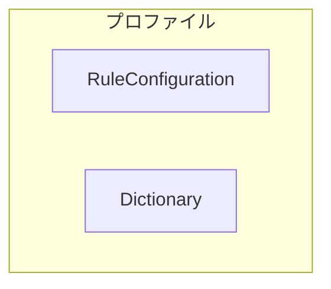

プロファイルの設計例は、下記のようになります。

```json
{
  "id": "wordpress",

  "rules": {
    "max-kanji-continuous": {
      "max": 7
    }
  },

  "dictionary": {
    "properNouns": [
      "WordPress",
      "Gutenberg"
    ]
  }
}
```

## 21. ランタイム要件

サポート対象は、下記になります。

* Node.js
* ブラウザー
* Web Worker

下記への直接依存を禁止します。

* fs
* path
* os
* process

## 22. textlint 連携

Core は textlint を内部利用します。ただし textlint は、公開 API に露出しません。

`import { TextLintEngine }` は許可します。
`new TextLintKernel()` をユーザーに公開することは禁止します。

## 23. リポジトリ構成

### ProfileRepository

```ts
interface ProfileRepository {
    load(
        profileId: string
    ): Promise<Profile>;
}
```

### DictionaryRepository

```ts
interface DictionaryRepository {
    load(
        dictionaryId: string
    ): Promise<Dictionary>;
}
```

Core はリポジトリ・インターフェースのみ保持します。

## 24. 公開 API

### `lint()`

文章を品質診断します。

```ts
const result =
    await lint({
        text,
        profile,
    });
```

### `validateConfig()`

設定を検証します。

```ts
validateConfig(config);
```

### `validateDictionary()`

辞書を検証します。

```ts
validateDictionary(dictionary);
```

### `registerRule()`

ルールを登録します。

```ts
registerRule(
    definition,
    executor
);
```

### `getRules()`

ルールを取得します。

```ts
getRules();
```

### `getRule()`

指定ルールを取得します。

```ts
getRule(
    ruleId
);
```

### `getRuntimeDiagnostics()`

ランタイム診断の応答を取得します。

```ts
getRuntimeDiagnostics();
```

### `registerParser()`

パーサーを登録します。

```ts
registerParser(
    parser
);
```

### `registerDictionaryType()`

辞書タイプを登録します。

```ts
registerDictionaryType(
    type
);
```

## 25. 実行モデル

`@s2j/docs-linter-core` は、Core API の定義する契約を実装する、ドメイン・ランタイムです。

本章では、ルール実行、辞書評価、検証パイプライン、およびランタイム Strategy を定義します。

### 設計原則

#### Core API 準拠

Core ランタイムは、`core_api.md` の定義する契約を実装します。

新たな「ドメインコンセプト」を追加してはなりません。

#### ランタイム独立性

Core ランタイムは、下記の実行環境をサポートします。

* Node.js
* ブラウザー
* Web Worker

#### プラットフォーム独立性

Core ランタイムは、下記に依存してはなりません。

* `WordPress`
* Gutenberg
* `Forwarder-PRO`
* `配配メール`
* React
* `Spring Boot`

### 検証パイプライン

検証パイプラインは、文章品質の診断実行フローです。

#### フロー

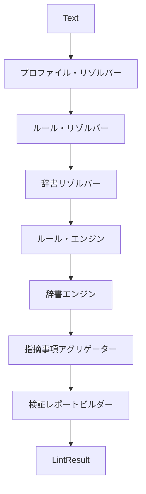

### パイプライン Stages

#### プロファイル・リゾルバー

プロファイル集約をロードします。

##### 責務

* プロファイルのロード
* バージョンのチェック
* プロファイルの検証

#### ルール・リゾルバー

RuleDefinition を取得します。

##### 責務

* ルール・レジストリのルックアップ
* ルール設定のマッピング
* ルール機能性の検証

#### 辞書リゾルバー

辞書を取得します。

##### 責務

* 辞書のロード
* 辞書の検証
* 辞書タイプの解決

#### ルール・エンジン

ルールを実行します。

##### 責務

* ルールの実行
* 重大度の解決
* ルール・ライフサイクルの検証

#### 辞書エンジン

辞書を評価します。

##### 責務

* 使用禁止の用語
* 推奨の用語
* 固有名詞
* ブランディングの用語

#### 指摘事項アグリゲーター

指摘事項を集約します。

##### 責務

* 重大度のグループ化
* ルールのグループ化
* レポートの準備

#### 検証レポートビルダー

ValidationReport を生成します。

##### 責務

* 概要の作成
* 詳細の作成
* 統計の作成

## 26. ルール実行モデル

RuleDefinition と RuleExecutor を分離します。

### 構造

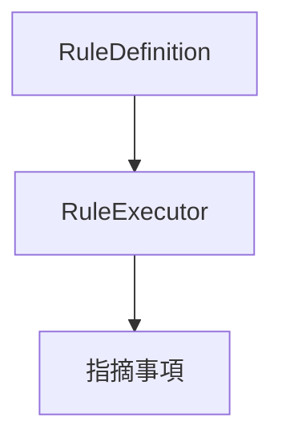

### インターフェース

#### RuleExecutor

```ts
interface RuleExecutor {
    execute(
        context: RuleContext
    ): Promise<Violation[]>;
}
```

##### 責務

* ルールの評価
* 指摘事項の生成

##### 禁止

RuleExecutor は、下記に依存してはなりません。

* `WordPress`
* ブラウザー DOM
* データベース
* ネットワーク・アクセス

### ルール登録 Strategy

(Core ランタイムは、ブラウザーおよび Web Worker をサポートするため) ルール登録は、静的方式を採用します。

#### 禁止

```ts
require(
    dynamicPath
);

import(
    runtimeGeneratedPath
);
```

### ルール・レジストリ・ランタイム

ルール・レジストリは、RuleDefinition と RuleExecutor を管理します。

#### 責務

* 登録
* ルックアップ
* ライフサイクルの解決

### 辞書ランタイム

辞書エンジンは、DictionaryType ごとに評価します。

#### 対応タイプ

* forbidden
* recommended
* proper-noun
* branding
* abbreviation
* custom

### マッチング Strategy

下記は、マッチング例です。

```json
{
  "type": "forbidden",
  "match": "contains"
}
```

#### exact

完全一致でのマッチングです。

#### contains

部分一致でのマッチングです。

#### regex

正規表現でのマッチングです。

### ランタイム Strategy

ランタイム Strategy は、実行環境の差異を吸収します。

#### ランタイム環境

```ts
type RuntimeEnvironment =
    | "node"
    | "browser"
    | "worker";
```

#### ランタイム・アダプター

```ts
interface RuntimeAdapter {
    environment:
        RuntimeEnvironment;
}
```

#### ランタイム検出

```ts
getRuntimeEnvironment();
```

#### ランタイム機能解決

RuntimeCapability は、実行環境に応じて解決します。

下記は、ランタイム機能解決例です。

```json
{
  "worker": true,
  "batch": true,
  "autofix": false
}
```

### 実行モード

#### Sync

```ts
lint()
```

#### Async

```ts
lintAsync()
```

#### Batch

```ts
lintBatch()
```

### Worker Strategy

ブラウザー・ランタイムは、Web Worker 実行を推奨します。

#### フロー

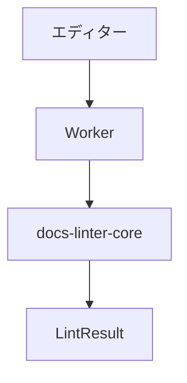

#### 要件

UI スレッドをブロックしてはなりません。

### パッケージング Strategy

Core ランタイムは、Vite バンドルを前提とします。

#### モジュール形式

下記を許可します。

* ESM

下記を許可しません。

* CommonJS のみ

#### バンドル互換性

下記をサポート対象とします。

* Vite
* Rollup
* Webpack

#### Node.js API 方針

下記を、「ランタイム・アダプターを介する」と言う、制限付きで許可します。

* process.env

下記を許可しません。

* fs
* path
* os
* child_process

### ライフサイクル・ハンドリング

ルール・ライフサイクルを、ランタイムが解決します。

#### 有効ルール

通常実行します。

#### 非推奨ルール

実行可能です。警告を生成できます。

#### 削除済みルール

新規プロファイルでは、利用できません。既存プロファイルの移行のみ、許可します。

### 移行ランタイム

移行契約を実行します。

#### 責務

* スキーマの移行
* プロファイルの移行
* 辞書の移行

### ドメインイベント・ランタイム

Core ランタイムは、「ドメインイベント」を発行できます。

#### 対応イベント

* ProfileUpdated
* DictionaryImported
* ValidationCompleted
* BatchValidationCompleted

### パフォーマンス方針

#### 設計意図 (ゴール)

* ブラウザー互換
* Worker 互換
* 一括での検証互換

#### 要件

ルールは、ステートレスとします。

RuleExecutor は、副作用を持ちません。

## 27. パーサー Strategy

`@s2j/docs-linter-core` は、入力コンテンツをAST (抽象構文木) に変換した上で、検証を実施します。

RuleExecutor は、生テキストを直接解析してはなりません。

### 設計意図 (ゴール)

* パーサーの差し替えを可能にする
* コンテンツタイプの追加を可能にする
* ルールの再利用性を高める
* ランタイム非依存を維持する

### インターフェース

#### Parser

```ts
interface Parser {
    parse(
        content: string
    ): Promise<DocumentAst>;
}
```

#### DocumentAst

```ts
interface DocumentAst {
    type: string;

    children:
        DocumentAst[];
}
```

### 対応パーサー

#### Markdown パーサー

下記は、パース対象です。

* README.md
* ドキュメント
* `WordPress` Block エディター Markdown

#### HTML パーサー

下記は、パース対象です。

* `WordPress` HTML
* メール・テンプレート

#### プレーンテキスト・パーサー

下記は、パース対象です。

* メール本文
* テキストコンテンツ

#### パーサー解決

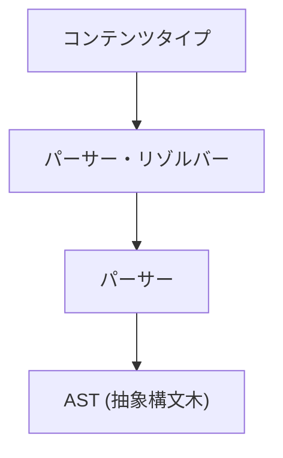

## 28. コンテンツタイプ Strategy

コンテンツタイプは、入力コンテンツの種類を表します。

パーサー選択およびルール適用判定に利用します。

### 値オブジェクト

```ts
type ContentType =
    | "markdown"
    | "html"
    | "text";
```

### コンテンツタイプ・リゾルバー

```ts
interface ContentTypeResolver {
    resolve(
        content: string
    ): ContentType;
}
```

下記は、コンテンツタイプ・リゾルバー例です。

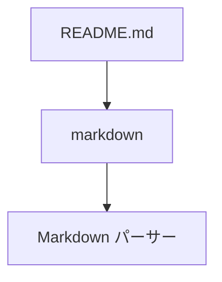

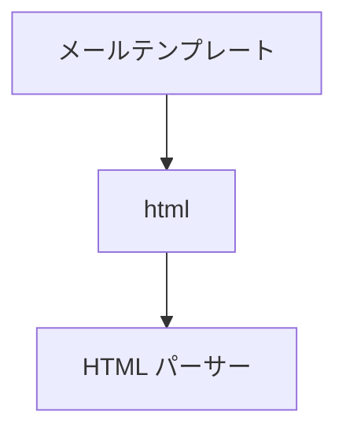

### ルール互換性

ルールは、対応コンテンツタイプを宣言できます。

```ts
interface RuleCapability {
    supportedContentTypes:
        ContentType[];
}
```

## 29. キャッシュ Strategy

`@s2j/docs-linter-core` は、検証パフォーマンス向上のため、キャッシュを利用できます。

キャッシュは、最適化であり、ドメインロジックに影響を与えてはなりません。

### キャッシュ・ターゲット

#### ルール・レジストリ・キャッシュ

キャッシュ対象は、下記になります。

* RuleDefinition
* RuleMetadata
* RuleSchema

#### プロファイル・キャッシュ

キャッシュ対象は、下記になります。

* Profile
* RuleConfiguration

#### 辞書キャッシュ

キャッシュ対象は、下記になります。

* Dictionary
* DictionaryMetadata

#### AST (抽象構文木) キャッシュ

キャッシュ対象は、下記になります。

* パース結果

### インターフェース

#### CacheProvider

```ts
interface CacheProvider {
    get<T>(
        key: string
    ): Promise<T | null>;

    set<T>(
        key: string,
        value: T
    ): Promise<void>;
}
```

### キャッシュ方針

#### 許可

* メモリー・キャッシュ
* ブラウザー・キャッシュ
* Worker キャッシュ

#### 禁止

RuleExecutor は、キャッシュの存在を前提としてはなりません。

## 30. エラー処理方針

`@s2j/docs-linter-core` は、「フェイルセーフ」採用します。

単一ルールの失敗によって、検証全体を停止してはなりません。

### エラー・カテゴリ

#### パーサー・エラー

下記は、エラー例です。

```text
Invalid Markdown
Malformed HTML
```

#### ルール・エラー

下記は、エラー例です。

```text
Rule Execution Failure
```

#### 辞書エラー

下記は、エラー例です。

```text
Invalid Dictionary Format
```

#### プロファイル・エラー

下記は、エラー例です。

```text
Unsupported Profile Version
```

### エラー Strategy

#### パーサー・エラー

検証を停止します。

#### ルール・エラー

ルールをスキップします。

#### 辞書エラー

辞書を無効化します。

#### プロファイル・エラー

検証を拒否します。

### エラー・レポート

```ts
interface RuntimeError {
    code: string;

    message: string;

    severity:
        | "error"
        | "warning";
}
```

## 31. 可観測性

`@s2j/docs-linter-core` は、ランタイム状態を観測可能でなければなりません。

### 設計意図 (ゴール)

* デバッグ
* パフォーマンス分析
* ランタイム監視
* アダプター診断

### インターフェース

#### Logger

```ts
interface Logger {
    debug(
        message: string
    ): void;

    info(
        message: string
    ): void;

    warn(
        message: string
    ): void;

    error(
        message: string
    ): void;
}
```

#### MetricsCollector

```ts
interface MetricsCollector {
    increment(
        metric: string
    ): void;

    timing(
        metric: string,
        duration: number
    ): void;
}
```

### 標準指標

#### 検証指標

* validation.total
* validation.success
* validation.failed

#### ルール指標

* rule.execution.count
* rule.execution.failure

#### パーサー指標

* parser.execution.count
* parser.execution.duration

#### 辞書指標

* dictionary.lookup.count

### テレメトリ方針

テレメトリは、任意機能とします。

Core ランタイムは、下記のような特定ベンダーに依存してはなりません。

* Google Analytics 依存
* Datadog 依存
* Sentry 依存

下記は、許可されます。

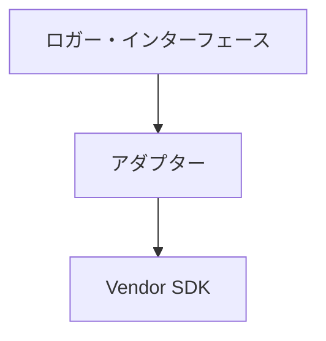

## 32. ランタイム診断

ランタイム状態を取得します。

下記は、ランタイム診断の応答例です。

```json
{
  "runtime": "worker",

  "rules": 12,

  "profiles": 3,

  "dictionaries": 5,

  "cache": {
    "enabled": true
  }
}
```

## 33. 拡張

本章は、ルール拡張、リソース拡張、設定拡張、および「セキュリティ境界」を定義します。

### 設計原則

#### OCP (Open-Closed Principle - 拡張に対して開かれ、修正に対して閉じている)

Core ランタイムは、拡張可能でなければなりません。

アダプターの追加によって、「Core ランタイム」を変更してはなりません。

#### プラットフォーム独立性

拡張機構は、下記に依存してはなりません。

* `WordPress`
* `Forwarder-PRO`
* `配配メール`

### 互換性

拡張機能は、Core API 契約を破ってはなりません。

#### 許可

* RuleDefinition の追加
* RuleExecutor の追加
* DictionaryType の追加
* Parser の追加

#### 禁止

* 集約契約の変更
* ID Strategy の変更
* 検証パイプラインの変更
* Core ドメイン・モデルの変更

### 拡張方針

公開 API の破壊的変更は、避けます。

新しい RuleDefinition は、追加可能とします。

ルール定義例は、下記のようになります。

* readability-score
* passive-voice
* marketing-phrase

### プラグイン拡張

ルールパックや辞書パックは、「拡張機能」として提供できます。

### 拡張機能プロバイダー

下記は、拡張機能プロバイダー例です。

```ts
export class
WordPressExtension
implements
ExtensionProvider
{
    async register(
        runtime
    )
    {
        runtime
            .registerRule(
                ...
            );
    }
}
```

#### 責務

拡張機能プロバイダーは、下記を登録できます。

* RuleDefinition
* RuleExecutor
* DictionaryType
* Parser
* プロファイル・テンプレート

#### インターフェイス

##### `ExtensionProvider`

```ts
interface ExtensionProvider {
    register(
        runtime:
            RuntimeRegistry
    ): Promise<void>;
}
```

### アダプター境界

アダプターは、「拡張機能プロバイダー」として振る舞うことができます。

#### `WordPress`

```mermaid
flowchart TD
  A["`WordPress` アダプター"] --> B["拡張機能プロバイダー"]
  B --> C["ランタイム・レジストリ"]
```

#### `Forwarder-PRO`

```mermaid
flowchart TD
  A["`Forwarder-PRO` アダプター"] --> B["拡張機能プロバイダー"]
  B --> C["ランタイム・レジストリ"]
```

### ランタイム・レジストリ

ランタイム・レジストリは、「拡張機能」の登録先です。

#### 責務

* ルールの登録
* パーサーの登録
* 辞書の登録

## 34. 設定解決 Strategy

設定は、階層的に解決します。後段の設定が優先されます。

下記は、設定解決の例です。

```text
max-kanji-continuous

Default:
7

Profile:
10

Override:
15

Result:
15
```

### 解決の順序

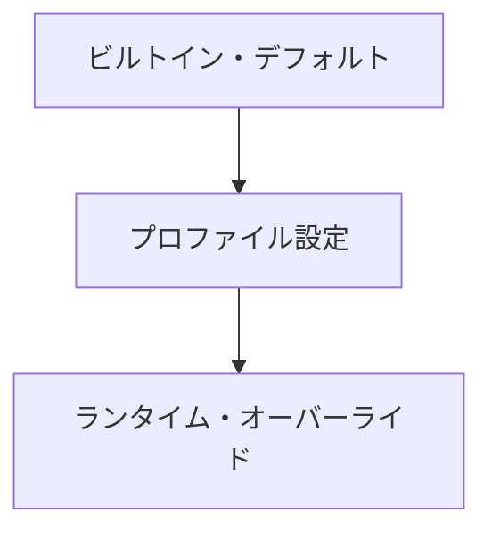

### ビルトイン・デフォルト

Core ランタイムが提供する既定値です。

### プロファイル設定

プロファイル集約が提供する値です。

### ランタイム・オーバーライド

アダプターが実行時に上書きする値です。

## 35. リソース・ロード

Core ランタイムは、リソースの保存場所を知りません。ResourceProvider を介して取得します。

### 設計意図 (ゴール)

* ストレージの独立性
* アダプターの独立性
* ランタイムの独立性

### 対応ソース

下記は、対応ソース例です。

* メモリー
* JSON
* REST API
* ブラウザー・ストレージ

### リソース・プロバイダー

下記は、リソース・プロバイダーを介してプロファイルを取得する例です。

`WordPress` の場合です。

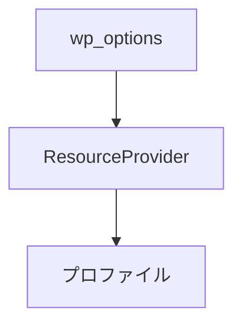

`Forwarder-PRO` の例です。

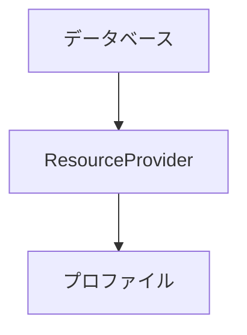

### インターフェイス

#### ResourceProvider

```ts
interface ResourceProvider {
    loadProfile(
        profileId:
            string
    ): Promise<Profile>;

    loadDictionary(
        dictionaryId:
            string
    ): Promise<Dictionary>;
}
```

## 36. セキュリティ境界

Core ランタイムは、ユーザー入力を信頼してはなりません。

### 信頼コンポーネント

下記は、信頼済みとします。

* RuleExecutor
* パーサー
* ランタイム・レジストリ

### 信頼できないコンポーネント

下記は、ユーザー入力とします。

* プロファイル
* 辞書
* 検証依頼

### セキュリティ・ルール

#### ルール定義

RuleDefinition は、データです。

実行コードを含んではなりません。

#### 辞書

辞書は、実行コードを含んではなりません。

#### プロファイル

プロファイルは、実行コードを含んではなりません。

#### 禁止

```json
{
  "script":
    "alert('hello')"
}
```

```json
{
  "executor":
    "eval(...)"
}
```

### ランタイム分離

RuleExecutor は、「ランタイム・レジストリ」に登録済みのもののみ実行します。

#### 許可

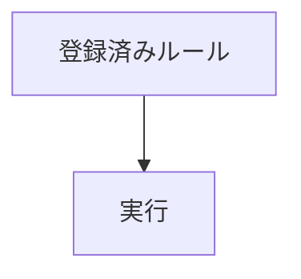

#### 禁止

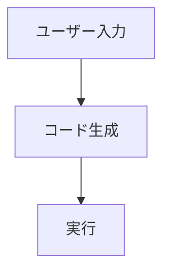

## 37. サンドボックス化方針

ブラウザー・ランタイムおよび Worker ランタイムを推奨します。

### 設計意図 (ゴール)

ルール実行時の権限を最小化します。

### 拡張機能のセキュリティ

拡張機能は、署名済みまたは信頼済みパッケージとして配布することを推奨します。

## 38. アプリケーション・サービス層

アプリケーション・サービス層は、Core ランタイムの公開入口です。

アダプター層は、ドメイン・オブジェクトを直接操作してはなりません。

すべての診断処理は、アプリケーション・サービスを経由します。

### 設計意図 (ゴール)

* ユースケースの統一
* ランタイムの隠蔽
* アダプターの単純化
* トランザクション境界の統一

### アプリケーション・サービス

#### LintApplicationService

文章品質を診断します。

##### 責務

* リクエストの検証
* セッションの管理
* 検証パイプラインの実行
* 結果の生成

##### フロー

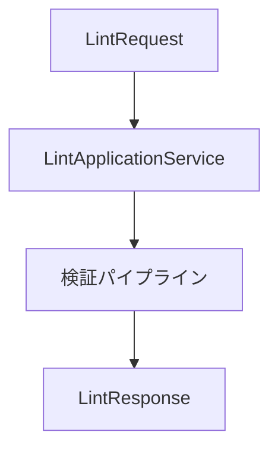

#### BatchLintApplicationService

一括で診断します。

##### 責務

* 一括セッションの作成
* 並列実行
* 集約
* レポートの生成

##### フロー

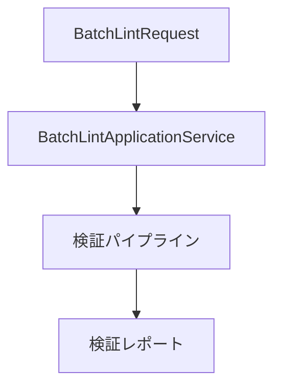

### インターフェイス

#### LintRequest

```ts
interface LintRequest {
    content: string;

    contentType:
        ContentType;

    profileId:
        string;

    runtimeOverride?:
        RuntimeOverride;
}
```

#### LintResponse

```ts
interface LintResponse {
    result:
        LintResult;

    diagnostics:
        RuntimeDiagnostics;
}
```

#### BatchLintRequest

```ts
interface BatchLintRequest {
    items:
        LintRequest[];
}
```

#### BatchLintResponse

```ts
interface BatchLintResponse {
    report:
        ValidationReport;
}
```

## 39. トランザクション境界

検証の実行単位を Lint セッションと呼びます。

### Lint セッション

下記を1つのセッションとします。

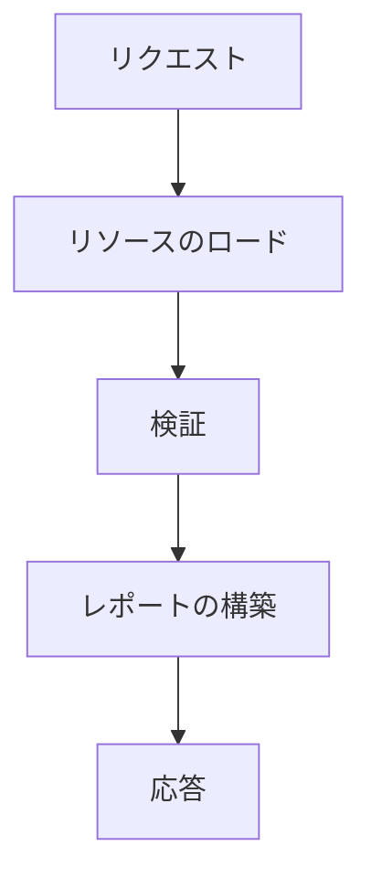

### セッション・ライフサイクル

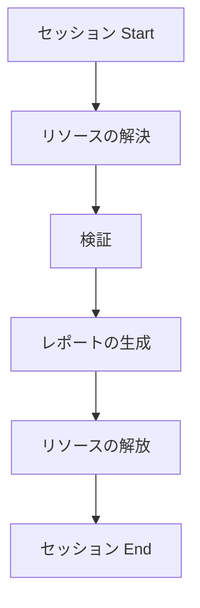

### 一貫性の原則

同一セッション内では、同じプロファイルと辞書を利用します。

検証中に設定変更が発生しても、反映しません。

## 40. 並行処理の方針

Core ランタイムは、並列実行可能でなければなりません。

### 設計原則

Stateless First (ステートレス・ファースト) とします。

### 要件

RuleExecutor は、状態を保持してはなりません。
辞書エンジンは、状態を保持してはなりません。
検証パイプラインは、状態を保持してはなりません。

### 許可

同時実行は、許可されます。

```mermaid
flowchart TD
  A["Worker A"] --> B["Lint セッション A"]
```

```mermaid
flowchart TD
  A["Worker B"] --> B["Lint セッション B"]
```

### 禁止

```mermaid
flowchart TD
  A["Worker A"] --> B["グローバルで値変更可能な状態"]
  C --> B["Worker B"]
```

### キャッシュと並行性

キャッシュは、共有可能です。

ただしドメイン・ロジックは、キャッシュを前提としてはなりません。

### 一括実行の方針

一括検証は、並列実行を許可します。

下記は、一括実行の例です。

```mermaid
flowchart TD
    subgraph Batch [Batch]
        B1[アイテム1]
        B2[アイテム2]
        B3[アイテム3]
        B4[アイテム4]
    end
    
    subgraph Worker_Pool [Worker プール]
        W1[Worker1]
        W2[Worker2]
        W3[Worker3]
        W4[Worker4]
    end

    Batch ==> Worker_Pool
```

## 41. リソース・ライフサイクル

ランタイム・リソースは、「セッション」に従って管理します。

### リソースリークの防止

セッション終了後に「セッション・リソース」を保持してはなりません。

### 管理対象リソース

* プロファイル
* 辞書
* ルール・レジストリ
* パーサー
* AST (抽象構文木) 

### リソースの獲得

```mermaid
flowchart TD
  A["セッション Start"] --> B["リソースの獲得"]
```

### リソースの解放

```mermaid
flowchart TD
  A["セッション End"] --> B["リソースの解放"]
```

### リソース所有権

* プロファイル - セッション・オーナー
* 辞書 - セッション・オーナー
* AST (抽象構文木) - セッション・オーナー
* ルール・レジストリ - ランタイム・オーナー

### リソースのクリーンアップ

#### 必須

* AST (抽象構文木) の解放
* セッション・キャッシュの解放
* 一時コンテキストの解放

#### 任意

* 共有キャッシュ
* ランタイム・レジストリ

## 42. ランタイム・コンテキスト

ランタイム・コンテキストは、毎セッション生成します。

RuntimeContext は、セッション内のみ有効とします。

### インターフェイス

#### RuntimeContext

```ts
interface RuntimeContext {
    profile:
        Profile;

    dictionaries:
        Dictionary[];

    runtime:
        RuntimeEnvironment;
}
```

## 43. 失敗処理

セッション失敗は、他セッションに影響してはなりません。

下記は、並行実行されてるセッションの一方が、失敗した例です。

```mermaid
flowchart TD
  A["セッション A"] --> B["ルールの失敗"]
  B --> C["中断"]
```

```mermaid
flowchart TD
  A["セッション B"] --> B["続行"]
```


## 44. リポジトリ

リポジトリは、ResourceProvider を利用して集約を構築します。

### 設計意図 (ゴール)

* ストレージの独立性
* ランタイムの独立性
* アダプターの独立性

### 集約の所有権

#### プロファイル集約

プロファイルは、唯一の「集約ルート」とします。

#### リポジトリのアクセス・ルール

下記のようなリポジトリ・アクセスは、許可されます。

```mermaid
flowchart TD
  A["アプリケーション・サービス"] --> B["リポジトリ"]
  B --> C["集約"]
```

一方、下記のようなリポジトリ・アクセスは、許可されません。

```mermaid
flowchart TD
  A["アプリケーション・サービス"] --> B["ResourceProvider"]
```

```mermaid
flowchart TD
  A["ランタイム・コンポーネント"] --> B["ResourceProvider"]
```

### インターフェイス

#### ProfileRepository

```ts
interface ProfileRepository {
    findById(
        profileId: string
    ): Promise<Profile>;

    save(
        profile: Profile
    ): Promise<void>;
}
```

#### DictionaryRepository

```ts
interface DictionaryRepository {
    findById(
        dictionaryId: string
    ): Promise<Dictionary>;
}
```

### リソースプロバイダーとの関係

```mermaid
flowchart TD
  A["ProfileRepository"] --> B["ResourceProvider"]
  B --> C["ストレージ"]
```

## 45. ドメイン・サービス境界

ドメイン・サービスは、ドメイン・ロジックを担当します。

ランタイム・サービスは、ランタイム・ロジックを担当します。

両者を混在させてはなりません。

### ドメイン・サービス

下記は、ドメイン・サービスの例です。

```text
ValidationService
ProfileService
RuleService
```

#### 責務

* 検証
* プロファイルの解決
* 辞書の解決
* ルールの解決

### ランタイム・サービス

下記は、ランタイム・サービスの例です。

```text
CacheService
MetricsService
WorkerDispatcher
DiagnosticsService
```

#### 責務

* キャッシュ
* ログ採取
* 指標
* Worker 配分・制御
* 診断

### 依存性ルール

下記のようなドメイン・サービスの依存は、許可されます。

```mermaid
flowchart TD
  A["アプリケーション・サービス"] --> B["ドメイン・サービス"]
```

下記のようなランタイム・サービスの依存は、許可されます。

```mermaid
flowchart TD
  A["アプリケーション・サービス"] --> B["ランタイム・サービス"]
```

一方、下記のようなランタイム・サービスの依存は、許可されません。

```mermaid
flowchart TD
  A["ドメイン・サービス"] --> B["ランタイム・サービス"]
```

## 46. プロファイルの解決 Strategy

プロファイルの解決は、ProfileId からプロファイル集約を解決する処理です。

下記は、プロファイルの解決例です。

```mermaid
flowchart TD
  A["wordpress/legal"] --> B["プロファイル集約"]
```

下記は、プロファイルの解決失敗例です。

```mermaid
flowchart TD
  A["wordpress/unknown"] --> B["wordpress/default"]
```

### フロー

```mermaid
flowchart TD
  A["ProfileId"] --> B["ProfileRepository"]
  B --> C["プロファイル集約"]
```

### プロファイルの解決の順序

#### 完全一致

最初に完全一致を検索します。

#### エイリアスの解決

エイリアスが存在する場合は、変換します。

#### 代替プロファイル

解決できない場合は、デフォルト・プロファイルを利用できます。

### インターフェイス

#### ProfileResolutionResult

```ts
interface ProfileResolutionResult {
    profile: Profile;

    fallback: boolean;
}
```

## 47. バージョン・ネゴシエーション

Core ランタイムは、ProfileVersion および SchemaVersion を評価します。

下記は、バージョン・ネゴシエーション例です。

```mermaid
flowchart TD
  A["Profile v1.0"] --> B["Core v2.0"]
  B --> C["deprecated"]
```

### バージョンの状態

```ts
type VersionState =
    | "compatible"
    | "deprecated"
    | "unsupported";
```

#### 互換

ロードを許可します。

#### 非推奨

ロードを許可します。警告を生成します。

#### 非サポート

ロードを拒否します。

### ネゴシエーションのフロー

```mermaid
flowchart TD
  A["プロファイル・バージョン"] --> B["互換性チェック"]
  B --> C["バージョンの状態"]
```

### 移行ルール

非推奨プロファイルは、移行ランタイムの対象とします。

### インターフェイス

#### VersionNegotiationResult

```ts
interface VersionNegotiationResult {
    state:
        VersionState;

    warnings:
        string[];
}
```

## 48. 汎用言語

本章は、`@s2j/docs-linter-core` における共通用語を定義します。

Core ランタイム、アダプター、拡張機能は、本用語を共有しなければなりません。

### 用語集

| 用語 | Description |
| --- | --- |
| Rule | 文章品質の判定ルール |
| RuleDefinition | ルールの定義情報 |
| RuleExecutor | ルールの実行実装 |
| RuleConfiguration | ルールの設定値 |
| Dictionary | 用語辞書 |
| DictionaryType | 辞書種別 |
| Profile | ルールおよび辞書の構成 |
| ProfilePackage | エクスポート/インポートの単位 |
| Violation | 単一違反 |
| Validation | 品質の診断処理 |
| ValidationReport | 診断結果 |
| Runtime | 実行環境 |
| Extension | ランタイム拡張 |
| Adapter | `WordPress` 等との接続層 |

### ネーミング・ルール

同一概念に対して、複数名称を利用してはなりません。つまり、同義語として利用してはなりません。

下記は、許可されます。

```text
ValidationReport
```

下記は、許可されません。

```text
LintReport
AnalysisReport
ValidationResult
```

## 49. ドメイン不変条件

ドメイン不変条件は、集約の不変条件を定義します。

### プロファイル集約

#### 不変条件

プロファイルは、有効な RuleConfiguration を保持しなければなりません。

下記は、許可されます。

```mermaid
flowchart TD
  A["Profile"] --> B["RuleConfiguration"]
  B --> C["RuleDefinition"]
```

下記は、許可されません。

```mermaid
flowchart TD
  A["Profile"] --> B["Unknown Rule"]
```

### 辞書

#### 不変条件

辞書は、DictionaryType を持たなければなりません。

下記は、許可されません。

```json
{
  "type": null
}
```

### RuleDefinition

#### 不変条件

RuleId は、ルール・レジストリ内で一意でなければなりません。

### ValidationReport

#### 不変条件

ValidationReport は、検証の実行結果のみを含みます。

ランタイム状態を保持してはなりません。

## 50. 機能の解決 Strategy

ランタイム機能性は、「ランタイム」と「ルール機能性」の組み合わせによって決定します。

### 解決フロー

```mermaid
flowchart TD
  A["ランタイム機能性"] --> B["ルール機能性"]
  B --> C["有効な機能性"]
```

下記は、ランタイム機能性の例です。

```json
{
  "worker": true,
  "autofix": false
}
```

下記は、ルール機能性の例です。

```json
{
  "worker": true,
  "autofix": true
}
```

下記は、有効な機能性の結果例です。

```json
{
  "worker": true,
  "autofix": false
}
```

### 解決ルール

最も制限の厳しい機能性を採用します。

下記は、ブラウザー・ランタイムの解決例です。

```mermaid
flowchart TD
  A["autofix"] --> B["disabled"]
```

下記は、Worker ランタイムの解決例です。

```mermaid
flowchart TD
  A["batch"] --> B["enabled"]
```

## 51. 拡張機能の互換性方針

拡張機能は、Core ランタイムの契約に従わなければなりません。

### 互換性チェック

```mermaid
flowchart TD
  A["拡張機能"] --> B["apiVersion"]
  B --> C["互換性チェック"]
  C --> D["ロード"]
```

### バージョン状態

```ts
type ExtensionCompatibility =
    | "compatible"
    | "deprecated"
    | "unsupported";
```

#### 互換

ロードを許可します。

#### 非推奨

ロードを許可します。警告を生成します。

#### 非サポート

ロードを拒否します。

### 拡張機能ルール

拡張機能は、下記を変更してはなりません。

* 集約契約
* ID Strategy
* 検証パイプライン
* Core ドメイン・モデル

下記の追加は、許可されます。

* Rule 追加
* DictionaryType 追加
* Parser 追加

### インターフェイス

#### ExtensionManifest

```ts
interface ExtensionManifest {
    extensionId:
        string;

    version:
        string;

    apiVersion:
        string;
}
```

## 52. テスト

Core ランタイムは、テスト可能でなければなりません。

### テスト層

#### 単体テスト

下記は、テストの対象です。

* RuleExecutor
* 辞書エンジン
* パーサー

#### 統合テスト

下記は、テストの対象です。

* 検証パイプライン
* リポジトリ
* リソース・プロバイダー

#### 互換性テスト

下記は、テストの対象です。

* プロファイル移行
* バージョン・ネゴシエーション
* 拡張機能の互換性

#### ランタイム・テスト

下記は、テストの対象です。

* ブラウザー・ランタイム
* Worker ランタイム
* Node ランタイム

### 必須カバレッジ

下記は、必須とします。

* ルール実行
* 検証パイプライン
* バージョン・ネゴシエーション
* プロファイルの解決

### テストの分離

RuleExecutor は、独立してテスト可能でなければなりません。

下記は、独立してテストできないので、禁止です。

```mermaid
flowchart TD
  A["RuleExecutor"] --> B["データベース"]
```

```mermaid
flowchart TD
  A["RuleExecutor"] --> B["ネットワーク・アクセス"]
```

### 継続的検証

CI は、下記を実行します。

* 単体テスト
* 統合テスト
* 互換性テスト

## 53. 完了条件

`@s2j/docs-linter-core` は、下記を実装した時点で完成とみなします。

* 検証パイプライン
* ルール・ランタイム
* 辞書ランタイム
* ルール・レジストリ・ランタイム
* ランタイム Strategy
* Worker Strategy
* パッケージング Strategy
* ライフサイクル・ハンドリング
* 移行ランタイム
* ドメインイベント・ランタイム
* Core API 互換

`@s2j/docs-linter-core` は、下記を実装した時点でランタイム層完了とみなします。

* パーサー Strategy
* コンテンツタイプ Strategy
* キャッシュ Strategy
* エラー処理方針
* 可観測性
* ランタイム診断

下記を満たした時点で、拡張機能層は完成とみなします。

* 拡張機能プロバイダー
* ランタイム・レジストリ
* 設定解決
* リソース・プロバイダー
* セキュリティ境界
* ランタイム分離
* 互換性契約

下記を満たした時点で、アプリケーション層は完成とみなします。

* LintApplicationService
* BatchLintApplicationService
* リクエスト契約
* 応答契約
* トランザクション境界
* 並行処理の方針
* リソース・ライフサイクル
* ランタイム・コンテキスト
* 障害隔離

下記を満たした時点で、アーキテクチャ層は完成とみなします。

* リポジトリ契約
* ドメイン・サービス境界
* ランタイム・サービス境界
* プロファイルの解決 Strategy
* バージョン・ネゴシエーション
* ADR (アーキテクチャ決定記録)
* 集約の一貫性
* ストレージの独立性
* ランタイムの独立性

下記を満たした時点で、ガバナンス層は完成とみなします。

* 汎用言語
* ドメイン不変条件
* 機能の解決
* 拡張機能の互換性
* テスト契約
* ガバナンス原則

## 54. 今後のロードマップ

* フェーズ1
  * `@s2j/docs-linter-core` として成立する最小構成
    * ルール・エンジン
    * 辞書エンジン
    * プロファイル・エンジン
* フェーズ2
  * ブラウザー・ランタイムとして、下記に対応
    * Vite
    * Web Worker
* フェーズ3
  * `WordPress` 連携
* フェーズ4
  * `Forwarder-PRO` 連携
  * `配配メール` 連携

## 55. ガバナンス原則

### 原則1

* プラットフォームの独立性 - Core ランタイムは、`WordPress` に依存しない。

### 原則2

* ランタイムの独立性 - Core ランタイムは、ブラウザー、Worker、Node.js をサポートする。

### 原則3

* 拡張機能 First - 新機能は、「拡張機能」として実装する。

### 原則4

* 下位互換性 - ProfilePackage の互換性を維持する。

### 原則5

* フェイルセーフ - 単一ルールの失敗で、検証全体を停止しない。

## 56. ADR (アーキテクチャ決定記録)

Core ランタイムの重要な設計判断を ADR として管理します。

### ADR-001

#### タイトル

* プラットフォームの独立性

#### 決定

* Core ランタイムは、`WordPress` / `Forwarder-PRO` / `配配メール` に依存しない。

### ADR-002

#### タイトル

* Worker First ランタイム

#### 決定

* ブラウザー・ランタイムでは Web Worker を優先する。

### ADR-003

#### タイトル

* 静的ルールの登録

#### 決定

* ルールは、ランタイム・レジストリに静的登録する。
* 動的 `require()` を利用しない。

### ADR-004

#### タイトル

* Stateless ルール実行

#### 決定

* RuleExecutor は、状態を保持しない。

### ADR-005

#### タイトル

* プロファイル集約ルート

#### 決定

* プロファイルを唯一の集約ルートとする。

### ADR-006

#### タイトル

* ストレージの独立性

#### 決定

* Core ランタイムは、ストレージを知らない。
* リポジトリと ResourceProvider を介してアクセスする。

### ADR-007

#### タイトル

* フェイルセーフ検証

#### 決定

* 単一ルールの失敗で、検証全体を停止しない。

### ADR-008

#### タイトル

* 拡張機能 First アーキテクチャ

#### 決定

* 新しいルールや DictionaryType の追加は、ExtensionProvider により行う。
* Core ランタイムの変更を必要としない。
