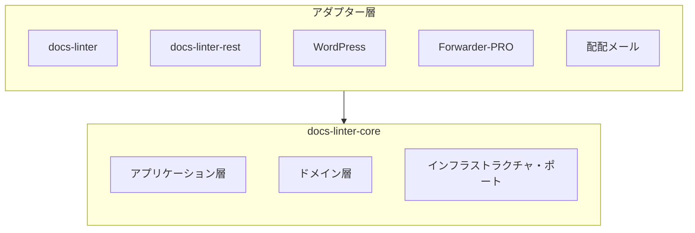

# 📘 S2J Docs Linter - フェーズ1-A - @s2j/docs-linter-core

## 概要

`@s2j/docs-linter-core` は、S2J Docs Linter の中核となる、文章の品質診断というドメイン知識を集約するためのコアドメイン・パッケージ (文章の品質検査エンジン) です。
CLI、REST API、`WordPress`、`Forwarder-PRO` / `配配メール` は、全て「アダプター層」と位置付け、本パッケージを中心に構成します。

## 設計意図 (ゴール)

本パッケージの目的は、下記とします。

* textlint の隠蔽
* 実行環境に非依存
* Adapter 非依存
* 文章の品質判定の共通化

## 非責務

* CLI
* REST API
* WordPress UI
* React UI
* Database
* User Management
* Authentication
* Authorization

## アーキテクチャ




## パッケージの責務

### ドメイン層

責務は、下記の管理です。

* RuleDefinition
* RuleConfiguration
* Dictionary
* Profile
* Violation
* LintResult

### アプリケーション層

責務は、下記の提供です。

* `lint()`
* `validateConfig()`
* `validateDictionary()`
* `loadProfile()`

### インフラストラクチャ・ポート

責務は、下記のインターフェースのみの定義になります。実装はアダプター層に委譲します。

* RuleRepository
* DictionaryRepository
* ProfileRepository

## ディレクトリ構造

```text
src/
├┬─ application/
│├─ services/
│├─ usecases/
│└─ dto/
├┬─ domain/
│├─ entities/
│├─ value-objects/
│├─ services/
│└─ repositories/
├┬─ infrastructure/
│├─ parsers/
│├─ adapters/
│└─ engines/
├─ profiles/
├─ rules/
├─ dictionaries/
└─ index.ts
```

## ドメイン層

### Profile エンティティ

集約のルートです。

```ts
interface Profile {
    id: string;
    name: string;

    rules: RuleConfiguration[];
    dictionaries: Dictionary[];
}
```

### RuleDefinition エンティティ

ルール定義です。

```ts
interface RuleDefinition {
    id: string;
    name: string;
    description: string;
}
```

### RuleConfiguration エンティティ

ユーザーによる設定値です。

```ts
interface RuleConfiguration {
    ruleId: string;
    values: Record<string, unknown>;
}
```

### Dictionary エンティティ

辞書定義です。

```ts
interface Dictionary {
    id: string;
    name: string;
    terms: string[];
}
```

### Violation エンティティ

診断結果です。

```ts
interface Violation {
    ruleId: string;

    severity:
        | "error"
        | "warning"
        | "info";

    message: string;

    line?: number;
    column?: number;
}
```

## ドメインサービス

### LintEngine

文章の品質診断を担当します。責務は、下記になります。

* ルール評価
* 辞書評価
* Result Aggregation

### RuleEngine

RuleDefinition を実行します。責務は、下記になります。

* RuleConfiguration 適用
* ルール評価

### DictionaryEngine

辞書を評価します。責務は、下記になります。

* 禁止語の検査
* 推奨語の検査
* 固有名詞の検査

## アプリケーション層

### LintService

下記は主要ユースケースです。

```ts
const result = await lint({
    text,
    profile,
});
```

* Input

```ts
interface LintRequest {
    text: string;

    profile: Profile;
}
```

* Output

```ts
interface LintResult {
    errors: Violation[];
    warnings: Violation[];
    infos: Violation[];
}
```

* ProfileService

Profile をロードします。

```ts
loadProfile(
    profileId: string
);
```

* ValidationService

設定を検証します。

```ts
validateConfig(config);
```

```ts
validateDictionary(dictionary);
```

## ルールエンジン設計

### ルール定義

ルール定義は、開発者が管理します。ルール定義例は、下記のようになります。

```text
max-kanji-continuous
max-sentence-length
max-heading-length
forbidden-word
required-word
```

### ルール設定

ユーザーが変更します。ルール設定例は、下記のようになります。

```json
{
  "max-kanji-continuous": {
    "max": 7
  }
}
```

たとえば、法律系のプロファイル例は、下記になります。

```json
{
  "max-kanji-continuous": {
    "max": 30
  }
}
```

## プロファイル設計

Profile は集約のルートとします。

```text
Profile
 ├─ RuleConfiguration
 └─ Dictionary
```

プロファイルの設計例は、下記のようになります。

```json
{
  "id": "wordpress",

  "rules": {
    "max-kanji-continuous": {
      "max": 7
    }
  },

  "dictionary": {
    "properNouns": [
      "WordPress",
      "Gutenberg"
    ]
  }
}
```

## ランタイム要件

サポート対象は、下記になります。

* Node.js
* ブラウザー
* Web Worker

下記への直接依存を禁止します。

* fs
* path
* os
* process

## textlint 連携

Core は textlint を内部利用します。ただし textlint は、公開 API に露出しません。

`import { TextLintEngine }` は許可します。
`new TextLintKernel()` をユーザーに公開することは禁止します。

## リポジトリ構成

### ProfileRepository

```ts
interface ProfileRepository {
    load(
        profileId: string
    ): Promise<Profile>;
}
```

### DictionaryRepository

```ts
interface DictionaryRepository {
    load(
        dictionaryId: string
    ): Promise<Dictionary>;
}
```

Core はリポジトリ・インターフェースのみ保持します。

## 公開 API

### `lint()`

文章を品質診断します。

```ts
const result =
    await lint({
        text,
        profile,
    });
```

### `validateConfig()`

設定を検証します。

```ts
validateConfig(config);
```

### `validateDictionary()`

辞書を検証します。

```ts
validateDictionary(dictionary);
```

## Extension Policy

新しい RuleDefinition は追加可能とします。

ルール定義例は、下記のようになります。

* readability-score
* passive-voice
* marketing-phrase

公開 API の破壊的変更は避けます。

## 今後のロードマップ

* フェーズ1
  * docs-linter-core として成立する最小構成
    * ルールエンジン
    * 辞書エンジン
    * プロファイルエンジン
* フェーズ2
  * ブラウザーランタイムとして、下記に対応
    * Vite
    * Web Worker
* フェーズ3
  * `WordPress` 連携
* フェーズ4
  * `Forwarder-PRO` 連携
  * `配配メール` 連携
