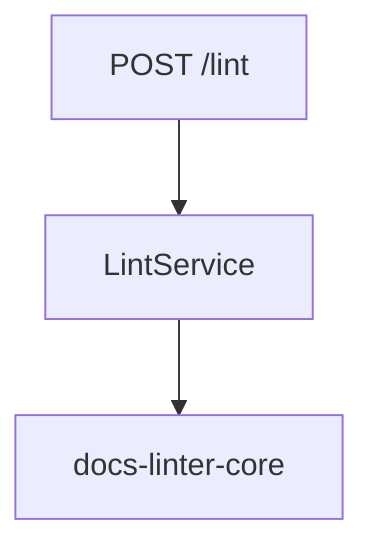
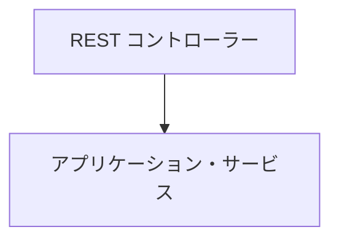
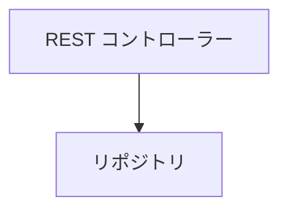
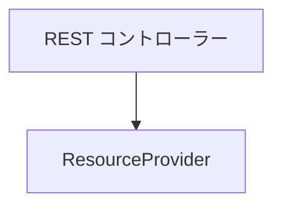
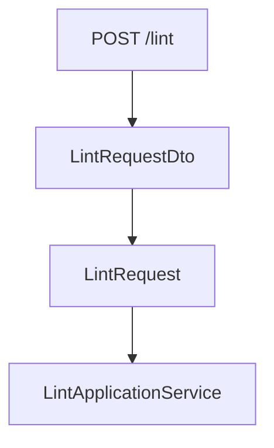
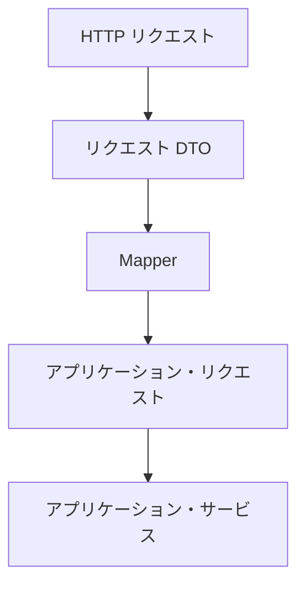
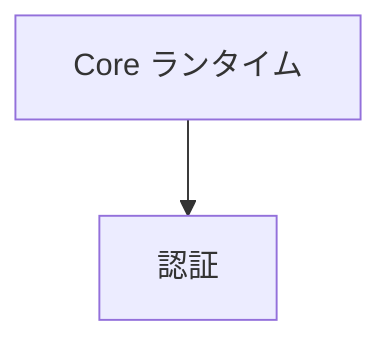

# 📘 S2J Docs Linter - @s2j/docs-linter-rest (配送契約)

## 1. 概要

`@s2j/docs-linter-rest` は、`@s2j/docs-linter-core` を REST API として公開するためのアダプター・パッケージです。

本パッケージは、文章品質判定ロジックを保持しません。全ての判定処理を `@s2j/docs-linter-core` に委譲します。

REST API は、`WordPress`、`Forwarder-PRO` / `配配メール` 等の外部システムとの連携手段として利用されます。

## 2. 設計原則

### アダプター・パターン

REST 層は、アダプターとして振る舞います。REST 層は、薄く保ちます。

REST 層に、業務ロジックを実装してはなりません。

### ドメイン分離

REST 層は、ドメイン・オブジェクトを公開してはなりません。

### コア・ファースト

全ての診断処理は Core に委譲します。

例は、下記のようになります。



### アプリケーション・サービス First

REST 層は、アプリケーション・サービスのみを利用します。

下記のような、REST コントローラーからのフローは許可されます。



下記のような、REST コントローラーからのフローは許可されません。





### ステートレス

REST API はステートレスとします。

セッション状態を保持しません。

## 3. 設計意図 (ゴール)

* Core API の REST 化
* プラットフォーム非依存化
* 外部アプリケーションとの連携
* プロファイル管理 API
* 辞書管理 API

## 4. REST 境界

### 責務

REST 層は、下記のみを担当します。

* リクエストの検証
* DTO マッピング
* 認証の連携
* 応答のシリアライゼーション
* エラーの翻訳

### 非責務

REST 層は、下記を担当しません。

* 検証ロジック
* Lint ロジック
* ルールの評価
* ルールの実行
* プロファイルの解決
* 辞書の解決
* 辞書の評価
* UI
* 認証
* 認可

## 5. API 契約

REST API は、アプリケーション・サービスの公開インターフェースです。

## 6. Core マッピング契約

REST 層は、DTO をアプリケーション・リクエストに変換します。

## 7. DTO 契約

REST 層は、DTO を公開します。

ドメイン・オブジェクトを公開してはなりません。

## 8. エラー契約

REST 層は、ランタイムエラーをエラー DTO に変換します。

## 9. OpenAPI 契約

REST API は、OpenAPI 仕様を提供します。

## 10. REST トランスポート契約

`@s2j/docs-linter-rest` は、`@s2j/docs-linter-core` のトランスポート・アダプターです。

本モジュールは、HTTP / REST を介して Core ランタイムを利用可能にします。

## 11. アーキテクチャ

```mermaid
flowchart TD
    subgraph ClientLayer ["クライアント"]
        direction TB
        c1["`WordPress`"]
        c2["`Forwarder-PRO`"]
        c3["`配配メール`"]
        c4["CLI"]
    end

    subgraph RestLayer ["`@s2j/docs-linter-rest`"]
        direction TB
        r1["REST コントローラー"]
        r2["リクエストの検証"]
        r3["DTO マッピング"]
    end

    core ["`@s2j/docs-linter-core`"]

    ClientLayer --> RestLayer
    RestLayer --> core
```

## 12. REST トランスポート

`@s2j/docs-linter-rest` は、`@s2j/docs-linter-core` のトランスポート・アダプターです。

本モジュールは、HTTP / REST を介して Core ランタイムを利用可能にします。

## 13. Core マッピング

REST 層は、DTO をアプリケーション・リクエストに変換します。

下記は、Core マッピング例です。



### フロー



## 14. ドメイン・マッピング

REST API は「ドメイン・モデル」を DTO に変換します。

### ドメイン

* Profile
* RuleConfiguration
* Dictionary
* LintResult
* Violation

### DTO

* ProfileDto
* DictionaryDto
* LintRequestDto
* LintResultDto

## 15. エンドポイント

### ヘルスチェック

サーバー状態を取得します。

* 応答

```json
{
  "status": "ok"
}
```

### Lint

```http
POST /api/v1/lint
```

* ターゲット - LintApplicationService

### 一括 Lint

```http
POST /api/v1/lint/batch
```

* ターゲット - BatchLintApplicationService

### プロファイル

```http
GET /api/v1/profiles
```

```http
GET /api/v1/profiles/{profileId}
```

### パッケージ

```http
POST /api/v1/packages/import
```

```http
GET /api/v1/packages/{packageId}/export
```

## 16. OpenAPI

REST API は、OpenAPI 仕様を提供します。

### 設計意図 (ゴール)

* クライアント生成
* SDK 生成
* 契約のテスト
* ドキュメント

### OpenAPI マッピング・ルール

全エンドポイントは、OpenAPI に記載しなければなりません。

### 出力

```text
/openapi.json
```

```text
/openapi.yaml
```

## 17. Lint API

### POST /lint

文章を品質診断します。

* リクエスト

```json
{
  "text": "# WordPress",
  "profileId": "wordpress"
}
```

* 応答

```json
{
  "errors": [],
  "warnings": [
    {
      "ruleId": "max-kanji-continuous",
      "message": "漢字の連続数が上限を超えています"
    }
  ]
}
```

## 18. プロファイル API

### GET /profiles

利用可能なプロファイル一覧を取得します。

* 応答

```json
[
  {
    "id": "wordpress",
    "name": "WordPress Profile"
  }
]
```

### GET /profiles/{id}

プロファイルを取得します。

* 応答

```json
{
  "id": "wordpress",
  "rules": {},
  "dictionary": {}
}
```

### POST /profiles

プロファイルを作成します。

* 応答

```json
{
  "id": "legal",
  "name": "Legal Profile"
}
```

### PUT /profiles/{id}

プロファイルを更新します。

### DELETE /profiles/{id}

プロファイルを削除します。

## 19. 辞書 API

### GET /dictionaries

辞書一覧を取得します。

### GET /dictionaries/{id}

辞書を取得します。

### POST /dictionaries

辞書を作成します。

* リクエスト

```json
{
  "id": "company-terms",
  "terms": [
    "WordPress",
    "Gutenberg"
  ]
}
```

### PUT /dictionaries/{id}

辞書を更新します。

### DELETE /dictionaries/{id}

辞書を削除します。

## 20. インポート API

### POST /import/profile

プロファイルをインポートします。

対応形式は、下記のようになります。

* JSON

### POST /import/dictionary

辞書をインポートします。

対応形式は、下記のようになります。

* JSON
* YAML

## 21. エクスポート API

### GET /export/profile/{id}

プロファイルをエクスポートします。

### GET /export/dictionary/{id}

辞書をエクスポートします。

## 22. リポジトリの関連付け

REST 層は、リポジトリ・インターフェースを実装します。

## 23. ランタイムエラー

REST 層は、ランタイムエラーをエラー DTO に変換します。

下記は、ランタイムエラー例です。

```json
{
  "code": "PROFILE_NOT_FOUND",
  "message": "Profile not found"
}
```

### 標準エラーコード

* PROFILE_NOT_FOUND
* DICTIONARY_NOT_FOUND
* UNSUPPORTED_VERSION
* VALIDATION_FAILED
* INTERNAL_ERROR

### エラー応答

#### 検証エラー

```json
{
  "code": "VALIDATION_ERROR",
  "message": "Profile ID is required"
}
```

#### Not Found

```json
{
  "code": "NOT_FOUND",
  "message": "Profile not found"
}
```

#### 内部エラー

```json
{
  "code": "INTERNAL_SERVER_ERROR",
  "message": "Unexpected error"
}
```

## 24. ランタイム要件

対応環境は、下記のようになります。

* Node.js
* Docker
* Linux
* macOS
* Windows

## 25. インターフェイス

### ProfileRepository

```ts
interface ProfileRepository {
  load(id: string);
  save(profile: Profile);
}
```

### DictionaryRepository

```ts
interface DictionaryRepository {
  load(id: string);
  save(dictionary: Dictionary);
}
```

### LintRequestDto

```ts
interface LintRequestDto {
    content: string;

    contentType: string;

    profileId: string;
}
```

### LintResponseDto

```ts
interface LintResponseDto {
    violations:
        ViolationDto[];

    summary:
        SummaryDto;
}
```

### ValidationReportDto

```ts
interface ValidationReportDto {
    totalViolations:
        number;

    warnings:
        number;

    errors:
        number;
}
```

### ErrorResponseDto

```ts
interface ErrorResponseDto {
    code: string;

    message: string;

    requestId?: string;
}
```

## 26. 認証境界

REST 層は、認証を許可します。

Core ランタイムは、認証を知りません。

### 対応例

* Bearer Token
* JWT
* Cookie セッション
* API キー

### 禁止



## 27. シリアライゼーション方針

REST API は、JSON を標準フォーマットとします。

### 命名規則

JSON プロパティは、camelCase (キャメルケース) を採用します。

構成単語 (先頭以外の各単語の語頭は、全て大文字) を連結する「キャメルケース」は、許可されます。

```json
{
  "profileId": "wordpress/default"
}
```

一方、構成単語 (各単語は、全て小文字) をアンダースコアで連結する「スネークケース (snake_case)」は、許可されません。

```json
{
  "profile_id": "wordpress/default"
}
```

### 日付フォーマット

RFC3339 を採用します。

下記は、日付の例です。

```json
{
  "createdAt":
    "2026-06-24T12:00:00Z"
}
```

### API バージョニング

REST API は、URI バージョニングを採用します。

下記は、API バージョニング例です。

```http
POST /api/v1/lint

POST /api/v2/lint
```

#### フォーマット

```text
/api/v1/*
```

### API バージョンの互換性

#### 互換

利用可能です。

#### 非推奨

利用可能です。警告を返します。

#### 非サポート

利用不可です。

## 28. リクエスト制限方針

REST 層は、「リクエスト制限」を提供できます。

### デフォルト設定の推奨

* Lint: `60 requests / minute`
* 一括 Lint: `10 requests / minute`

### 応答

```http
429 Too Many Requests
```

## 29. トランスポート・イベント

REST トランスポート・イベントを発行できます。

下記は、トランスポート・イベント例です。

* RequestReceived
* ResponseSent
* AuthenticationFailed

## 30. REST 可観測性

### 指標

* request.count
* request.duration
* request.error

### ログ

* アクセス・ログ
* エラー・ログ

## 31. 完了条件

`@s2j/docs-linter-rest` は、下記を実装した時点で完成とみなします。

* REST 境界
* API 契約
* DTO 契約
* Core マッピング契約
* シリアライゼーション方針
* API バージョニング
* エラー契約
* 認証境界
* リクエスト制限方針
* OpenAPI 契約
* トランスポート可観測性
* トランスポート ADR (アーキテクチャ決定記録)

## 32. 今後のロードマップ

`@s2j/docs-linter-rest` は、必須コンポーネントではありません。
`WordPress` やブラウザー・ランタイムが `@s2j/docs-linter-core` を直接利用する構成も許容します。

* フェーズ1
  * REST アダプターの実装
    * Health API
    * Lint API
* フェーズ2
  * プロファイル管理 API の実装
    * CRUD
    * Import
    * Export
* フェーズ3
  * 辞書管理 API の実装
    * CRUD
    * Import
    * Export
* フェーズ4
  * マルチテナント対応
* フェーズ5
  * 認証統合
    * JWT
    * OAuth2
    * SSO

## 33. ADR (アーキテクチャ決定記録)

### ADR-REST-001

REST 層は、トランスポート・アダプターとする。

### ADR-REST-002

REST 層は、ドメイン・オブジェクトを公開しない。

### ADR-REST-003

REST 層は、アプリケーション・サービスのみを呼び出す。

### ADR-REST-004

REST API は、OpenAPI を提供する。

### ADR-REST-005

認証は、REST 層の責務とする。
