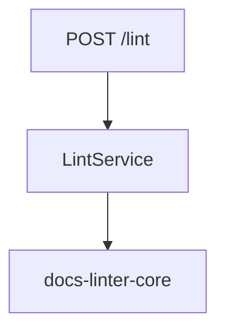

# 📘 S2J Docs Linter - フェーズ1-B - @s2j/docs-linter-rest

## 概要

`@s2j/docs-linter-rest` は `@s2j/docs-linter-core` を REST API として公開するためのアダプター・パッケージです。

本パッケージは文章品質判定ロジックを保持しません。全ての判定処理を `@s2j/docs-linter-core` に委譲します。

REST API は `WordPress`、`Forwarder-PRO` / `配配メール` 等の外部システムとの連携手段として利用されます。

## 設計意図 (ゴール)

* Core API の REST 化
* プラットフォーム非依存化
* 外部アプリケーションとの連携
* プロファイル管理 API
* 辞書管理 API

## 非責務

* ルール評価
* 辞書評価
* Lint ロジック
* UI
* Authentication
* Authorization

## アーキテクチャ

```mermaid
flowchart TD
    subgraph ClientLayer ["Client"]
        direction TB
        c1["`WordPress`"]
        c2["`Forwarder-PRO`"]
        c3["`配配メール`"]
        c4["CLI"]
    end

    subgraph RestLayer ["docs-linter-rest"]
        direction TB
        r1["REST Controller"]
        r2["Request Validation"]
        r3["DTO Mapping"]
    end

    core ["docs-linter-core"]

    ClientLayer --> RestLayer
    RestLayer --> core
```

## 設計原則

### 薄いアダプター

REST Layer は薄く保ちます。

REST Layer に業務ロジックを実装してはなりません。

### コア・ファースト

全ての診断処理は Core に委譲します。

例は、下記のようになります。



### ステートレス

REST API はステートレスとします。

セッション状態を保持しません。

## ドメインマッピング

REST API は Domain Model を DTO に変換します。

### ドメイン

* Profile
* RuleConfiguration
* Dictionary
* LintResult
* Violation

### DTO

* ProfileDto
* DictionaryDto
* LintRequestDto
* LintResultDto

## エンドポイント

### ヘルスチェック

#### GET /health

サーバー状態を取得します。

* レスポンス

```json
{
  "status": "ok"
}
```

## Lint API

### POST /lint

文章を品質診断します。

* リクエスト

```json
{
  "text": "# WordPress",
  "profileId": "wordpress"
}
```

* レスポンス

```json
{
  "errors": [],
  "warnings": [
    {
      "ruleId": "max-kanji-continuous",
      "message": "漢字の連続数が上限を超えています"
    }
  ]
}
```

## プロファイル API

### GET /profiles

利用可能なプロファイル一覧を取得します。

* 応答

```json
[
  {
    "id": "wordpress",
    "name": "WordPress Profile"
  }
]
```

### GET /profiles/{id}

プロファイルを取得します。

* 応答

```json
{
  "id": "wordpress",
  "rules": {},
  "dictionary": {}
}
```

### POST /profiles

プロファイルを作成します。

* 応答

```json
{
  "id": "legal",
  "name": "Legal Profile"
}
```

### PUT /profiles/{id}

プロファイルを更新します。

### DELETE /profiles/{id}

プロファイルを削除します。

## 辞書 API

### GET /dictionaries

辞書一覧を取得します。

### GET /dictionaries/{id}

辞書を取得します。

### POST /dictionaries

辞書を作成します。

* リクエスト

```json
{
  "id": "company-terms",
  "terms": [
    "WordPress",
    "Gutenberg"
  ]
}
```

### PUT /dictionaries/{id}

辞書を更新します。

### DELETE /dictionaries/{id}

辞書を削除します。

## Import API

### POST /import/profile

プロファイルをインポートします。

対応形式は、下記のようになります。

* JSON

### POST /import/dictionary

辞書をインポートします。

対応形式は、下記のようになります。

* JSON
* YAML

## Export API

### GET /export/profile/{id}

プロファイルをエクスポートします。

### GET /export/dictionary/{id}

辞書をエクスポートします。

## リポジトリの関連付け

REST Layer はリポジトリ・インターフェースを実装します。

### ProfileRepository

```ts
interface ProfileRepository {
  load(id: string);
  save(profile: Profile);
}
```

### DictionaryRepository

```ts
interface DictionaryRepository {
  load(id: string);
  save(dictionary: Dictionary);
}
```

## エラー応答

### 検証エラー

```json
{
  "code": "VALIDATION_ERROR",
  "message": "Profile ID is required"
}
```

### Not Found

```json
{
  "code": "NOT_FOUND",
  "message": "Profile not found"
}
```

### 内部エラー

```json
{
  "code": "INTERNAL_SERVER_ERROR",
  "message": "Unexpected error"
}
```

## ランタイム要件

対応環境は、下記のようになります。

* Node.js
* Docker
* Linux
* macOS
* Windows

## 今後のロードマップ

docs-linter-rest は必須コンポーネントではありません。
`WordPress` やブラウザー・ランタイムが `@s2j/docs-linter-core` を直接利用する構成も許容します。

* フェーズ1
  * REST アダプターの実装
    * Health API
    * Lint API
* フェーズ2
  * プロファイル管理 API の実装
    * CRUD
    * Import
    * Export
* フェーズ3
  * 辞書管理 API の実装
    * CRUD
    * Import
    * Export
* フェーズ4
  * マルチテナント対応
* フェーズ5
  * 認証統合
    * JWT
    * OAuth2
    * SSO
