# 📘 S2J Docs Linter - `@s2j/docs-linter-rest` (配送契約、HTTP 契約)

## 1. 概要

`@s2j/docs-linter-rest` は、`@s2j/docs-linter-core` を REST API として公開するためのアダプター・パッケージです。

本パッケージは、文章品質判定ロジックを保持しません。全ての判定処理を `@s2j/docs-linter-core` に委譲します。

REST API は、`WordPress`、`Forwarder-PRO` / `配配メール` 等の外部システムとの連携手段として利用されます。

## 2. 設計原則

### アダプター・パターン

REST 層は、アダプターとして振る舞います。REST 層は、薄く保ちます。

REST 層に、業務ロジックを実装してはなりません。

### ドメイン分離

REST 層は、ドメイン・オブジェクトを公開してはなりません。

### コア・ファースト

全ての診断処理は Core に委譲します。

例は、下記のようになります。

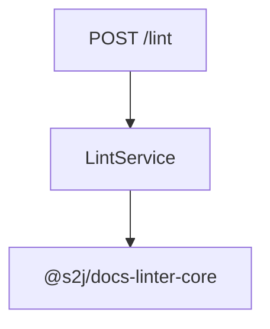

### アプリケーション・サービス First

REST 層は、アプリケーション・サービスのみを利用します。

下記のような、REST コントローラーからのフローは許可されます。

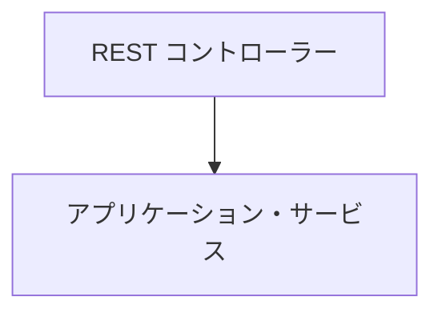

下記のような、REST コントローラーからのフローは許可されません。

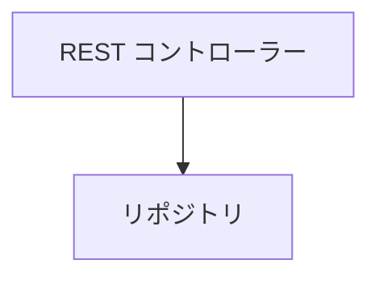

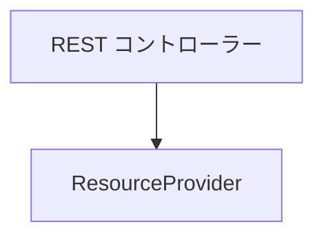

### ステートレス

REST API はステートレスとします。

セッション状態を保持しません。

## 3. 設計意図 (ゴール)

* Core API の REST 化
* プラットフォーム非依存化
* 外部アプリケーションとの連携
* プロファイル管理 API
* 辞書管理 API

## 4. REST 境界

### 責務

REST 層は、下記のみを担当します。

* リクエストの検証
* DTO マッピング
* 認証の連携
* 応答のシリアライゼーション
* エラーの翻訳

### 非責務

REST 層は、下記を担当しません。

* 検証ロジック
* Lint ロジック
* ルールの評価
* ルールの実行
* プロファイルの解決
* 辞書の解決
* 辞書の評価
* UI
* 認証
* 認可

## 5. 準拠契約

### API 契約

REST API は、アプリケーション・サービスの公開インターフェースです。

### DTO 契約

REST 層は、DTO を公開します。

ドメイン・オブジェクトを公開してはなりません。

### Core マッピング契約

REST 層は、DTO をアプリケーション・リクエストに変換します。

### エラー契約

REST 層は、ランタイムエラーをエラー DTO に変換します。

### OpenAPI 契約

REST API は、OpenAPI 仕様を提供します。

### REST トランスポート契約

`@s2j/docs-linter-rest` は、`@s2j/docs-linter-core` のトランスポート・アダプターです。

本モジュールは、HTTP / REST を介して Core ランタイムを利用可能にします。

### 運用契約

トランスポート層の互換性、運用性、および拡張性を保証するためのルールを定めます。

### ページネーション契約

一覧取得 API は、ページネーションをサポートします。

### データ絞り込み契約

一覧取得 API は、「絞り込み」をサポートできます。

### 並べ替えの契約

一覧取得 API は、「並べ替え」をサポートできます。

### 非同期ジョブ契約

長時間の実行処理は、非同期ジョブとして実行します。

### 相関 ID 契約

すべてのリクエストは、相関 ID を持つことを推奨します。

### 「利用側」駆動契約

「利用側」は、下記を想定します。

* `WordPress`
* `Forwarder-PRO`
* `配配メール`

### トランスポート機能契約

トランスポート層は、HTTP に関する契約を提供します。
Core ランタイムは、これらの実装詳細を知りません。

### タイムアウト契約

トランスポート層は、タイムアウトを定義します。

### リクエストサイズ契約

REST 層は、リクエストサイズを制限します。

### 「部分成功」契約

バッチ処理における検証は、「部分成功」を返却できます。

### キャンセル契約

非同期ジョブは、キャンセルをサポートできます。

## 6. トランスポート統制

### 原則1

後方互換性 First - 既存「利用側」を破壊しない。

### 原則2

Core 分離 - REST 層は、Core ランタイムを汚染しない。

### 原則3

OpenAPI First - すべてのエンドポイントを OpenAPI に記載する。

### 原則4

非同期 First - 長時間処理は、非同期ジョブを利用する。

### 原則5

マルチテナント分離 - テナント間のデータ共有を禁止する。

## 7. アーキテクチャ

```mermaid
flowchart TD
    subgraph ClientLayer ["クライアント"]
        direction TB
        c1["`WordPress`"]
        c2["`Forwarder-PRO`"]
        c3["`配配メール`"]
        c4["CLI"]
    end

    subgraph RestLayer ["`@s2j/docs-linter-rest`"]
        direction TB
        r1["REST コントローラー"]
        r2["リクエストの検証"]
        r3["DTO マッピング"]
    end

    core ["`@s2j/docs-linter-core`"]

    ClientLayer --> RestLayer
    RestLayer --> core
```

## 8. REST トランスポート

`@s2j/docs-linter-rest` は、`@s2j/docs-linter-core` のトランスポート・アダプターです。

本モジュールは、HTTP / REST を介して Core ランタイムを利用可能にします。

## 9. Core マッピング

REST 層は、DTO をアプリケーション・リクエストに変換します。

下記は、Core マッピング例です。

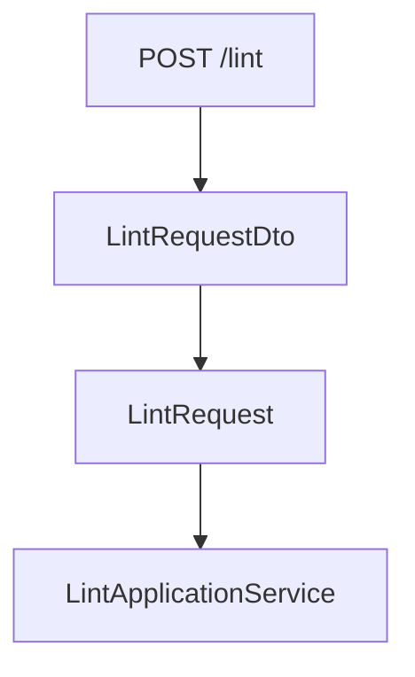

### フロー

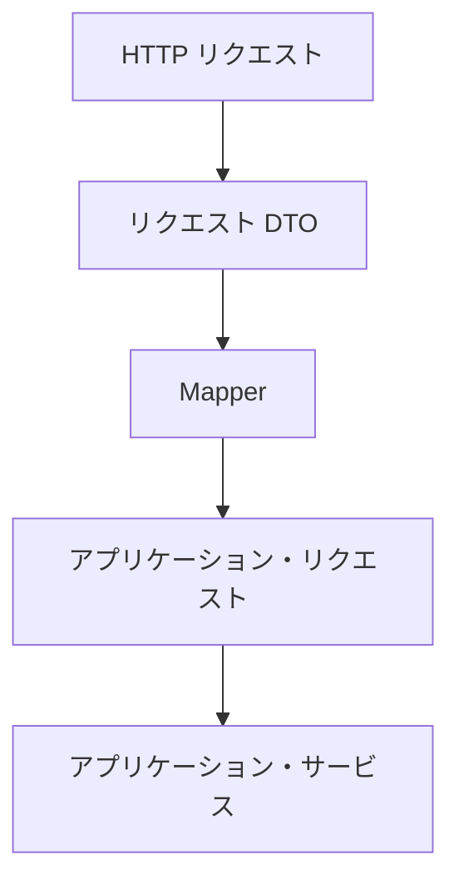

## 10. ドメイン・マッピング

REST API は「ドメイン・モデル」を DTO に変換します。

### ドメイン

* Profile
* RuleConfiguration
* Dictionary
* LintResult
* Violation

### DTO

* ProfileDto
* DictionaryDto
* LintRequestDto
* LintResultDto

## 11. エンドポイント

### ヘルスチェック

サーバー状態を取得します。

* 応答

```json
{
  "status": "ok"
}
```

### Lint

```http
POST /api/v1/lint
```

* ターゲット - LintApplicationService

### 一括 Lint

```http
POST /api/v1/lint/batch
```

* ターゲット - BatchLintApplicationService

### プロファイル

```http
GET /api/v1/profiles
```

```http
GET /api/v1/profiles/{profileId}
```

### パッケージ

```http
POST /api/v1/packages/import
```

```http
GET /api/v1/packages/{packageId}/export
```

## 12. OpenAPI

REST API は、OpenAPI 仕様を提供します。

### 設計意図 (ゴール)

* クライアント生成
* SDK 生成
* 契約のテスト
* ドキュメント

### OpenAPI マッピング・ルール

全エンドポイントは、OpenAPI に記載しなければなりません。

### 出力

```text
/openapi.json
```

```text
/openapi.yaml
```

## 13. Lint API

### POST /lint

文章を品質診断します。

* リクエスト

```json
{
  "text": "# WordPress",
  "profileId": "wordpress"
}
```

* 応答

```json
{
  "errors": [],
  "warnings": [
    {
      "ruleId": "max-kanji-continuous",
      "message": "漢字の連続数が上限を超えています"
    }
  ]
}
```

## 14. プロファイル API

### GET /profiles

利用可能なプロファイル一覧を取得します。

* 応答

```json
[
  {
    "id": "wordpress",
    "name": "WordPress Profile"
  }
]
```

### GET /profiles/{id}

プロファイルを取得します。

* 応答

```json
{
  "id": "wordpress",
  "rules": {},
  "dictionary": {}
}
```

### POST /profiles

プロファイルを作成します。

* 応答

```json
{
  "id": "legal",
  "name": "Legal Profile"
}
```

### PUT /profiles/{id}

プロファイルを更新します。

### DELETE /profiles/{id}

プロファイルを削除します。

## 15. 辞書 API

### GET /dictionaries

辞書一覧を取得します。

### GET /dictionaries/{id}

辞書を取得します。

### POST /dictionaries

辞書を作成します。

* リクエスト

```json
{
  "id": "company-terms",
  "terms": [
    "WordPress",
    "Gutenberg"
  ]
}
```

### PUT /dictionaries/{id}

辞書を更新します。

### DELETE /dictionaries/{id}

辞書を削除します。

## 16. インポート API

### POST /import/profile

プロファイルをインポートします。

対応形式は、下記のようになります。

* JSON

### POST /import/dictionary

辞書をインポートします。

対応形式は、下記のようになります。

* JSON
* YAML

## 17. エクスポート API

### GET /export/profile/{id}

プロファイルをエクスポートします。

### GET /export/dictionary/{id}

辞書をエクスポートします。

## 18. リポジトリの関連付け

REST 層は、リポジトリ・インターフェースを実装します。

## 19. ランタイムエラー

REST 層は、ランタイムエラーをエラー DTO に変換します。

下記は、ランタイムエラー例です。

```json
{
  "code": "PROFILE_NOT_FOUND",
  "message": "Profile not found"
}
```

### 標準エラーコード

* PROFILE_NOT_FOUND
* DICTIONARY_NOT_FOUND
* UNSUPPORTED_VERSION
* VALIDATION_FAILED
* INTERNAL_ERROR

### エラー応答

#### 検証エラー

```json
{
  "code": "VALIDATION_ERROR",
  "message": "Profile ID is required"
}
```

#### Not Found

```json
{
  "code": "NOT_FOUND",
  "message": "Profile not found"
}
```

#### 内部エラー

```json
{
  "code": "INTERNAL_SERVER_ERROR",
  "message": "Unexpected error"
}
```

## 20. ランタイム要件

対応環境は、下記のようになります。

* Node.js
* Docker
* Linux
* macOS
* Windows

## 21. インターフェイス

### ProfileRepository

```ts
interface ProfileRepository {
  load(id: string);
  save(profile: Profile);
}
```

### DictionaryRepository

```ts
interface DictionaryRepository {
  load(id: string);
  save(dictionary: Dictionary);
}
```

### LintRequestDto

```ts
interface LintRequestDto {
    content: string;

    contentType: string;

    profileId: string;
}
```

### LintResponseDto

```ts
interface LintResponseDto {
    violations:
        ViolationDto[];

    summary:
        SummaryDto;
}
```

### ValidationReportDto

```ts
interface ValidationReportDto {
    totalViolations:
        number;

    warnings:
        number;

    errors:
        number;
}
```

### ErrorResponseDto

```ts
interface ErrorResponseDto {
    code: string;

    message: string;

    requestId?: string;
}
```

### TenantContext

```ts
interface TenantContext {
    tenantId: string;
}
```

## 22. 認証境界

REST 層は、認証を許可します。

Core ランタイムは、認証を知りません。

### 対応例

* Bearer Token
* JWT
* Cookie セッション
* API キー

### 禁止

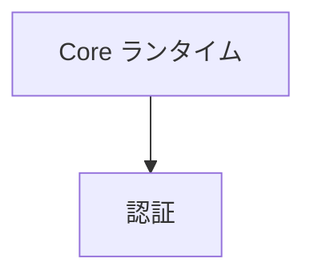

## 23. シリアライゼーション方針

REST API は、JSON を標準フォーマットとします。

### 命名規則

JSON プロパティは、camelCase (キャメルケース) を採用します。

構成単語 (先頭以外の各単語の語頭は、全て大文字) を連結する「キャメルケース」は、許可されます。

```json
{
  "profileId": "wordpress/default"
}
```

一方、構成単語 (各単語は、全て小文字) をアンダースコアで連結する「スネークケース (snake_case)」は、許可されません。

```json
{
  "profile_id": "wordpress/default"
}
```

### 日付フォーマット

RFC3339 を採用します。

下記は、日付の例です。

```json
{
  "createdAt":
    "2026-06-24T12:00:00Z"
}
```

### API バージョニング

REST API は、URI バージョニングを採用します。

下記は、API バージョニング例です。

```http
POST /api/v1/lint

POST /api/v2/lint
```

#### フォーマット

```text
/api/v1/*
```

### API バージョンの互換性

#### 互換

利用可能です。

#### 非推奨

利用可能です。警告を返します。

#### 非サポート

利用不可です。

## 24. リクエスト制限方針

REST 層は、「リクエスト制限」を提供できます。

### デフォルト設定の推奨

* Lint: `60 requests / minute`
* 一括 Lint: `10 requests / minute`

### 応答

```http
429 Too Many Requests
```

## 25. トランスポート・イベント

REST トランスポート・イベントを発行できます。

下記は、トランスポート・イベント例です。

* RequestReceived
* ResponseSent
* AuthenticationFailed

## 26. REST 可観測性

### 指標

* request.count
* request.duration
* request.error

### ログ

* アクセス・ログ
* エラー・ログ

## 27. 運用

本章は、`@s2j/docs-linter-rest` の長期にわたる運用契約を定義します。

トランスポート層の互換性、運用性、および拡張性を保証するためのルールを定めます。

### 冪等性 (べきとうせい) 方針

REST API は、エンドポイントごとの冪等性を明示します。

### 冪等 (べきとう) キー

必要に応じて、下記を利用できます。

```http
Idempotency-Key: 8a8f4d9e
```

### 冪等性 (べきとうせい) エンドポイント

複数回実行しても、同じ結果になります。

| エンドポイント | 冪等 (べきとう) |
| --- | --- |
| POST /api/v1/lint | Yes |
| POST /api/v1/lint/batch | Yes |
| GET /api/v1/profiles | Yes |
| GET /api/v1/profiles/{id} | Yes |

### 非冪等性 (べきとうせい) エンドポイント

複数回実行で、冪等性 (べきとうせい) は保証されません。

| エンドポイント | 冪等 (べきとう) |
| --- | --- |
| POST /api/v1/packages/import | No |

## 28. ページネーション

一覧取得 API は、ページネーションをサポートします。

### リクエスト・パラメータ

```http
GET /api/v1/profiles?page=1&pageSize=20
```

### 応答フォーマット

```json
{
  "items": [],
  "page": 1,
  "pageSize": 20,
  "total": 120,
  "totalPages": 6
}
```

### デフォルト値

| プロパティ | 値 |
| -------- | ----- |
| page     | 1     |
| pageSize | 20    |

### 最大値

| プロパティ | 値 |
| -------- | ----- |
| pageSize | 100   |

## 29. データ絞り込み

一覧取得 API は、「絞り込み」をサポートできます。

下記は、絞り込み例です。

```http
GET /api/v1/profiles?category=wordpress

GET /api/v1/profiles?profileType=legal
```

### 絞り込みルール

フィルター・パラメータは、完全一致を基本とします。

部分一致での検索は、明示的に定義します。

## 30. 並べ替え

一覧取得 API は、「並べ替え」をサポートできます。

下記は、並べ替えの例です。

```http
GET /api/v1/profiles?sort=name

GET /api/v1/profiles?sort=-createdAt
```

### 並べ替えのルール

先頭の "-" は、降順を表します。

## 31. 非同期ジョブ

長時間の実行処理は、非同期ジョブとして実行します。

### 対象操作

* 一括検証
* パッケージ・インポート
* パッケージ・エクスポート

### ジョブ作成

```http
POST /api/v1/jobs
```

### 応答

```json
{
  "jobId": "job-123"
}
```

### ジョブ状態

```http
GET /api/v1/jobs/{jobId}
```

### 状態値

```ts
type JobStatus =
    | "pending"
    | "running"
    | "completed"
    | "failed";
```

### 完了結果

```json
{
  "jobId": "job-123",
  "status": "completed"
}
```

## 32. 相関 ID

すべてのリクエストは、相関 ID を持つことを推奨します。

### リクエスト・ヘッダー

```http
X-Correlation-Id: abc123
```

### 応答ヘッダー

```http
X-Correlation-Id: abc123
```

### トレースのフロー

同一相関 ID を利用します。

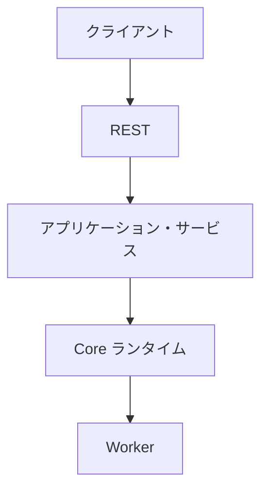

## 33. コントラクトテスト方針

REST 契約の後方互換性を保証します。

### 必須テスト

* リクエスト契約
* 応答契約
* エラー契約
* OpenAPI 契約

## 34. 「利用側」駆動

「利用側」は、下記を想定します。

* `WordPress`
* `Forwarder-PRO`
* `配配メール`

### 互換性ルール

既存「利用側」を破壊する変更は、禁止します。

## 35. API 非推奨化の方針

REST API の廃止手順を定義します。

### ライフサイクル

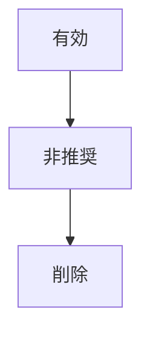

### 有効

通常利用可能です。

### 非推奨

利用可能だが、警告を表示します。

### 削除

利用不可です。

### 最低限の非推奨期間

| API タイプ | 期間 |
| --- | --- |
| 外部公開 API | 6か月 |
| 内部結合 API | 3か月 |

### 移行猶予ヘッダー

```http
Deprecation: true
```

### 廃止ヘッダー

```http
Sunset: 2027-12-31
```

## 36. マルチテナント境界

REST 層は、「テナント・コンテキスト」を扱います。

Core ランタイムは、テナントを知りません。

### 責務

REST 層の責務は、下記の通りです。

* テナントの解決
* テナント認証
* テナント認可

Core ランタイムの責務は、下記の通りです。

* 検証
* ルールの実行
* 辞書の評価

### テナント・フロー

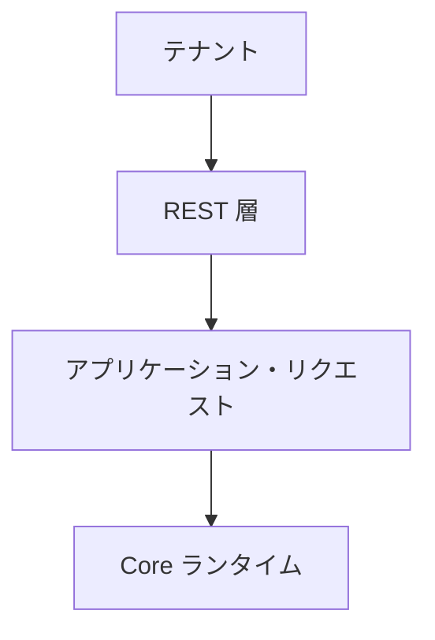

### 分離ルール

テナント間で、下記を共有してはなりません。

* プロファイル
* 辞書
* パッケージ
* 検証結果

## 37. トランスポート機能

本章は、`@s2j/docs-linter-rest` の HTTP トランスポート機能を定義します。

トランスポート層は、HTTP に関する契約を提供します。
Core ランタイムは、これらの実装詳細を知りません。

### メディアタイプ・ネゴシエーション

REST API は、「コンテンツ・ネゴシエーション」をサポートします。

### サポート対象のリクエスト・メディアタイプ

| メディアタイプ | 必須 |
| --- | --- |
| application/json | Yes |

### サポート対象の応答メディアタイプ

| メディアタイプ | 必須 |
| --- | --- |
| application/json | Yes |

### 非サポート・メディアタイプ

サポート対象外のメディアタイプは、拒否します。

#### 応答

```http
HTTP/1.1 415 Unsupported Media Type
```

### Accept ネゴシエーション

サポート対象外の Accept ヘッダーは、拒否します。

#### 応答

```http
HTTP/1.1 406 Not Acceptable
```

### 文字エンコーディング

UTF-8 を標準とします。

### HTTP コンテンツ圧縮方針

トランスポート層は、HTTP コンテンツ圧縮をサポートできます。

Core ランタイムは、HTTP コンテンツ圧縮を認識しません。

### サポート対象の HTTP コンテンツ圧縮

| エンコーディング | 必須 |
| --- | --- |
| gzip | Yes |
| br | 任意 |

### ネゴシエーション

```http
Accept-Encoding: gzip, br
```

#### 応答

```http
Content-Encoding: gzip
```

### HTTP コンテンツ圧縮スコープ

HTTP コンテンツ圧縮の対象は、下記の通りです。

* ValidationReport
* 一括応答
* パッケージのエクスポート

### リトライ方針

クライアントは、リトライ方針に従います。

### リトライ可な応答

| HTTP ステータス・コード | リトライ |
| --- | --- |
| 429 | Yes |
| 503 | Yes |
| 504 | Yes |

### リトライ不可な応答

| HTTP ステータス・コード | リトライ |
| --- | --- |
| 400 | No |
| 401 | No |
| 403 | No |
| 404 | No |

### リトライ・ヘッダー

```http
Retry-After: 60
```

### リトライ・ルール

冪等 (べきとう) エンドポイントのみ、自動リトライを推奨します。

## 38. タイムアウト

トランスポート層は、タイムアウトを定義します。

### 推奨タイムアウト

| エンドポイント | タイムアウト |
| ---------------- | ------------ |
| POST /lint | 30秒 |
| POST /lint/batch | 非同期ジョブ推奨 |
| GET /profiles | 10秒 |

### タイムアウト応答

```http
HTTP/1.1 504 Gateway Timeout
```

### 完了までに時間がかかる処理

30秒を超える可能性がある処理は、非同期ジョブとして実装します。

## 39. API 機能の検出

REST API は、ランタイム機能を公開できます。

機能は、UI の自動構成およびクライアントの機能判定に利用します。

### エンドポイント

```http
GET /api/v1/capabilities
```

### 応答例

```json
{
  "runtime": {
    "worker": true,
    "batch": true,
    "asyncJob": true
  },
  "features": {
    "profiles": true,
    "packages": true,
    "dictionaryImport": true,
    "dictionaryExport": true
  },
  "limits": {
    "maxBatchSize": 100,
    "maxDocumentSize": 1048576
  },
  "api": {
    "version": "1.0"
  }
}
```

### 機能カテゴリー

#### ランタイム

* worker
* batch
* asyncJob

#### 機能

* profiles
* packages
* dictionaries
* import
* export

#### 制限

* maxBatchSize
* maxDocumentSize
* maxConcurrentJobs

### 機能の解決

トランスポート層は、`@s2j/docs-linter-core` が提供するランタイム機能を取得し、機能応答を生成します。

### クライアントの用途

機能の検出は、下記の用途を想定します。

* `WordPress` 管理画面の UI 構成
* `Forwarder-PRO` の機能判定
* `配配メール` の画面制御
* SDK のランタイム判定

### ネゴシエーション・フロー

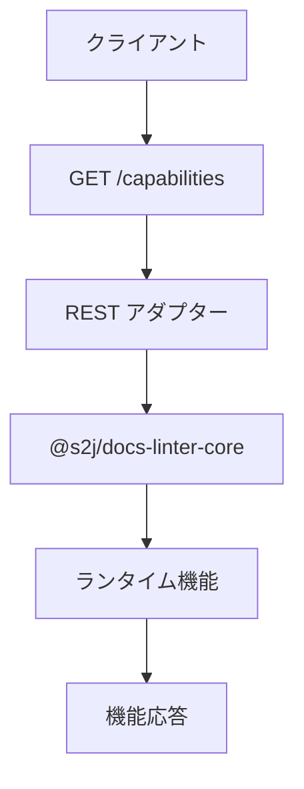

## 40. HTTP 運用方針

本章は、HTTP トランスポート層の運用契約を定義します。

Core ランタイムは、HTTP プロトコルを認識しません。

HTTP に関する責務は、すべて `@s2j/docs-linter-rest` が担当します。

## 41. CORS (オリジン間リソース共有) 方針

REST API は、CORS (オリジン間リソース共有) をサポートできます。

### 責務

CORS (オリジン間リソース共有) の判定は、REST 層が担当します。

Core ランタイムは、オリジン (出自) を認識してはなりません。

### サポート対象のオリジン (出自) 

既定では、同一オリジン (出自) を推奨します。

必要に応じて、許可オリジン (出自) を設定できます。

### サポート対象のメソッド

* GET
* POST
* OPTIONS

### サポート対象のヘッダー

* Authorization
* Content-Type
* Accept
* X-Correlation-Id

### クレデンシャル (資格情報)

Cookie 認証を利用する場合は、クレデンシャル (資格情報) を許可できます。

### プリフライト (Preflight)

OPTIONS リクエストをサポートします。

## 42. キャッシュ制御方針

REST 層は、HTTP キャッシュ方針を提供します。

### デフォルト方針

下記は、変更系エンドポイントの場合のキャッシュ制御例です。

```http
Cache-Control: no-store
```

### 読み取り専用エンドポイント

機能の検出等は、短時間キャッシュを許可できます。

```http
Cache-Control: max-age=300
```

### 禁止

Core ランタイムは、キャッシュ制御ヘッダーを生成してはなりません。

## 43. 条件付きリクエスト

REST 層は、HTTP 条件付きリクエストをサポートできます。

### サポート対象のヘッダー

```http
ETag

If-None-Match
```

### 応答

下記は、変更が無い場合の応答例です。

```http
304 Not Modified
```

### 推奨ターゲット

* プロファイル・リスト
* 機能の検出
* 辞書リスト

## 44. リクエストサイズ

REST 層は、リクエストサイズを制限します。

### 制限

| Item | デフォルト |
| --- | --- |
| ドキュメント・サイズ | 1MiB |
| バッチ処理サイズ | 100Items |
| JSON Body | 5MiB |

### 応答

下記は、制限超過時の応答例です。

```http
413 Payload Too Large
```

### 責務

サイズ制限は、REST 層が担当します。

Core ランタイムは、サイズ検証を前提としてはなりません。

## 45. 部分成功

バッチ処理における検証は、「部分成功」を返却できます。

### ユースケース

* バッチ処理における検証
* パッケージのインポート
* 辞書のインポート

### 応答例

```json
{
  "completed": 97,
  "failed": 3,
  "items": [
    {
      "status": "completed"
    },
    {
      "status": "failed"
    }
  ]
}
```

### ステータス値

```ts
type ItemStatus =
    | "completed"
    | "failed";
```

### HTTP ステータス・コード

下記は、バッチ処理全体は成功したが、一部失敗した場合の例です。

```http
200 OK
```

下記は、完全失敗時の例です。

```http
500 Internal Server Error
```

## 46. キャンセル

非同期ジョブは、キャンセルをサポートできます。

### エンドポイント

```http
POST /api/v1/jobs/{jobId}/cancel

DELETE /api/v1/jobs/{jobId}
```

### キャンセル・フロー

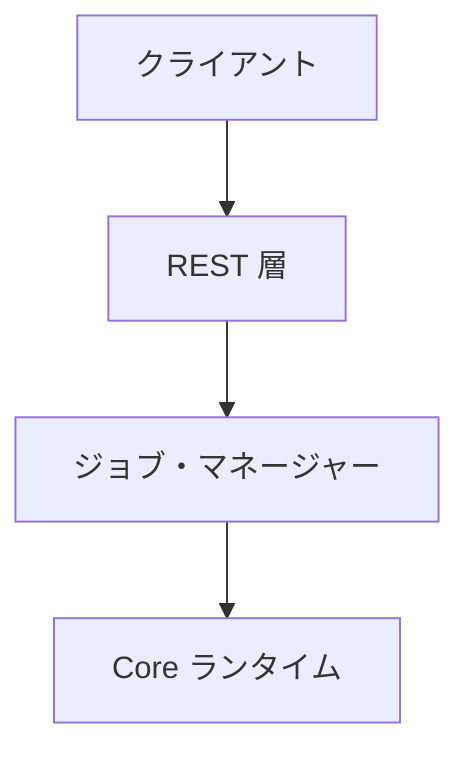

### 応答

下記は、「成功」を示す応答例です。

```http
202 Accepted
```

下記は、「存在しないジョブ」を示す応答例です。

```http
404 Not Found
```

下記は、「完了済みジョブ」を示す応答例です。

```http
409 Conflict
```

### キャンセル・ルール

キャンセル・リクエストは、「ベストエフォート」とします。

すでに完了したジョブは、キャンセルされません。

## 47. HTTP 責任境界

### REST 層の責務

* CORS (オリジン間リソース共有)
* HTTP キャッシュ
* 条件付きリクエスト
* ペイロード・サイズ
* 非同期ジョブ
* キャンセル

### Core ランタイムの責務

* 検証
* ルールの実行
* 辞書の評価
* レポートの生成

### 禁止

Core ランタイムは、下記を認識してはなりません。

* オリジン (出自)
* ETag
* キャッシュ制御
* HTTP ステータス・コード
* リクエスト・ヘッダー

## 48. OpenAPI ライフサイクル

OpenAPI 仕様は、`@s2j/docs-linter-rest` が公開する API 契約を表現する成果物です。

OpenAPI は、Core API 契約から派生する「二次成果物」と位置付けます。

OpenAPI を編集対象とするのではなく、Core API 契約との整合性を維持することを目的とします。

### 設計意図 (ゴール)

* Single Source of Truth
* 契約の整合性
* クライアントの生成
* ドキュメントの生成
* 契約のテスト

### Source of Truth

REST API の唯一の契約は、下記のドキュメントとします。OpenAPI は、これらから導出される成果物です。

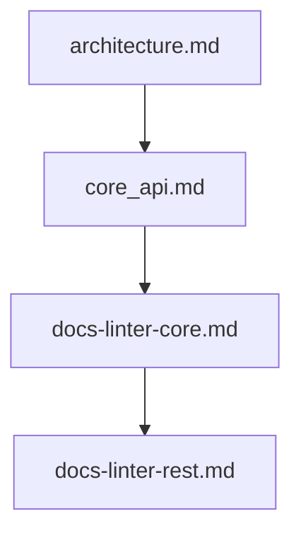

### ライフサイクル

#### フェーズ1

Core API `core_api.md` を変更します。

#### フェーズ2

Core ランタイム契約 `docs-linter-core.md` を更新します。

#### フェーズ3

REST トランスポート契約 `docs-linter-rest.md` を更新します。

#### フェーズ4

OpenAPI 仕様 `openapi.yaml` を更新します。

#### フェーズ5

契約テストを実行します。

#### フェーズ6

クライアント SDK を生成します。

#### フェーズ7

公開ドキュメントを更新します。

### ライフサイクル・フロー

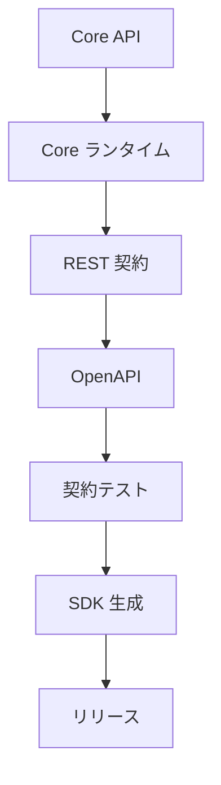

### 所有権

| 生成物 | 所有者 |
| --- | --- |
| `architecture.md` | アーキテクチャ |
| `core_api.md` | ドメイン |
| `docs-linter-core.md` | ランタイム |
| `docs-linter-rest.md` | トランスポート |
| `openapi.yaml` | 生成された契約 |

### 同期ルール

OpenAPI は、`@s2j/docs-linter-rest` の内容と一致しなければなりません。

差異が存在する状態でリリースしてはなりません。

### 変更管理

REST エンドポイントを追加 / 変更 / 削除した場合は、OpenAPI を更新します。

DTO を変更した場合は、OpenAPI スキーマを更新します。

エラー契約を変更した場合は、OpenAPI 応答を更新します。

バージョンを変更した場合は、OpenAPI バージョンを更新します。

### 契約検証

CI は、下記を検証します。

* OpenAPI の構文検証
* 契約テスト
* DTO とスキーマの整合性
* エンドポイントと OpenAPI の整合性

### クライアント・コード自動生成の方針

OpenAPI は、クライアント SDK の生成元として利用できます。

下記は、クライアント SDK の対象例です。

* TypeScript SDK
* Java SDK
* PHP SDK
* C# SDK

SDK は、OpenAPI から生成される成果物であり、手動編集してはなりません。

### ドキュメントの生成

OpenAPI は、API ドキュメント生成にも利用できます。

下記は、ドキュメントの生成例です。

* Swagger UI
* Redoc

### 下位互換性

OpenAPI は、API バージョニング方針に従います。

既存「利用側」を破壊する変更は、禁止します。

### リリース方針

リリース前に、下記を満たさなければなりません。

* OpenAPI 更新済み
* 契約テストの成功
* 互換性テストの成功
* SDK 生成の成功

## 49. 完了条件

`@s2j/docs-linter-rest` は、下記を実装した時点で完成とみなします。

* REST 境界
* API 契約
* DTO 契約
* Core マッピング契約
* シリアライゼーション方針
* API バージョニング
* エラー契約
* 認証境界
* リクエスト制限方針
* OpenAPI 契約
* トランスポート可観測性
* トランスポート ADR (アーキテクチャ決定記録)

運用層は、下記を実装した時点で完成とみなします。

* 冪等性 (べきとうせい) 方針
* ページネーション契約
* データ絞り込み契約
* ソートの契約
* 非同期ジョブ契約
* 相関 ID 契約
* コントラクトテスト方針
* API 非推奨化の方針
* マルチテナント境界
* トランスポート統制

トランスポート機能層は、下記を実装した時点で完成とみなします。

* メディアタイプ・ネゴシエーション
* HTTP コンテンツ圧縮方針
* リトライ方針
* タイムアウト契約
* API 機能の検出
* HTTP 機能ネゴシエーション
* トランスポート決定記録

HTTP 運用層は、下記を実装した時点で完成とみなします。

* CORS (オリジン間リソース共有) 方針
* キャッシュ制御方針
* 条件付きリクエスト
* リクエストサイズ契約
* 「部分成功」契約
* キャンセル契約
* HTTP 責任境界
* HTTP 決定記録

OpenAPI ライフサイクルは、下記を実装した時点で完成とみなします。

* Source of Truth
* ライフサイクルの定義
* 所有権
* 同期ルール
* 契約検証
* クライアント・コード自動生成の方針
* ドキュメントの生成
* リリース方針
* OpenAPI アーキテクチャ決定記録

## 50. 今後のロードマップ

`@s2j/docs-linter-rest` は、必須コンポーネントではありません。
`WordPress` やブラウザー・ランタイムが `@s2j/docs-linter-core` を直接利用する構成も許容します。

* フェーズ1
  * REST アダプターの実装
    * Health API
    * Lint API
* フェーズ2
  * プロファイル管理 API の実装
    * CRUD
    * インポート
    * エクスポート
* フェーズ3
  * 辞書管理 API の実装
    * CRUD
    * インポート
    * エクスポート
* フェーズ4
  * マルチテナント対応
* フェーズ5
  * 認証統合
    * JWT
    * OAuth2
    * SSO

## 51. ADR (アーキテクチャ決定記録)

### ADR-REST-001

* REST 層は、トランスポート・アダプターとする。

### ADR-REST-002

* REST 層は、ドメイン・オブジェクトを公開しない。

### ADR-REST-003

* REST 層は、アプリケーション・サービスのみを呼び出す。

### ADR-REST-004

* REST API は、OpenAPI を提供する。

### ADR-REST-005

* 認証は、REST 層の責務とする。

## 52. トランスポート決定記録

### ADR-REST-006

#### タイトル

* JSON First

#### 決定

* REST API は、JSON を標準フォーマットとする。

### ADR-REST-007

#### タイトル

* 機能の検出

#### 決定

* クライアントは、ランタイム機能を取得できる。

### ADR-REST-008

#### タイトル

* 非同期 First

#### 決定

* 長時間処理は、非同期ジョブとして実装する。

### ADR-REST-009

#### タイトル

* HTTP 標準準拠

#### 決定

* HTTP ステータス・コード、コンテンツ・ネゴシエーション、および HTTP コンテンツ圧縮は RFC に準拠する。

### ADR-REST-010

#### タイトル

* リトライの安全性

#### 決定

* 冪等 (べきとう) エンドポイントのみ、リトライを推奨する。

## 53. HTTP 決定記録

### ADR-REST-011

#### タイトル

* HTTP 責任の分離

#### 決定

* HTTP プロトコルは、REST 層の責務とする。

### ADR-REST-012

#### タイトル

* Core 外キャッシュ

#### 決定

* HTTP キャッシュは、REST 層が提供する。

### ADR-REST-013

#### タイトル

* ペイロード保護

#### 決定

* リクエスト・サイズは、REST 層が検証する。

### ADR-REST-014

#### タイトル

* 部分成功

#### 決定

* 一括 API は、「部分成功」を許可する。

### ADR-REST-015

#### タイトル

* キャンセル可能な非同期ジョブ

#### 決定

* 長時間処理は、キャンセルをサポートできる。

## 54. OpenAPI アーキテクチャ決定記録

### ADR-REST-016

#### タイトル

* 二次成果物としての OpenAPI

#### 決定

* OpenAPI は、Core API 契約から導出される成果物とする。

### ADR-REST-017

#### タイトル

* Single Source of Truth

#### 決定

* API 契約は、`@s2j/docs-linter-rest` を正とする。
* OpenAPI は、契約書ではなく、契約の表現形式である。

### ADR-REST-018

#### タイトル

* OpenAPI First リリース検証

#### 決定

* リリース前に、「OpenAPI / 契約テスト / SDK 生成」の整合性を検証する。
