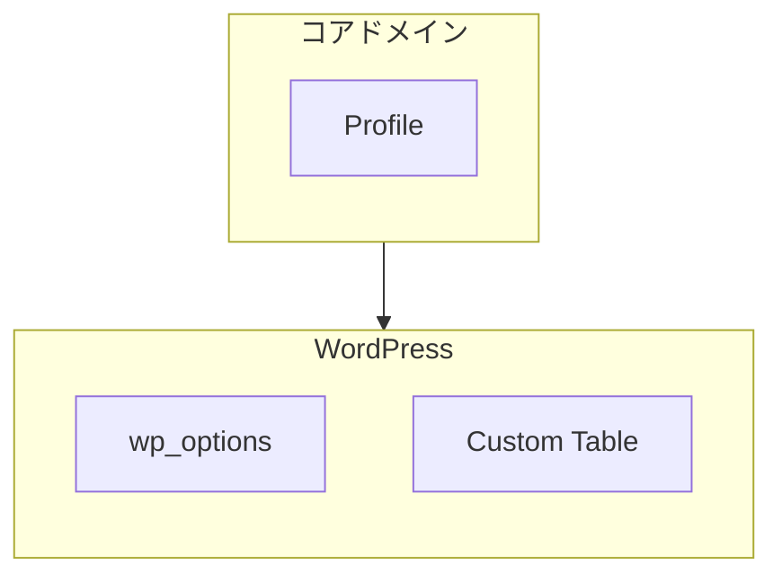
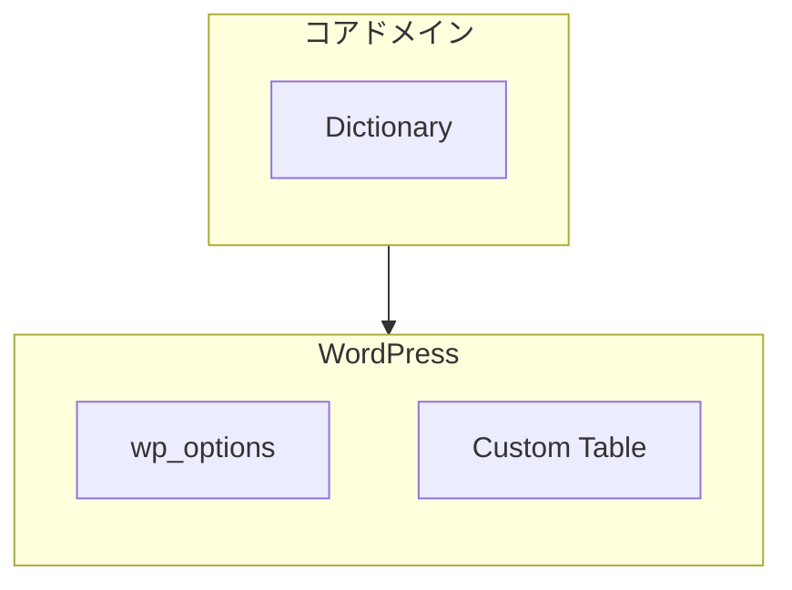
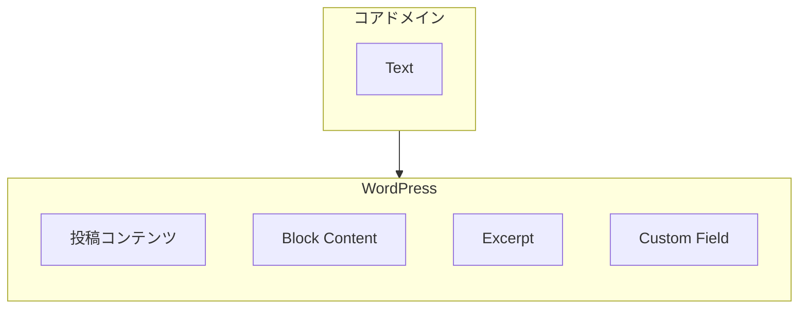
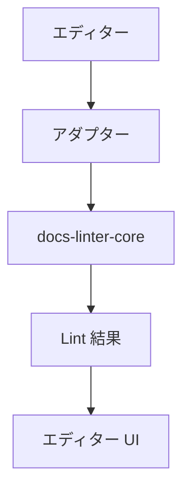
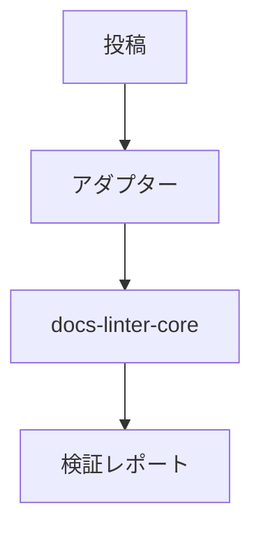
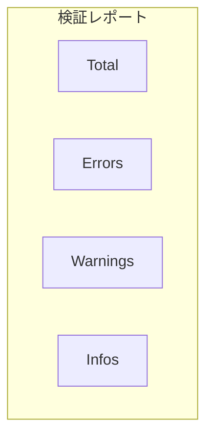
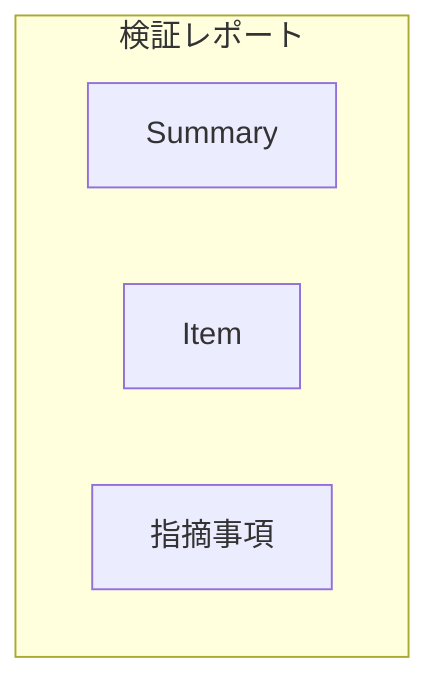
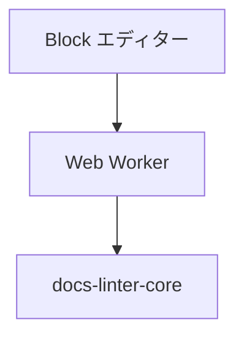
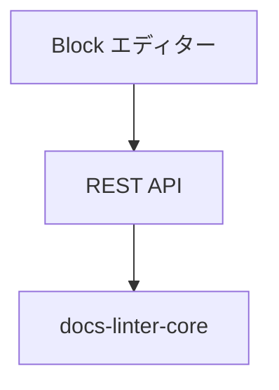
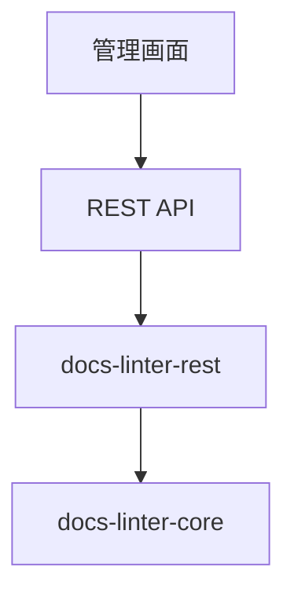

# 📘 S2J Docs Linter - フェーズ2 - `in WordPress`

## 概要

`in WordPress` は、`@s2j/docs-linter-core` を `WordPress` 上で利用するための統合アダプターです。

本コンポーネントは `WordPress` とコアドメインを接続する責務を持ちます。

文章品質判定ロジックは保持せず、全ての診断処理を `@s2j/docs-linter-core` に委譲します。

## 再利用可能な仕様

本仕様は `WordPress` 固有仕様ではなく、統合アダプター仕様の実装例です。

将来的な下記アダプターは、本仕様を継承します。

* in CMS
* in `Forwarder-PRO`
* in `配配メール`
* in メール配信プラットフォーム

下記は、継承に際して、「共通要素」になります。

* エディターの検証
* 一括検証
* プロファイル管理
* 辞書管理
* ルール設定管理
* 検証レポート

## 設計意図 (ゴール)

* `WordPress` 投稿編集時の品質診断
* `WordPress` 投稿群の一括診断
* プロファイル管理
* 辞書管理
* ルール設定管理

## 非責務

* ルール評価
* 辞書評価
* Lint ロジック
* ルール定義管理
* コアドメイン実装

## アーキテクチャー

```mermaid
flowchart TD
    subgraph WordPress ["WordPress"]
        direction TB
        c1["Block エディター"]
        c2["管理画面 UI"]
        c3["一括検証"]
    end

    subgraph WordPressAdapter ["WordPress アダプター"]
        direction TB
        c4["プロファイルのマッピング"]
        c5["辞書のマッピング"]
        c6["検証のマッピング"]
    end

    core ["docs-linter-core"]

    WordPress --> WordPressAdapter
    WordPressAdapter --> core
```

## 境界づけられたコンテキスト

### コアドメイン

管理対象は、下記になります。

* Profile
* Dictionary
* RuleConfiguration
* LintResult

### `WordPress` コンテキスト

管理対象は、下記になります。

* Post
* Page
* カスタム投稿タイプ
* User
* Option
* Metadata

## ドメインマッピング

### Profile



### Dictionary



### 検証対象



## 統合機能

### 共通ユースケース - エディターの検証

投稿編集時に品質を診断します。

#### トリガー

* 投稿編集
* 下書き保存
* 公開前確認

#### 入力

* 投稿コンテンツ

#### フロー



#### 出力

* Error
* Warning
* Info

## 共通ユースケース - 一括検証

投稿群を対象に一括で診断します。

### 検証対象

* Post
* Page
* カスタム投稿タイプ

### フロー



### 結果



## 共通ユースケース - プロファイル管理

Profile を管理します。

### 対応操作

* Create
* Read
* Update
* Delete

### ストレージ

`WordPress` Option または Custom Table に保存します。

## 共通ユースケース - 辞書管理

辞書を管理します。

### 対応操作

* 作成
* 読み取り
* 更新
* 削除
* インポート
* エクスポート

### 対応フォーマット

* JSON
* YAML

## 共通ユースケース - ルール設定管理

RuleConfiguration を管理します。

### 対応操作

* Create
* Read
* Update
* Delete

### 例

```json
{
  "max-kanji-continuous": {
    "max": 7
  }
}
```

## 共通ユースケース - 検証レポート

### 集約



### 要約

```json
{
  "total": 100,
  "errors": 3,
  "warnings": 15,
  "infos": 22
}
```

## リポジトリのバインディング

### ProfileRepository

`WordPress` ストレージとコアドメインを接続します。

### DictionaryRepository

`WordPress` ストレージとコアドメインを接続します。

## ランタイム Strategy

### 対応

* ブラウザー
* Web Worker
* REST API

## 実装方針

具体的な実装方式は、固定しません。下記パターンを許容します。

* パターン A



* パターン B



* パターン C



## セキュリティ方針

ユーザーは、ルール定義を変更しては、なりません。ユーザーは、下記のみ変更可能です。

* Profile
* Dictionary
* RuleConfiguration

## 拡張ポイント

`WordPress` 固有機能との連携を許容します。

連携例は、下記のようになります。

* Gutenberg
* Classic Editor
* カスタム投稿タイプ
* Advanced Custom Fields
* WP-CLI

## 今後のロードマップ

* フェーズ2-A
  * エディターの検証
* フェーズ2-B
  * プロファイル管理
* フェーズ2-C
  * 辞書管理
* フェーズ2-D
  * 一括検証
* フェーズ2-E
  * 検証レポート
