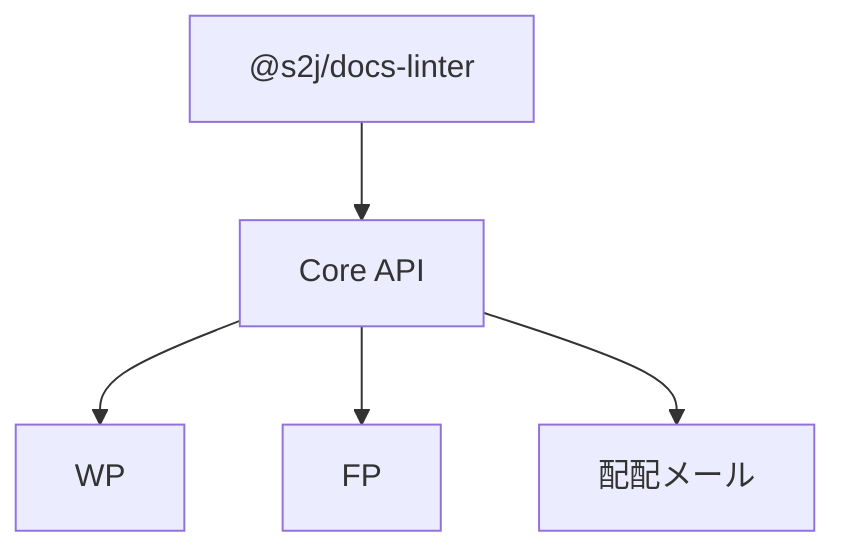
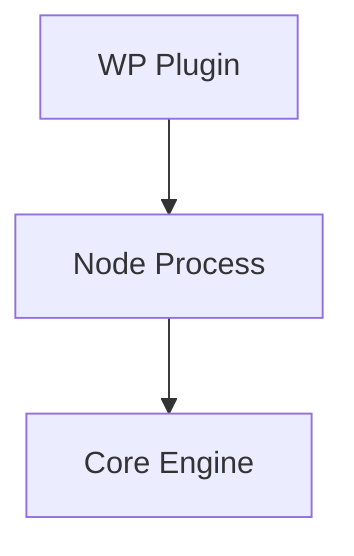
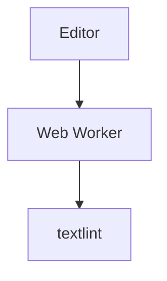
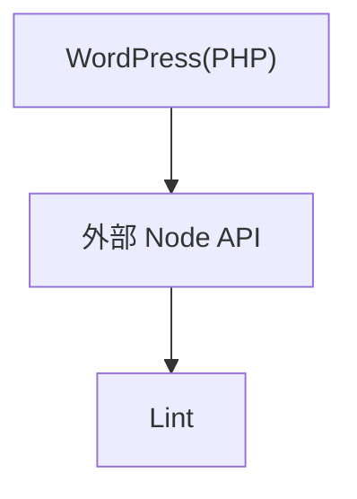
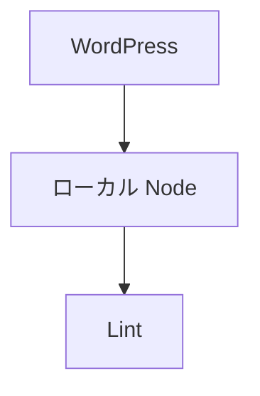
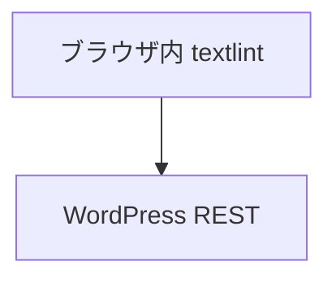
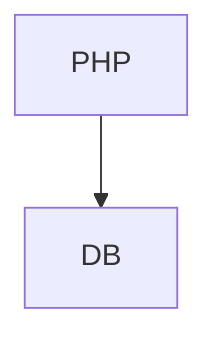
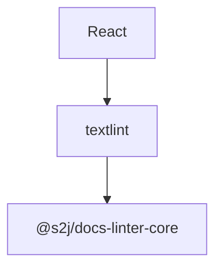
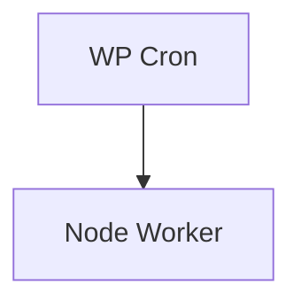
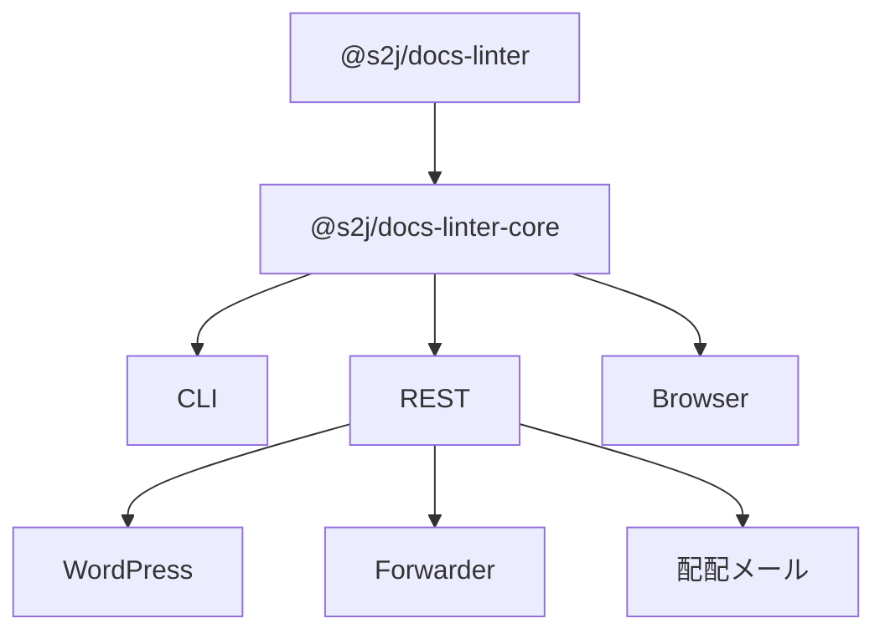

# 📘 S2J Docs Linter - Modification Plan-1

[S2J Docs Linter (@s2j/docs-linter)](../README.md)

* [GitHub リポジトリ](https://github.com/stein2nd/docs-linter) で開発
* [npmパッケージ仕様](../docs/specifications/npm_package_spec.md) では、「パッケージ戦略」等を記載

こちらは、『VisualStudio Code』クローン (CursorやAntiGravity) と言った「Markdown エディター」に対する linter ルールセットとなってます。
npm install 時に、他の textlint ルールセットもインストールしますが、npm モジュール『textlint』を前提にしてます。
「@s2j/docs-linter」自身には、CLIコマンド (init、doctor) を持たせてあり、また既に、利用側プロジェクト向けに VScodeクローン用設定 `.vscode/settings.json` や GitHub Action 設定 `./src/templates/docs-lint.yml` も同梱してます。

これの拡張として、下記の様な展開を考えてますが、如何でしょうか？
尚、Xserver やさくらインターネットなどで、REST API サーバーをサービスすることは想定しません。

* フェーズ1: REST API 版
	* (WordPress プラグイン版を考慮に入れると) Xserver やさくらインターネット等のレンタルサーバーでも安全に実行できる状況にすることが大前提。
	* 以後の展開を考えると、REST API 経由で lint 設定や lint 辞書をメンテナンス可能にする必要がある。
		* `./examples/.textlintrc.wp.jsonc` や `./presets/wordpress/.textlintrc.wp.json`、`./presets/wordpress/dictionary/wp-terms.yml`、`presets/wordpress/rules/space-around-english.js` といった、textlint ルールのメンテナンスができる機能 (ディレクトリ名は例)。
	* lint 機能は、REST API 仲介の対象とする。
	* doctor 機能、init 機能を REST API 仲介の対象にするかは、検討の余地あり。
	* 目標は、「textlint を隠蔽した、Core API」。

* フェーズ2: lint 辞書データや、lint ルール自体の保存場所
	* lint 辞書データや、lint ルール自体は各ユーザーの元で成長していく筈なので、中央集権的な管理サーバーを設けずに、`WordPress`、`Forwarder-PRO`、`配配メール` といったアプリ側の DB テーブルに持つ…という選択肢も検討したい。
	* 当然、lint 辞書データや、lint ルール自体を各ユーザーが `.textlintrc.json` や `dictionary/terms.yml` 形式でバックアップしたりインポートできる機能が必要 (たとえば WPvivid や WP Migrate Lite 等)。

* フェーズ3: REST API 版を WordPress Block editor (React + npm) 向けに実装したプラグイン「for WordPress」。
	* 管理画面
		* (json や yml 構文は、プラグインが内部的に変換した上で) lint 設定内容や lint 辞書内容を、プラグイン利用者毎に保持できるものとする。
			* 安全にメンテできる機能が必要 (tabular 形式であれば、WordPress 標準のテーブルで編集できるようにする)。
		* 固定記事や Custom Post Type に対する一括診断を可能とする (textlint の自動修正まではサポートしない)。
	* Block Editor
		* lint を実施できる様にする (textlint の自動修正まではサポートしない)。
		* ブラウザー依存となる実装は、許容できない。

* フェーズ4:
	* 外部コントリビューターに任せ、私自身はタッチしない。
	* 外部コントリビューター (関西総合システム `Forwarder-Pro` 開発メンバー) が、REST API 版を SpringBoot から呼び出せる様なアダプター？を実装した「for `Forwarder-Pro`」
	* 外部コントリビューター (ラクス `配配メール` 開発メンバー) が、REST API 版を呼び出せる様なアダプター？を実装した「for `配配メール`」
		* 管理機能
			* (json や yml 構文は、プラグインが内部的に変換した上で) lint 設定内容や lint 辞書内容を、利用者毎に保持できる。
			* 安全にメンテできる機能が必要 (tabular 形式であれば、テーブル機能で編集できるようにする)。
			* 配信メールに対する一括診断 (textlint の自動修正まではサポートしない)。
		* 配信メール編集画面での lint (textlint の自動修正まではサポートしない)。

---

全体としては、かなり筋が良い構想です。

特に評価できるのは、最初から「WordPress 専用ツール」を作るのではなく、「textlint を隠蔽した Core API を先に作る」という発想です。

逆に言うと、成功するかどうかは **フェーズ1の設計次第** でしょう。

---

## 良い点

### 1. textlint依存を隠蔽できる

現在の `@s2j/docs-linter` は、下記を束ねた「設定集」に近い状態です。

* textlint
* textlint-rule-preset-japanese
* 独自ルール
* 独自辞書

しかし WordPress 側や Forwarder-Pro 側から見ると、下記の text 値に対する errors 結果だけが欲しい。

* 依頼側の値 (例)

```json
POST /lint

{
  "text": "WordPressの管理画面です"
}
```

* 応答 (例)

```json
{
  "errors":[]
}
```

利用側は、下記を知りたくありません。Core API 化する価値は非常にあります。

* textlint
* YAML
* .textlintrc

---

### 2. WordPress 以外への展開が容易

現在の案だと下記の流れになります。



これなら、下記にも展開できます。

* Laravel
* Spring Boot
* Next.js
* Electron

WordPress依存が無いのは大きいです。

---

### 3. 辞書の成長を中央集権にしない

ここは特に賛成です。

たとえば下記のような辞書は、企業ごとに違います。

* WordPress
* Gutenberg
* WP-CLI
* Custom Post Type

A 社の適用例は、下記が想定されます。

* 会員管理システム
* 顧客ポータル

B 社の適用例は、下記が想定されます。

* `配配メール`
* メールマーケティング

これを「S2J 中央サーバー」に保存するのは無理があります。
むしろ下記に持たせる方が自然です。

* `WordPress` DB
* `Forwarder` DB
* `配配メール` DB

---

## 私なら変更する点

### フェーズ1をさらに分割する

現在は `フェーズ1 = REST API版` になっています。
しかし実際には「フェーズ1-A」「フェーズ1-B」に分けた方が良いです。

* フェーズ1-A

Core Engine

```ts
import { lint } from "@s2j/docs-linter-core";

await lint({
    text,
    dictionary,
    config
});
```

* フェーズ1-B

REST API Wrapper

```text
POST /lint
```

理由は、WordPress プラグイン内部で Node を動かす場合、必ずしも REST API が必要とは限らないからです。
下記でも実装できます。



---

## 最大の課題

### WordPress で Node.js をどう扱うか

ここが一番難しいです。

Xserver やさくらインターネットを前提にすると、「パターン A」は簡単です。しかし「REST API サーバーを運営したくない」という前提と矛盾します。
「パターン B」は共有レンタルサーバーでは厳しいです。Node の常駐ができません。

「パターン C」が実は有力です。
Gutenberg は React なので、下記が可能です。VSCode 拡張に近い方式です。



* パターン A



* パターン B



* パターン C



## WordPress 版で現実的な構成

私なら「管理画面」「編集画面」「一括診断」を下記のように構成します。

* 管理画面

サーバー側の流れを下記とします。



保持するのは、下記とします。

* 辞書
* 設定
* プロファイル

* 編集画面

ブラウザ側で、下記のような流れで実行する。



* 一括診断

ここだけ、下記2パターンの流れで実行する。



```text
CLI
```

---

## Forwarder-Pro 展開を考えるなら

フェーズ4向けに最初から設計するなら、REST API を下記くらいに留める方が良いです。

```json
POST /lint

POST /dictionary/import

POST /dictionary/export

POST /config/import

POST /config/export
```

特に `POST /rule/upload` は危険です。

利用者が `module.exports = ...` をアップロードできる設計になると、事実上「任意コード実行」になります。
そのため、下記の方が安全です。

* 辞書は DB 管理 - OK
* npm パッケージ更新 - 運営側管理

---

## 推奨アーキテクチャ

最終的には、下記を目指すのが良いでしょう。



特に重要なのは、**「辞書はユーザーが編集可能」「ルールコードは編集不可」** という境界を早い段階で明確にすることです。
この境界を守ると、Xserver やさくらインターネットでも運用しやすく、WordPress プラグイン化や他製品への横展開もしやすくなります。
