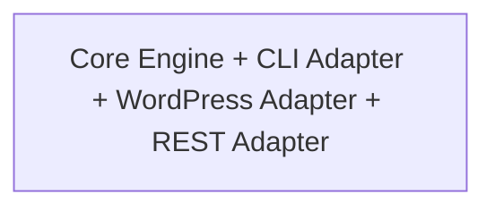
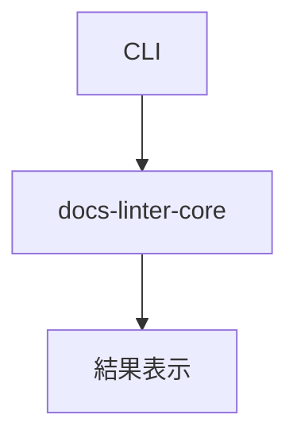

# 📘 S2J Docs Linter - Modification Plan-4

[S2J Docs Linter](https://github.com/stein2nd/docs-linter.git) の今後の展開構想が見えてきたので、`./docsMod` 配下のファイルを `./docs` 配下に移そうと検討しています。

現状は、下記の様になってます。

```
├┬─ docs/
│├─ SPEC.md
│└─ git_submodule.md
└┬─ docsMod/
　├─ specs.md
　├─ status.md
　├─ versioning_policy.md
　├─ semantic_release_evaluation.md
　├─ release.md
　├─ npm_usage.md
　├─ npm_package_spec.md
　├─ npm_auth_secret_manage_spec.md
　├─ maintenance_policy.md
　└─ cli_tooling_spec.md
```

併せて、`@s2j/docs-linter` として保持するものと、`docs-linter-core` に移譲する機能を確認したいです。

尚、`@s2j/docs-linter` でコマンドとして提供してるのは、「init」「doctor」です。
lint 機能は利用側 package.json の scripts で `"lint:docs": "s2j-docs-linter ./README.md ./docs/**/*.md ./docs_mod/**/*.md"` の形で定義しておいた上で `npm run lint:docs` で実行できる様になってます。

---

かなり整理しやすい段階まで来ていると評価します。

今の説明を読む限り、実は `@s2j/docs-linter` は既に下記の性格が強いです。


将来構想の、下記とは責務が少し混ざっています。



そのため、今のタイミングで `docsMod` → `docs` に移行するのは良い判断だと評価します。

---

## まず docs 構成

私ならこう整理します。

```text
docs/
├─ architecture.md
├─ roadmap.md
├─ status.md
├─ release.md
├─ versioning_policy.md
├─ maintenance_policy.md
├┬─ cli/
│├─ init.md
│├─ doctor.md
│└─ npm_usage.md
├┬─ specifications/
│├─ package_structure.md
│├─ cli_tooling.md
│├─ npm_package.md
│└─ auth_secret_management.md
├┬─ future/
│├─ core_api.md
│├─ rest_api.md
│├─ wordpress.md
│└─ adapters.md
└┬─ archive/
　├─ semantic_release_evaluation.md
　└─ git_submodule.md
```

特に `npm_package_spec.md` は今後、`package_structure.md` に名前を変えることを提案します。
理由は、将来、下記が増えるからです。

* @s2j/docs-linter
* docs-linter-core
* docs-linter-rest

---

## Core に移すもの

ここが重要です。

### docs-linter-core

責務 `文章品質判定エンジン` のみ。

具体的には、下記構成になります。

#### 1. lint実行

```ts
lint()
```

#### 2. 設定ロード

```ts
loadConfig()
```

#### 3. 辞書ロード

```ts
loadDictionary()
```

#### 4. プロファイル管理

下記のようなプロファイルを管理する。

* wordpress
* general
* business-mail

#### 5. 結果生成

```ts
{
  errors: [],
  warnings: []
}
```

ここまで。

---

## @s2j/docs-linter に残すもの

こちらは `CLI Distribution` になります。

### init

下記は利用者体験そのものだから、残す。

```bash
npx s2j-docs-linter init
```

生成対象例は、下記。

```text
.textlintrc.json
.vscode/settings.json
.github/workflows/docs-lint.yml
```

### doctor

下記は CLI 診断機能だから、残す。

`npx s2j-docs-linter doctor`

例えば、下記のチェック。

* Node version
* textlint version
* 設定ファイル有無
* 辞書有無

### lint コマンド

ここは悩ましいです。

現状 `npm run lint:docs` で、`s2j-docs-linter` を呼んでいる。
将来も `s2j-docs-linter README.md` は便利だから、私は残した方が良い。
内部は、下記に変更。



## Core へ移譲しない方が良いもの

WordPress 版や REST 版では不要だからです。

* GitHub Actions テンプレート - これは CLI 側。
* VSCode 設定テンプレート - これも CLI 側。
* init テンプレート - これも CLI 側。

---

## 将来のパッケージ構成

かなり先ですが、私ならこう考えます。

```text
packages/
├─ docs-linter-core
├─ docs-linter-cli
├─ docs-linter-rest
├─ docs-linter-wordpress
└─ docs-linter-rules-wordpress
```

そして npm 公開名は `@s2j/docs-linter` とし、内部的には `docs-linter-cli` を参照。

---

## 今の段階で作るべき文書

特に今後の開発を考えると、`docs/future/core_api.md` を最優先で書くことをおすすめします。

その文書には、下記だけを書く。

* Core の責務
* CLI の責務
* WordPress の責務
* REST の責務

コードより先に責務境界を固定しておくと、後から下記で迷わなくなります。

* 「これは Core ?」
* 「これは CLI ?」

現在の構想だと、`init` と `doctor` は明確に `@s2j/docs-linter` 側、文章解析・辞書・ルール評価・結果生成は `docs-linter-core` 側、という分割が最も自然に見えます。