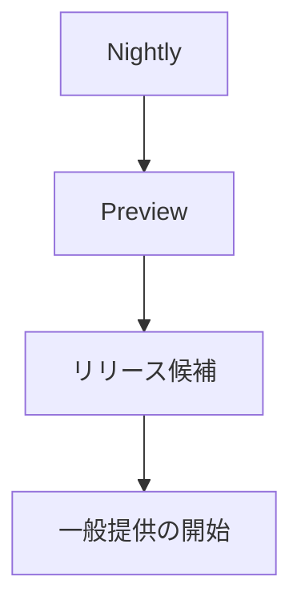
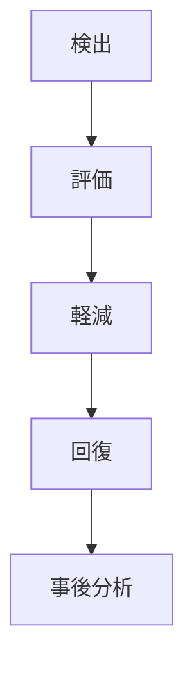

# 📘 S2J Docs Linter - プロジェクト横断のソフトウェア・サプライチェーン、リリース・ガバナンス

## 1. リリース・エンジニアリング仕様

本書は、S2J Docs Linter プラットフォーム全体のリリース・エンジニアリングおよびソフトウェア・サプライチェーンを定義します。

本書の対象は、下記のコンポーネントです。

* @s2j/docs-linter
* @s2j/docs-linter-core
* @s2j/docs-linter-rest
* SDK ジェネレーター
* 生成される SDK
* 将来追加される、プラットフォーム・コンポーネント

本書は、各コンポーネントを横断するリリース・ガバナンスを定義します。

## 2. 設計意図 (ゴール)

リリース・エンジニアリングは、下記を目的とします。

* 再現可能なリリース
* 監査可能なビルド
* サプライチェーン・セキュリティの確保
* 品質保証の自動化
* 「利用側」への安定提供

## 3. リリース・マニフェスト

すべてのリリースは、マニフェストを持ちます。

マニフェストは、リリースを識別する唯一の情報源 (Single Source of Truth) とします。

### 必須プロパティ

| プロパティ | 説明 |
| --- | --- |
| releaseId | リリース ID |
| component | コンポーネント名 |
| version | リリース・バージョン |
| commit | Git コミット SHA |
| generatorVersion | ジェネレーター・バージョン |
| templateVersion | テンプレート・バージョン |
| buildId | CI ビルド ID |
| releasedAt | リリース・タイムスタンプ |

### ルール

リリース・マニフェストは、CI により自動生成します。

手動編集してはなりません。

## 4. 契約

### 来歴契約

すべての成果物は、来歴を持ちます。

## 5. 来歴

すべての成果物は、来歴を持ちます。

### 必須来歴

* ソース・リポジトリ
* Git コミット
* ビルド・ワークフロー
* ビルド・ランナー
* ビルド・タイムスタンプ

### ルール

リリース成果物は、来歴を検証可能でなければなりません。

## 6. 署名方針

公開する成果物は、署名可能でなければなりません。

### サポート対象メソッド

* npm 来歴
* JAR 署名
* NuGet 署名
* Composer 署名 (対応してる場合)

### ルール

署名情報は、パッケージ・メタデータに含めます。

## 7. リリース・プロモーション

リリースは、段階的に昇格します。

### ライフサイクル



### ルール

各段階は、品質ゲートを通過しなければなりません。

## 8. ホットフィックス方針

ホットフィックスは、緊急修正を目的とします。

### 条件

* セキュリティ課題
* 重大バグ
* データ破損

### ルール

ホットフィックスは、パッチ・バージョンとして公開します。

メジャー / マイナー・バージョンを変更してはなりません。

## 9. リリース・ブランチ戦略

Git ブランチは、リリース戦略に従います。

### 標準ブランチ

```text
main
release/*
hotfix/*
feature/*
```

### ルール

リリースは、`release/*` または `main` から実施します。

## 10. パッケージ検証

公開後にパッケージを検証します。

### 必須検証

* インストールの成功
* 依存関係の解決
* パッケージの完全性
* チェックサムの検証

下記は、パッケージ検証の例です。

* TypeScript の場合： `npm install` 
* PHP の場合： `composer install`
* Java の場合： `mvn dependency:get`

### ルール

パッケージ検証に失敗した場合は、リリースを停止します。

## 11. 「利用側」互換性テスト

主要「利用側」との互換性を確認します。

### 標準「利用側」

* `WordPress`
* `Forwarder-PRO`
* `配配メール`

### 検証

* SDK インポート
* ビルド成功
* ランタイム・スモークテスト

### ルール

メジャー・バージョンのリリースでは、「利用側」互換性テストを必須とします。

## 12. リリース KPI

リリースの品質を、継続的に評価します。

### 標準指標

* リリース頻度
* リリース成功率
* ビルド成功率
* ロールバック率
* 平均の復旧時間 (MTTR)
* セキュリティ脆弱性
* テスト・カバレッジ

### ルール

KPI は、継続的改善のために利用します。

## 13. 横断的方針

### 品質ゲート

下記をすべて満たした場合のみ、リリースを許可します。

* ビルドに成功
* 契約テストに成功
* セキュリティ・スキャンに成功
* パッケージ検証に成功
* 「利用側」互換性に成功

### トレーサビリティ

リリースは、下記を追跡可能でなければなりません。

* コミット
* ビルド
* 成果物
* パッケージ
* 「利用側」

### 自動化 First

リリースは、CI/CD により自動実行します。

手動リリースは、緊急対応を除き禁止します。

## 14. ソフトウェア・サプライチェーン・ガバナンス

本章は、S2J Docs Linter プラットフォームのソフトウェア・サプライチェーン・ガバナンスを定義します。

対象は、下記のコンポーネントとします。

* @s2j/docs-linter
* @s2j/docs-linter-core
* @s2j/docs-linter-rest
* SDK ジェネレーター
* 生成された SDK
* 将来追加されるプラットフォーム・コンポーネント

本章では、リリース後も継続的に運用されるセキュリティ、ガバナンス、およびサプライチェーン方針を定義します。

## 15. SBOM (ソフトウェア構成表) 方針

公開する成果物には、SBOM (ソフトウェア構成表) を生成することを推奨します。

SBOM (ソフトウェア構成表) は、依存ライブラリおよびライセンス情報を追跡可能とします。

### サポート対象フォーマット

* SPDX
* CycloneDX

### 要件

SBOM (ソフトウェア構成表) には、下記を含めます。

* コンポーネント名
* バージョン
* ライセンス
* サプライヤー
* ハッシュ

### ルール

リリース成果物と SBOM (ソフトウェア構成表) は、同一バージョンを保持しなければなりません。

## 16. 脆弱性対応の方針

脆弱性が確認された場合の、対応手順を定義します。

### 重症度

* Critical
* High
* Medium
* Low

### 応答

#### Critical

ホットフィックス・リリースを最優先で実施します。

#### High

次回パッチ・リリースに含めます。

#### Medium / Low

通常リリース・サイクルに従います。

### ルール

修正内容は、リリースノートに明記します。

## 17. 依存関係の更新方針

依存ライブラリは、継続的に更新します。

### 自動化

推奨ツールは、下記になります。

* Renovate
* Dependabot

### アップデート・カテゴリー

* パッチ
* マイナー
* メジャー

### ルール

メジャー・バージョン更新は、互換性検証を必須とします。

## 18. 成果物の保存方針

ビルド成果物の、保持期間を定義します。

### 推奨の保持期間

| 成果物 | 保持期間 |
| --- | --- |
| CI 成果物 | 90日 |
| リリース成果物 | 永続的 |
| ビルド・ログ | 180日 |
| SBOM (ソフトウェア構成表) | 永続的 |

### ルール

リリース成果物は、削除してはなりません。

## 19. 災害復旧の方針

パッケージ・レジストリや CI 障害時の復旧方針を定義します。

### 復旧対象

* Git リポジトリ
* パッケージ・レジストリ
* CI/CD
* 成果物ストレージ

### 戦略

* バックアップ
* 復元
* リトライ
* 手動プロモーション

### ルール

復旧手順は、文書化します。

## 20. Secret 管理方針

Secret は、安全に管理します。

### マネージド Secret

* npm Token
* GitHub Token
* Signing Key
* Package Registry Credentials

### ストレージ

* GitHub Actions Secrets
* Organization Secrets
* Secure Vault

### ルール

Secret をリポジトリに保存してはなりません。

## 21. コンプライアンス方針

OSS および法令遵守を保証します。

### コンプライアンス対象

* OSS ライセンス
* サードパーティ通知
* エクスポート制御
* 著作権

### ルール

リリース前に、コンプライアンス・チェックを実施します。

## 22. 監査方針

リリース操作は、監査可能でなければなりません。

### 監査対象

* リリース
* ロールバック
* 承認
* パッケージ Publish

### 必須情報

* ユーザー
* タイムスタンプ
* コンポーネント
* バージョン
* コミット

### ルール

監査ログは、改竄防止された状態で保持します。

## 23. インシデント管理方針

リリース後の障害対応を定義します。

### ライフサイクル



### 成果物

* インシデント・レポート
* 根本原因の分析
* 是正措置
* 予防措置

### ルール

重大障害では「事後分析」を実施します。

## 24. 変更管理の方針

変更管理の手順を定義します。

### 変更カテゴリー

* 機能
* 改善
* バグ修正
* 破壊的変更

### 承認

破壊的変更は、下記を更新します。

* ADR (アーキテクチャ決定記録)
* 移行ガイド
* 互換性マトリックス

### ルール

メジャー・バージョンは、変更レビューを必須とします。

## 25. 横断の原則

### セキュリティ First

セキュリティを、リリースより優先します。

### 自動化 First

可能な限り CI/CD により、自動化します。

### トレーサビリティ

すべての成果物は、ソース・リポジトリまで追跡可能とします。

### 責務

同一入力から、同一成果物を生成します。

## 26. 完了条件

リリース・エンジニアリングは、下記を実装した時点で完成とみなします。

* リリース・マニフェスト
* 来歴契約
* 署名方針
* リリース・プロモーション
* ホットフィックス方針
* リリース・ブランチ戦略
* パッケージ検証
* 「利用側」互換性テスト
* リリース KPI
* 横断的方針
* ADR (アーキテクチャ決定記録)

ソフトウェア・サプライチェーン・ガバナンスは、下記を実装した時点で完成とみなします。

* SBOM (ソフトウェア構成表) 方針
* 脆弱性対応の方針
* 依存関係の更新方針
* 成果物の保存方針
* 災害復旧の方針
* Secret 管理方針
* コンプライアンス方針
* 監査方針
* インシデント管理方針
* 変更管理の方針
* 横断の原則
* ソフトウェア・サプライチェーン・ガバナンス ADR (アーキテクチャ決定記録)

## 27. ADR (アーキテクチャ決定記録)

### ADR-REL-001

#### タイトル

* リリース・マニフェスト

#### 決定

* すべてのリリースは、マニフェストを持つ。

### ADR-REL-002

#### タイトル

* 検証済み来歴

#### 決定

* リリース成果物は、来歴を保持する。

### ADR-REL-003

#### タイトル

* 署名済み成果物

#### 決定

* 公開成果物は、署名可能とする。

### ADR-REL-004

#### タイトル

* プロモーション・パイプライン

#### 決定

* Nightly → Preview → RC → GA の昇格モデルを採用する。

### ADR-REL-005

#### タイトル

* 利用側 First 検証

#### 決定

* 主要「利用側」との互換性をリリース条件とする。

## 28. ソフトウェア・サプライチェーン・ガバナンス ADR (アーキテクチャ決定記録)

### ADR-REL-006

#### タイトル

* SBOM (ソフトウェア構成表) 生成

#### 決定

* リリース成果物には、SBOM (ソフトウェア構成表) を生成することを推奨する。

### ADR-REL-007

#### タイトル

* マネージド依存関係

#### 決定

* 依存ライブラリは、継続的に更新する。

### ADR-REL-008

#### タイトル

* Secret 隔離

#### 決定

* Secret は、専用 Secret ストアに保存する。

### ADR-REL-009

#### タイトル

* トレーサブルなリリース

#### 決定

* リリース操作は、監査可能とする。

### ADR-REL-010

#### タイトル

* デリバリー前のセキュリティ

#### 決定

* セキュリティ・チェックに失敗したリリースは、公開しない。
