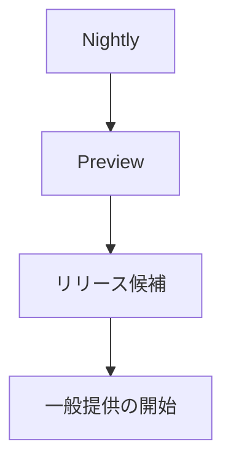

# 📘 S2J Docs Linter - プロジェクト横断のソフトウェア・サプライチェーン、リリース・ガバナンス

## リリース・エンジニアリング Specification

本書は、S2J Docs Linter プラットフォーム全体のリリース・エンジニアリングおよびソフトウェア・サプライチェーンを定義します。

本書の対象は、下記のコンポーネントです。

* @s2j/docs-linter
* @s2j/docs-linter-core
* @s2j/docs-linter-rest
* SDK ジェネレーター
* 生成される SDK
* 将来追加される、プラットフォーム・コンポーネント

本書は、各コンポーネントを横断するリリース・ガバナンスを定義します。

## 設計意図 (ゴール)

リリース・エンジニアリングは、下記を目的とします。

* 再現可能なリリース
* 監査可能なビルド
* サプライチェーン・セキュリティの確保
* 品質保証の自動化
* 「利用側」への安定提供

## リリース・マニフェスト

すべてのリリースは、マニフェストを持ちます。

マニフェストは、リリースを識別する唯一の情報源 (Single Source of Truth) とします。

### 必須プロパティ

| プロパティ | 説明 |
| --- | --- |
| releaseId | リリース ID |
| component | コンポーネント名 |
| version | リリース・バージョン |
| commit | Git コミット SHA |
| generatorVersion | ジェネレーター・バージョン |
| templateVersion | テンプレート・バージョン |
| buildId | CI ビルド ID |
| releasedAt | リリース・タイムスタンプ |

### ルール

リリース・マニフェストは、CI により自動生成します。

手動編集してはなりません。

## 来歴契約

すべての成果物は、来歴を持ちます。

### 必須来歴

* ソース・リポジトリ
* Git コミット
* ビルド・ワークフロー
* ビルド・ランナー
* ビルド・タイムスタンプ

### ルール

リリース成果物は、来歴を検証可能でなければなりません。

## 署名方針

公開する成果物は、署名可能でなければなりません。

### サポート対象メソッド

* npm 来歴
* JAR 署名
* NuGet 署名
* Composer 署名 (対応してる場合)

### ルール

署名情報は、パッケージ・メタデータに含めます。

## リリース・プロモーション

リリースは、段階的に昇格します。

### ライフサイクル



### ルール

各段階は、品質ゲートを通過しなければなりません。

## ホットフィックス方針

ホットフィックスは、緊急修正を目的とします。

### 条件

* セキュリティ課題
* 重大バグ
* データ破損

### ルール

ホットフィックスは、パッチ・バージョンとして公開します。

メジャー / マイナー・バージョンを変更してはなりません。

## リリース・ブランチ戦略

Git ブランチは、リリース戦略に従います。

### 標準ブランチ

```text
main
release/*
hotfix/*
feature/*
```

### ルール

リリースは、`release/*` または `main` から実施します。

## パッケージ検証

公開後にパッケージを検証します。

### 必須検証

* インストールの成功
* 依存関係の解決
* パッケージの完全性
* チェックサムの検証

下記は、パッケージ検証の例です。

* TypeScript の場合： `npm install` 
* PHP の場合： `composer install`
* Java の場合： `mvn dependency:get`

### ルール

パッケージ検証に失敗した場合は、リリースを停止します。

## 「利用側」互換性テスト

主要「利用側」との互換性を確認します。

### 標準「利用側」

* `WordPress`
* `Forwarder-PRO`
* `配配メール`

### 検証

* SDK インポート
* ビルド成功
* ランタイム・スモークテスト

### ルール

メジャー・バージョンのリリースでは、「利用側」互換性テストを必須とします。

## リリース KPI

リリースの品質を、継続的に評価します。

### 標準指標

* リリース頻度
* リリース成功率
* ビルド成功率
* ロールバック率
* 平均の復旧時間 (MTTR)
* セキュリティ脆弱性
* テスト・カバレッジ

### ルール

KPI は、継続的改善のために利用します。

## 横断的方針

### 品質ゲート

下記をすべて満たした場合のみ、リリースを許可します。

* ビルドに成功
* 契約テストに成功
* セキュリティ・スキャンに成功
* パッケージ検証に成功
* 「利用側」互換性に成功

### トレーサビリティ

リリースは、下記を追跡可能でなければなりません。

* コミット
* ビルド
* 成果物
* パッケージ
* 「利用側」

### 自動化 First

リリースは、CI/CD により自動実行します。

手動リリースは、緊急対応を除き禁止します。

## 完了条件

リリース・エンジニアリングは、下記を実装した時点で完成とみなします。

* リリース・マニフェスト
* 来歴契約
* 署名方針
* リリース・プロモーション
* ホットフィックス方針
* リリース・ブランチ戦略
* パッケージ検証
* 「利用側」互換性テスト
* リリース KPI
* 横断的方針
* ADR (アーキテクチャ決定記録)

## ADR (アーキテクチャ決定記録)

### ADR-REL-001

#### タイトル

* リリース・マニフェスト

#### 決定

* すべてのリリースは、マニフェストを持つ。

### ADR-REL-002

#### タイトル

* 検証済み来歴

#### 決定

* リリース成果物は、来歴を保持する。

### ADR-REL-003

#### タイトル

* 署名済み成果物

#### 決定

* 公開成果物は、署名可能とする。

### ADR-REL-004

#### タイトル

* プロモーション・パイプライン

#### 決定

* Nightly → Preview → RC → GA の昇格モデルを採用する。

### ADR-REL-005

#### タイトル

* 利用側 First 検証

#### 決定

* 主要「利用側」との互換性をリリース条件とする。
