# 📘 S2J Docs Linter - SDK ジェネレーター仕様

## 1. SDK ジェネレーター仕様

本書は、docs-linter SDK ジェネレーターの設計および実装契約を定義します。

SDK ジェネレーターは、OpenAPI 仕様を入力とし、各言語向け SDK を生成するジェネレーター・エンジンです。

ジェネレーターは、ドメイン契約および REST 契約を変更してはなりません。

## 2. 境界づけられたコンテキスト

### ジェネレーター・コンテキスト

SDK ジェネレーターは、独立した「境界づけられたコンテキスト」とします。

責務は、SDK の生成であり、SDK の利用やランタイム実行は責務に含めません。

### コンテキスト境界

#### 上流

* architecture.md
* core_api.md
* docs-linter-core.md
* docs-linter-rest.md
* OpenAPI 仕様

#### 下流

* TypeScript SDK
* PHP SDK
* Java SDK
* C# SDK

## 3. ジェネレーター・アーキテクチャ

ジェネレーターは、テンプレート・ベースのコード・ジェネレーターとします。

### コンポーネント

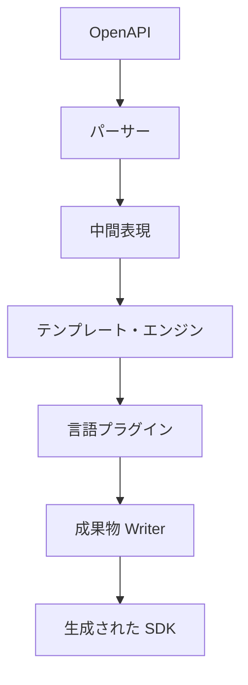

### 責務

#### パーサー

OpenAPI を解析し「中間表現」を生成します。

#### テンプレート・エンジン

中間表現をテンプレートに適用します。

#### 言語プラグイン

言語固有の構文・命名規則・パッケージ構成を提供します。

#### 成果物 Writer

生成成果物を、パッケージ構成として出力します。

## 4. ジェネレーター・パイプライン

### ライフサイクル

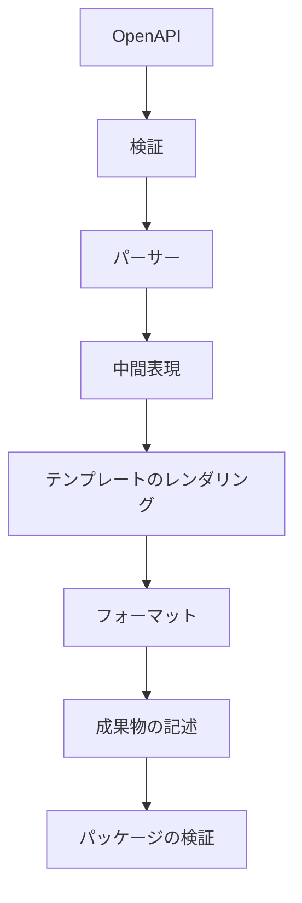

### パイプライン・ルール

各ステップは、独立してテスト可能でなければなりません。

## 5. 中間表現

ジェネレーターは、OpenAPI を直接テンプレートに渡してはなりません。

OpenAPI は、「中間表現」に変換します。

下記は、エンティティー例です。

* ApiModel
* EndpointModel
* OperationModel
* ParameterModel
* SchemaModel

### 目的

* 言語非依存
* 安定した内部モデル
* テンプレートの簡素化

### ルール

テンプレートは、「中間表現」のみを参照します。

## 6. テンプレート・エンジン

テンプレート・エンジンは、「中間表現」をレンダリングします。

### 責務

* ファイルのレンダリング
* 部分レンダリング
* テンプレートのコンポジション

### 拡張ポイント

* ヘルパー
* フィルター
* 部分テンプレート

### ルール

テンプレートは、ドメイン・ロジックを持ちません。

## 7. 契約

### ジェネレーター機能拡張の契約

SDK ジェネレーターは、プラグインにより拡張できます。

### SDK ジェネレーター契約

SDK ジェネレーターは、OpenAPI 仕様を入力とし、各言語向け SDK を生成します。

### ジェネレーター・テンプレート契約

SDK ジェネレーターは、言語ごとのテンプレートにより SDK を生成します。

### 言語マッピング契約

Core API 型を各言語に一貫して変換します。

### ジェネレーターのテスト契約

SDK ジェネレーターの品質保証を定義します。

### 言語プラグイン契約

各言語は、「言語プラグイン」として実装します。

### 成果物契約

ジェネレーターは、SDK と関連成果物を生成します。

### フォーマット契約

ジェネレーターは、生成後に「フォーマッター」を適用します。

### SDK コンパイラー契約

ジェネレーターは、OpenAPI 仕様を入力とし、言語非依存の「中間表現」を経由して各言語向け SDK を生成します。

### コンパイラー・ランタイム契約

コンパイラー・ランタイムは、OpenAPI 仕様を入力とし、決定論的なコード生成パイプラインを実行します。

### コンパイラー・パス契約

コンパイラーは、複数の「コンパイラー・パス」により構成します。

各パスは、独立した責務を持ち、順序に従って実行されます。

### 中間表現の変換契約

中間表現は、複数段階で変換できます。

### ジェネレーター機能契約

ジェネレーターは、自身の機能を公開します。

### 再現可能性ビルド契約

コンパイラーは、再現可能な成果物を生成します。

### ジェネレーター設定契約

ジェネレーターは、設定情報を「設定」として管理します。

設定は、生成コンテキストの一部として扱います。

### コンパイラー拡張ポイント契約

コンパイラーは、パイプラインごとに拡張ポイントを提供します。

### 成果物検証の契約

生成成果物は、検証を通過しなければなりません。

### テンプレート API 契約

テンプレートは、公開 API のみ利用できます。

### コンパイラー指標契約

コンパイラーは、実行状況を指標として公開します。

### 成果物のメタデータ契約

生成成果物には、メタデータを付与します。

## 8. 言語プラグイン

各言語は、「言語プラグイン」として実装します。

### 責務

* 命名規則
* 型のマッピング
* パッケージ・レイアウト
* Import ルール
* ビルド・スクリプト

### プラグイン・インターフェース

```text
LanguagePlugin
    ├─ TypeMapper
    ├─ NamingStrategy
    ├─ Formatter
    └─ PackageBuilder
```

### ルール

プラグインは、OpenAPI を直接解析してはなりません。

## 9. 成果物

ジェネレーターは、SDK と関連成果物を生成します。

### 生成される成果物

* SDK ソースコード
* README
* LICENSE
* パッケージのメタデータ
* ビルド・スクリプト
* 設定

### ルール

生成される成果物は、再生成可能でなければなりません。

## 10. フォーマット

ジェネレーターは、生成後に「フォーマッター」を適用します。

下記は、フォーマッター例です。

| 言語 | フォーマッター |
| --- | --- |
| TypeScript | Prettier |
| Java | google-java-format |
| PHP | PHP-CS-Fixer |
| C# | dotnet format |

### ルール

フォーマッターは、言語プラグインが提供します。

## 11. テンプレート・バージョニング

テンプレートは、独立してバージョン管理します。

### バージョニング

テンプレート・バージョンは、「ジェネレーター・バージョン」と独立して管理できます。

### 互換性

テンプレート・バージョンは、対応する「ジェネレーター・バージョン」を明示します。

## 12. インクリメンタル生成

ジェネレーターは、再生成時にユーザー・コードを保持します。

### カテゴリー

#### Generated

再生成の対象です。

#### Protected

ジェネレーターは、変更しません。

#### User

ユーザーが管理します。

### マージ戦略

`Generated` のみ再生成します。

## 13. ジェネレーター診断

ジェネレーターは、診断情報を提供します。

下記は、診断例です。

* Missing Template
* Unsupported Schema
* Unknown Data Type
* Invalid OpenAPI

### 重症度

* Info
* Warning
* Error

### ルール

ジェネレーター・エラーは、ビルド・エラーとして扱います。

## 14. アプリケーション・サービス

### GenerateSdkService

SDK を生成します。

### ValidateTemplateService

テンプレートを検証します。

### ValidateOpenApiService

OpenAPI を検証します。

### PublishArtifactService

成果物をパッケージとして出力します。

## 15. SDK マニフェスト

SDK は、自身のメタデータを公開しなければなりません。

マニフェストは、SDK の識別、診断、および互換性判定に利用します。

### マニフェスト例

```json
{
  "sdkName": "@s2j/docs-linter-sdk",
  "language": "typescript",
  "sdkVersion": "1.2.0",
  "apiVersion": "v1",
  "generatorVersion": "1.0.0",
  "generatedAt": "2027-01-01T00:00:00Z"
}
```

### 必須プロパティ

| プロパティ | 説明 |
| --- | --- |
| sdkName | SDK 名 |
| language | 対応言語 |
| sdkVersion | SDK バージョン |
| apiVersion | REST API バージョン |
| generatorVersion | ジェネレーター・バージョン |
| generatedAt | 生成日時 |

### 責務

マニフェストは、SDK ジェネレーターが生成します。

SDK ユーザーは、編集してはなりません。

## 16. ジェネレーターの互換性

SDK ジェネレーターと OpenAPI バージョンの互換性を管理します。

### 互換性マトリクス

| ジェネレーター | OpenAPI |
| --- | --- |
| 1.x | 3.0.x |
| 2.x | 3.1.x |

### ルール

ジェネレーターは、対応する OpenAPI バージョンのみ生成を保証します。

### 検証

CI は、ジェネレーターと OpenAPI バージョンの整合性を検証します。

## 17. SDK 機能フラグ

SDK は、自身が提供する機能を「機能フラグ」として公開できます。

機能フラグは、SDK の実装能力を表すものであり、ランタイム機能とは区別します。

下記は、機能フラグ例です。

```json
{
  "features": {
    "asyncJob": true,
    "batchValidation": true,
    "streaming": false,
    "telemetry": true
  }
}
```

### 利用法

機能フラグは、「利用側」が SDK の利用可否を判断するために利用します。

### ルール

機能フラグは、SDK バージョンに従って管理します。

## 18. SDK 非推奨

SDK の API 廃止手順を定義します。

### ライフサイクル

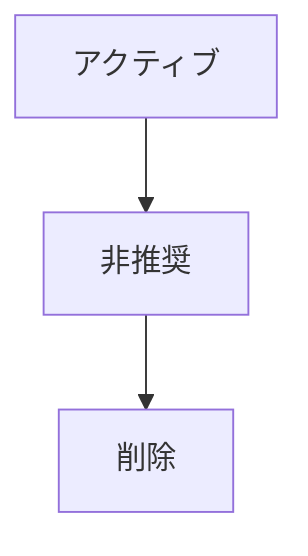

### メジャー・ルール

非推奨 API は、少なくとも1メジャー・バージョンの維持を推奨します。

### ドキュメント

非推奨 API には、下記を記載します。

* 廃止理由
* 推奨 API
* 廃止予定バージョン

### 利用側ガイダンス

移行ガイドを提供しなければなりません。

## 19. ジェネレーター機能拡張

SDK ジェネレーターは、プラグインにより拡張できます。

### 機能拡張ポイント

* 言語ジェネレーター
* テンプレート・エンジン
* Serializer ジェネレーター
* 認証ジェネレーター
* ドキュメント・ジェネレーター

### 機能拡張の契約

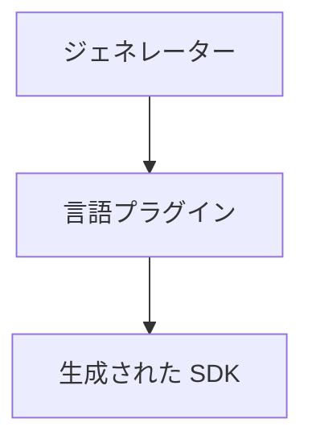

### 設計ルール

ジェネレーター・プラグインは、下記を変更してはなりません。

* Core API 契約
* REST 契約
* OpenAPI 契約

### 責務

ジェネレーター・プラグインは、下記を担当します。

* 言語固有コード生成
* パッケージ構成
* ビルド・スクリプト
* ドキュメント・テンプレート

## 20. プロダクト・ライフサイクル

### ライフサイクル

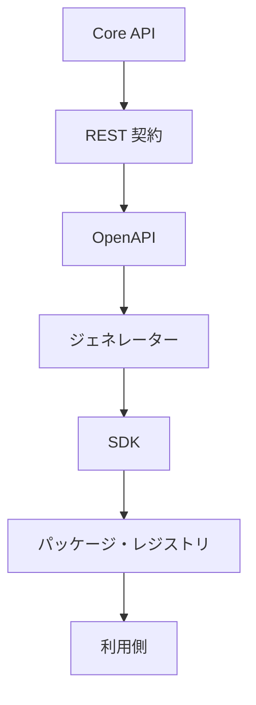

### リリース・フロー

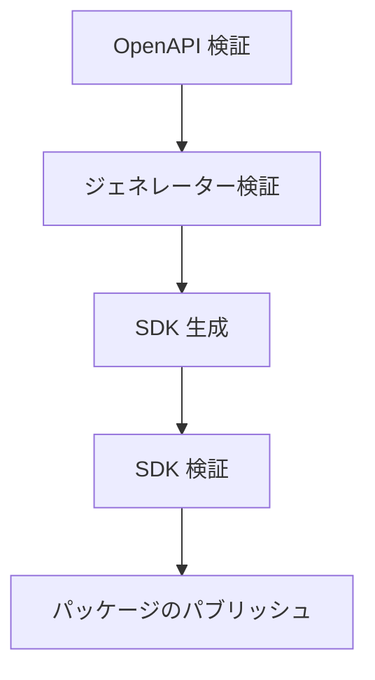

## 21. SDK ジェネレーター

本章は、docs-linter SDK ジェネレーターの契約を定義します。

SDK ジェネレーターは、OpenAPI 仕様を入力とし、各言語向け SDK を生成します。

ジェネレーターは、ドメイン契約および REST 契約を変更してはなりません。

## 22. ジェネレーター・テンプレート

SDK ジェネレーターは、言語ごとのテンプレートにより SDK を生成します。

テンプレートは、ジェネレーターの拡張ポイントであり、Core API 契約には影響を与えません。

### テンプレート構造

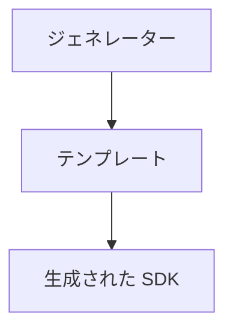

### 必須テンプレート

* API クライアント
* DTO
* エラー
* 設定
* 認証
* パッケージ・メタデータ

### 設計ルール

テンプレートは、下記を変更してはなりません。

* REST エンドポイント
* DTO スキーマ
* エラー契約
* バージョン契約

テンプレートは、プレゼンテーションのみ変更できません。

## 23. 言語マッピング

Core API 型を各言語に一貫して変換します。

### 初期マッピング

| Core | TypeScript | Java | PHP | C# |
| --- | --- | --- | --- | --- |
| string | string | String | string | string |
| integer | number | Integer | int | int |
| boolean | boolean | Boolean | bool | bool |
| datetime | Date | Instant | DateTimeImmutable | DateTimeOffset |
| uuid | string | UUID | string | Guid |

### コレクション・マッピング

| Core | TypeScript | Java | PHP |
| --- | --- | --- | --- |
| List | Array | List | array |
| Map | Record | Map | array |

### ルール

言語マッピングは、ジェネレーター・バージョンごとに管理します。

## 24. コード生成の方針

ジェネレーターは、生成コードとユーザー・コードを分離します。

### カテゴリー

#### 生成されたコード

毎回再生成されます。

生成されたコード例は、`generated/` です。

#### 保護されたコード

ジェネレーターは、変更しません。

保護されたコード例は、`custom/` です。

#### 設定

ユーザーが編集可能です。

設定例は、`configuration/` です。

### ルール

生成されたコードを、手動編集してはなりません。

### マージ戦略

再生成時は、生成されたコードのみ上書きします。

保護されたコードは、保持します。

## 25. SDK のセマンティック互換性

SDK は、セマンティック・バージョニングに従います。

### 互換性ルール

#### パッチ

* バグ修正
* 内部の改善

#### マイナー

* 新 API
* 後方互換性

#### メジャー

* 破壊的変更

### メソッドの互換性

下記は、メジャー・バージョンのみ許可します。

* メソッド・シグネチャの変更
* パラメータの削除
* 戻り値の型の変更

### DTO 互換性

任意フィールドの追加は、マイナー・バージョンとします。

必須フィールドの追加は、メジャー・バージョンとします。

## 26. ジェネレーターのテスト

SDK ジェネレーターの品質保証を定義します。

### 必須テスト

#### テンプレート・テスト

* テンプレートが、正常に展開できること。

#### スナップショット・テスト

* 生成結果が、期待値と一致すること。

#### ゴールデンファイル・テスト

* 生成コードが、既知の成果物と一致すること。

#### ビルド・テスト

* 生成 SDK が、正常にビルドできること。

#### 契約テスト

* 生成 SDK が、OpenAPI 契約に準拠すること。

#### 回帰テスト

* ジェネレーター更新により既存 SDK が、破壊されないこと。

### CI 要件

ジェネレーターの変更時は、下記を必須とします。

* テンプレート・テスト
* スナップショット・テスト
* ビルド・テスト
* 契約テスト

## 27. ジェネレーターのライフサイクル

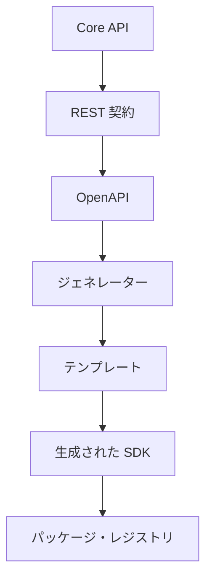

## 28. ジェネレーターの責務

ジェネレーターは、下記を担当します。

* SDK 生成
* 言語マッピング
* テンプレートの展開
* パッケージ・メタデータの生成

## 29. ジェネレーターの非責務

ジェネレーターは、下記を担当しません。

* ドメイン・ロジック
* ランタイム検証
* REST 契約の定義

## 30. SDK コンパイラー

本章は、SDK ジェネレーターを「コンパイラー・エンジン」として定義します。

ジェネレーターは、OpenAPI 仕様を入力とし、言語非依存の「中間表現」を経由して各言語向け SDK を生成します。

ジェネレーターは、決定論的 (deterministic) なコンパイラーとして動作し、同一入力から常に同一成果物を生成しなければなりません。

## 31. ジェネレーター・マニフェスト

ジェネレーターは、自身の構成情報を「マニフェスト」として公開します。

マニフェストは、ジェネレーターの診断、互換性判定、およびビルド・パイプラインに利用します。

### 必須プロパティ

| プロパティ | 説明 |
| --- | --- |
| generatorName | ジェネレーター名 |
| generatorVersion | ジェネレーター・バージョン |
| compilerVersion | コンパイラー・エンジン・バージョン |
| templateVersion | テンプレート・バージョン |
| supportedOpenApi | 対応 OpenAPI バージョン |
| generatedAt | 生成日時 |

### ルール

マニフェストは、ジェネレーターが自動生成します。

ユーザーが編集してはなりません。

## 32. 生成コンテキスト

ジェネレーターは、「生成コンテキスト」を入力として動作します。

コンテキストは、生成対象ランタイムを表します。

### コンテキスト・コンポーネント

```text
生成コンテキスト
    ├─ OpenAPI 仕様
    ├─ 対象言語
    ├─ 対象ランタイム
    ├─ 対象プラットフォーム
    ├─ 設定
    └─ ジェネレーター・マニフェスト
```

### 例

#### TypeScript Browser

* 言語： TypeScript
* ランタイム： Browser
* パッケージ： npm

#### Java Spring

* 言語： Java
* ランタイム： JVM
* パッケージ： Maven

#### PHP

* 言語： PHP
* ランタイム： PHP v8.x
* パッケージ： Composer

## 33. テンプレート解決戦略

ジェネレーターは、「生成コンテキスト」に応じてテンプレートを選択します。

下記は、解決フローの例です。

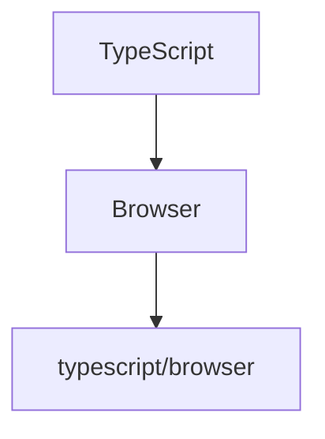

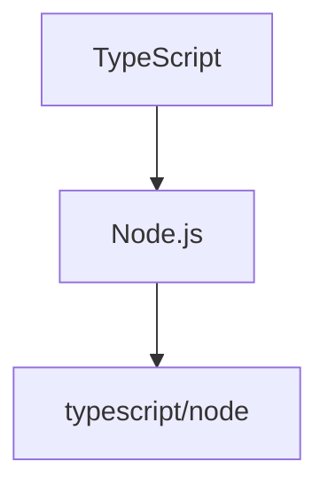

### 解決フロー

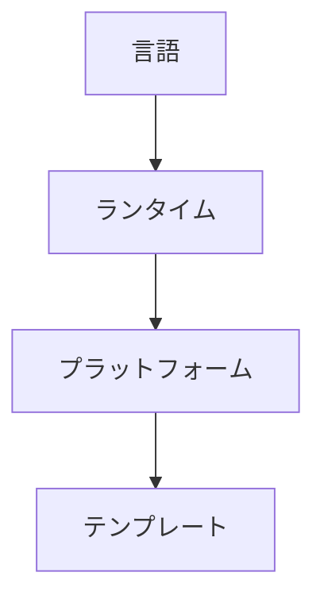

### ルール

テンプレート解決は、決定論的 (deterministic) でなければなりません。

## 34. プラグイン検出

ジェネレーターは、言語プラグインを動的に検出できます。

### 検出方法

* 静的レジストリ
* パッケージ検出
* サービスローダー

### プラグイン・メタデータ

プラグインは、下記を公開します。

* プラグイン名称
* プラグイン・バージョン
* サポート対象言語
* サポート対象ランタイム
* サポート対象テンプレート・バージョン

### ルール

プラグイン検出は、Core API 契約を変更してはなりません。

## 35. 決定論的な生成

同一入力からは、常に同一成果物を生成します。

### 決定論的 (deterministic) な入力

* OpenAPI
* 設定
* テンプレート・バージョン
* ジェネレーター・バージョン
* プラグイン・バージョン

### ルール

現在時刻、乱数、実行順序などによって生成結果が変化してはなりません。

### 目的

「決定論的な生成」により、下記を保証します。

* 再現可能なビルド
* 差分レビューの容易化
* CI の安定性

## 36. 成果物の依存関係グラフ

ジェネレーターは、成果物間の依存関係を管理します。

### 依存関係グラフ

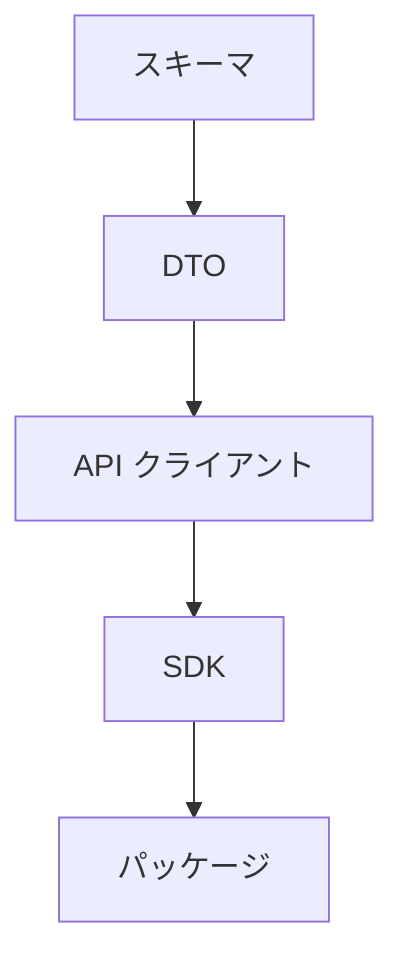

### ルール

依存先は、依存元より先に生成します。

循環依存を禁止します。

## 37. 並列生成

依存関係が存在しない成果物は、並列生成できます。

### 並列ターゲット

* DTO
* ドキュメント
* 設定
* README

### ルール

並列生成しても、「決定論的な生成」を維持しなければなりません。

## 38. テンプレート互換性

テンプレート・バージョンは、ジェネレーター・バージョンと独立して管理します。

### 互換性マトリクス

| ジェネレーター | テンプレート |
| --- | --- |
| 1.x | 1.x |
| 2.x | 2.x |

### ルール

互換性のないテンプレートを使用してはなりません。

ジェネレーターは、互換性を検証しなければなりません。

## 39. ジェネレーター・パフォーマンス

ジェネレーターは、一定以上の性能を維持します。

### パフォーマンス目標

* 段階的生成を優先する。
* 不要なテンプレートのレンダリングを避ける。
* 言語プラグインの初期化を最小限とする。

### 指標

下記は、測定対象の例です。

* Parse Time
* Render Time
* Generation Time
* Formatting Time

## 40. ジェネレーターの可観測性

ジェネレーターは、診断情報を提供します。

### ログ記録

下記を記録できます。

* Generation Start
* Generation Finish
* Template Selection
* Plugin Resolution
* Error

### 指標

* Generated Files
* Render Count
* Plugin Count
* Cache Hit Rate

### トレース

各パイプライン・ステップをトレースとして記録できます。

### ルール

可観測性は、ジェネレーターの動作を変更してはなりません。

## 41. コンパイラー・ランタイム

本章は、SDK ジェネレーターの「コンパイラー・ランタイム」を定義します。

コンパイラー・ランタイムは、OpenAPI 仕様を入力とし、決定論的なコード生成パイプラインを実行します。

本章では、コンパイラー・パス、中間表現の変換、キャッシュ、プラグイン・ライフサイクル、およびビルドの再現性を定義します。

## 42. コンパイラー・パス

コンパイラーは、複数の「コンパイラー・パス」により構成します。

各パスは、独立した責務を持ち、順序に従って実行されます。

### 標準パス

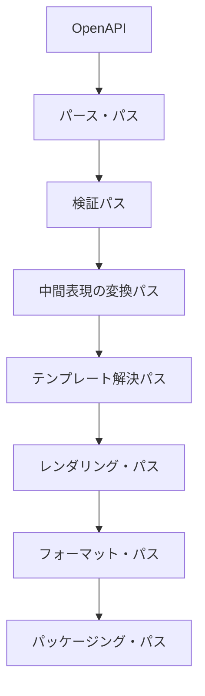

### 設計ルール

各パスは、単一責務とします。

パスは、他パスの内部状態に依存してはなりません。

### 拡張

コンパイラー・パスは、追加可能とします。

追加パスは、既存パスを変更してはなりません。

## 43. 中間表現の変換

中間表現は、複数段階で変換できます。

### 変換フロー

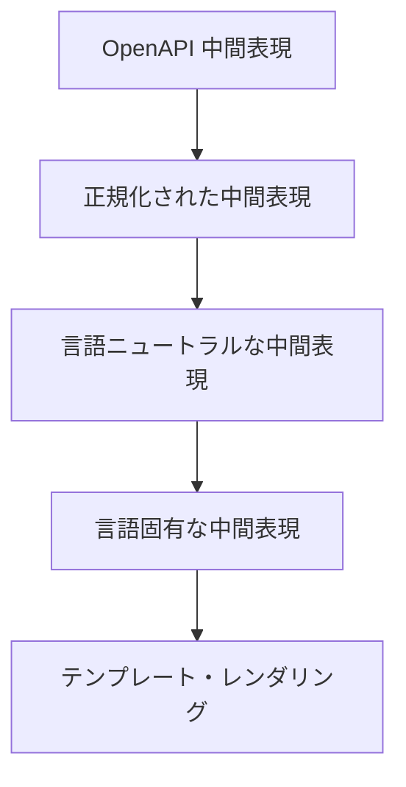

### 目的

* OpenAPI 差異の吸収
* テンプレートの簡素化
* 言語プラグインの責務分離

### ルール

変換は、可逆性を要求しません。

各変換は、決定論的 (deterministic) でなければなりません。

## 44. キャッシュ戦略

コンパイラーは、再利用可能な情報をキャッシュできます。

### キャッシュ対象

* パースされた OpenAPI
* 中間表現
* テンプレート
* 言語プラグイン
* フォーマッター

### キャッシュ方針

* 最後まで読む
* 遅延ロード
* 明示的な無効化

### ルール

キャッシュは、生成結果に影響してはなりません。

キャッシュ・ミスとキャッシュ・ヒットは、同一成果物を生成しなければなりません。

## 45. ジェネレーター機能

ジェネレーターは、自身の機能を公開します。

### 機能例

```text
supportsParallelGeneration
supportsIncrementalGeneration
supportsSnapshotTest
supportsTemplateVersioning
supportsPluginDiscovery
```

### 利用法

機能は、CI や IDE がジェネレーターの利用可否を判断するために利用します。

### ルール

機能は、ジェネレーター・バージョンごとに管理します。

## 46. 機能拡張ライフサイクル

言語プラグインは、ライフサイクルを持ちます。

### ライフサイクル

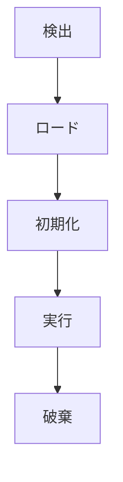

### 責務

#### ロード

プラグインをロードします。

#### 初期化

ジェネレーター・コンテキストを受け取ります。

#### 実行

テンプレート・レンダリングを実施します。

#### 破棄

リソースを解放します。

### ルール

破棄は、必ず実行されなければなりません。

## 47. リソース管理

コンパイラー・ランタイムは、リソースを管理します。

### マネージド・リソース

* テンプレート
* プラグイン
* フォーマッター
* キャッシュ
* ファイル・ハンドル

### 戦略

* 遅延ロード
* 参照カウント
* 明示的な解放

### ルール

リソース・リークを発生させてはなりません。

## 48. コンパイラー・エラー分類

コンパイラー・エラーは、種類ごとに分類します。

### カテゴリー

#### パース・エラー

OpenAPI を解析できません。

#### 検証エラー

OpenAPI が契約に違反します。

#### 中間表現エラー

中間表現を生成できません。

#### テンプレート・エラー

テンプレート・レンダリングに失敗しました。

#### プラグイン・エラー

言語プラグインが失敗しました。

#### フォーマット・エラー

フォーマッターに失敗しました。

#### パッケージング・エラー

パッケージを生成できません。

### 重症度

* Info
* Warning
* Error
* Fatal

### ルール

致命的なエラーは、パイプラインを中断します。

## 49. 再現可能性ビルド

コンパイラーは、再現可能な成果物を生成します。

### 基本原則

同一入力から、同一成果物を生成します。

### 必須条件

* ファイル順序の固定
* 安定版のテンプレート・バージョン
* 安定版のジェネレーター・バージョン
* 安定版のプラグイン・バージョン
* 安定版のフォーマッター・バージョン

### 禁止

* 現在時刻の埋め込み
* 乱数利用
* 非決定的な並列処理

### 目的

* CI の安定化
* 差分レビューの容易化
* リリースの再現性

## 50. コンパイラー・プラットフォーム・ガバナンス

本章は、SDK ジェネレーターの「コンパイラー・プラットフォーム」を運用するための契約を定義します。

コンパイラー・プラットフォームは、OpenAPI 仕様を入力とし、再現可能かつ検証可能な SDK を生成します。

本章では、設定、拡張、検証、互換性、およびアップグレード方針を定義します。

## 51. ジェネレーター設定

ジェネレーターは、設定情報を「設定」として管理します。

設定は、生成コンテキストの一部として扱います。

### 設定モデル

```yaml
generator:
  language: typescript
  runtime: browser
  template: default
  formatter: prettier
  output: ./generated
```

### 設定ソース

優先順位は、下記の通りとします。

1. コマンドライン・オプション
2. 設定ファイル
3. 環境変数
4. デフォルト値

### ルール

設定解決は、決定論的 (deterministic) でなければなりません。

## 52. コンパイラー拡張ポイント

コンパイラーは、パイプラインごとに拡張ポイントを提供します。

### 標準拡張ポイント

```text
BeforeParse
AfterParse
BeforeTransform
AfterTransform
BeforeRender
AfterRender
BeforePackage
AfterPackage
```

### ルール

拡張は、コンパイラー・パスを置き換えてはなりません。

拡張は、追加処理のみ許可します。

### 順序付け

拡張は、優先度順に実行します。

## 53. 成果物検証

生成成果物は、検証を通過しなければなりません。

### 検証の対象

* ソースコード
* パッケージのメタデータ
* ビルド・スクリプト
* 生成されるドキュメント

### 検証ルール

* ビルド成功
* フォーマッター適用
* OpenAPI 互換性
* テンプレート互換性

### ルール

検証失敗は、リリースを禁止します。

## 54. テンプレート API

テンプレートは、公開 API のみ利用できます。

### 標準 API

* `resolveType()`
* `resolveImport()`
* `renderModel()`
* `renderOperation()`
* `renderSchema()`

### ルール

テンプレートは、ジェネレーター内部実装に依存してはなりません。

### 安定性

テンプレート API は、マイナー・バージョンで後方互換性を維持します。

## 55. ジェネレーター互換性方針

ジェネレーター自体の互換性を管理します。

### 互換性の対象

* OpenAPI バージョン
* テンプレート・バージョン
* プラグイン・バージョン
* SDK バージョン

### 互換性マトリクス

| ジェネレーター | OpenAPI | テンプレート |
| --- | --- | --- |
| 1.x | 3.0 | 1.x |
| 2.x | 3.1 | 2.x |

### ルール

互換性のない構成では、生成実行してはなりません。

## 56. コンパイラー指標

コンパイラーは、実行状況を指標として公開します。

### 標準指標

* Parse Time
* Validation Time
* Render Time
* Generation Time
* Formatting Time

### 運用指標

* Generated Files
* Generated Lines
* Cache Hit Rate
* Plugin Count

### ルール

指標は、コンパイラーの動作を変更してはなりません。

## 57. 成果物のメタデータ

生成成果物には、メタデータを付与します。

下記は、メタデータの付与例です。

```text
Generated by S2J SDK Generator
Generator Version: 1.0.0
Template Version: 1.2.0
OpenAPI Version: 3.1
```

### 必須メタデータ

* ジェネレーター・バージョン
* テンプレート・バージョン
* OpenAPI バージョン
* 生成されたタイムスタンプ
* 言語プラグイン・バージョン

### ルール

メタデータは、トレーサビリティのために保持します。

## 58. ジェネレーターのアップグレード方針

ジェネレーターの更新方針を定義します。

### アップグレード対象

* ジェネレーター
* テンプレート
* プラグイン
* フォーマッター

### アップグレード原則

* 後方互換性 First
* 詳細な移行ガイド
* インクリメンタル・アップグレード

### 必須成果物

ジェネレーターのアップグレードでは、下記を提供します。

* 移行ガイド
* 互換性マトリクス
* 破壊的変更
* アップグレード例

### ルール

メジャー・バージョン更新では、移行ガイドを必須とします。

## 59. 完了条件

SDK プロダクト管理は、下記を実装した時点で完成とみなします。

* SDK マニフェスト
* ジェネレーターの互換性
* SDK 機能フラグ
* SDK 非推奨契約
* ジェネレーター機能拡張の契約
* プロダクト・ライフサイクル
* SDK プロダクト管理 ADR (アーキテクチャ決定記録)

SDK ジェネレーターは、下記を実装した時点で完成とみなします。

* ジェネレーター・アーキテクチャ
* ジェネレーター・パイプライン
* 中間表現
* テンプレート・エンジン
* 言語プラグイン契約
* 成果物契約
* フォーマット契約
* テンプレート・バージョニング
* インクリメンタル生成
* ジェネレーター診断
* アプリケーション・サービス
* ADR (アーキテクチャ決定記録)
* ジェネレーター・テンプレート契約
* 言語マッピング契約
* コード生成の方針
* SDK のセマンティック互換性
* ジェネレーターのテスト契約
* ジェネレーターのライフサイクル
* ジェネレーターの責務
* SDK ジェネレーター ADR (アーキテクチャ決定記録)

SDK コンパイラーは、下記を実装した時点で完成とみなします。

* ジェネレーター・マニフェスト
* 生成コンテキスト
* テンプレート解決戦略
* プラグイン検出
* 決定論的な生成
* 成果物の依存関係グラフ
* 並列生成
* テンプレート互換性
* ジェネレーター・パフォーマンス
* ジェネレーターの可観測性
* SDK コンパイラー ADR (アーキテクチャ決定記録)

コンパイラー・ランタイムは、下記を実装した時点で完成とみなします。

* コンパイラー・パス契約
* 中間表現の変換契約
* キャッシュ戦略
* ジェネレーター機能契約
* 機能拡張ライフサイクル
* リソース管理
* コンパイラー・エラー分類
* 再現可能性ビルド契約
* コンパイラー・ランタイム ADR (アーキテクチャ決定記録)

コンパイラー・プラットフォーム・ガバナンスは、下記を実装した時点で完成とみなします。

* ジェネレーター設定契約
* コンパイラー拡張ポイント契約
* 成果物検証の契約
* テンプレート API 契約
* ジェネレーター互換性方針
* コンパイラー指標契約
* 成果物のメタデータ契約
* ジェネレーターのアップグレード方針
* コンパイラー・プラットフォーム・ガバナンス ADR (アーキテクチャ決定記録)

## 60. SDK プロダクト管理 ADR (アーキテクチャ決定記録)

### ADR-SDK-016

#### タイトル

* SDK マニフェスト

#### 決定

* SDK は、自身のメタデータを「マニフェスト」として公開する。

### ADR-SDK-017

#### タイトル

* ジェネレーターの互換性

#### 決定

* ジェネレーターは、対応する OpenAPI バージョンのみ生成を保証する。

### ADR-SDK-018

#### タイトル

* 機能フラグの公開

#### 決定

* SDK は、自身の実装能力を「機能フラグ」として公開する。

### ADR-SDK-019

#### タイトル

* 明示的な非推奨

#### 決定

* SDK API は、明示的な非推奨ライフサイクルに従う。

### ADR-SDK-020

#### タイトル

* ジェネレーター・プラグイン

#### 決定

* SDK ジェネレーターは、プラグインにより拡張できる。
* ジェネレーター・プラグインは、Core API 契約を変更してはならない。

## 61. SDK ジェネレーター ADR (アーキテクチャ決定記録)

### ADR-SDK-021

#### タイトル

* テンプレート駆動生成

#### 決定

* SDK は、テンプレートにより生成する。

### ADR-SDK-022

#### タイトル

* 安定した言語マッピング

#### 決定

* 言語マッピングは、バージョンごとに固定する。

### ADR-SDK-023

#### タイトル

* 保護されたユーザー・コード

#### 決定

* ジェネレーターは、ユーザー・コードを上書きしない。

### ADR-SDK-024

#### タイトル

* セマンティック互換性

#### 決定

* SDK の互換性は、セマンティック・バージョニングに従う。

### ADR-SDK-025

#### タイトル

* ジェネレーターの品質 First

#### 決定

* ジェネレーターの変更は、契約テストおよびスナップショット・テストを通過しなければならない。

## 62. ADR (アーキテクチャ決定記録)

### ADR-GEN-001

* ジェネレーターは、「中間表現」を採用する。

### ADR-GEN-002

* テンプレートは、ドメイン・ロジックを保持しない。

### ADR-GEN-003

* 言語の固有実装は、「プラグイン」とする。

### ADR-GEN-004

* ジェネレーターは、「インクリメンタル生成」をサポートする。

### ADR-GEN-005

* テンプレート・バージョンは、ジェネレーター・バージョンと独立管理する。


## 63. SDK コンパイラー ADR (アーキテクチャ決定記録)

### ADR-GEN-006

#### タイトル

* 生成コンテキスト

#### 決定

* ジェネレーターは、「生成コンテキスト」を入力とする。

### ADR-GEN-007

#### タイトル

* 決定論的 (deterministic) なコンパイラー

#### 決定

* 同一入力から、常に同一成果物を生成する。

### ADR-GEN-008

#### タイトル

* 中間表現 First

#### 決定

* テンプレートは、中間表現のみを参照する。

### ADR-GEN-009

#### タイトル

* 「依存関係」駆動型生成

#### 決定

* 成果物は、依存関係グラフに従って生成する。

### ADR-GEN-010

#### タイトル

* オブザーバブル・ジェネレーター

#### 決定

* ジェネレーターは、ログ記録、指標、およびトレースを提供する。

## 64. コンパイラー・ランタイム ADR (アーキテクチャ決定記録)

### ADR-GEN-011

#### タイトル

* パスベースのコンパイラー

#### 決定

* コンパイラーは、独立したパスにより構成する。

### ADR-GEN-012

#### タイトル

* 中間表現の多段変換

#### 決定

* 中間表現は、多段変換を許可する。

### ADR-GEN-013

#### タイトル

* 決定論的 (deterministic) なキャッシュ

#### 決定

* キャッシュは、生成結果を変更してはならない。

### ADR-GEN-014

#### タイトル

* プラグイン・ライフサイクル

#### 決定

* 言語プラグインは、ライフサイクルに従う。

### ADR-GEN-015

#### タイトル

* 再現可能性ビルド

#### 決定

* コンパイラーは、再現可能な成果物を生成する。

## 65. コンパイラー・プラットフォーム・ガバナンス ADR (アーキテクチャ決定記録)

### ADR-GEN-016

#### タイトル

* 生成コンテキストとしての設定

#### 決定

* 設定は、生成コンテキストの一部として扱う。

### ADR-GEN-017

#### タイトル

* コンパイラー拡張ポイント

#### 決定

* 拡張は、パイプライン・フックにより提供する。

### ADR-GEN-018

#### タイトル

* 成果物検証 First

#### 決定

* 検証失敗は、リリースを禁止する。

### ADR-GEN-019

#### タイトル

* 安定版のテンプレート API

#### 決定

* テンプレートは、公開 API のみ利用する。

### ADR-GEN-020

#### タイトル

* コンパイラー互換性

#### 決定

* ジェネレーターは、互換性マトリクスを管理する。
