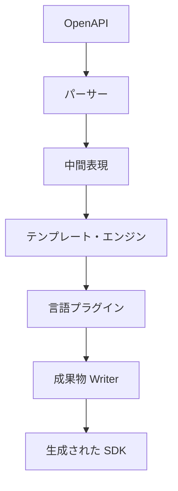
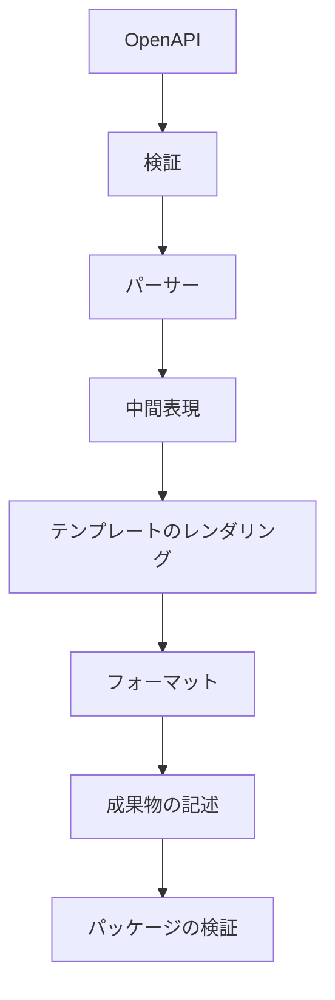
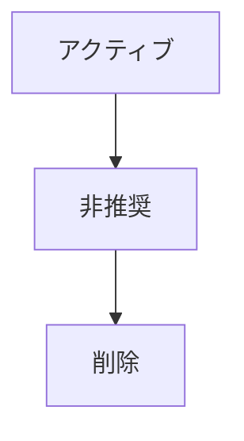
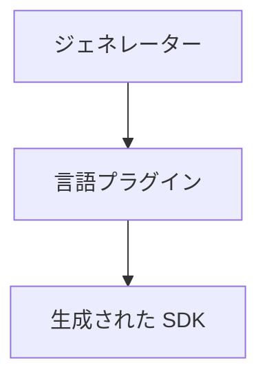
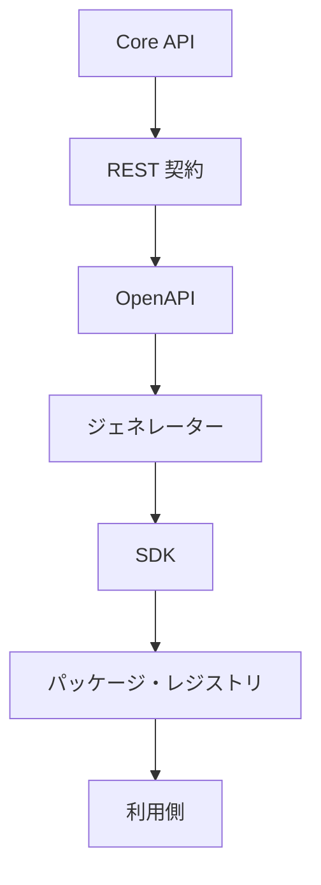
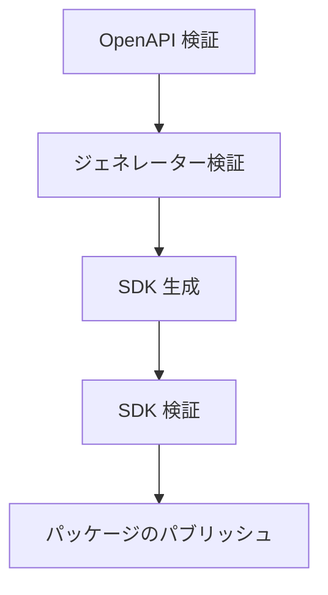
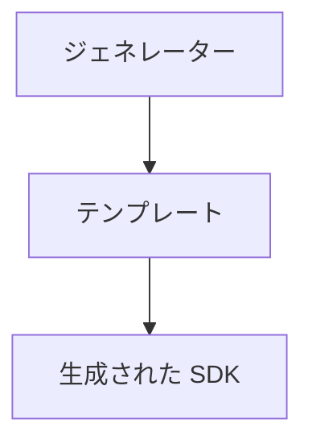
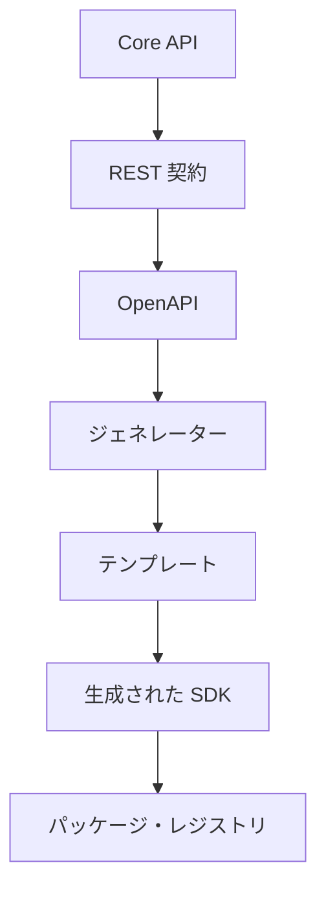

# 📘 S2J Docs Linter - SDK ジェネレーター仕様

## 1. SDK ジェネレーター仕様

本書は、docs-linter SDK ジェネレーターの設計および実装契約を定義します。

SDK ジェネレーターは、OpenAPI 仕様を入力とし、各言語向け SDK を生成するジェネレーター・エンジンです。

ジェネレーターは、ドメイン契約および REST 契約を変更してはなりません。

## 2. 境界づけられたコンテキスト

### ジェネレーター・コンテキスト

SDK ジェネレーターは、独立した「境界づけられたコンテキスト」とします。

責務は、SDK の生成であり、SDK の利用やランタイム実行は責務に含めません。

### コンテキスト境界

#### 上流

* architecture.md
* core_api.md
* docs-linter-core.md
* docs-linter-rest.md
* OpenAPI 仕様

#### 下流

* TypeScript SDK
* PHP SDK
* Java SDK
* C# SDK

## 3. ジェネレーター・アーキテクチャ

ジェネレーターは、テンプレート・ベースのコード・ジェネレーターとします。

### コンポーネント



### 責務

#### パーサー

OpenAPI を解析し「中間表現」を生成します。

#### テンプレート・エンジン

中間表現をテンプレートに適用します。

#### 言語プラグイン

言語固有の構文・命名規則・パッケージ構成を提供します。

#### 成果物 Writer

生成成果物を、パッケージ構成として出力します。

## 4. ジェネレーター・パイプライン

### ライフサイクル



### パイプライン・ルール

各ステップは、独立してテスト可能でなければなりません。

## 5. 中間表現

ジェネレーターは、OpenAPI を直接テンプレートに渡してはなりません。

OpenAPI は、「中間表現」に変換します。

下記は、エンティティー例です。

* ApiModel
* EndpointModel
* OperationModel
* ParameterModel
* SchemaModel

### 目的

* 言語非依存
* 安定した内部モデル
* テンプレートの簡素化

### ルール

テンプレートは、「中間表現」のみを参照します。

## 6. テンプレート・エンジン

テンプレート・エンジンは、「中間表現」をレンダリングします。

### 責務

* ファイルのレンダリング
* 部分レンダリング
* テンプレートのコンポジション

### 拡張ポイント

* ヘルパー
* フィルター
* 部分テンプレート

### ルール

テンプレートは、ドメイン・ロジックを持ちません。

## 7. 契約

### ジェネレーター機能拡張の契約

SDK ジェネレーターは、プラグインにより拡張できます。

### SDK ジェネレーター契約

SDK ジェネレーターは、OpenAPI 仕様を入力とし、各言語向け SDK を生成します。

### ジェネレーター・テンプレート契約

SDK ジェネレーターは、言語ごとのテンプレートにより SDK を生成します。

### 言語マッピング契約

Core API 型を各言語に一貫して変換します。

### ジェネレーターのテスト契約

SDK ジェネレーターの品質保証を定義します。

### 言語プラグイン契約

各言語は、「言語プラグイン」として実装します。

### 成果物契約

ジェネレーターは、SDK と関連成果物を生成します。

### フォーマット契約

ジェネレーターは、生成後に「フォーマッター」を適用します。

## 8. 言語プラグイン

各言語は、「言語プラグイン」として実装します。

### 責務

* 命名規則
* 型のマッピング
* パッケージ・レイアウト
* Import ルール
* ビルド・スクリプト

### プラグイン・インターフェース

```text
LanguagePlugin
    ├─ TypeMapper
    ├─ NamingStrategy
    ├─ Formatter
    └─ PackageBuilder
```

### ルール

プラグインは、OpenAPI を直接解析してはなりません。

## 9. 成果物

ジェネレーターは、SDK と関連成果物を生成します。

### 生成される成果物

* SDK ソースコード
* README
* LICENSE
* パッケージのメタデータ
* ビルド・スクリプト
* 設定

### ルール

生成される成果物は、再生成可能でなければなりません。

## 10. フォーマット

ジェネレーターは、生成後に「フォーマッター」を適用します。

下記は、フォーマッター例です。

| 言語 | フォーマッター |
| --- | --- |
| TypeScript | Prettier |
| Java | google-java-format |
| PHP | PHP-CS-Fixer |
| C# | dotnet format |

### ルール

フォーマッターは、言語プラグインが提供します。

## 11. テンプレート・バージョニング

テンプレートは、独立してバージョン管理します。

### バージョニング

テンプレート・バージョンは、「ジェネレーター・バージョン」と独立して管理できます。

### 互換性

テンプレート・バージョンは、対応する「ジェネレーター・バージョン」を明示します。

## 12. インクリメンタル生成

ジェネレーターは、再生成時にユーザー・コードを保持します。

### カテゴリー

#### Generated

再生成の対象です。

#### Protected

ジェネレーターは、変更しません。

#### User

ユーザーが管理します。

### マージ戦略

`Generated` のみ再生成します。

## 13. ジェネレーター診断

ジェネレーターは、診断情報を提供します。

下記は、診断例です。

* Missing Template
* Unsupported Schema
* Unknown Data Type
* Invalid OpenAPI

### 重症度

* Info
* Warning
* Error

### ルール

ジェネレーター・エラーは、ビルド・エラーとして扱います。

## 14. アプリケーション・サービス

### GenerateSdkService

SDK を生成します。

### ValidateTemplateService

テンプレートを検証します。

### ValidateOpenApiService

OpenAPI を検証します。

### PublishArtifactService

成果物をパッケージとして出力します。

## 15. SDK マニフェスト

SDK は、自身のメタデータを公開しなければなりません。

マニフェストは、SDK の識別、診断、および互換性判定に利用します。

### マニフェスト例

```json
{
  "sdkName": "@s2j/docs-linter-sdk",
  "language": "typescript",
  "sdkVersion": "1.2.0",
  "apiVersion": "v1",
  "generatorVersion": "1.0.0",
  "generatedAt": "2027-01-01T00:00:00Z"
}
```

### 必須プロパティ

| プロパティ | 説明 |
| --- | --- |
| sdkName | SDK 名 |
| language | 対応言語 |
| sdkVersion | SDK バージョン |
| apiVersion | REST API バージョン |
| generatorVersion | ジェネレーター・バージョン |
| generatedAt | 生成日時 |

### 責務

マニフェストは、SDK ジェネレーターが生成します。

SDK ユーザーは、編集してはなりません。

## 16. ジェネレーターの互換性

SDK ジェネレーターと OpenAPI バージョンの互換性を管理します。

### 互換性マトリックス

| ジェネレーター | OpenAPI |
| --- | --- |
| 1.x | 3.0.x |
| 2.x | 3.1.x |

### ルール

ジェネレーターは、対応する OpenAPI バージョンのみ生成を保証します。

### 検証

CI は、ジェネレーターと OpenAPI バージョンの整合性を検証します。

## 17. SDK 機能フラグ

SDK は、自身が提供する機能を「機能フラグ」として公開できます。

機能フラグは、SDK の実装能力を表すものであり、ランタイム機能とは区別します。

下記は、機能フラグ例です。

```json
{
  "features": {
    "asyncJob": true,
    "batchValidation": true,
    "streaming": false,
    "telemetry": true
  }
}
```

### 利用法

機能フラグは、「利用側」が SDK の利用可否を判断するために利用します。

### ルール

機能フラグは、SDK バージョンに従って管理します。

## 18. SDK 非推奨

SDK の API 廃止手順を定義します。

### ライフサイクル



### メジャー・ルール

非推奨 API は、少なくとも1メジャー・バージョンの維持を推奨します。

### ドキュメント

非推奨 API には、下記を記載します。

* 廃止理由
* 推奨 API
* 廃止予定バージョン

### 利用側ガイダンス

移行ガイドを提供しなければなりません。

## 19. ジェネレーター機能拡張

SDK ジェネレーターは、プラグインにより拡張できます。

### 機能拡張ポイント

* 言語ジェネレーター
* テンプレート・エンジン
* Serializer ジェネレーター
* 認証ジェネレーター
* ドキュメント・ジェネレーター

### 機能拡張の契約



### 設計ルール

ジェネレーター・プラグインは、下記を変更してはなりません。

* Core API 契約
* REST 契約
* OpenAPI 契約

### 責務

ジェネレーター・プラグインは、下記を担当します。

* 言語固有コード生成
* パッケージ構成
* ビルド・スクリプト
* ドキュメント・テンプレート

## 20. プロダクト・ライフサイクル

### ライフサイクル



### リリース・フロー



## 21. SDK ジェネレーター

本章は、docs-linter SDK ジェネレーターの契約を定義します。

SDK ジェネレーターは、OpenAPI 仕様を入力とし、各言語向け SDK を生成します。

ジェネレーターは、ドメイン契約および REST 契約を変更してはなりません。

## 22. ジェネレーター・テンプレート

SDK ジェネレーターは、言語ごとのテンプレートにより SDK を生成します。

テンプレートは、ジェネレーターの拡張ポイントであり、Core API 契約には影響を与えません。

### テンプレート構造



### 必須テンプレート

* API クライアント
* DTO
* エラー
* 設定
* 認証
* パッケージ・メタデータ

### 設計ルール

テンプレートは、下記を変更してはなりません。

* REST エンドポイント
* DTO スキーマ
* エラー契約
* バージョン契約

テンプレートは、プレゼンテーションのみ変更できません。

## 23. 言語マッピング

Core API 型を各言語に一貫して変換します。

### 初期マッピング

| Core | TypeScript | Java | PHP | C# |
| --- | --- | --- | --- | --- |
| string | string | String | string | string |
| integer | number | Integer | int | int |
| boolean | boolean | Boolean | bool | bool |
| datetime | Date | Instant | DateTimeImmutable | DateTimeOffset |
| uuid | string | UUID | string | Guid |

### コレクション・マッピング

| Core | TypeScript | Java | PHP |
| --- | --- | --- | --- |
| List | Array | List | array |
| Map | Record | Map | array |

### ルール

言語マッピングは、ジェネレーター・バージョンごとに管理します。

## 24. コード生成の方針

ジェネレーターは、生成コードとユーザー・コードを分離します。

### カテゴリ

#### 生成されたコード

毎回再生成されます。

生成されたコード例は、`generated/` です。

#### 保護されたコード

ジェネレーターは、変更しません。

保護されたコード例は、`custom/` です。

#### 設定

ユーザーが編集可能です。

設定例は、`configuration/` です。

### ルール

生成されたコードを、手動編集してはなりません。

### マージ戦略

再生成時は、生成されたコードのみ上書きします。

保護されたコードは、保持します。

## 25. SDK のセマンティック互換性

SDK は、セマンティック・バージョニングに従います。

### 互換性ルール

#### パッチ

* バグ修正
* 内部の改善

#### マイナー

* 新 API
* 後方互換性

#### メジャー

* 破壊的変更

### メソッドの互換性

下記は、メジャー・バージョンのみ許可します。

* メソッド・シグネチャの変更
* パラメータの削除
* 戻り値の型の変更

### DTO 互換性

任意フィールドの追加は、マイナー・バージョンとします。

必須フィールドの追加は、メジャー・バージョンとします。

## 26. ジェネレーターのテスト

SDK ジェネレーターの品質保証を定義します。

### 必須テスト

#### テンプレート・テスト

* テンプレートが、正常に展開できること。

#### スナップショット・テスト

* 生成結果が、期待値と一致すること。

#### ゴールデンファイル・テスト

* 生成コードが、既知の成果物と一致すること。

#### ビルド・テスト

* 生成 SDK が、正常にビルドできること。

#### 契約テスト

* 生成 SDK が、OpenAPI 契約に準拠すること。

#### 回帰テスト

* ジェネレーター更新により既存 SDK が、破壊されないこと。

### CI 要件

ジェネレーターの変更時は、下記を必須とします。

* テンプレート・テスト
* スナップショット・テスト
* ビルド・テスト
* 契約テスト

## 27. ジェネレーターのライフサイクル



## 28. ジェネレーターの責務

ジェネレーターは、下記を担当します。

* SDK 生成
* 言語マッピング
* テンプレートの展開
* パッケージ・メタデータの生成

## 29. ジェネレーターの非責務

ジェネレーターは、下記を担当しません。

* ドメイン・ロジック
* ランタイム検証
* REST 契約の定義

## 30. 完了条件

SDK プロダクト管理は、下記を実装した時点で完成とみなします。

* SDK マニフェスト
* ジェネレーターの互換性
* SDK 機能フラグ
* SDK 非推奨契約
* ジェネレーター機能拡張の契約
* プロダクト・ライフサイクル
* SDK プロダクト管理 ADR (アーキテクチャ決定記録)

SDK ジェネレーターは、下記を実装した時点で完成とみなします。
* ジェネレーター・アーキテクチャ
* ジェネレーター・パイプライン
* 中間表現
* テンプレート・エンジン
* 言語プラグイン契約
* 成果物契約
* フォーマット契約
* テンプレート・バージョニング
* インクリメンタル生成
* ジェネレーター診断
* アプリケーション・サービス
* ADR (アーキテクチャ決定記録)
* ジェネレーター・テンプレート契約
* 言語マッピング契約
* コード生成の方針
* SDK のセマンティック互換性
* ジェネレーターのテスト契約
* ジェネレーターのライフサイクル
* ジェネレーターの責務
* SDK ジェネレーター ADR (アーキテクチャ決定記録)

## 31. SDK プロダクト管理 ADR (アーキテクチャ決定記録)

### ADR-SDK-016

#### タイトル

* SDK マニフェスト

#### 決定

* SDK は、自身のメタデータを「マニフェスト」として公開する。

### ADR-SDK-017

#### タイトル

* ジェネレーターの互換性

#### 決定

* ジェネレーターは、対応する OpenAPI バージョンのみ生成を保証する。

### ADR-SDK-018

#### タイトル

* 機能フラグの公開

#### 決定

* SDK は、自身の実装能力を「機能フラグ」として公開する。

### ADR-SDK-019

#### タイトル

* 明示的な非推奨

#### 決定

* SDK API は、明示的な非推奨ライフサイクルに従う。

### ADR-SDK-020

#### タイトル

* ジェネレーター・プラグイン

#### 決定

* SDK ジェネレーターは、プラグインにより拡張できる。
* ジェネレーター・プラグインは、Core API 契約を変更してはならない。

## 32. SDK ジェネレーター ADR (アーキテクチャ決定記録)

### ADR-SDK-021

#### タイトル

* テンプレート駆動生成

#### 決定

* SDK は、テンプレートにより生成する。

### ADR-SDK-022

#### タイトル

* 安定した言語マッピング

#### 決定

* 言語マッピングは、バージョンごとに固定する。

### ADR-SDK-023

#### タイトル

* 保護されたユーザー・コード

#### 決定

* ジェネレーターは、ユーザー・コードを上書きしない。

### ADR-SDK-024

#### タイトル

* セマンティック互換性

#### 決定

* SDK の互換性は、セマンティック・バージョニングに従う。

### ADR-SDK-025

#### タイトル

* ジェネレーターの品質 First

#### 決定

* ジェネレーターの変更は、契約テストおよびスナップショット・テストを通過しなければならない。

## 33. ADR (アーキテクチャ決定記録)

### ADR-GEN-001

* ジェネレーターは、「中間表現」を採用する。

### ADR-GEN-002

* テンプレートは、ドメイン・ロジックを保持しない。

### ADR-GEN-003

* 言語の固有実装は、「プラグイン」とする。

### ADR-GEN-004

* ジェネレーターは、「インクリメンタル生成」をサポートする。

### ADR-GEN-005

* テンプレート・バージョンは、ジェネレーター・バージョンと独立管理する。
