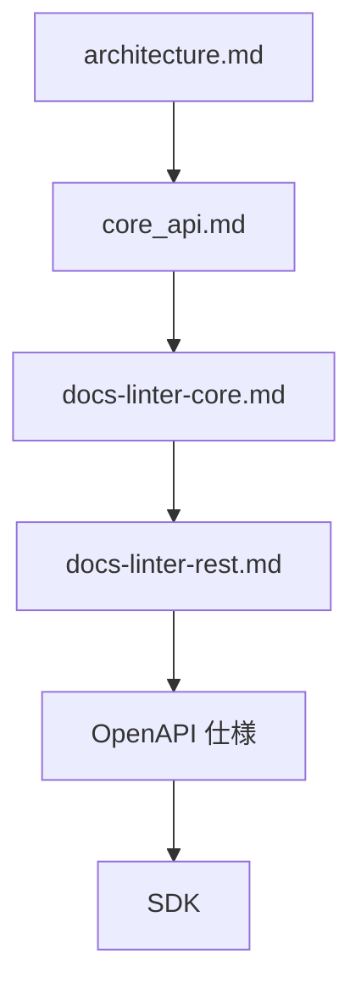
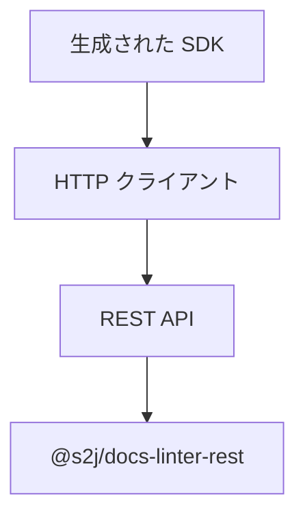
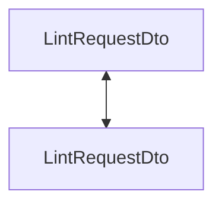
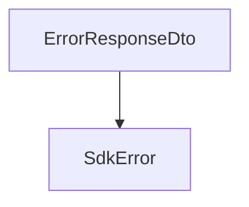
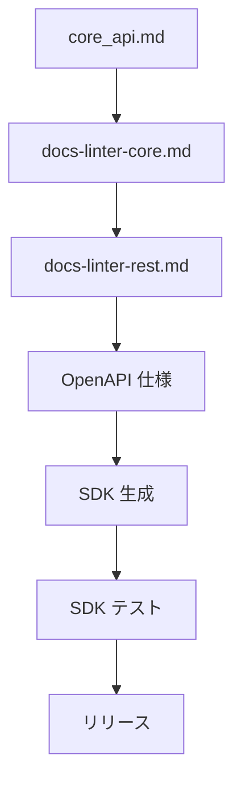
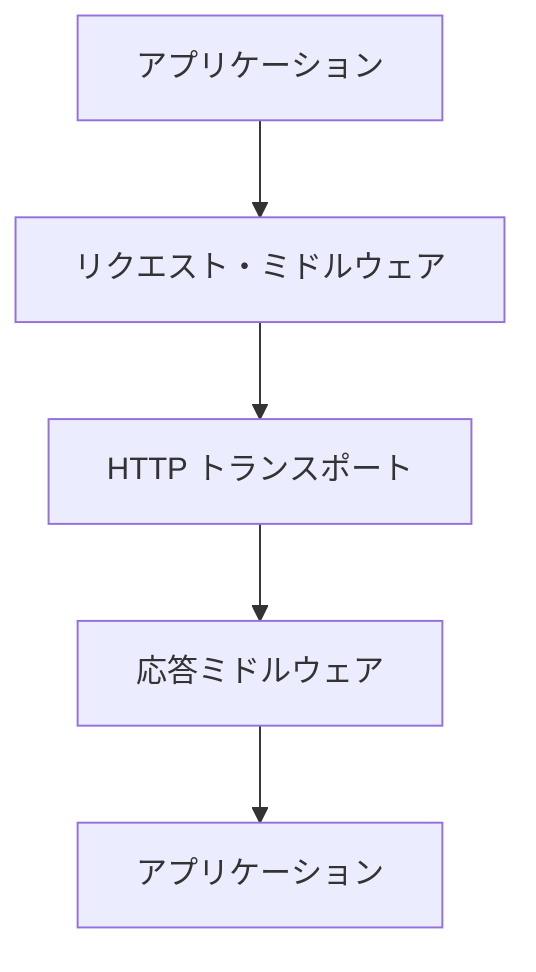
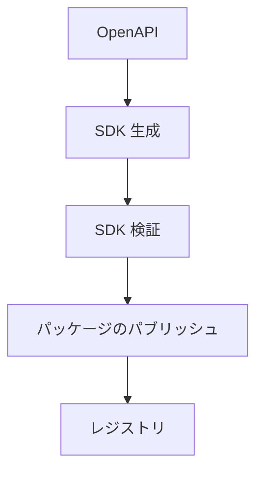
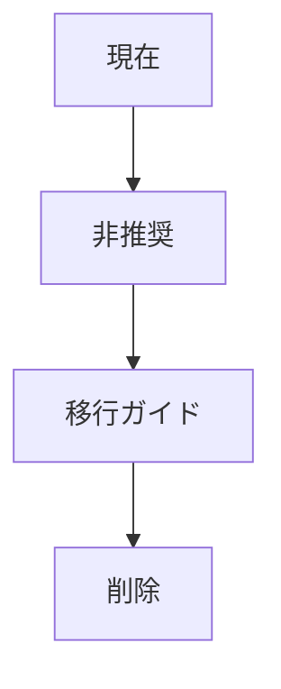
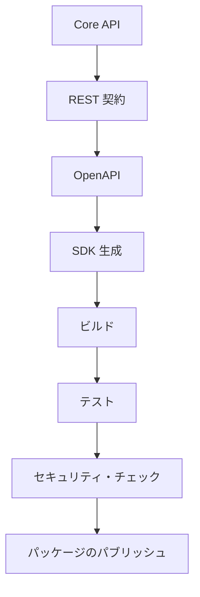

# 📘 S2J Docs Linter - SDK の生成・配布・互換性・テスト契約

## 1. SDK 生成仕様

本書は、`@s2j/docs-linter` の SDK 生成方針を定義します。

SDK は、Core API および REST API を利用するためのクライアント・ライブラリであり、ドメイン契約を変更するものではありません。

SDK は、OpenAPI 仕様を基に生成される成果物 (Generated Artifact) と位置付けます。

## 2. 設計意図 (ゴール)

SDK は、下記を目的とします。

* REST API 利用の簡素化
* 型安全な API 呼び出し
* API 契約との整合性維持
* アダプター実装の効率化
* 「利用側」間の実装品質の均一化

## 3. 設計原則

### Single Source of Truth

SDK の設計源は、下記とします。



SDK を直接編集してはなりません。

### 生成される成果物

SDK は、自動生成される成果物です。

手動変更は、禁止します。

### プラットフォームの独立性

SDK は、特定のアダプターに依存してはなりません。

下記への依存は、禁止します。

* `WordPress`
* `Forwarder-PRO`
* `配配メール`

## 4. SDK アーキテクチャ

### レイヤ



### 責務

SDK は、下記を担当します。

* HTTP リクエスト
* HTTP 応答
* DTO シリアライズ
* 認証ヘッダー設定
* リトライ制御
* 相関 ID 付与

### 非責務

SDK は、下記を担当しません。

* 検証ロジック
* ルールの実行
* 辞書の解決
* プロファイルの解決

## 5. サポート対象 SDK

### 必須

* TypeScript SDK

### 推奨

* PHP SDK
* Java SDK
* C# SDK

### 将来

* Kotlin SDK
* Swift SDK
* Go SDK

## 6. SDK 構造

```text
sdk/
├── client/
├── dto/
├── models/
├── auth/
├── errors/
├── configuration/
└── generated/
```

## 7. 生成されるコンポーネント

SDK ジェネレーターは、下記を生成します。

* API クライアント
* DTO
* Enum
* エラークラス
* 設定
* 認証インターフェース

## 8. DTO マッピング

SDK DTO は、REST DTO と一致しなければなりません。



ドメイン・オブジェクトを SDK に公開してはなりません。

## 9. 契約

### 認証契約

SDK は、認証方式を抽象化します。

### 設定契約

SDK は、ランタイム設定を提供します。

### ミドルウェア契約

SDK は、ミドルウェアにより、リクエスト / 応答を拡張できます。

### SDK 機能契約

SDK は、ランタイム機能を取得できます。

機能は、REST API が公開する情報を反映します。

### テレメトリ契約

SDK は、テレメトリを統合できます。

### SDK 非推奨契約

SDK の API 廃止手順を定義します。

## 10. 認証

SDK は、認証方式を抽象化します。

### インターフェース「AuthenticationProvider」

```ts
interface AuthenticationProvider {
    apply(request: HttpRequest): Promise<HttpRequest>;
}
```

### サポート対象例

* Bearer Token
* JWT
* API Key
* Cookie Session

## 11. 設定

SDK は、ランタイム設定を提供します。

### インターフェース「SdkConfiguration」

```ts
interface SdkConfiguration {
    baseUrl: string;
    timeout: number;
    retryCount: number;
}
```

## 12. エラーハンドリング

SDK は、エラー DTO を SDK エラーに変換します。



## 13. リトライ方針

SDK は、REST リトライ方針に従います。

リトライは、冪等 (べきとう) エンドポイントのみに適用します。

## 14. 相関 ID

SDK は、相関 ID を付与できます。

未指定の場合は、SDK が生成しても構いません。

## 15. バージョン互換性

SDK は、REST API バージョンに従います。

| SDK | REST API |
| --- | --- |
| 1.x | v1 |
| 2.x | v2 |

## 16. 後方互換性

マイナー・バージョンでは、後方互換性を維持します。

メジャー・バージョンでのみ、破壊的変更を許可します。

## 17. 生成ライフサイクル



## 18. 契約検証

CI は、下記を実施します。

* OpenAPI 検証
* SDK 生成
* SDK ビルド
* SDK ユニットテスト
* SDK 結合テスト
* 後方互換性テスト

## 19. テスト戦略

### ユニットテスト

* DTO マッピング
* エラーのマッピング
* 認証

### 結合テスト

* REST 通信
* リトライ方針
* タイムアウト

### 契約テスト

SDK と OpenAPI の整合性を検証します。

## 20. 拡張方針

SDK ジェネレーターは、プラグインにより拡張できます。

下記は、拡張例です。

* 認証方式
* ロギング
* テレメトリ
* HTTP クライアント

尚、Core API 契約を変更しては、なりません。

## 21. パッケージング方針

SDK は、言語ごとの標準パッケージ管理を利用します。

| 言語 | パッケージ・マネージャー |
| --- | --- |
| TypeScript | npm |
| PHP | Composer |
| Java | Maven Central |
| C# | NuGet |

## 22. SDK エコシステム・ガバナンス

本章は、docs-linter SDK の長期運用契約を定義します。

SDK は、単なる生成コードではなく、複数ランタイム・複数「利用側」が利用する共通プラットフォームとして設計します。

本章ではトランスポート、機能拡張、機能、互換性、および品質保証の契約を定義します。

## 23. トランスポート抽象化

SDK は、HTTP クライアント実装を抽象化します。

Core API および REST 契約は、トランスポート実装に依存してはなりません。

### 設計意図 (ゴール)

* ランタイム独立性
* HTTP クライアント独立性
* テスト容易性

### トランスポート契約

#### インターフェース「HttpTransport」

```ts
interface HttpTransport {
    send(
        request: HttpRequest
    ): Promise<HttpResponse>;
}
```

### 実装例

* Fetch API
* XMLHttpRequest
* Axios
* Guzzle
* OkHttp

### 責務

トランスポートは、下記を担当します。

* HTTP リクエスト
* HTTP 応答
* タイムアウト
* リトライ
* HTTP 圧縮
* ヘッダー管理

トランスポートは、下記を担当しません。

* DTO マッピング
* 検証ロジック
* ルールの実行

## 24. ミドルウェア

SDK は、ミドルウェアにより、リクエスト / 応答を拡張できます。

### ミドルウェア・フロー



### リクエスト・ミドルウェア

下記は、リクエスト・ミドルウェア例です。

* 認証
* 相関 ID
* ログ記録
* リトライ
* テレメトリ

### 応答ミドルウェア

下記は、応答ミドルウェア例です。

* エラーのマッピング
* 指標
* 応答のログ記録

### 設計ルール

ミドルウェアは、順序保証されます。

ミドルウェアは、ドメイン・オブジェクトを変更してはなりません。

## 25. SDK 機能

SDK は、ランタイム機能を取得できます。

機能は、REST API が公開する情報を反映します。

#### インターフェース「CapabilityService」

```ts
interface CapabilityService {
    getCapabilities():
        Promise<RuntimeCapabilities>;
}
```

### 機能例

下記は、ランタイムの機能例です。

* Worker
* 一括検証
* 非同期ジョブ

機能は、たとえば、下記の様になります。

* プロファイル
* パッケージ
* 辞書

制限は、たとえば、下記の様になります。

* バッチの最大サイズ
* ドキュメントの最大サイズ
* 並行ジョブの最大数

### 「利用側」利用法

機能は、UI の有効/無効の制御に利用できます。

機能が無効な機能は、SDK からロードしないことを推奨します。

## 26. リリース互換性マトリックス

SDK、REST API、Core ランタイムの互換性を管理します。

### 互換性マトリックス

| SDK | REST API | Core ランタイム |
| --- | --- | --- |
| 1.x | v1 | 1.x |
| 2.x | v2 | 2.x |

### 互換性ルール

メジャー・バージョンの不一致は、互換性を保証しません。

マイナー・バージョンは、後方互換性を維持します。

パッチ・バージョンは、不具合修正のみとします。

### アップグレード方針

SDK は、対応する REST API バージョンを利用しなければなりません。

## 27. SDK 品質ゲート

SDK リリースは、品質基準を満たさなければなりません。

### 必須チェック

* OpenAPI 検証
* SDK 生成
* ビルド
* ユニットテスト
* 結合テスト
* 契約テスト
* 広報互換性テスト

### 推奨チェック

* 静的解析
* 依存関係の監査
* パフォーマンス・ベンチマーク

### リリース・ブロックのルール

下記が失敗した場合、リリースを禁止します。

* 契約テスト
* ビルド
* OpenAPI 検証

## 28. テレメトリ

SDK は、テレメトリを統合できます。

### 設計意図 (ゴール)

* リクエスト・トレース
* パフォーマンス監視
* エラー監視

### インターフェース「TelemetryContext」

```ts
interface TelemetryContext {
    correlationId: string;
    traceId?: string;
}
```

### サポート対象の例

* OpenTelemetry
* W3C トレース・コンテキスト

### ルール

テレメトリは、ドメイン・ロジックに影響を与えてはなりません。

## 29. オフライン機能

SDK は、オフライン・ランタイムをサポートできます。

### ユースケース例

* Desktop アプリケーション
* Electron
* VS Code 機能拡張

### サポート対象の機能

* リクエスト・キュー
* リトライ・キュー
* ローカル・キャッシュ

### ルール

オフライン・キャッシュは、ドメイン・オブジェクトを永続化してはなりません。

永続化対象は、DTO またはリクエスト・キューとします。

## 30. SDK 拡張 API

SDK は、プラグインにより拡張できます。

### 機能拡張ポイント

* 認証プロバイダー
* HTTP トランスポート
* ロガー
* Serializer
* テレメトリ・プロバイダー

### 機能拡張の契約

#### インターフェース「SdkExtension」

```ts
interface SdkExtension {
    register(
        sdk: SdkBuilder
    ): void;
}
```

### 設計ルール

機能拡張は、Core API 契約を変更してはなりません。

機能拡張は、REST 契約を変更してはなりません。

## 31. 「利用側」プロファイル

SDK は、ユーザー種別ごとのランタイムを想定します。

### サポート対象の「利用側」

| 利用側 | ランタイム |
| --- | --- |
| `WordPress` | Browser / Node.js |
| `Forwarder-PRO` | Java |
| `配配メール` | Java ? |
| CLI | Node.js |

### 将来の「利用側」

* Electron
* VS Code 機能拡張
* IntelliJ プラグイン
* Visual Studio 機能拡張

### 「利用側」独立性

「利用側」固有の処理は、SDK に実装してはなりません。「利用側」アダプター側で実装します。

## 32. SDK プラットフォーム・ガバナンス

本章は、docs-linter SDK プラットフォームの運用契約を定義します。

SDK は、生成された成果物であると同時に、複数プラットフォーム・複数「利用側」に提供される、ソフトウェアのサプライチェーンの成果物でもあります。

本章では、SDK の配布、保守、移行、セキュリティ、およびリリース自動化を定義します。

## 33. SDK 配布方針

SDK は、各言語の標準パッケージ・レジストリを通じて配布します。

SDK の配布は、OpenAPI 仕様に基づく自動生成の成果物を対象とします。

### サポート対象のパッケージ・レジストリ

| 言語 | レジストリ |
| --- | --- |
| TypeScript | npm |
| PHP | Composer / Packagist |
| Java | Maven Central |
| C# | NuGet |

### 配布ルール

SDK の生成物は、リリース・パイプラインによって公開します。

手動で生成・公開してはなりません。

### 配布フロー



## 34. SDK サポート方針

SDK は、セマンティック・バージョニングに従って保守します。

### サポート対象

| バージョン | 状態 |
| --- | --- |
| 最新のメジャー | アクティブ |
| 前のメジャー | セキュリティ修正のみ |
| 以前のバージョン | サポート終了 |

### メンテナンス方針

#### アクティブ

* 機能
* バグ修正
* セキュリティ修正

#### セキュリティ修正のみ

* セキュリティ・パッチ
* 重大バグ修正

#### サポート終了

新規修正を提供しません。

### サポート期間

メジャー・バージョンは、最低12か月間サポートすることを推奨します。

## 35. SDK 移行方針

メジャー・バージョン更新時の移行契約を定義します。

### 移行原則

* 後方互換性 First
* 明示的な非推奨
* 移行ガイド必須

### 移行ライフサイクル



### 必須成果物

メジャー・バージョンのリリースでは、下記を提供します。

* 移行ガイド
* 破壊的変更
* 互換性マトリックス
* アップグレード例

### 移行ルール

非推奨 API は、最低1メジャー・バージョン維持を推奨します。

## 36. SDK セキュリティ方針

SDK は、サプライチェーン・セキュリティを考慮して提供します。

### セキュリティ目標

* パッケージの整合性
* 依存関係の整合性
* 成果物の真正性

### 必須チェック

* 依存関係のスキャン
* 脆弱性スキャン
* ライセンスのチェック
* 静的解析

### 推奨チェック

* SBOM (ソフトウェア構成表) 生成
* パッケージ署名
* 来歴検証

### 依存関係の方針

依存ライブラリは、定期的に更新します。

重大な脆弱性を含む依存関係を、リリースに含めてはなりません。

### セキュリティ・インシデント

重大な脆弱性が確認された場合は、セキュリティ・パッチを優先します。

## 37. SDK リリース自動化

SDK リリースは、CI/CD により自動化します。

### リリース・パイプライン



### 必須パイプライン

* OpenAPI 検証
* SDK 生成
* ビルド
* ユニットテスト
* 結合テスト
* 契約テスト
* セキュリティ・スキャン
* パッケージのパブリッシュ

### リリース条件

下記を満たした場合のみ、リリースを許可します。

* ビルドの成功
* テストの成功
* 契約の適合
* セキュリティ・チェックの成功

### ロールバック方針

パッケージのパブリッシュに失敗した場合は、リリースを中断します。

公開済みパッケージの削除ではなく、新しいパッチ・バージョンによる修正を推奨します。

## 38. SDK プロダクト管理

本章は、docs-linter SDK のプロダクト管理契約を定義します。

SDK は、単なる「生成される成果物」ではなく、長期的に保守・配布されるソフトウェア・プロダクトと位置付けます。

本章では SDK のメタデータ、ジェネレーター互換性、機能公開、非推奨管理、およびジェネレーター拡張契約を定義します。

## 39. 完了条件

SDK 層は、下記を実装した時点で完成とみなします。

* SDK アーキテクチャ
* 生成される成果物の方針
* DTO マッピング契約
* 認証契約
* 設定契約
* エラーハンドリング契約
* リトライ方針
* バージョン互換性
* 生成ライフサイクル
* 契約検証
* テスト戦略
* パッケージング方針
* ADR (アーキテクチャ決定記録)

SDK エコシステムは、下記を実装した時点で完成とみなします。

* トランスポート抽象化
* ミドルウェア契約
* SDK 機能契約
* リリース互換性マトリックス
* SDK 品質ゲート
* テレメトリ契約
* オフライン機能
* SDK 拡張 API
* 「利用側」プロファイル
* SDK ADR (アーキテクチャ決定記録)

SDK プラットフォーム・ガバナンスは、下記を実装した時点で完成とみなします。

* SDK 配布方針
* SDK サポート方針
* SDK 移行方針
* SDK セキュリティ方針
* SDK リリース自動化
* プラットフォーム・ガバナンス ADR (アーキテクチャ決定記録)

## 40. ADR (アーキテクチャ決定記録)

### ADR-SDK-001

#### タイトル

* 生成される成果物としての SDK

#### 決定

* SDK は、OpenAPI から生成される成果物とする。

### ADR-SDK-002

#### タイトル

* REST 契約 First

#### 決定

* SDK は、`@s2j/docs-linter-rest` の契約に従う。

### ADR-SDK-003

#### タイトル

* ドメイン・ロジックなし

#### 決定

* SDK は、ドメイン・ロジックを保持しない。

### ADR-SDK-004

#### タイトル

* プラットフォーム非依存 SDK

#### 決定

* SDK は、特定アプリケーションに依存しない。

### ADR-SDK-005

#### タイトル

* 生成コードの保護

#### 決定

* 生成コードは、手動編集してはならない。

## 41. SDK ADR (アーキテクチャ決定記録)

### ADR-SDK-006

#### タイトル

* トランスポート抽象化

#### 決定

* HTTP クライアントは、抽象化する。

### ADR-SDK-007

#### タイトル

* ミドルウェア First

#### 決定

* SDK 拡張は、ミドルウェアにより実現する。

### ADR-SDK-008

#### タイトル

* 機能駆動クライアント

#### 決定

* ランタイム機能に応じて、SDK の動作を制御する。

### ADR-SDK-009

#### タイトル

* 生成される Core

#### 決定

* 生成コードを手動編集してはならない。

* 拡張は、拡張 API を利用する。

### ADR-SDK-010

#### タイトル

* プラットフォーム非依存「利用側」

#### 決定

* SDK は、「利用側」固有の実装を持たない。

## 42. プラットフォーム・ガバナンス ADR (アーキテクチャ決定記録)

### ADR-SDK-011

#### タイトル

* 自動 SDK 配布

#### 決定

* SDK は、CI/CD により生成・公開する。

### ADR-SDK-012

#### タイトル

* セマンティック・バージョニングのサポート

#### 決定

* SDK の保守は、セマンティック・バージョニングに従う。

### ADR-SDK-013

#### タイトル

* 削除前の移行

#### 決定

* 非推奨 API は、移行ガイドを提供した上で廃止する。

### ADR-SDK-014

#### タイトル

* サプライチェーン・セキュリティ

#### 決定

* SDK リリースは、セキュリティ・スキャンおよび依存関係の検証を必須とする。

### ADR-SDK-015

#### タイトル

* 生成された成果物の保護

#### 決定

* 生成された SDK は手動編集を禁止し、OpenAPI を唯一の生成元とする。
