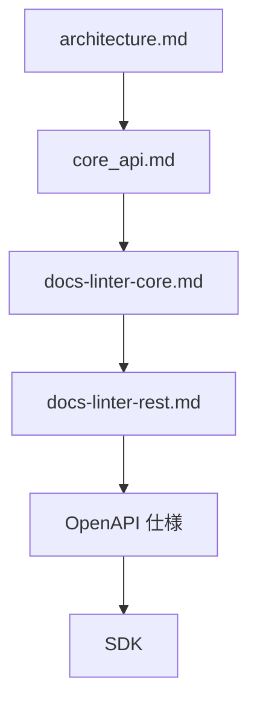
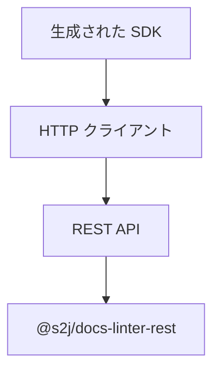
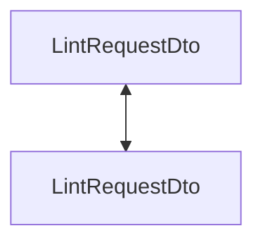
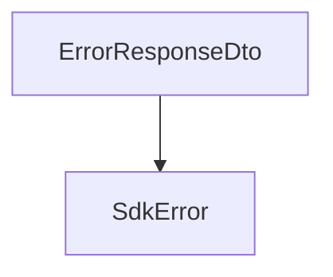
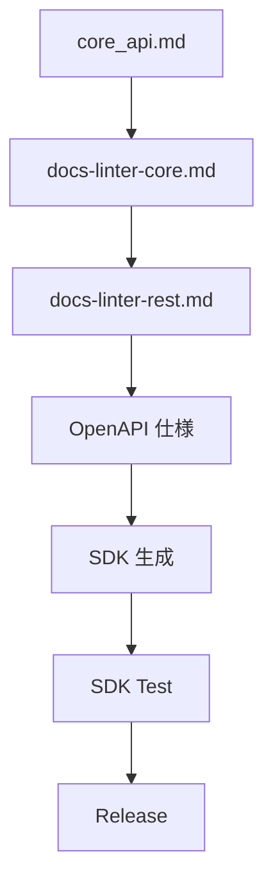

# 📘 S2J Docs Linter - SDK の生成・配布・互換性・テスト契約

## 1. SDK 生成仕様

### 概要

本書は、`@s2j/docs-linter` の SDK 生成方針を定義します。

SDK は、Core API および REST API を利用するためのクライアント・ライブラリであり、ドメイン契約を変更するものではありません。

SDK は、OpenAPI 仕様を基に生成される成果物 (Generated Artifact) と位置付けます。

## 2. 設計意図 (ゴール)

SDK は、下記を目的とします。

* REST API 利用の簡素化
* 型安全な API 呼び出し
* API 契約との整合性維持
* アダプター実装の効率化
* Consumer 間の実装品質の均一化

## 3. 設計原則

### Single Source of Truth

SDK の設計源は、下記とします。



SDK を直接編集してはなりません。

### 生成される成果物

SDK は、自動生成される成果物です。

手動変更は、禁止します。

### プラットフォームの独立性

SDK は、特定のアダプターに依存してはなりません。

下記への依存は、禁止します。

* `WordPress`
* `Forwarder-PRO`
* `配配メール`

## 4. SDK アーキテクチャ

### レイヤ



### 責務

SDK は、下記を担当します。

* HTTP リクエスト
* HTTP 応答
* DTO シリアライズ
* 認証ヘッダー設定
* リトライ制御
* 相関 ID 付与

### 非責務

SDK は、下記を担当しません。

* 検証ロジック
* ルールの実行
* 辞書の解決
* プロファイルの解決

## 5. サポート対象 SDK

### 必須

* TypeScript SDK

### 推奨

* PHP SDK
* Java SDK
* C# SDK

### 将来

* Kotlin SDK
* Swift SDK
* Go SDK

## 6. SDK 構造

```text
sdk/
├── client/
├── dto/
├── models/
├── auth/
├── errors/
├── configuration/
└── generated/
```

## 7. 生成されるコンポーネント

SDK ジェネレーターは、下記を生成します。

* API クライアント
* DTO
* Enum
* エラークラス
* 設定
* 認証インターフェース

## 8. DTO マッピング

SDK DTO は、REST DTO と一致しなければなりません。



ドメイン・オブジェクトを SDK に公開してはなりません。

## 9. 契約

### 認証契約

SDK は、認証方式を抽象化します。

### 設定契約

SDK は、ランタイム設定を提供します。

## 10. 認証

SDK は、認証方式を抽象化します。

### インターフェース「AuthenticationProvider」

```ts
interface AuthenticationProvider {
    apply(request: HttpRequest): Promise<HttpRequest>;
}
```

### サポート対象例

* Bearer Token
* JWT
* API Key
* Cookie Session

## 11. 設定

SDK は、ランタイム設定を提供します。

### インターフェース「SdkConfiguration」

```ts
interface SdkConfiguration {
    baseUrl: string;
    timeout: number;
    retryCount: number;
}
```

## 12. エラーハンドリング

SDK は、エラー DTO を SDK エラーに変換します。



## 13. リトライ方針

SDK は、REST リトライ方針に従います。

リトライは、冪等 (べきとう) エンドポイントのみに適用します。

## 14. 相関 ID

SDK は、相関 ID を付与できます。

未指定の場合は、SDK が生成しても構いません。

## 15. バージョン互換性

SDK は、REST API バージョンに従います。

| SDK | REST API |
| --- | --- |
| 1.x | v1 |
| 2.x | v2 |

## 16. 後方互換性

マイナーバージョンでは、後方互換性を維持します。

メジャーバージョンでのみ、破壊的変更を許可します。

## 17. 生成ライフサイクル



## 18. 契約検証

CI は、下記を実施します。

* OpenAPI 検証
* SDK 生成
* SDK ビルド
* SDK ユニットテスト
* SDK 結合テスト
* 後方互換性テスト

## 19. テスト戦略

### ユニットテスト

* DTO マッピング
* エラーマッピング
* 認証

### 結合テスト

* REST 通信
* リトライ方針
* タイムアウト

### 契約テスト

SDK と OpenAPI の整合性を検証します。

## 20. 拡張方針

SDK ジェネレーターは、プラグインにより拡張できます。

下記は、拡張例です。

* 認証方式
* ロギング
* 遠隔測定
* HTTP クライアント

尚、Core API 契約を変更しては、なりません。

## 21. パッケージング方針

SDK は、言語ごとの標準パッケージ管理を利用します。

| 言語 | パッケージ・マネージャー |
| --- | --- |
| TypeScript | npm |
| PHP | Composer |
| Java | Maven Central |
| C# | NuGet |

## 22. 完了条件

SDK 層は、下記を実装した時点で完成とみなします。

* SDK アーキテクチャ
* 生成される成果物の方針
* DTO マッピング契約
* 認証契約
* 設定契約
* エラーハンドリング契約
* リトライ方針
* バージョン互換性
* 生成ライフサイクル
* 契約検証
* テスト戦略
* パッケージング方針
* ADR (アーキテクチャ決定記録)

## 23. ADR (アーキテクチャ決定記録)

### ADR-SDK-001

#### タイトル

* 生成される成果物としての SDK

#### 決定

* SDK は、OpenAPI から生成される成果物とする。

### ADR-SDK-002

#### タイトル

* REST 契約 First

#### 決定

* SDK は、`@s2j/docs-linter-rest` の契約に従う。

### ADR-SDK-003

#### タイトル

* ドメイン・ロジックなし

#### 決定

* SDK は、ドメイン・ロジックを保持しない。

### ADR-SDK-004

#### タイトル

* プラットフォーム非依存 SDK

#### 決定

* SDK は、特定アプリケーションに依存しない。

### ADR-SDK-005

#### タイトル

* 生成コードの保護

#### 決定

* 生成コードは、手動編集してはならない。
