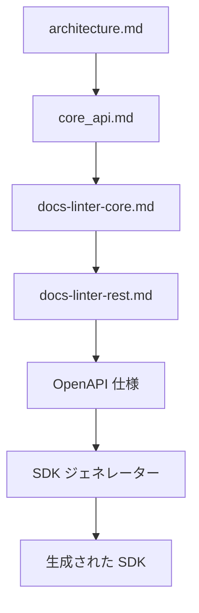
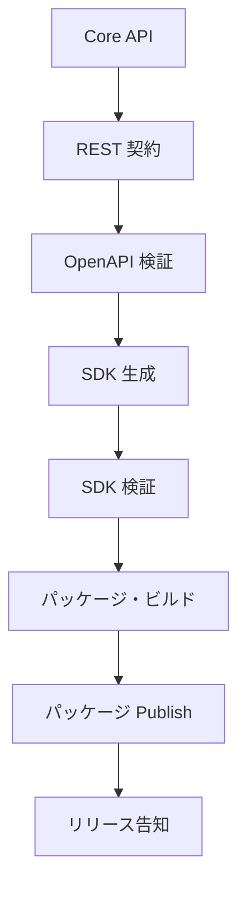
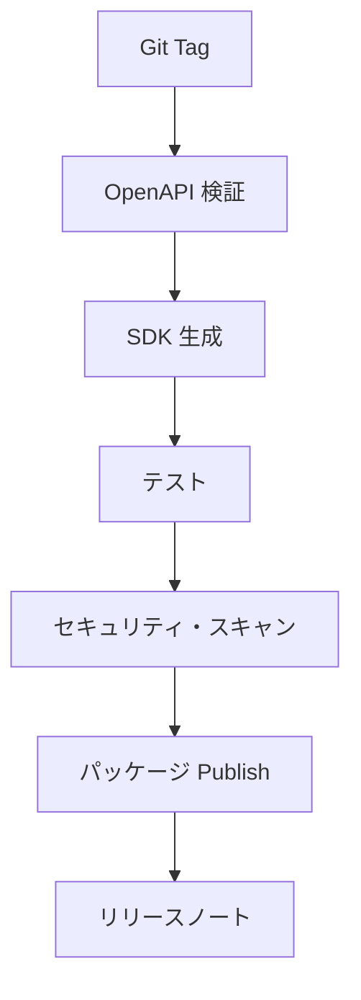

# 📘 S2J Docs Linter - SDK 固有のリリース運用

## 1. SDK リリース仕様

本書は、docs-linter SDK のリリース・エンジニアリングを定義します。

SDK は、OpenAPI 仕様から生成される成果物 (Generated Artifact) と位置付けます。

本書では、SDK のバージョン管理方針、リリース・パイプライン、品質保証、および公開運用を定義します。

## 2. 目的

SDK リリースは、下記を目的とします。

* 生成された SDK の品質保証
* OpenAPI 契約との整合性維持
* 「利用側」への安定した提供
* セマンティック・バージョニングの遵守
* ソフトウェア・サプライチェーンの健全性維持

## 3. 適用範囲

本書は、下記を対象とします。

* TypeScript SDK
* PHP SDK
* Java SDK
* C# SDK
* 将来追加される言語 SDK

## 4. リリース原則

### Single Source of Truth

SDK は、下記の契約から生成されます。

SDK を直接編集してはなりません。

### 不変リリース

公開済み SDK は、変更してはなりません。

修正は、新しいバージョンをリリースします。

### 決定論的 (deterministic) なリリース

同一入力から生成された SDK は、常に同一成果物となることを保証します。

## 5. リリース・ライフサイクル

## 6. リリース・パイプライン

### フェーズ1

* OpenAPI 検証

#### 必須

* OpenAPI 検証
* 契約検証

### フェーズ2

* SDK 生成

#### 必須

* ジェネレーター検証
* テンプレート検証
* 成果物生成

### フェーズ3

* ビルド

#### 必須

* ビルド成功
* 依存関係の解決

### フェーズ4

* 品質検証

#### 必須

* ユニットテスト
* 結合テスト
* 契約テスト
* スナップショット・テスト
* ゴールデンファイル・テスト

### フェーズ5

* セキュリティ検証

#### 必須

* 依存関係スキャン
* 脆弱性スキャン
* ライセンス・チェック

#### 推奨

* ソフトウェア構成表生成
* 来歴検証
* パッケージ署名

### フェーズ6

* パッケージ Publish

SDK は、各言語の標準パッケージ・レジストリに公開します。

| 言語 | レジストリ |
| --- | --- |
| TypeScript | npm |
| PHP | Packagist |
| Java | Maven Central |
| C# | NuGet |

### フェーズ7

* リリースノート

下記を公開します。

* リリースノート
* 互換性マトリクス
* 移行ガイド (必要な場合)
* 破壊的変更 (メジャー・バージョンの場合)

## 7. バージョン管理方針

SDK は、セマンティック・バージョニングに従います。

### パッチ

* バグ修正
* 内部の改善

### マイナー

* 後方互換性のある機能

### メジャー

* 破壊的変更
* 契約変更
* 生成された API 変更

## 8. 互換性マトリクス

| SDK | REST API | Core API |
| --- | --- | --- |
| 1.x | v1 | 1.x |
| 2.x | v2 | 2.x |

互換性マトリクスは、各リリースで更新します。

## 9. リリース品質ゲート

リリースは、下記をすべて満たさなければなりません。

* OpenAPI 検証成功
* SDK 生成成功
* ビルド成功
* 契約テスト成功
* スナップショット・テスト成功
* セキュリティ・スキャン成功
* 互換性マトリクス更新済み

いずれかが失敗した場合、リリースを中止します。

## 10. リリース成果物

各リリースは、下記を成果物として提供します。

* SDK パッケージ
* リリースノート
* 互換性マトリクス
* 移行ガイド (必要な場合)
* ソフトウェア構成表 (推奨)
* パッケージのチェックサム (推奨)

## 11. ロールバック方針

公開済みパッケージは、削除しません。

障害が発生した場合は、パッチ・バージョンを発行します。

## 12. サポート方針

| バージョン | サポート |
| --- | --- |
| 最新のメジャー | アクティブ・サポート |
| 前のメジャー | セキュリティ修正のみ |
| 旧バージョン | サポート終了 |

## 13. 「利用側」通知方針

メジャー・バージョンでは、下記を通知します。

* 破壊的変更
* 移行ガイド
* 非推奨 API
* サポート・スケジュール

## 14. リリースの自動化

リリースは、CI/CD により自動実行します。

手動リリースは、緊急対応を除き実施しません。

## 15. 可観測性

リリース・パイプラインは、下記を記録します。

* リリース ID
* ジェネレーター・バージョン
* テンプレート・バージョン
* OpenAPI バージョン
* ビルド所要時間
* テスト結果

## 16. 完了条件

SDK リリースは、下記を実装した時点で完成とみなします。

* リリース・ライフサイクル
* リリース・パイプライン
* バージョン管理方針
* 互換性マトリクス
* 品質ゲート
* セキュリティ検証
* リリース成果物
* ロールバック方針
* サポート方針
* 「利用側」通知方針
* リリースの自動化
* 可観測性
* ADR (アーキテクチャ決定記録)

## 17. ADR (アーキテクチャ決定記録)

### ADR-REL-001

#### タイトル

* 生成された SDK リリース

#### 決定

* SDK は、OpenAPI から生成された成果物のみをリリースする。

### ADR-REL-002

#### タイトル

* 品質ゲート First

#### 決定

* 品質ゲートを通過しない SDK は、公開しない。

### ADR-REL-003

#### タイトル

* 不変リリース

#### 決定

* 公開済みパッケージを変更せず、新しいバージョンを発行する。

### ADR-REL-004

#### タイトル

* 決定論的 (deterministic) なリリース

#### 決定

* 同一入力から同一成果物を生成できることを、リリース条件とする。

### ADR-REL-005

#### タイトル

* 自動リリース

#### 決定

* SDK リリースは、CI/CD を唯一の公開経路とする。
