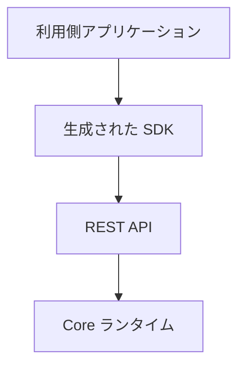
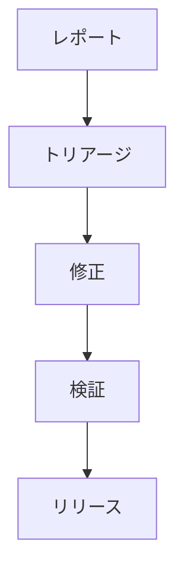

# 📘 S2J Docs Linter - SDK セキュリティ運用

## 1. SDK セキュリティ仕様

本書は、S2J Docs Linter プラットフォームが提供する SDK のセキュリティ契約を定義します。

本書の対象は、下記のコンポーネントです。

* TypeScript SDK
* PHP SDK
* Java SDK
* C# SDK
* 将来追加される SDK

本書では、SDK の設計/生成/利用/保守に関する、セキュリティ方針を定義します。

## 2. 目的

SDK セキュリティは、下記を目的とします。

* 「デフォルトでセキュア」の実現
* 利用側アプリケーションの保護
* ソフトウェア・サプライチェーンの信頼性向上
* セキュリティ・リスクの低減
* 長期保守性の確保

## 3. セキュリティ原則

SDK は、下記の原則に従います。

* デフォルトでセキュア
* 最低限の権限
* 多層防御
* フェイル・セキュア
* 明示的な信頼境界
* ゼロトラスト設計

## 4. セキュリティ境界

SDK は、ドメイン層とインフラストラクチャ層の境界を越えてセキュリティ責務を持ちません。

### 信頼境界

SDK は、「利用側」の認証情報や秘密情報を保持しません。

## 5. 契約

### 認証契約

SDK は、認証方式を抽象化します。

### 認可契約

認可は、SDK の責務ではありません。

### 機能拡張セキュリティ契約

プラグインおよびミドルウェアは、セキュリティ境界を越えてはなりません。

### 脅威モデル契約

SDK は、想定する脅威を明示します。

脅威モデルは、SDK のセキュリティ境界を定義するための基準とします。

### セキュリティ機能契約

SDK は、提供するセキュリティ機能を公開します。

機能は、ランタイムごとの差異を吸収します。

### セキュア・デフォルト契約

SDK は、「デフォルトでセキュア」を採用します。

### プライバシー契約

SDK は、個人情報および機密情報を最小限に取り扱います。

### セキュリティ指標契約

SDK は、セキュリティ指標を公開できます。

## 6. 認証

SDK は、認証方式を抽象化します。

### サポート対象の認証

* Bearer Token
* API Key
* OAuth 2.0
* JWT
* 将来追加される認証方式

### ルール

認証方式は、SDK ジェネレーターに固定してはなりません。

認証プロバイダーを差し替え可能とします。

## 7. 認可

認可は、SDK の責務ではありません。

認可判定は、REST API または「利用側」が担当します。

## 8. Secret の取扱い方針

SDK は、Secret を永続化してはなりません。

下記は、対象となる Secret 例です。

* Access Token
* Refresh Token
* API Key
* Session Token

### ルール

SDK は、Secret を下記に出力してはなりません。

* ソースコード
* ログ
* キャッシュ
* 例外

## 9. トランスポート・セキュリティ

SDK は、安全な通信を前提とします。

### 要件

* HTTPS
* TLS
* 証明書の検証

### ルール

平文通信を前提としてはなりません。

## 10. 入力検証の方針

SDK は、「利用側」入力を検証します。

### 検証の対象

* リクエスト DTO
* パラメーター
* ヘッダー
* クエリー

### ルール

検証失敗は、リクエストを送信してはなりません。

## 11. 出力検証の方針

SDK は、Response を検証します。

### 検証の対象

* 応答 DTO
* HTTP ステータス・コード
* コンテンツタイプ

### ルール

不正な応答は、ドメイン・オブジェクトに変換してはなりません。

## 12. エラー情報方針

セキュリティ情報をエラーに含めてはなりません。

### 禁止

* トークン
* パスワード
* Secret
* 内部パス

## 13. ログ記録方針

SDK は、セキュリティ機密データをログに出力してはなりません。

### マスキング対象

* 認証ヘッダー
* API キー
* トークン
* Cookie

## 14. 依存関係セキュリティ方針

SDK の依存ライブラリは、継続的に監査します。

### 要件

* 既知の脆弱性スキャン
* ライセンスのチェック
* 依存関係の更新

## 15. 暗号化方針

独自暗号の実装を禁止します。

### ルール

SDK は、各ランタイムが提供する標準暗号 API を利用します。

## 16. 機能拡張セキュリティ

プラグインおよびミドルウェアは、セキュリティ境界を越えてはなりません。

### ルール

機能拡張は、下記に直接アクセスしてはなりません。

* Secret
* 認証
* 内部状態

## 17. セキュアな設定

セキュリティに関する設定は、設定として外部化します。

### 例

* タイムアウト
* リトライ
* TLS 検証
* プロキシー

## 18. セキュリティ・イベント

SDK は、セキュリティ・イベントを通知できます。

### 例

* 認証失敗
* 無効な証明書
* 無効な応答
* 署名の検証失敗

## 19. セキュリティ・テスト

### 必須テスト

* 静的解析
* 依存関係スキャン
* 契約テスト
* セキュリティ回帰テスト

### 推奨テスト

* Fuzz テスト
* Mutation テスト

## 20. 脆弱性の対応

### ライフサイクル

### ルール

重大な脆弱性は、ホットフィックス・リリースの対象とします。

## 21. セキュリティの可観測性

### 指標

* 認証の失敗回数
* TLS の失敗回数
* 検証の失敗回数
* 依存関係の脆弱性件数

### ログ記録

セキュリティ・イベントは、監査可能な形式で記録します。

## 22. Advanced セキュリティ契約

本章は、SDK セキュリティ仕様を補完します。

本章は、セキュリティ機能、脅威モデル、およびセキュリティ・ガバナンスを定義します。

本章では、SDK の長期運用に必要なセキュリティ契約を定義します。

対象は、下記の SDK とします。

* TypeScript SDK
* PHP SDK
* Java SDK
* C# SDK
* 将来追加される SDK

## 23. 脅威モデル

SDK は、想定する脅威を明示します。

脅威モデルは、SDK のセキュリティ境界を定義するための基準とします。

### 標準脅威

* トークン漏洩
* 認証情報の漏洩
* MITM (中間者)
* リプレイ攻撃
* 依存関係ポイズニング
* パッケージ改竄
* 悪意のある機能拡張
* 設定の注入
* ログ情報の漏洩

### ルール

脅威モデルは、SDK バージョンごとに見直します。

重大なセキュリティ機能の追加時は、脅威モデルを更新します。

## 24. セキュリティ機能

SDK は、提供するセキュリティ機能を公開します。

機能は、ランタイムごとの差異を吸収します。

下記は、機能の例です。

* supportsOAuth2
* supportsBearerToken
* supportsApiKey
* supportsTLS
* supportsCertificateValidation
* supportsRetryPolicy
* supportsRequestSigning
* supportsProxyConfiguration

### ルール

機能は、SDK マニフェストに公開できる形式とします。

## 25. セキュア・デフォルト

SDK は、「デフォルトでセキュア」を採用します。

ユーザーが明示的に変更しない限り、安全な設定を利用します。

### デフォルトの要件

* TLS 検証： Enabled
* 証明書検証： Enabled
* リダイレクト制限： Limited
* リトライ数： Conservative
* タイムアウト： Defined
* ログ記録： 機密データのマスキング

### ルール

セキュリティを低下させる設定は、明示的なユーザー操作を必要とします。

## 26. プライバシー

SDK は、個人情報および機密情報を最小限に取り扱います。

### プライバシー原則

* データの最小化
* 利用目的の限定
* 保存期間の制限
* 明示的な処理

### 禁止

SDK は、下記を永続化してはなりません。

* 個人情報
* アクセス・トークン
* リフレッシュ・トークン
* パスワード
* 秘密鍵

### ルール

プライバシーに関する設定は、「利用側」が制御できるようにします。

## 27. 証明書方針

SDK は、証明書検証を実施します。

### 要件

* TLS 検証
* ホストネームの検証
* 証明書チェーンの検証

### オプション機能

* 証明書ピンニング
* カスタム・トラスト・ストア

### ルール

証明書検証を無効化する API は、提供しないことを推奨します。

## 28. セキュア機能拡張の方針

SDK の機能拡張は、セキュリティ境界を越えてはなりません。

### 機能拡張の制限

機能拡張は、下記に直接アクセスしてはなりません。

* Secret
* 認証状態
* 内部キャッシュ
* セキュリティ・コンテキスト

### ルール

機能拡張は、公開 API のみ利用します。

## 29. セキュリティ設定プロファイル

実行環境ごとに、セキュリティ・プロファイルを定義します。

### プロファイル

#### 開発

* デバッグを有効
* ログ記録の緩和
* テスト用証明書の許可

#### テスト

* 模擬認証
* テスト用エンドポイント

#### 本番

* TLS 必須
* セキュアなログ記録
* 証明書検証を有効

### ルール

本番プロファイルは、「デフォルトでセキュア」とします。

## 30. コンプライアンス・マッピング

SDK は、主要なセキュリティ・ガイドラインとの対応関係を明示できます。

### リファレンス標準

* OWASP ASVS
* OWASP API セキュリティ
* NIST SSDF (セキュア・ソフトウェア開発フレームワーク)
* CWE

### ルール

コンプライアンス・マッピングは、参考情報であり、認証取得を意味しません。

## 31. セキュリティ指標

SDK は、セキュリティ指標を公開できます。

### 標準指標

* 認証の失敗回数
* 認可の失敗回数
* TLS の失敗回数
* 証明書検証の失敗回数
* 検証の失敗回数
* 依存関係の脆弱性件数

### ルール

指標は、セキュリティ・イベントの監視に利用します。

個人情報や Secret を含めてはなりません。

## 32. セキュリティの互換性方針

セキュリティ機能の互換性を管理します。

### 互換性の対象

* SDK バージョン
* ランタイム・バージョン
* 認証プロバイダー
* TLS バージョン

### 互換性マトリクス

| SDK | ランタイム | セキュリティ機能 |
| --- | --- | --- |
| 1.x | サポート対象のランタイム | Stable |
| 2.x | サポート対象のランタイム | Stable |

### ルール

セキュリティ機能の削除は、メジャー・バージョンのみ許可します。

新しいセキュリティ機能の追加は、マイナー・バージョンとします。

## 33. 横断原則

### 設計でセキュリティ

セキュリティは、設計段階から考慮します。

### 最低限の権限

必要最小限の権限で動作します。

### 明示的な Trust 境界

Trust 境界を越える操作は、明示的に管理します。

### 継続的検証

セキュリティ・テストおよび依存関係スキャンを継続的に実施します。

## 34. 完了条件

SDK セキュリティは、下記を実装した時点で完成とみなします。

* セキュリティ原則
* セキュリティ境界
* 認証契約
* 認可契約
* Secret の取扱い方針
* トランスポート・セキュリティ
* 入力検証の方針
* 出力検証の方針
* エラー情報方針
* ログ記録方針
* 依存関係セキュリティ方針
* 暗号化方針
* 機能拡張セキュリティ契約
* セキュアな設定
* セキュリティ・イベント
* セキュリティ・テスト
* 脆弱性の対応
* セキュリティの可観測性
* ADR (アーキテクチャ決定記録)

Advanced セキュリティ契約は、下記を実装した時点で完成とみなします。

* 脅威モデル契約
* セキュリティ機能契約
* セキュア・デフォルト契約
* プライバシー契約
* 証明書方針
* セキュア機能拡張の方針
* セキュリティ設定プロファイル
* コンプライアンス・マッピング
* セキュリティ指標契約
* セキュリティの互換性方針
* 横断原則
* Advanced セキュリティ ADR (アーキテクチャ決定記録)

## 35. ADR (アーキテクチャ決定記録)

### ADR-SEC-001

#### タイトル

* デフォルトでセキュア

#### 決定

* SDK は、「デフォルトでセキュア」を採用する。

### ADR-SEC-002

#### タイトル

* Secret 隔離

#### 決定

* SDK は、Secret を永続化しない。

### ADR-SEC-003

#### タイトル

* 標準暗号

#### 決定

* 独自暗号を実装しない。

### ADR-SEC-004

#### タイトル

* 認証の抽象化

#### 決定

* 認証方式は、認証プロバイダーにより抽象化する。

### ADR-SEC-005

#### タイトル

* 依存関係セキュリティ

#### 決定

* 依存ライブラリは、継続的にセキュリティ・スキャンを実施する。

## 36. Advanced セキュリティ ADR (アーキテクチャ決定記録)

### ADR-SEC-006

#### タイトル

* 明示的な脅威モデル

#### 決定

* SDK は、脅威モデルを公開する。

### ADR-SEC-007

#### タイトル

* セキュリティ機能公開

#### 決定

* SDK は、セキュリティ機能を公開する。

### ADR-SEC-008

#### タイトル

* セキュア・デフォルト

#### 決定

* SDK は、「デフォルトでセキュア」を採用する。

### ADR-SEC-009

#### タイトル

* セキュリティ・プロファイル

#### 決定

* ランタイムごとの「セキュリティ設定プロファイル」を提供する。

### ADR-SEC-010

#### タイトル

* 互換性 First

#### 決定

* セキュリティ機能の互換性は、セマンティック・バージョニングに従って管理する。
