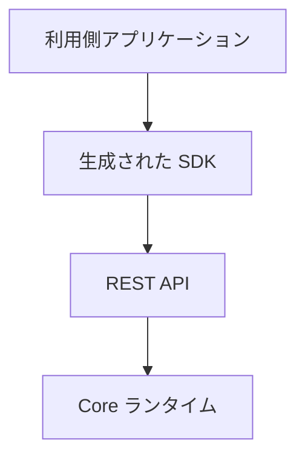
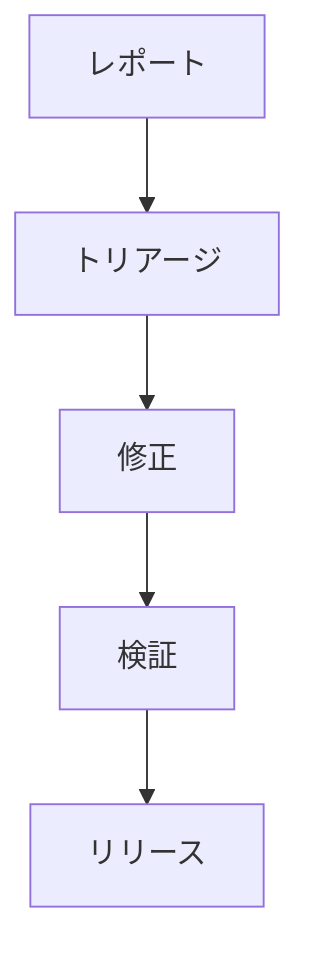

# 📘 S2J Docs Linter - SDK セキュリティ運用

## SDK セキュリティ仕様

本書は、S2J Docs Linter プラットフォームが提供する SDK のセキュリティ契約を定義します。

本書の対象は、下記のコンポーネントです。

* TypeScript SDK
* PHP SDK
* Java SDK
* C# SDK
* 将来追加される SDK

本書では、SDK の設計/生成/利用/保守に関する、セキュリティ方針を定義します。

## 目的

SDK セキュリティは、下記を目的とします。

* 「デフォルトでセキュア」の実現
* 利用側アプリケーションの保護
* ソフトウェア・サプライチェーンの信頼性向上
* セキュリティ・リスクの低減
* 長期保守性の確保

## セキュリティ原則

SDK は、下記の原則に従います。

* デフォルトでセキュア
* 最低限の権限
* 多層防御
* フェイル・セキュア
* 明示的な信頼境界
* ゼロトラスト設計

## セキュリティ境界

SDK は、ドメイン層とインフラストラクチャ層の境界を越えてセキュリティ責務を持ちません。

### 信頼境界

SDK は、「利用側」の認証情報や秘密情報を保持しません。

## 認証契約

SDK は、認証方式を抽象化します。

### サポート対象の認証

* Bearer Token
* API Key
* OAuth 2.0
* JWT
* 将来追加される認証方式

### ルール

認証方式は、SDK ジェネレーターに固定してはなりません。

認証プロバイダーを差し替え可能とします。

## 認可契約

認可は、SDK の責務ではありません。

認可判定は、REST API または「利用側」が担当します。

## Secret の取扱い方針

SDK は、Secret を永続化してはなりません。

下記は、対象となる Secret 例です。

* Access Token
* Refresh Token
* API Key
* Session Token

### ルール

SDK は、Secret を下記に出力してはなりません。

* ソースコード
* ログ
* キャッシュ
* 例外

## トランスポート・セキュリティ

SDK は、安全な通信を前提とします。

### 要件

* HTTPS
* TLS
* 証明書の検証

### ルール

平文通信を前提としてはなりません。

## 入力検証の方針

SDK は、「利用側」入力を検証します。

### 検証の対象

* リクエスト DTO
* パラメーター
* ヘッダー
* クエリー

### ルール

検証失敗は、リクエストを送信してはなりません。

## 出力検証の方針

SDK は、Response を検証します。

### 検証の対象

* 応答 DTO
* HTTP ステータス・コード
* コンテンツタイプ

### ルール

不正な応答は、ドメイン・オブジェクトに変換してはなりません。

## エラー情報方針

セキュリティ情報をエラーに含めてはなりません。

### 禁止

* トークン
* パスワード
* Secret
* 内部パス

## ログ記録方針

SDK は、セキュリティ機密データをログに出力してはなりません。

### マスキング対象

* 認証ヘッダー
* API キー
* トークン
* Cookie

## 依存関係セキュリティ方針

SDK の依存ライブラリは、継続的に監査します。

### 要件

* 既知の脆弱性スキャン
* ライセンスのチェック
* 依存関係の更新

## 暗号化方針

独自暗号の実装を禁止します。

### ルール

SDK は、各ランタイムが提供する標準暗号 API を利用します。

## 機能拡張セキュリティ契約

プラグインおよびミドルウェアは、セキュリティ境界を越えてはなりません。

### ルール

機能拡張は、下記に直接アクセスしてはなりません。

* Secret
* 認証
* 内部状態

## セキュアな設定

セキュリティに関する設定は、設定として外部化します。

### 例

* タイムアウト
* リトライ
* TLS 検証
* プロキシー

## セキュリティ・イベント

SDK は、セキュリティ・イベントを通知できます。

### 例

* 認証失敗
* 無効な証明書
* 無効な応答
* 署名の検証失敗

## セキュリティ・テスト

### 必須テスト

* 静的解析
* 依存関係スキャン
* 契約テスト
* セキュリティ回帰テスト

### 推奨テスト

* Fuzz テスト
* Mutation テスト

## 脆弱性の対応

### ライフサイクル

### ルール

重大な脆弱性は、ホットフィックス・リリースの対象とします。

## セキュリティの可観測性

### 指標

* 認証の失敗回数
* TLS の失敗回数
* 検証の失敗回数
* 依存関係の脆弱性件数

### ログ記録

セキュリティ・イベントは、監査可能な形式で記録します。

## 完了条件

SDK セキュリティは、下記を実装した時点で完成とみなします。

* セキュリティ原則
* セキュリティ境界
* 認証契約
* 認可契約
* Secret の取扱い方針
* トランスポート・セキュリティ
* 入力検証の方針
* 出力検証の方針
* エラー情報方針
* ログ記録方針
* 依存関係セキュリティ方針
* 暗号化方針
* 機能拡張セキュリティ契約
* セキュアな設定
* セキュリティ・イベント
* セキュリティ・テスト
* 脆弱性の対応
* セキュリティの可観測性
* ADR (アーキテクチャ決定記録)

## ADR (アーキテクチャ決定記録)

### ADR-SEC-001

#### タイトル

* デフォルトでセキュア

#### 決定

* SDK は、「デフォルトでセキュア」を採用する。

### ADR-SEC-002

#### タイトル

* Secret 隔離

#### 決定

* SDK は、Secret を永続化しない。

### ADR-SEC-003

#### タイトル

* 標準暗号

#### 決定

* 独自暗号を実装しない。

### ADR-SEC-004

#### タイトル

* 認証の抽象化

#### 決定

* 認証方式は、認証プロバイダーにより抽象化する。

### ADR-SEC-005

#### タイトル

* 依存関係セキュリティ

#### 決定

* 依存ライブラリは、継続的にセキュリティ・スキャンを実施する。
